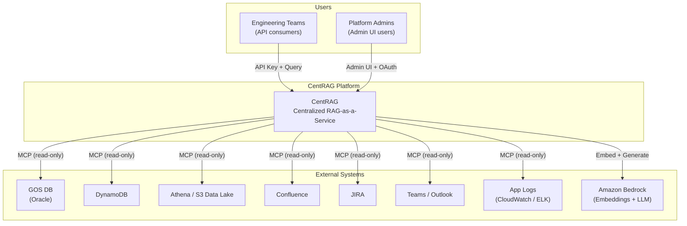
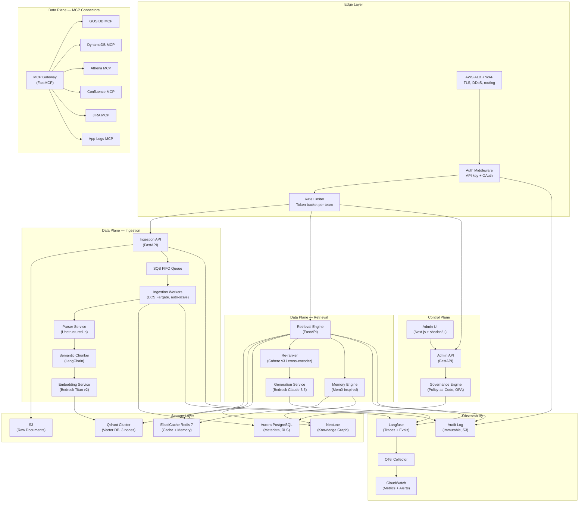

# CentRAG — High-Level Design (HLD)

**Version:** 2.0  
**Author:** Platform Engineering  
**Status:** Draft → Review  
**Last Updated:** 2026-04-13  

---

## 1. Executive Summary

### 1.1 Problem Statement

Teams in the organization waste **2–4 weeks** each setting up their own RAG pipelines: choosing vector DBs, configuring embedding models, building auth, writing chunking logic, managing memory. This leads to:
- **Duplicated effort** across 50+ teams
- **Inconsistent quality** — some teams use naive fixed-size chunking, others skip re-ranking
- **No governance** — PII leaks, runaway costs, no audit trail
- **No memory** — every session starts from scratch

### 1.2 Solution

**CentRAG** is a centralized RAG-as-a-Service platform. Teams onboard via API key, upload data, and consume retrieval + generation through a unified API — fully namespace-isolated.

### 1.3 Goals
| Goal | Metric |
|------|--------|
| Zero-setup RAG for teams | Team onboarding < 30 minutes |
| Namespace isolation | 0 cross-tenant data leaks |
| Enterprise security | SOX/GDPR compliant, full audit trail |
| High performance | P95 retrieval < 3s (cold), < 50ms (cache hit) |
| Reusable infrastructure | Any new connector < 1 week to add |

---

## 2. Architectural Principles

### 2.1 Reusability Framework

> Every component is designed so it can be extracted, reused, or replaced independently.

| Principle | Implementation | Benefit |
|-----------|---------------|---------|
| **Interface-first contracts** | Every service defines a `typing.Protocol` (structural subtyping) before implementation | Swap implementations without changing callers |
| **Plugin-based connectors** | MCP connectors implement a `BaseConnector` interface | Add Confluence/JIRA/Slack without touching core |
| **Layered guardrails** | Security middleware is composable decorators, not embedded logic | Same guardrails reusable across any MCP server |
| **Shared config schema** | Pydantic `BaseSettings` hierarchy with env-var override | Same config pattern for any new service |
| **Reusable SDK** | `centrag-client` Python package for consumers | One `pip install` to connect; works in any Python app |
| **Template-based IaC** | CDK constructs for each component | Deploy a new environment in 1 command |

### 2.2 Core Architecture Principles

| # | Principle | How Applied |
|---|-----------|-------------|
| 1 | **Namespace Isolation** | Every data layer (vectors, metadata, cache, memory, S3) is partitioned by `team_id` |
| 2 | **Stateless Services** | All compute is horizontally scalable containers; state lives in managed datastores |
| 3 | **Defence in Depth** | API key → rate limit → namespace guard → SQL validation → PII redaction → audit log |
| 4 | **Event-Driven Ingestion** | Upload → SQS → async worker (never blocks the API thread) |
| 5 | **Hybrid RAG** | Dense + Sparse + KG retrieval, fused by a cross-encoder re-ranker |
| 6 | **Tiered Caching** | L1 (in-process) → L2 (exact) → L3 (semantic) → L4 (full RAG) |
| 7 | **Observability First** | Every chain has a `trace_id` linking query → retrieval → generation → response |
| 8 | **Policy-as-Code** | Access policies, retention rules, PII patterns defined as versioned code |
| 9 | **Graceful Shutdown** | All services implement tiered shutdown: drain requests → flush analytics → close connections → force-exit with failsafe timeout. Prevents data loss on SIGTERM/SIGINT during rolling deployments. |
| 10 | **Session Recovery** | Long-running retrieval sessions can be resumed after crash or disconnect. Conversation state is checkpointed to durable storage (PostgreSQL), allowing clients to reconnect without replaying from scratch. |
| 11 | **Performance Budgets** | Every async operation has a latency budget. Operations exceeding their budget are automatically logged as `slow_operation_detected` warnings with stack traces, enabling zero-effort bottleneck discovery. |
| 12 | **LLM-Driven Agent Selection** | The LLM itself decides the orchestration strategy at query time. Based on query complexity, it routes to: cache-only (SIMPLE), standard RAG (STANDARD), multi-step retrieval (COMPLEX), or full multi-agent orchestration (RESEARCH). This replaces static routing with dynamic, context-aware selection. See `CROSS_REPO_ANALYSIS.md §3`. |
| 13 | **Context Engineering** | Aggressive context management: isolated sub-agent contexts, mid-session summarization, memory compression, and progressive skill loading. Inspired by DeerFlow's context summarization and AgentScope's memory compression. See `LEARNING_AND_ROADMAP.md Phase 2`. |
| 14 | **MCP-First Integration** | All external data source connections (Oracle GOS DB, DynamoDB, Confluence, etc.) are exposed as MCP servers using stdio transport. The retrieval engine acts as an MCP client. This standardizes all integrations via the Model Context Protocol. See `MCP_DEPLOYMENT_GUIDE.md`. |
| 15 | **Deep Immutability** | Core document abstractions enforce strict read-only state at the application level to prevent accidental mutation during retrieval/ingestion flows (e.g., `ExtractedDocument`). |
| 16 | **Fail-Fast Configuration** | Boot-time validators reject non-production infrastructure URLs (e.g., `localhost`) when the system is in `production` mode, preventing silent configuration leaks. |

### 2.3 Development Practices

| Principle | Implementation |
|-----------|----------------|
| **Agentic Self-Correction** | A suite of specialized quality gates in `.agents/skills/` autonomously validates every code change against SOLID, security, and architectural standards during the development lifecycle. |
*   **Storage (S3)**: Encrypted at rest via AES-256 (KMS). Use **Envelope Encryption** for document chunks where possible (Phase 5).
*   **Database (Aurora/Qdrant)**: Full disk encryption via AWS managed keys. Support for **Customer Managed Keys (CMK / BYOK)** at the Enterprise tier.

---

## 3. System Context (C4 Level 1)



**Who uses it:**
- **Teams** consume retrieval/generation via REST API with an API key
- **Admins** manage teams, keys, namespaces, and monitor usage via Admin UI

**What it connects to:**
- 7 internal data sources via MCP servers (reusable connector pattern)
- Amazon Bedrock for embedding + LLM generation

---

## 4. Container Diagram (C4 Level 2)



---

## 5. Namespace Isolation Strategy

### 5.1 Isolation by Layer

| Layer | Mechanism | How It Works |
|-------|----------|-------------|
| **API Gateway** | API key → `team_id` | Every request is tagged with `team_id` in the first middleware; no downstream service can proceed without it |
| **Vector DB (Qdrant)** | Payload filter + tiered sharding | All vectors have `team_id` in payload; queries MUST include `team_id` filter. High-volume teams get dedicated shards via `is_tenant=true` |
| **Metadata DB (PostgreSQL)** | Row-Level Security (RLS) | Policies enforce `WHERE team_id = current_setting('app.team_id')` on all tables. Set via `SET LOCAL` at connection checkout |
| **Cache (Redis)** | Key prefix | All keys follow `{service}:{team_id}:{hash}` pattern. Lua scripts enforce prefix on every operation |
| **Object Store (S3)** | Prefix partition | `s3://bucket/raw/{team_id}/{doc_id}/...` — IAM policy restricts prefix access |
| **Memory** | Scoped stores | Memory engine indexes and retrieves only within the requesting team's namespace |

### 5.2 What Prevents Cross-Tenant Access

```
Request comes in:
  ├─ API key → SHA256 hash → Redis/PG lookup → resolves to team_id
  ├─ team_id is injected into RequestContext (immutable after auth)
  ├─ Every downstream call receives team_id from context (not from user input)
  ├─ Qdrant: filter condition `team_id == ctx.team_id` is ALWAYS appended (not optional)
  ├─ PostgreSQL: RLS policy auto-filters rows (cannot be bypassed at SQL level)
  ├─ Redis: key prefix is enforced (service:TEAM_ID:key)
  └─ S3: IAM policy restricts to s3://bucket/raw/TEAM_ID/*
```

---

## 6. Security Architecture

### 6.1 Defence-in-Depth Layers

```
Internet
  │
  ▼
┌─────────────────────────────────────────────────┐
│ AWS WAF        — IP whitelisting, rate limiting,│
│                  SQL injection rules, geo-block  │
├─────────────────────────────────────────────────┤
│ ALB            — TLS 1.3 termination, HTTPS only│
├─────────────────────────────────────────────────┤
│ Auth Middleware — API key validation, OAuth      │
│                  team_id resolution, scope check │
├─────────────────────────────────────────────────┤
│ Rate Limiter   — Token bucket per team, per tier│
│                  (free=60/min, pro=300/min)      │
├─────────────────────────────────────────────────┤
│ Namespace Guard — team_id injection into context│
│                   immutable after auth            │
├─────────────────────────────────────────────────┤
│ SQL Validator  — Blocked keywords (DROP, ALTER)  │
│                  Parameterized queries only       │
│                  Schema/table whitelisting        │
├─────────────────────────────────────────────────┤
│ PII Redactor   — Regex patterns (SSN, CC, email)│
│                  Applied to ALL outbound data    │
├─────────────────────────────────────────────────┤
│ Result Capper  — Max 5MB per response            │
│                  Max 5000 rows per query          │
├─────────────────────────────────────────────────┤
│ Audit Logger   — Every tool invocation logged    │
│                  Immutable, shipped to S3         │
├─────────────────────────────────────────────────┤
│ Encryption     — BYOK Envelope Encryption (CMK)  │
│                  Per-team keys in AWS KMS         │
│                  DEK in-memory only, never stored │
│                  See: APP_LOGS_PRIVACY_LANGSMITH  │
└─────────────────────────────────────────────────┘
```

### 6.2 API Key Lifecycle

| Event | What Happens |
|-------|-------------|
| **Create** | Admin generates key via UI → `centrag_{uuid4}` → SHA-256 hashed → hash stored in PG → plaintext shown ONCE |
| **Validate** | Incoming key → SHA-256 → Redis lookup (TTL 5min) → fallback PG → returns `{team_id, scopes, tier}` |
| **Scope check** | Key scopes (e.g., `["read", "write"]`) matched against requested operation |
| **Rotate** | New key generated → old key marked `is_active=false` → cache invalidated |
| **Revoke** | Key deleted from PG → cache invalidated → immediate effect |
| **Expire** | Keys have optional `expires_at` → cron job deactivates expired keys daily |

### 6.3 RBAC Matrix

| Action | `viewer` | `editor` | `owner` | `super_admin` |
|--------|:--------:|:--------:|:-------:|:-------------:|
| Query data | ✅ | ✅ | ✅ | ✅ |
| View traces | ✅ | ✅ | ✅ | ✅ |
| Upload documents | ❌ | ✅ | ✅ | ✅ |
| Delete documents | ❌ | ✅ | ✅ | ✅ |
| Manage namespaces | ❌ | ✅ | ✅ | ✅ |
| Create API keys | ❌ | ❌ | ✅ | ✅ |
| Manage team members | ❌ | ❌ | ✅ | ✅ |
| View all teams | ❌ | ❌ | ❌ | ✅ |
| Platform config | ❌ | ❌ | ❌ | ✅ |

---

## 7. MCP Integration Architecture

### 7.1 Reusable Connector Pattern

All MCP connectors follow the **same interface** so adding a new one is copy-and-customize:

```
BaseConnector (Abstract)
   ├── connect()           → establish connection / session
   ├── list_resources()    → list available schemas, tables, pages
   ├── describe_resource() → get metadata for a specific resource
   ├── query()             → execute a read operation
   ├── ingest()            → pull data into the RAG pipeline
   └── health_check()      → verify connectivity
```

### 7.2 Connector Inventory

| MCP Server | Source | Protocol | Auth | Status |
|-----------|--------|----------|------|:------:|
| **GOS DB** | JPMC Oracle DB | oracledb (thin) | Wallet / Password | ✅ Built |
| **DynamoDB** | AWS DynamoDB | boto3 | STS AssumeRole | ✅ Built |
| **Athena** | AWS Athena / S3 | boto3 | STS AssumeRole | ✅ Built |
| **Confluence** | Atlassian Cloud | REST API v2 | OAuth 2.0 / PAT | 🔲 Phase 3 |
| **JIRA** | Atlassian Cloud | REST API v3 | OAuth 2.0 / PAT | 🔲 Phase 3 |
| **Teams/Outlook** | Microsoft 365 | Graph API | OAuth 2.0 (app) | 🔲 Phase 3 |
| **App Logs** | CloudWatch / ELK | boto3 / REST | IAM / API key | 🔲 Phase 4 |
| **Agent Logs** | Langfuse/LangSmith | REST API | API key | 🔲 Phase 4 |

### 7.3 Adding a New Connector (Reusability Workflow)

```
Time to add a new connector: < 1 week (for an engineer who reads this doc)

1. Copy `mcp_enterprise_server/gosdb_mcp.py` as template
2. Implement the BaseConnector interface:
   - Replace connection logic
   - Define tool functions (list, describe, query)
   - Map to guardrails (which keywords to block, which schemas to whitelist)
3. Add config class to `config.py` (follow existing pattern)
4. Register tools in `server.py` via `register_{name}_tools(mcp, config.{name})`
5. Add unit tests following `tests/test_guardrails.py` pattern
6. Add CDK construct following existing template

No core code changes needed. Just add files + register.
```

---

## 8. Data Flow Diagrams

### 8.1 Ingestion Flow

```
User uploads PDF via API:

POST /v1/documents
  Content-Type: multipart/form-data
  X-API-Key: centrag_xxxx
  Body: { file: report.pdf, namespace: "q3_reports" }

                                    ┌──────────────────────────────────────────────┐
                                    │           Ingestion Pipeline                  │
                                    │                                              │
  API Server                        │   Worker (ECS Fargate, auto-scale)           │
  ──────────                        │   ──────────────────────────────             │
  1. Validate API key → team_id     │   5. Dequeue SQS message                    │
  2. Validate file (size ≤100MB,    │   6. Download from S3                       │
     type ∈ [pdf,docx,csv,md,txt])  │   7. Parse → Unstructured.io               │
  3. Virus scan (ClamAV) [Phase 5]  │      PDF→Markdown, DOCX→Text               │
  4. Upload to S3:                  │   8. Semantic chunk (512 tok, 50 overlap)   │
     s3://bucket/raw/{team_id}/     │   9. Batch embed (Bedrock Titan v2, n=100) │
     {doc_id}/report.pdf            │  10. Upsert to Qdrant:                     │
  5. INSERT documents (status=      │      collection=documents                   │
     pending)                       │      payload={team_id, doc_id, namespace,   │
  6. Publish to SQS FIFO:          │        chunk_index, source_type}            │
     {doc_id, team_id, s3_key}      │  11. INSERT chunks rows in PostgreSQL      │
  7. Return 202 Accepted +         │  12. UPDATE documents status=ready          │
     {doc_id, status: "processing"} │  13. ACK SQS message                       │
                                    │                                              │
                                    │  On Error:                                   │
                                    │  - Retry up to 3 times                      │
                                    │  - After 3 failures → DLQ                   │
                                    │  - UPDATE documents status=error            │
                                    │  - Alert via CloudWatch alarm               │
                                    └──────────────────────────────────────────────┘
```

### 8.2 Retrieval Flow

```
User queries via API:

POST /v1/retrieve
  X-API-Key: centrag_xxxx
  Body: { "query": "What was Q3 revenue?", "namespace": "q3_reports", "max_results": 5 }

          ──── if cache hit at any level, return cached response ────
   7     Query Expansion         HyDE: generate hypothetical answer embed     ~200ms
   8     Dense Search (Qdrant)   HNSW ANN search, filter: team_id, top=50    ~15ms
   9     Sparse Search (BM25)    Qdrant sparse vectors, top=50               ~10ms
  10     KG Lookup (Neptune)     Entity extraction → graph traversal          ~20ms
  11     Memory Recall (Mem0)    Retrieve relevant memories for user context  ~10ms
  12     Fusion (RRF)            Reciprocal Rank Fusion of all sources        ~1ms
  13     Re-rank (Cohere v3)     Cross-encoder scoring, select top=5          ~100ms
  14     Context Assembly        Top-5 chunks + memory + KG facts             ~1ms
  15     LLM Generation          Bedrock Claude 3.5: answer + citations       ~1500ms
  16     Output Guardrails       Check confidence, schema validation, leaks   ~1ms
  17     PII Redaction           Regex scrub: SSN, CC, email, phone, IP       ~2ms
  18     Audit & Cost Tracking   Log token usage, duration, budget check      ~1ms
  19     Cache Write             Populate L2 (exact) + L3 (semantic)          ~3ms
  20     Trace Emit              Send to Langfuse: full chain metadata        ~1ms (async)
  21     Return Response         JSON: {answer, sources[], trace_id}          ─────
                                                                    Total: ~1800ms
```

### 8.3 Auth Flow

```
Every API request:

  Client                  API Gateway            Auth Service              Redis            PostgreSQL
  ──────                  ───────────            ────────────              ─────            ──────────
    │                         │                       │                      │                    │
    │  X-API-Key: nxr_...     │                       │                      │                    │
    ├────────────────────────>│                       │                      │                    │
    │                         │  Forward API key      │                      │                    │
    │                         ├──────────────────────>│                      │                    │
    │                         │                       │  SHA256(key)         │                    │
    │                         │                       │─────────────────────>│                    │
    │                         │                       │                      │                    │
    │                         │                       │  Cache HIT           │                    │
    │                         │                       │<─ ─ ─ ─ ─ ─ ─ ─ ─ ─│                    │
    │                         │                       │  {team_id,           │                    │
    │                         │                       │   scopes, tier}      │                    │
    │                         │                       │                      │                    │
    │                         │                       │  OR Cache MISS       │                    │
    │                         │                       │─────────────────────────────────────────>│
    │                         │                       │                      │   SELECT * FROM    │
    │                         │                       │                      │   api_keys WHERE   │
    │                         │                       │                      │   key_hash=? AND   │
    │                         │                       │                      │   is_active=true   │
    │                         │                       │<─────────────────────────────────────── │
    │                         │                       │  SET in Redis        │                    │
    │                         │                       │  TTL 5min            │                    │
    │                         │                       │─────────────────────>│                    │
    │                         │                       │                      │                    │
    │                         │  Inject team_id       │                      │                    │
    │                         │  into RequestContext  │                      │                    │
    │                         │  (IMMUTABLE)          │                      │                    │
    │                         │                       │                      │                    │
    │                         │  Check scopes vs      │                      │                    │
    │                         │  requested action     │                      │                    │
    │                         │                       │                      │                    │
    │  200 OK / 401 / 403     │                       │                      │                    │
    │<────────────────────────│                       │                      │                    │
```

### 8.4 Startup & Shutdown Lifecycle Flow

```
Startup (Parallel Resource Acquisition — inspired by claude-code RAII pattern):

  app.py lifespan "startup"
  ────────────────────────
  asyncio.gather(
    connect_postgres(),      ─┐
    connect_redis(),          ├─ All 3 connections acquired in parallel
    connect_qdrant(),        ─┘              ⟶ ~max(PG, Redis, Qdrant) latency
  )
  Feature-flag route inclusion:
    if settings.enable_docs_routes:   mount /v1/documents
    if settings.enable_retrieval_routes: mount /v1/retrieve
  Emit "centrag_ready" structured log


Graceful Shutdown (inspired by claude-code/gracefulShutdown.ts):

  SIGTERM / SIGINT received
  ─────────────────────────
  Phase 1: Mark unhealthy               (health → 503, stop accepting new requests)    ~0ms
  Phase 2: Drain in-flight requests      (asyncio.wait, timeout=10s)                   ~0-10s
  Phase 3: Flush async resources         (parallel)                                    ~0-3s
     ├── Langfuse trace batch flush
     ├── Audit log buffer flush
     ├── Usage metrics aggregate → PostgreSQL
     └── Redis pub/sub unsubscribe
  Phase 4: Close connection pools         (parallel)                                   ~0-1s
     ├── PostgreSQL pool.close()
     ├── Redis.close()
     └── Qdrant client.close()
  Phase 5: Exit 0

  Failsafe: If Phases 2-4 exceed 15s total → force exit (prevent hung containers)
  Orphan detection: Periodic check (30s) — if stdout/stdin become invalid → trigger shutdown
```

### 8.5 Session Recovery Flow (Phase 5)

```
Client crash or network disconnect during retrieval:

  State saved:                        State restored on reconnect:
  ─────────────                       ──────────────────────────
  1. Query text + namespace           1. Client sends: POST /v1/session/resume
  2. Retrieval step reached              { session_id: "xxx" }
  3. Partial results so far           2. Server loads checkpoint from PostgreSQL
  4. Token usage accumulated          3. Resume from last completed step
  5. Timestamp + trace_id            4. Cost state restored (no double-billing)
                                      5. Remaining pipeline executes normally
  Checkpoint granularity:
  - After auth ✓
  - After cache lookup (hit or miss)
  - After retrieval + rerank
  - After generation
```

---

## 9. Technology Decisions

| Decision | Choice | Rationale | Alternatives Considered |
|---------|--------|-----------|------------------------|
| **Vector DB** | Qdrant (self-hosted, EKS) | Native tiered multi-tenancy, HNSW, payload filtering, `is_tenant` index. Best isolation story. | OpenSearch Serverless (fully managed but no tiered sharding), Pinecone (SaaS, data leaves VPC) |
| **Embedding** | Bedrock Titan Embed v2 (1024d) | AWS-native, no data leaves VPC, managed scaling, $0.0001/1K tokens | OpenAI text-embedding-3-large (3072d, higher quality but network hop), Cohere embed v3 |
| **LLM** | Bedrock Claude 3.5 Sonnet | Best quality/cost ratio, 200K context, AWS-native, no model hosting | GPT-4o (OpenAI, external), self-hosted Llama 3.1 70B (cheaper at scale but ops burden) |
| **Re-ranker** | Cohere Rerank v3 | Best-in-class cross-encoder, simple API, massive precision improvement | No re-ranker (worse quality), self-hosted cross-encoder (ops burden), Bedrock re-rank |
| **Metadata DB** | Aurora PostgreSQL 15 | RLS for isolation, JSONB for flexible metadata, proven at scale, Multi-AZ | DynamoDB (no SQL, no RLS), CockroachDB (complex, unnecessary) |
| **Cache** | ElastiCache Redis 7+ (cluster) | TTL-based exact-match cache (L2), key-prefix isolation, pub/sub for invalidation. **Note:** Redis is L2 only; L3 semantic cache uses Qdrant (ElastiCache lacks RediSearch). | Memcached (no pub/sub), Valkey (newer, less battle-tested) |
| **Queue** | SQS FIFO | Exactly-once processing, DLQ, no ops, ordered per team | Kafka (overkill for ingestion), RabbitMQ (self-managed) |
| **Document Parser** | Unstructured.io | Best layout-aware PDF/DOCX/HTML parsing. Handles tables, images, multi-column. | LangChain loaders (simpler but worse on complex layouts), Amazon Textract (OCR use cases) |
| **IaC** | AWS CDK (Python) | Same language as backend, L2 constructs, reusable stacks | Terraform (HCL is another language to maintain), CloudFormation (verbose) |
| **Observability** | Langfuse (self-hosted) | OSS, OTel-native, traces + evals + prompt management, LLM-specific metrics | LangSmith (vendor lock-in), Arize Phoenix (newer), custom OTel + Grafana (more work) |
| **Knowledge Graph** | Amazon Neptune | Managed, Gremlin/SPARQL, entity-relation storage, Multi-AZ | Neo4j Community (self-hosted, free but ops), skip KG for MVP (acceptable) |

---

## 10. Deployment Architecture (AWS)

```
┌─────────────────────────────────────────────────────────────────────────────┐
│                            AWS Account                                      │
│                                                                             │
│  ┌─── VPC 10.0.0.0/16 ───────────────────────────────────────────────────┐  │
│  │                                                                        │  │
│  │  ┌─── Public Subnets (3 AZs: a, b, c) ────────────────────────────┐  │  │
│  │  │  ALB (internet-facing) + WAF + ACM TLS cert                     │  │  │
│  │  │  NAT Gateway × 3 (one per AZ for HA egress)                     │  │  │
│  │  └─────────────────────────────────────────────────────────────────┘  │  │
│  │                                                                        │  │
│  │  ┌─── Private App Subnets (3 AZs: a, b, c) ───────────────────────┐  │  │
│  │  │  EKS Cluster (control plane: AWS-managed, 3-AZ)                 │  │  │
│  │  │  ├── api-server         (3 pods, r6g.large, spread across AZs) │  │  │
│  │  │  ├── retrieval-engine   (3 pods, r6g.large, spread across AZs) │  │  │
│  │  │  ├── ingestion-worker   (1-20 pods, auto-scale on SQS depth)    │  │  │
│  │  │  ├── mcp-gateway        (2 pods, r6g.medium)                    │  │  │
│  │  │  ├── memory-service     (2 pods, r6g.medium)                    │  │  │
│  │  │  ├── admin-ui           (2 pods, t3.medium)                     │  │  │
│  │  │  └── langfuse           (2 pods, r6g.medium)                    │  │  │
│  │  └─────────────────────────────────────────────────────────────────┘  │  │
│  │                                                                        │  │
│  │  ┌─── Private Data Subnets (3 AZs: a, b, c) ──────────────────────┐  │  │
│  │  │  Aurora PostgreSQL 15   (Multi-AZ, r6g.xlarge, 3-AZ storage)   │  │  │
│  │  │  Qdrant Cluster         (3 nodes, 1 per AZ, r6g.2xlarge, gp3) │  │  │
│  │  │  ElastiCache Redis 7    (Cluster, r6g.large, 3 shards, 3 AZs) │  │  │
│  │  │  Amazon Neptune         (db.r6g.large, Multi-AZ)               │  │  │
│  │  └─────────────────────────────────────────────────────────────────┘  │  │
│  │                                                                        │  │
│  │  Why 3 AZs: Quorum systems (etcd, Qdrant, Redis) need majority.       │  │
│  │  2 AZs → lose 1 AZ → lose 50% → no majority → OUTAGE.                │  │
│  │  3 AZs → lose 1 AZ → 2/3 remain → quorum maintained → OK.            │  │
│  │                                                                        │  │
│  └────────────────────────────────────────────────────────────────────────┘  │
│                                                                             │
│  S3 (raw documents + audit logs)                                            │
│  SQS FIFO (ingestion queue + DLQ)                                           │
│  Amazon Bedrock (Titan embeddings + Claude 3.5)                             │
│  Secrets Manager (DB creds, API signing keys)                               │
│  CloudWatch (metrics, alarms, dashboards)                                   │
│  ECR (container images)                                                     │
│  Route 53 (centrag.internal.company.com)                                    │
│                                                                             │
└─────────────────────────────────────────────────────────────────────────────┘
```

---

## 11. Cost Estimation (Monthly, 50 Teams)

| Component | Sizing | Est. Cost/Month |
|-----------|--------|:---------------:|
| EKS Cluster (control plane) | 1 cluster | $73 |
| EKS Nodes (app tier) | 6x r6g.large on-demand | ~$440 |
| EKS Nodes (ingestion) | 1-5x r6g.large spot | ~$120 |
| Aurora PostgreSQL | r6g.xlarge Multi-AZ | ~$590 |
| ElastiCache Redis | r6g.large cluster (3 shards) | ~$520 |
| Qdrant (on EKS) | 3x r6g.2xlarge + 300GB gp3 | ~$900 |
| Neptune (Phase 6) | db.r6g.large Multi-AZ | ~$290 |
| S3 | 500GB + lifecycle policies | ~$12 |
| SQS | ~1M messages/month | ~$1 |
| Bedrock Embeddings | ~10M tokens/month | ~$1 |
| Bedrock LLM (Claude) | ~50M input + 10M output tok/month (est.) | ~$200 |
| ALB + WAF | Shared | ~$50 |
| CloudWatch | Logs + metrics | ~$30 |
| NAT Gateway | 3× (one per AZ) | ~$100 |
| **Total** | | **~$3,330/month** |

> Estimated **~$70/team/month** at 50 teams. Compare to teams each running their own infrastructure.
> **Note:** Neptune is Phase 6 (optional). Excluding it reduces cost to ~$3,000/month (~$60/team).
> Bedrock LLM cost scales with query volume. At high volume, expect $100-200/team.
> Cache hit ratio (target 40-60%) is the primary LLM cost lever.

---

## 12. Implementation Phases

| Phase | Weeks | Deliverable | Reusable Output |
|:-----:|:-----:|-------------|-----------------|
| **1** | 1-3 | PostgreSQL schema + API key auth + S3 upload + SQS + basic ingestion | Auth middleware (reusable), BaseConnector interface |
| **2** | 4-5 | Hybrid retrieval + re-ranker + semantic cache + LLM generation | Retrieval engine (reusable), cache layer (reusable) |
| **3** | 6-7 | Memory layer + MCP connectors (Confluence, JIRA, Teams) | Memory SDK (reusable), connector template |
| **4** | 8-9 | Admin UI + Langfuse observability | UI component library (reusable) |
| **5** | 10-12 | RBAC + PII pipeline + CDK deployment + load testing + security audit | CDK constructs (reusable), guardrails package (reusable) |

---

## 13. Performance Targets

| Metric | Target | How Measured |
|--------|--------|-------------|
| Query P95 (cache hit) | < 50ms | Load test with Locust |
| Query P95 (cache miss) | < 3s | Load test with Locust |
| Ingestion throughput | 100 docs/min | CloudWatch SQS metrics + custom dashboard |
| API key validation | < 5ms | Benchmark |
| Namespace isolation | 0 cross-tenant leaks | Automated security test suite |
| Uptime | 99.9% (8.7 hrs downtime/year) | CloudWatch + PagerDuty |
| Cache hit ratio | > 40% (steady state) | Redis metrics |

---

## 14. Open Questions

| # | Question | Impact | Who Decides |
|---|---------|--------|-------------|
| 1 | Qdrant vs OpenSearch Serverless for vector DB? | Self-managed vs fully managed | Platform + Infra team |
| 2 | Skip Knowledge Graph (Neptune) for MVP? | Reduces cost -$350/mo, loses entity reasoning | Product Owner |
| 3 | Bedrock Titan v2 vs OpenAI embeddings? | Quality vs latency vs data residency | Security + ML team |
| 4 | GOS DB connection details (hostname, wallet, schemas)? | Blocks MCP server testing | DBA team |
| 5 | Data residency requirements (us-east-1 only)? | Affects deployment topology | Compliance |
| 6 | Internal security review gates before AWS deploy? | Affects timeline | Security team |
