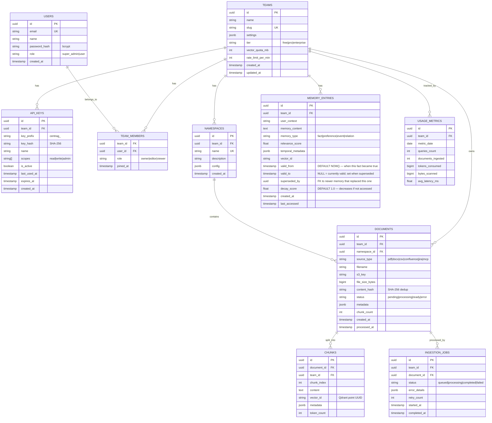

# CentRAG — Low-Level Design (LLD)

**Version:** 2.0  
**Author:** Platform Engineering  
**Status:** Draft → Review  
**Last Updated:** 2026-03-31  
**Prerequisite:** Read [ARCHITECTURE_HLD.md](./ARCHITECTURE_HLD.md) first.

---

## 1. Data Model (PostgreSQL)

### 1.1 ER Diagram



### 1.2 Row-Level Security (RLS)

```sql
-- Enable RLS on all tenant-scoped tables
ALTER TABLE documents ENABLE ROW LEVEL SECURITY;
ALTER TABLE chunks ENABLE ROW LEVEL SECURITY;
ALTER TABLE api_keys ENABLE ROW LEVEL SECURITY;
ALTER TABLE namespaces ENABLE ROW LEVEL SECURITY;
ALTER TABLE memory_entries ENABLE ROW LEVEL SECURITY;
ALTER TABLE ingestion_jobs ENABLE ROW LEVEL SECURITY;

-- CRITICAL: FORCE RLS even for table owners and superusers.
-- Without FORCE, a rogue engineer with owner role bypasses all RLS.
ALTER TABLE documents FORCE ROW LEVEL SECURITY;
ALTER TABLE chunks FORCE ROW LEVEL SECURITY;
ALTER TABLE api_keys FORCE ROW LEVEL SECURITY;
ALTER TABLE namespaces FORCE ROW LEVEL SECURITY;
ALTER TABLE memory_entries FORCE ROW LEVEL SECURITY;
ALTER TABLE ingestion_jobs FORCE ROW LEVEL SECURITY;

-- Create policy: rows are only visible for the current team
CREATE POLICY team_isolation ON documents
    USING (team_id = current_setting('app.team_id')::uuid);

CREATE POLICY team_isolation ON chunks
    USING (team_id = current_setting('app.team_id')::uuid);

CREATE POLICY team_isolation ON api_keys
    USING (team_id = current_setting('app.team_id')::uuid);

CREATE POLICY team_isolation ON namespaces
    USING (team_id = current_setting('app.team_id')::uuid);

CREATE POLICY team_isolation ON memory_entries
    USING (team_id = current_setting('app.team_id')::uuid);

CREATE POLICY team_isolation ON ingestion_jobs
    USING (team_id = current_setting('app.team_id')::uuid);

-- Usage: set team context at connection checkout
-- This is done by the API server middleware, NOT by the client
SET LOCAL app.team_id = '550e8400-e29b-41d4-a716-446655440000';

-- All subsequent queries on this connection are auto-filtered
SELECT * FROM documents;  -- Only returns team's documents
```

### 1.3 Indexes

```sql
-- Primary access patterns
CREATE INDEX idx_documents_team_ns ON documents (team_id, namespace_id);
CREATE INDEX idx_documents_status ON documents (status) WHERE status != 'ready';
CREATE INDEX idx_chunks_document ON chunks (document_id);
CREATE INDEX idx_chunks_team ON chunks (team_id);
CREATE INDEX idx_api_keys_hash ON api_keys (key_hash) WHERE is_active = true;
CREATE INDEX idx_api_keys_team ON api_keys (team_id);
CREATE INDEX idx_memory_team_type ON memory_entries (team_id, memory_type);
CREATE INDEX idx_ingestion_status ON ingestion_jobs (status) WHERE status = 'queued';
CREATE INDEX idx_usage_team_date ON usage_metrics (team_id, metric_date);
```

---

## 2. API Design

### 2.1 Endpoint Table

All endpoints require `X-API-Key` header unless marked with 🔓 (OAuth only for Admin UI).

#### Retrieval API (for teams)

| Method | Endpoint | Description | Scope Required |
|--------|---------|-------------|:--------------:|
| `POST` | `/v1/retrieve` | Execute RAG query | `read` |
| `POST` | `/v1/retrieve/stream` | SSE streaming RAG query | `read` |
| `POST` | `/v1/documents` | Upload document for ingestion | `write` |
| `GET` | `/v1/documents` | List team's documents | `read` |
| `GET` | `/v1/documents/{id}` | Get document status | `read` |
| `DELETE` | `/v1/documents/{id}` | Delete document + vectors | `write` |
| `GET` | `/v1/namespaces` | List team's namespaces | `read` |
| `POST` | `/v1/namespaces` | Create namespace | `write` |
| `GET` | `/v1/health` | Health check | none |

#### Admin API 🔓 (for platform admins)

| Method | Endpoint | Description | Role Required |
|--------|---------|-------------|:-------------:|
| `POST` | `/admin/teams` | Create team | `super_admin` |
| `GET` | `/admin/teams` | List all teams | `super_admin` |
| `POST` | `/admin/teams/{id}/keys` | Generate API key | `owner` |
| `DELETE` | `/admin/teams/{id}/keys/{key_id}` | Revoke API key | `owner` |
| `POST` | `/admin/teams/{id}/members` | Add team member | `owner` |
| `GET` | `/admin/teams/{id}/usage` | View usage metrics | `owner` |

### 2.2 Core Request/Response Schemas

#### POST /v1/retrieve (RAG Query)

**Request:**
```json
{
  "query": "What was the Q3 2025 revenue for Product Alpha?",
  "namespace": "q3_reports",
  "max_results": 5,
  "include_sources": true,
  "include_memory": true,
  "temperature": 0.1
}
```

**Response (200 OK):**
```json
{
  "answer": "Based on the Q3 2025 financial report, Product Alpha generated $42.3M in revenue, representing a 15% YoY increase...",
  "sources": [
    {
      "document_id": "d1a2b3c4-...",
      "filename": "q3_2025_financials.pdf",
      "chunk_index": 7,
      "relevance_score": 0.94,
      "snippet": "...Product Alpha revenue reached $42.3M in Q3 2025..."
    },
    {
      "document_id": "e5f6a7b8-...",
      "filename": "product_alpha_summary.docx",
      "chunk_index": 2,
      "relevance_score": 0.87,
      "snippet": "...15% year-over-year growth driven by enterprise adoption..."
    }
  ],
  "metadata": {
    "trace_id": "tr_8a9b0c1d2e3f...",
    "latency_ms": 1847,
    "cache_hit": false,
    "chunks_retrieved": 50,
    "chunks_after_rerank": 5,
    "tokens_used": {
      "embedding": 24,
      "generation_input": 3200,
      "generation_output": 180
    }
  }
}
```

#### POST /v1/documents (Upload)

**Request:**
```
POST /v1/documents
Content-Type: multipart/form-data
X-API-Key: centrag_xxxx

file: report.pdf (binary)
namespace: q3_reports
metadata: {"department": "finance", "year": 2025}
```

**Response (202 Accepted):**
```json
{
  "document_id": "d1a2b3c4-...",
  "filename": "report.pdf",
  "status": "processing",
  "namespace": "q3_reports",
  "estimated_completion_seconds": 30,
  "poll_url": "/v1/documents/d1a2b3c4-..."
}
```

### 2.3 Error Response Schema

All errors follow the same structure:

```json
{
  "error": {
    "code": "RATE_LIMIT_EXCEEDED",
    "message": "Rate limit of 60 requests/minute exceeded for team 'alpha'. Retry after 15 seconds.",
    "details": {
      "limit": 60,
      "window": "1 minute",
      "retry_after_seconds": 15
    },
    "trace_id": "tr_xxx"
  }
}
```

| HTTP Code | Error Code | When |
|:---------:|-----------|------|
| 400 | `INVALID_REQUEST` | Missing/malformed fields |
| 401 | `INVALID_API_KEY` | Key not found or expired |
| 403 | `INSUFFICIENT_SCOPE` | Key doesn't have required scope |
| 404 | `NOT_FOUND` | Document/namespace doesn't exist |
| 413 | `FILE_TOO_LARGE` | Upload exceeds 100MB |
| 422 | `UNSUPPORTED_FILE_TYPE` | File type not in allowed list |
| 429 | `RATE_LIMIT_EXCEEDED` | Token bucket depleted |
| 500 | `INTERNAL_ERROR` | Server error (logged, alerted) |
| 503 | `SERVICE_UNAVAILABLE` | Dependency down (Qdrant, Bedrock) |

---

## 3. Reusable Module Architecture

### 3.1 Module Dependency Tree

```
centrag/
├── centrag-core/                  # Shared reusable library
│   ├── auth/                      # API key validation, team resolution
│   │   ├── middleware.py           # FastAPI middleware (extractable)
│   │   └── key_manager.py         # Key generation, hashing, validation
│   ├── guardrails/                # Security guardrails (already built)
│   │   ├── sql_validator.py       # SQL injection prevention
│   │   ├── rate_limiter.py        # Token bucket implementation
│   │   ├── pii_redactor.py        # PII pattern matching
│   │   ├── result_capper.py       # Response size limits
│   │   └── audit_logger.py        # Structured audit logging
│   ├── config/                    # Pydantic settings (already built)
│   │   └── settings.py            # Environment-based config hierarchy
│   ├── namespace/                 # Team context management
│   │   ├── context.py             # RequestContext with immutable team_id
│   │   └── rls.py                 # PostgreSQL RLS helpers
│   └── connectors/                # Base connector interface
│       └── base.py                # BaseConnector ABC
│
├── centrag-ingestion/             # Ingestion service
│   ├── parsers/                   # Document parsers (pluggable)
│   │   ├── pdf_parser.py
│   │   ├── docx_parser.py
│   │   ├── csv_parser.py
│   │   └── markdown_parser.py
│   ├── chunkers/                  # Chunking strategies (pluggable)
│   │   ├── semantic_chunker.py
│   │   ├── fixed_chunker.py
│   │   └── parent_child_chunker.py
│   ├── embedders/                 # Embedding backends (pluggable)
│   │   ├── bedrock_embedder.py
│   │   ├── openai_embedder.py
│   │   └── local_embedder.py
│   └── worker.py                  # SQS consumer + orchestrator
│
├── centrag-retrieval/             # Retrieval engine
│   ├── retrievers/                # Retrieval strategies (pluggable)
│   │   ├── dense_retriever.py     # Qdrant HNSW search
│   │   ├── sparse_retriever.py    # BM25 via Qdrant sparse vectors
│   │   ├── graph_retriever.py     # Neptune entity lookup
│   │   └── hybrid_retriever.py    # RRF fusion of all
│   ├── rerankers/                 # Reranker backends (pluggable)
│   │   ├── cohere_reranker.py
│   │   ├── cross_encoder_reranker.py
│   │   └── no_reranker.py         # Passthrough (for testing)
│   ├── generators/                # LLM backends (pluggable)
│   │   ├── bedrock_generator.py
│   │   ├── openai_generator.py
│   │   └── vllm_generator.py
│   └── engine.py                  # Orchestrates retrieve→rerank→generate
│
├── centrag-memory/                # Memory service
│   ├── extractors/                # Memory extraction (pluggable)
│   │   └── fact_extractor.py      # Parse messages → atomic facts
│   ├── stores/                    # Memory storage backends (pluggable)
│   │   ├── redis_working.py       # Working memory (TTL 30min)
│   │   ├── vector_episodic.py     # Episodic (Qdrant + PG)
│   │   ├── graph_semantic.py      # Semantic (Neptune + Qdrant)
│   │   └── composite_store.py     # Combines all stores
│   └── engine.py                  # Extract → store → retrieve → update
│
├── centrag-mcp/                   # MCP connector gateway
│   ├── connectors/                # Each connector follows BaseConnector
│   │   ├── gosdb_connector.py     # ✅ Built
│   │   ├── dynamodb_connector.py  # ✅ Built
│   │   ├── athena_connector.py    # ✅ Built
│   │   ├── confluence_connector.py
│   │   ├── jira_connector.py
│   │   └── applogs_connector.py
│   └── server.py                  # FastMCP server + tool registration
│
├── centrag-admin/                 # Admin UI
│   ├── app/                       # Next.js app router
│   ├── components/                # shadcn/ui components
│   └── lib/                       # API client library
│
├── centrag-cache/                 # Cache layer
│   ├── exact_cache.py             # L2: Redis exact match
│   ├── semantic_cache.py          # L3: Redis vector similarity
│   └── cache_manager.py          # L1+L2+L3 tiered orchestrator
│
├── centrag-observability/         # Observability
│   ├── tracer.py                  # Langfuse integration
│   ├── metrics.py                 # CloudWatch metrics emission
│   └── audit.py                   # Immutable audit log to S3
│
├── infra/                         # AWS CDK (Python)
│   ├── app.py                     # CDK app entrypoint
│   ├── stacks/
│   │   ├── networking_stack.py    # VPC, subnets, security groups
│   │   ├── database_stack.py      # Aurora, ElastiCache, Neptune
│   │   ├── compute_stack.py       # EKS cluster, node groups
│   │   ├── storage_stack.py       # S3 buckets, SQS queues
│   │   └── monitoring_stack.py    # CloudWatch, alarms, dashboards
│   └── constructs/                # Reusable CDK constructs
│       ├── qdrant_cluster.py
│       ├── langfuse_service.py
│       └── mcp_service.py
|
└── sdk/                           # Client SDK
    └── centrag-client/            # pip install centrag-client
        ├── client.py              # CentRAGClient class
        ├── models.py              # Request/response Pydantic models
        └── exceptions.py          # Typed exceptions
```

### 3.2 BaseConnector Interface (the Reusability Key)

```python
"""
centrag-core/connectors/base.py

ANY new data source connector inherits from this.
This is the contract that guarantees reusability.
"""
from abc import ABC, abstractmethod
from typing import Any, Optional
from dataclasses import dataclass

@dataclass
class ConnectorConfig:
    """Base config all connectors share."""
    name: str
    enabled: bool = True
    rate_limit_per_minute: int = 20
    max_results: int = 1000
    blocked_keywords: list[str] = None  # For SQL-based sources
    allowed_resources: list[str] = None  # Whitelist

class BaseConnector(ABC):
    """
    Interface for all CentRAG data source connectors.

    To add a new connector:
      1. Create a class inheriting BaseConnector
      2. Implement all abstract methods
      3. Register tools in register_tools()
      4. Add config to settings.py
      5. Register in server.py

    No core code changes needed. Just add files + register.
    """

    def __init__(self, config: ConnectorConfig):
        self._config = config

    @abstractmethod
    async def connect(self) -> None:
        """Establish connection / session."""

    @abstractmethod
    async def disconnect(self) -> None:
        """Close connection / session."""

    @abstractmethod
    async def health_check(self) -> bool:
        """Verify connectivity. Returns True if healthy."""

    @abstractmethod
    async def list_resources(self) -> list[dict[str, Any]]:
        """List available schemas, tables, pages, etc."""

    @abstractmethod
    async def describe_resource(self, resource_name: str) -> dict[str, Any]:
        """Get metadata for a specific resource."""

    @abstractmethod
    async def query(
        self,
        query: str,
        params: Optional[dict[str, Any]] = None,
        max_results: int = 100,
    ) -> list[dict[str, Any]]:
        """Execute a read operation and return results."""

    @abstractmethod
    async def ingest_to_rag(
        self,
        resource_name: str,
        team_id: str,
        namespace_id: str,
    ) -> dict[str, Any]:
        """Pull data from source into the RAG ingestion pipeline."""

    @abstractmethod
    def register_tools(self, mcp_server) -> None:
        """Register MCP tools on the server. Called at startup."""
```

### 3.3 Reusable Guardrails Package

The guardrails we already built (`mcp_enterprise_server/guardrails.py`) are reusable
across ANY service. Here's how they compose:

```python
# Usage in any new service:
from centrag.core.guardrails import (
    validate_sql_query,        # SQL injection prevention
    check_rate_limit,          # Token bucket
    redact_pii,                # PII scrubbing
    cap_result_size,           # Response truncation
    audit_log,                 # Structured logging
    validate_schema_access,    # Schema whitelisting
    validate_table_access,     # Table whitelisting
)

# Compose as middleware in FastAPI:
@app.middleware("http")
async def guardrails_middleware(request, call_next):
    team_id = request.state.team_id  # Set by auth middleware
    check_rate_limit(caller_id=team_id, tool_name=request.url.path)
    response = await call_next(request)
    # PII redaction on all outbound responses
    body = await response.body()
    body = redact_pii(body.decode())
    body = cap_result_size(body)
    return Response(content=body, ...)
```

---

## 4. Microservice Specifications

### 4.1 api-server

| Property | Value |
|---------|-------|
| **Language** | Python 3.12 + FastAPI |
| **Port** | 8000 |
| **Replicas** | 3 (min), HPA on CPU/requests |
| **Dependencies** | Aurora PG, Redis, SQS, Qdrant |
| **Responsibilities** | Auth, routing, query orchestration, document upload, team management |

**Key middleware chain:**
```
Request → WAF → ALB → TLS → Auth(API key) → RateLimit → NamespaceInjection
  → RouteHandler → PII_Redaction → AuditLog → Response
```

**Startup Lifecycle** *(inspired by claude-code RAII pattern)*:
```python
# centrag/app.py — lifespan context manager
@asynccontextmanager
async def lifespan(app: FastAPI):
    settings = get_settings()
    # PARALLEL resource acquisition — max(PG, Redis, Qdrant) latency
    pg, redis, qdrant = await asyncio.gather(
        connect_postgres(settings.database_url),
        connect_redis(settings.redis_url),
        connect_qdrant(settings.qdrant_url),
    )
    app.state.pg = pg
    app.state.redis = redis
    app.state.qdrant = qdrant
    logger.info("centrag_ready", startup_ms=elapsed)
    yield
    # Graceful shutdown: drain → flush → close
    await asyncio.gather(
        pg.close(), redis.close(), qdrant.close(),
    )
```

**Feature-Flagged Route Inclusion:**
```python
# Only mount routes for enabled bounded contexts
if settings.enable_docs_routes:
    app.include_router(document_router, prefix="/v1")
if settings.enable_retrieval_routes:
    app.include_router(retrieve_router, prefix="/v1")
```

### 4.2 ingestion-worker

| Property | Value |
|---------|-------|
| **Language** | Python 3.12 (direct SQS consumer via `aiobotocore`) |
| **Scaling** | KEDA auto-scale on SQS queue depth (target: 5 msgs/pod) |
| **Replicas** | 1-20 |
| **Dependencies** | S3, Aurora PG, Qdrant, Bedrock |
| **Responsibilities** | S3 download, parsing, chunking, embedding, vector upsert |

> **Note:** We use SQS FIFO as the queue (not Celery). Celery's `kombu` transport
> does not support SQS FIFO message groups. The worker polls SQS directly via
> `aiobotocore` with long-polling (20s), providing exact-once processing per
> message group (team_id).

### 4.3 retrieval-engine

| Property | Value |
|---------|-------|
| **Language** | Python 3.12 + FastAPI |
| **Port** | 8001 |
| **Replicas** | 3 (min), HPA on request latency |
| **Dependencies** | Qdrant, Redis, Neptune, Bedrock, Cohere |
| **Responsibilities** | Hybrid search, re-ranking, context assembly, LLM generation |

**Agentic Pipeline Enhancements** *(inspired by claude-code)*:

| Enhancement | Source Inspiration | Implementation |
|-------------|--------------------|----------------|
| **Lazy Loading** | `claude-code` dynamic imports | DI accepts `Callable[[], Protocol]` factories. Heavy SDKs (boto3, cohere) instantiate on first `.retrieve()` call, not at import time. Reduces cold-start memory by ~40%. |
| **Hierarchical Cancellation** | `claude-code/abortController.ts` | `RetrievalEngine.retrieve()` traps `asyncio.CancelledError`. If the client disconnects, all child tasks (vector search, LLM generation) are cancelled immediately, preventing zombie GPU/DB usage. |
| **Adaptive Thinking** | `claude-code/thinking.ts` | Prompts include `<search_strategy>` and `<evaluation>` XML tags to force CoT reasoning before final answer. Reduces hallucinations by separating reasoning from output. |
| **CRAG Advisor Loop** | `claude-code/advisor.ts` | Before yielding the final response, a cheap/fast "critic" model validates retrieved context relevance. If confidence < threshold, the query is rewritten and retrieval re-runs (max 1 retry). |
| **Token Budget Management** | `claude-code/tokenBudget.ts` | `TokenBudgetManager` computes remaining context window before LLM call. If retrieved documents exceed budget, it hierarchically summarizes/truncates to fit, preventing hard API truncation errors. |
| **Streaming Response** | `claude-code/QueryEngine.ts` | `retrieve_stream()` async generator yields response chunks via `StreamingResponse` for reduced TTFB. Guardrails operate on sliding text windows. |

### 4.4 memory-service

| Property | Value |
|---------|-------|
| **Language** | Python 3.12 + FastAPI |
| **Port** | 8002 |
| **Replicas** | 2 |
| **Dependencies** | Redis, Qdrant, Neptune, Aurora PG |
| **Responsibilities** | Memory extraction, storage, retrieval, conflict resolution |

### 4.5 mcp-gateway

| Property | Value |
|---------|-------|
| **Language** | Python 3.12 + FastMCP |
| **Port** | 8003 (HTTP) or stdio |
| **Replicas** | 2 |
| **Dependencies** | GOS DB, DynamoDB, Athena, Confluence API, JIRA API |
| **Responsibilities** | Expose external data sources as MCP tools with guardrails |

---

## 5. Cache Layer Implementation

### 5.1 Tiered Cache Strategy

```python
import hashlib

class CacheManager:
    """
    Tiered cache with automatic fallthrough:
    L1 (in-process) → L2 (exact) → L3 (semantic) → L4 (full RAG)

    IMPORTANT: L3 (semantic cache) requires Redis Stack with RediSearch module,
    or Amazon MemoryDB with vector search. Standard ElastiCache Redis does NOT
    support ft.search. If using ElastiCache, skip L3 or use Qdrant as the
    semantic cache backend instead.
    """

    @staticmethod
    def _stable_hash(s: str) -> str:
        """Deterministic hash. Python's built-in hash() is randomized per PEP 456."""
        return hashlib.sha256(s.encode()).hexdigest()

    async def get(self, query: str, team_id: str) -> Optional[str]:
        # L1: In-process LRU (deterministic key)
        key = f"{team_id}:{self._stable_hash(query)}"
        if result := self._lru.get(key):
            metrics.cache_hit("L1")
            return result

        # L2: Redis exact match
        redis_key = f"cache:{team_id}:{self._stable_hash(query)}"
        if result := await self._redis.get(redis_key):
            metrics.cache_hit("L2")
            self._lru[key] = result  # Promote to L1
            return result

        # L3: Semantic similarity via Qdrant (NOT Redis — ElastiCache lacks RediSearch)
        # Uses a dedicated "cache_responses" Qdrant collection
        query_embedding = await self._embed(query)
        similar = await self._qdrant.search(
            collection_name="cache_responses",
            query_vector=query_embedding,
            query_filter={"must": [{"key": "team_id", "match": {"value": team_id}}]},
            score_threshold=0.95,
            limit=1,
        )
        if similar and similar[0].score >= 0.95:
            metrics.cache_hit("L3")
            result = similar[0].response
            # Promote to L2 + L1
            await self._redis.set(redis_key, result, ex=3600)
            self._lru[key] = result
            return result

        # L4: Cache miss → full RAG pipeline
        metrics.cache_miss()
        return None

    async def set(self, query: str, team_id: str, response: str):
        """Populate all cache tiers after a RAG query."""
        query_embedding = await self._embed(query)

        # L1
        self._lru[f"{team_id}:{self._stable_hash(query)}"] = response

        # L2
        await self._redis.set(
            f"cache:{team_id}:{self._stable_hash(query)}",
            response,
            ex=3600,  # 1 hour TTL
        )

        # L3: Upsert to Qdrant semantic cache collection (NOT Redis — ElastiCache lacks RediSearch)
        await self._qdrant.upsert(
            collection_name="cache_responses",
            points=[{
                "id": str(uuid4()),
                "vector": query_embedding.tolist(),
                "payload": {
                    "team_id": team_id,
                    "query": query,
                    "response": response,
                },
            }],
        )
```

### 5.2 Cache Invalidation

```
When a document is re-ingested or deleted:
  1. Delete L2 keys using SCAN (NOT KEYS — KEYS blocks Redis at scale):
     cursor-based: SCAN 0 MATCH cache:{team_id}:* COUNT 100 → DEL batch
  2. Delete all L3 vectors matching @team_id:{team_id}
  3. L1 handled by process restart or TTL expiry
  4. Redis pub/sub notifies all API server pods to clear local LRU
```

### 5.3 Advanced Cache Patterns *(Implemented — inspired by claude-code)*

The following production-grade patterns are already implemented in `centrag/abstractions/cache.py`:

**Byte-Bounded LRU** *(replaces count-based `functools.lru_cache`)*:
```python
from cachetools import LRUCache
import sys

# Capacity is measured in BYTES, not item count.
# Prevents OOM from variable-size LLM/RAG responses.
MAX_CACHE_BYTES = 256 * 1024 * 1024  # 256 MB
_cache = LRUCache(maxsize=MAX_CACHE_BYTES, getsizeof=sys.getsizeof)
```

**In-Flight Request Deduplication** *(inspired by claude-code/memoize.ts)*:
```python
# If 100 users query the same document simultaneously,
# standard caches fail because the first request hasn't populated yet.
# Solution: cache the active asyncio.Task, not the result.
_inflight: dict[str, asyncio.Task] = {}

async def get_or_compute(key, compute_fn):
    if key in _inflight:
        return await _inflight[key]  # Attach to existing computation
    task = asyncio.create_task(compute_fn())
    _inflight[key] = task
    try:
        result = await task
        _cache[key] = CacheEntry(result, expires_at=now() + TTL)
        return result
    finally:
        _inflight.pop(key, None)
```

**Stale-While-Revalidate (SWR)**:
```python
# Returns stale-but-fast cached result to user immediately,
# while spawning a background task to refresh the cache silently.
if entry and entry.is_stale:
    asyncio.create_task(background_revalidate(key, compute_fn))
    return entry.value  # Instant response from stale cache
```

---

## 6. Memory Layer Implementation

### 6.1 Memory Operations

```python
class MemoryEngine:
    """
    Mem0-inspired memory layer with temporal tracking.

    Key design decisions (validated against Supermemory, Zep/Graphiti, HydraDB):
    - Temporal versioning: Facts are NEVER overwritten. Old facts get valid_to set.
      This mirrors Zep's bi-temporal model and HydraDB's append-only approach.
    - Decay scoring: Memories that aren't accessed gradually decay (Supermemory pattern).
    - 4 memory types: fact, preference, event, relation.
    """

    async def add_memory(self, messages: list[dict], team_id: str, user_id: str):
        """Extract and store memories from conversation messages."""
        # 1. Extract atomic facts from messages using LLM
        facts = await self._extractor.extract(messages)
        # e.g., [{"type": "fact", "content": "Primary database is CockroachDB"},
        #         {"type": "preference", "content": "User prefers tables over charts"}]

        for fact in facts:
            # 2. Check for CONFLICTING memories (not just similar ones)
            existing = await self._search_similar(fact.content, team_id, threshold=0.9)
            if existing:
                # DON'T overwrite — create a temporal version chain
                # (Inspired by Zep's validity intervals and HydraDB's git-like history)
                new_id = uuid4()

                # Mark old fact as superseded in both PG and Qdrant
                await self._pg.execute("""
                    UPDATE memory_entries
                    SET valid_to = NOW(), superseded_by = :new_id
                    WHERE id = :old_id AND valid_to IS NULL
                """, old_id=existing.id, new_id=new_id)
                # Update Qdrant payload so superseded memory is filtered at search time
                await self._qdrant.set_payload(
                    collection="memories",
                    points=[existing.vector_id],
                    payload={"is_current": False},
                )

                # Insert new version with valid_from = NOW()
                embedding = await self._embed(fact.content)
                vector_id = await self._qdrant.upsert(
                    collection="memories",
                    vector=embedding,
                    payload={"team_id": team_id, "user_id": user_id,
                            "type": fact.type, "content": fact.content,
                            "is_current": True}
                )
                await self._pg.insert_memory(
                    id=new_id, team_id=team_id, content=fact.content,
                    memory_type=fact.type, vector_id=vector_id,
                    valid_from=datetime.now(timezone.utc), valid_to=None,
                    superseded_by=None, decay_score=1.0,
                )
            else:
                # No conflict — store as new memory
                embedding = await self._embed(fact.content)
                vector_id = await self._qdrant.upsert(
                    collection="memories", vector=embedding,
                    payload={"team_id": team_id, "user_id": user_id,
                            "type": fact.type, "content": fact.content,
                            "is_current": True}
                )
                await self._pg.insert_memory(
                    team_id=team_id, content=fact.content,
                    memory_type=fact.type, vector_id=vector_id,
                    valid_from=datetime.now(timezone.utc), valid_to=None,
                    decay_score=1.0,
                )

    async def recall(self, query: str, team_id: str, user_id: str) -> list[dict]:
        """Retrieve relevant, CURRENTLY VALID memories for the query context."""
        # Working memory (current session)
        working = await self._redis.hgetall(f"memory:working:{team_id}:{user_id}")

        # Episodic memory — filter at Qdrant level for current memories only
        # (is_current=True means valid_to IS NULL in PG)
        query_embed = await self._embed(query)
        episodic = await self._qdrant.search(
            collection="memories",
            vector=query_embed,
            filter={"must": [
                {"key": "team_id", "match": {"value": team_id}},
                {"key": "type", "match": {"any": ["fact", "preference"]}},
                {"key": "is_current", "match": {"value": True}},
            ]},
            limit=5,
        )
        # No Python-side filtering needed — Qdrant already excluded superseded memories

        # Semantic memory (knowledge graph)
        entities = await self._extract_entities(query)
        graph_facts = await self._neptune.get_related(entities, team_id)

        # Boost recently accessed memories, decay old ones
        ranked = self._merge_rank_with_decay(working, episodic, graph_facts)
        # Update last_accessed for retrieved memories
        await self._pg.touch_memories([m.id for m in ranked])
        return ranked
```

---

## 7. Client SDK (Reusable for Teams)

```python
"""
pip install centrag-client

Teams use this to connect to CentRAG in 3 lines of code.
"""

from centrag import CentRAGClient

# Initialize
client = CentRAGClient(
    api_key="centrag_xxxx",
    base_url="https://centrag.internal.company.com",
)

# Query (RAG)
result = client.retrieve(
    query="What was Q3 revenue?",
    namespace="q3_reports",
    max_results=5,
)
print(result.answer)
print(result.sources)

# Upload document
doc = client.upload(
    file_path="report.pdf",
    namespace="q3_reports",
    metadata={"department": "finance"},
)
print(f"Document {doc.document_id} is {doc.status}")

# Check document status
status = client.get_document(doc.document_id)
print(f"Status: {status.status}, Chunks: {status.chunk_count}")

# List namespaces
namespaces = client.list_namespaces()
for ns in namespaces:
    print(f"  {ns.name}: {ns.document_count} documents")
```

---

## 8. Error Handling & Resilience

### 8.1 Failure Modes and Recovery

| What Fails | Detection | Impact | Recovery |
|------------|----------|--------|----------|
| **Qdrant down** | Health check fails (10s) | No vector search | Circuit breaker → return error with `503` + retry hint. Cache may serve recent queries. |
| **Bedrock throttled** | HTTP 429 from Bedrock | Embedding/generation blocked | Exponential backoff (1s, 2s, 4s, 8s). Switch to batch mode. |
| **Aurora PG down** | Connection timeout | Auth fails, metadata unavailable | Multi-AZ failover (< 30s). Redis cache serves API key lookups during failover window. |
| **Redis down** | Connection timeout | No cache, no working memory | Fallthrough: skip cache tiers, all queries go to L4 (full RAG). Higher latency but functional. |
| **Ingestion worker crash** | SQS message visibility timeout | Document stuck in "processing" | SQS re-delivers after 5min. Worker picks up again. After 3 failures → DLQ. Cron job marks DLQ docs as "error". |
| **MCP connector timeout** | 30s timeout | Data source unreachable | Return partial results with warning. Log + alert. |

### 8.2 Circuit Breaker Pattern

```python
from circuitbreaker import circuit

@circuit(failure_threshold=5, recovery_timeout=30, expected_exception=Exception)
async def call_qdrant(query_vector, team_id, top_k):
    """
    After 5 consecutive failures, the circuit opens.
    For 30 seconds, all calls return immediately with CircuitBreakerError.
    After 30s, one call is allowed through (half-open).
    If it succeeds, circuit closes. If it fails, circuit stays open.
    """
    return await qdrant_client.search(
        collection_name="documents",
        query_vector=query_vector,
        query_filter={"must": [{"key": "team_id", "match": {"value": team_id}}]},
        limit=top_k,
    )
```

### 8.3 Per-Session Cost Tracking & Persistence *(inspired by claude-code/cost-tracker.ts)*

Claude Code persists complete cost state per session and restores it on `--resume`. CentRAG implements the equivalent for billing accuracy:

```python
@dataclass
class SessionCostState:
    """Accumulated cost state for a single retrieval session."""
    session_id: str
    team_id: str
    total_embed_tokens: int = 0
    total_generation_input_tokens: int = 0
    total_generation_output_tokens: int = 0
    total_cost_usd: float = 0.0
    total_api_duration_ms: float = 0.0
    step_reached: str = "auth"  # Last completed pipeline step

    def add_usage(self, model: str, usage: TokenUsage) -> None:
        """Accumulate token usage from a single API call."""
        cost = calculate_cost(model, usage)
        self.total_cost_usd += cost
        self.total_embed_tokens += usage.embed_tokens
        self.total_generation_input_tokens += usage.input_tokens
        self.total_generation_output_tokens += usage.output_tokens

# Lifecycle:
# 1. Created at session start (first /v1/retrieve call)
# 2. Updated after every billable API call (embed, generate, rerank)
# 3. Persisted to PostgreSQL `usage_metrics` at session end
# 4. Restored on session resume (no double-billing)
#
# Persistence:
#   INSERT INTO usage_metrics (team_id, metric_date, tokens_consumed, ...)
#   ON CONFLICT (team_id, metric_date) DO UPDATE
#     SET tokens_consumed = usage_metrics.tokens_consumed + EXCLUDED.tokens_consumed
```

### 8.4 Graceful Shutdown Protocol *(inspired by claude-code/gracefulShutdown.ts)*

All CentRAG services follow a tiered shutdown protocol to prevent data loss during rolling deployments:

```python
import signal
import asyncio

_shutdown_event = asyncio.Event()

async def graceful_shutdown(app: FastAPI, timeout: float = 15.0):
    """
    Tiered shutdown sequence:
    Phase 1: Mark unhealthy (health → 503, K8s stops sending traffic)
    Phase 2: Drain in-flight requests (wait for active handlers)
    Phase 3: Flush async resources (Langfuse, audit log, metrics)
    Phase 4: Close connection pools (PG, Redis, Qdrant)
    Phase 5: Exit 0
    Failsafe: If total > timeout seconds → force exit
    """
    _shutdown_event.set()
    app.state.healthy = False  # Health endpoint returns 503

    # Phase 2: Drain with timeout
    try:
        await asyncio.wait_for(
            drain_inflight_requests(app),
            timeout=10.0,
        )
    except asyncio.TimeoutError:
        logger.warning("shutdown_drain_timeout", pending=count_active())

    # Phase 3: Flush (parallel, capped at 3s)
    try:
        await asyncio.wait_for(
            asyncio.gather(
                flush_langfuse_traces(),
                flush_audit_log_buffer(),
                persist_usage_metrics(),
                return_exceptions=True,
            ),
            timeout=3.0,
        )
    except asyncio.TimeoutError:
        logger.warning("shutdown_flush_timeout")

    # Phase 4: Close pools
    await asyncio.gather(
        app.state.pg.close(),
        app.state.redis.close(),
        app.state.qdrant.close(),
        return_exceptions=True,
    )

# Register signal handlers
for sig in (signal.SIGTERM, signal.SIGINT):
    asyncio.get_event_loop().add_signal_handler(
        sig, lambda: asyncio.create_task(graceful_shutdown(app))
    )
```

**Failsafe timer** *(from claude-code pattern)*:
```python
# If shutdown exceeds 15s, force exit to prevent hung containers.
# This prevents K8s terminationGracePeriodSeconds (default 30s) from
# killing the pod without flushing critical data.
failsafe = asyncio.get_event_loop().call_later(
    15.0, lambda: os._exit(1)
)
```

---

## 9. Observability Stack

### 9.1 What's Traced

Every retrieval request generates a Langfuse trace with these spans:

```
Trace: tr_8a9b0c1d
├── Span: auth              (2ms)    — key validation, team resolution
├── Span: rate_limit_check   (0.1ms)  — token bucket check
├── Span: cache_lookup       (6ms)    — L1(byte-bounded)→L2→L3 check + SWR
├── Span: query_expansion    (200ms)  — HyDE/multi-query + adaptive thinking
├── Span: retrieval
│   ├── Span: dense_search   (15ms)   — Qdrant HNSW (lazy-loaded)
│   ├── Span: sparse_search  (10ms)   — BM25 (lazy-loaded)
│   ├── Span: graph_lookup   (20ms)   — Neptune (lazy-loaded)
│   └── Span: memory_recall  (10ms)   — Mem0 (lazy-loaded)
├── Span: fusion_rrf         (1ms)    — Reciprocal Rank Fusion
├── Span: rerank             (100ms)  — Cohere cross-encoder
├── Span: advisor_crag       (100ms)  — Context relevance validation (critic model)
├── Span: token_budget       (1ms)    — Context compression to fit LLM window
├── Span: generation         (1500ms) — Bedrock Claude 3.5
│   ├── input_tokens: 3200
│   ├── output_tokens: 180
│   └── model: claude-3-5-sonnet
├── Span: pii_redaction      (2ms)    — regex scrub
├── Span: cache_write        (3ms)    — populate L2+L3 (dedup-aware)
├── Span: audit_log          (1ms)    — structured log + cost tracking
└── Span: slow_operations    (—)      — if any step exceeded its budget, emitted here
```

### 9.2 Dashboards (CloudWatch)

| Dashboard | Metrics |
|-----------|---------|
| **Platform Overview** | Total queries/min, active teams, error rate, P50/P95/P99 latency |
| **Per-Team Usage** | Queries, documents, tokens consumed, cache hit ratio, per team |
| **Ingestion Pipeline** | Queue depth, processing rate, error rate, DLQ depth |
| **Vector DB Health** | Qdrant: collection size, search latency, memory usage |
| **Cost Tracking** | Bedrock tokens consumed, S3 storage, compute costs per team |

---

## 10. CDK Infrastructure (Reusable Stacks)

### 10.1 Stack Decomposition

Each stack is independently deployable and reusable for other projects:

```python
# infra/app.py
from aws_cdk import App
from stacks.networking import NetworkingStack
from stacks.database import DatabaseStack
from stacks.compute import ComputeStack
from stacks.storage import StorageStack
from stacks.monitoring import MonitoringStack

app = App()
env = {"account": "123456789012", "region": "us-east-1"}

network = NetworkingStack(app, "CentRAG-Network", env=env)
database = DatabaseStack(app, "CentRAG-Database", vpc=network.vpc, env=env)
storage = StorageStack(app, "CentRAG-Storage", env=env)
compute = ComputeStack(app, "CentRAG-Compute",
    vpc=network.vpc,
    aurora=database.aurora,
    redis=database.redis,
    qdrant_sg=database.qdrant_sg,
    ingestion_queue=storage.ingestion_queue,
    env=env,
)
monitoring = MonitoringStack(app, "CentRAG-Monitoring",
    cluster=compute.eks_cluster,
    aurora=database.aurora,
    env=env,
)

app.synth()
```

### 10.2 Reusable CDK Constructs

```
infra/constructs/
├── qdrant_cluster.py      # Deploy Qdrant on EKS with persistent volumes
├── langfuse_service.py    # Deploy Langfuse on EKS with Aurora backend
├── mcp_service.py         # Deploy any MCP server as EKS service
├── sqs_worker.py          # Deploy SQS consumer worker with KEDA autoscaler
└── fastapi_service.py     # Deploy any FastAPI service behind ALB
```

Each construct is parameterized and can be reused for any future project.

---

## 11. Testing Strategy

| Level | What | Tool | Runs When |
|-------|------|------|-----------|
| **Unit** | Guardrails, auth, cache, parsers, chunkers | pytest + mocks | Every commit |
| **Integration** | Ingestion pipeline, retrieval pipeline | pytest + testcontainers | Every PR |
| **Contract** | API schemas match OpenAPI spec | Schemathesis | Every PR |
| **Load** | P95 latency under 100 concurrent teams | Locust | Weekly + pre-release |
| **Security** | SQL injection, XSS, namespace leaks | OWASP ZAP + custom suite | Weekly |
| **E2E** | Upload→Ingest→Retrieve→Delete full cycle | Playwright + API tests | Nightly |
| **RAG Quality** | Faithfulness, relevancy, context precision | RAGAS automated suite | On embedding/chunker changes |

---

## 12. Code Mapping — Architecture → Scaffold

> **Note:** The scaffold (`centrag/`) implements the MVP subset of this LLD.
> Tables, endpoints, and module structures listed here represent the FULL production design.
> The scaffold implements: teams, api_keys, documents, chunks, memory_entries, audit_logs.

| LLD Component | Scaffold File | Pattern Applied |
|--------------|--------------|----------------|
| §1 Data Model | `centrag/models.py` | SQLAlchemy 2.0 async models + RLS SQL template |
| §1.2 RLS policies | `centrag/models.py` → `RLS_SETUP_SQL` | Applied via Alembic migration |
| §2 API endpoints | `centrag/routes/{health,documents,retrieve}.py` | FastAPI routers with auth DI |
| §3 Module arch | `centrag/abstractions/*.py` | `typing.Protocol` (6 interfaces) |
| §4.1 api-server | `centrag/app.py` → `create_app()` | Factory Pattern + parallel startup (`asyncio.gather`) |
| §4.1 Feature flags | `centrag/config.py` → `enable_*_routes` | Dynamic route inclusion via Pydantic Settings |
| §4.3 Lazy loading | `centrag/retrieval/engine.py` | `Callable[[], Protocol]` factory DI → `@property` proxy |
| §4.3 Cancellation | `centrag/retrieval/engine.py` | `asyncio.CancelledError` trap for request abort propagation |
| §4.3 CRAG advisor | `centrag/retrieval/engine.py` | Critic model pre-validation before LLM generation |
| §4.3 Token budget | `centrag/retrieval/engine.py` | `TokenBudgetManager` context compression |
| §4.3 Adaptive thinking | `centrag/retrieval/engine.py` | `<search_strategy>` CoT prompt separation |
| §5 Cache layer | `centrag/abstractions/cache.py` | Byte-bounded LRU + SWR + in-flight dedup |
| §6 Memory layer | `centrag/abstractions/memory.py` | Temporal versioning Protocol |
| §8 Resilience / Guardrails | `centrag/retrieval/engine.py` / `centrag/guardrails.py` | Chain of Responsibility / Input+Output Validation |
| §9 Slow operation logger | `centrag/middleware/slow_logger.py` | `track_slow_operation(budget_ms)` context manager |
| Auth middleware | `centrag/middleware/auth.py` | API key → immutable `RequestContext` |
| Config | `centrag/config.py` | Pydantic Settings, `@lru_cache` singleton, feature flags |
| Migrations | `alembic/env.py` | Async Alembic with CentRAG models |
| Infrastructure | `docker-compose.yml` | Local dev: Postgres + Redis + Qdrant |

