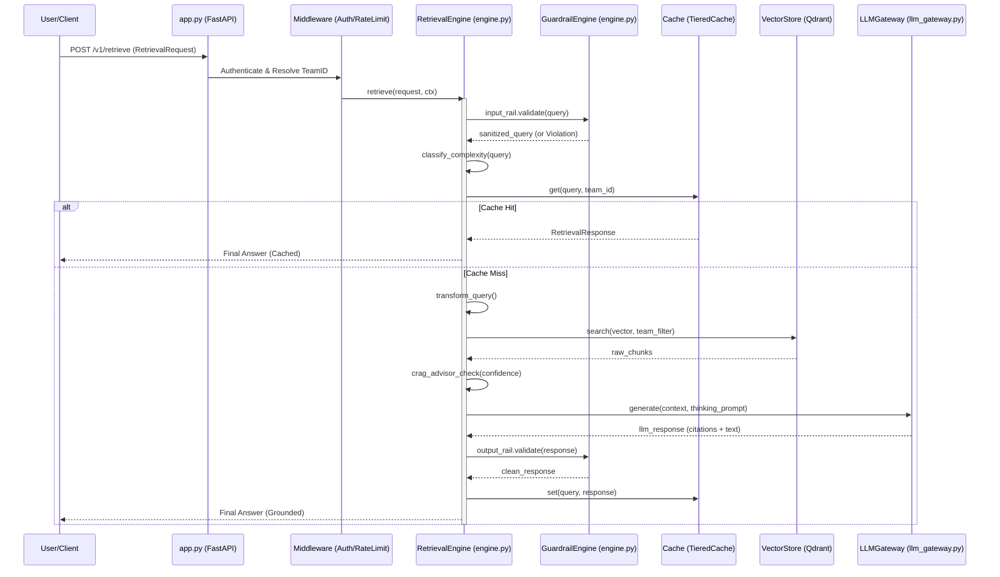
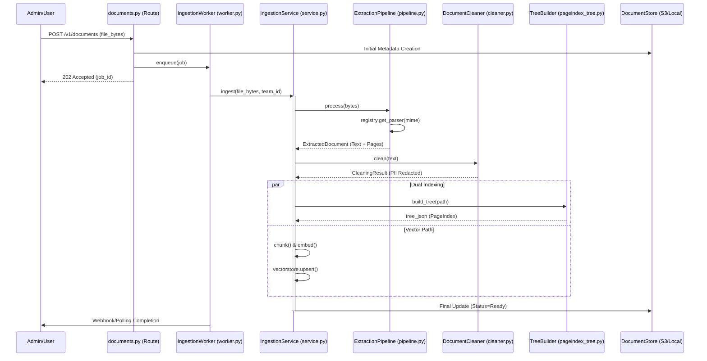

# CentRAG — Complete Code Flow Guide

> **Start here.** This document traces every code path in CentRAG
> with **actual class names, method signatures, and file locations**.
> Read it top-to-bottom like a story.

---

## Table of Contents

1. [The Big Picture](#the-big-picture)
2. [How the App Starts](#how-the-app-starts)
3. [Uploading a Document (Ingestion)](#uploading-a-document-ingestion)
4. [Asking a Question (Retrieval)](#asking-a-question-retrieval)
5. [The Dual-Path Architecture](#the-dual-path-architecture)
6. [Component Reference](#component-reference)
7. [File Map](#file-map)
8. [Glossary](#glossary)
9. [Agent Ecosystem Mapping](#agent-ecosystem-mapping)
10. [Documentation Standards](#documentation-standards)

---

## The Big Picture

CentRAG does **two things**:

1. **Ingest documents** — Upload a PDF/CSV/text/markdown → clean it → build indexes (Enforced Immutability)
2. **Answer questions** — Ask a question → find relevant chunks → generate answer (Mandatory Isolation)

```
  POST /v1/documents              POST /v1/retrieve
       │                                │
       ▼                                ▼
  ┌──────────┐                    ┌──────────────┐
  │ INGEST   │                    │  RETRIEVE    │
  │ Pipeline │                    │  Pipeline    │
  └──────────┘                    └──────────────┘
       │                                │
       ▼                                ▼
  ┌──────────────────────────────────────────────┐
  │              DocumentStore                    │
  │         (shared filesystem storage)           │
  └──────────────────────────────────────────────┘
```

---

## How the App Starts

### Entry Point

**File:** [`centrag/app.py`](file:///c:/Users/khars/PycharmProjects/scratch/centrag/app.py)
**Function:** `create_app() → FastAPI` (line 159)

When you run `uvicorn centrag.app:create_app --factory`, this is the call chain:

```
create_app()                                          # centrag/app.py:159
│
├── settings = get_settings()                         # centrag/config.py → Settings (Pydantic)
│   ├── Reads CENTRAG_* env vars + .env file
│   ├── PHASE 4 FLAGS: enable_graph_extraction, enable_multivector_retrieval, enable_cag
│   └── FAIL-FAST: Rejects non-production infra URLs (localhost) in PRODUCTION mode
│
├── app = FastAPI(title="CentRAG", lifespan=lifespan) # app.py:168
│
├── CORSMiddleware added (strict origins)             # app.py:180
│
├── SimpleRateLimitMiddleware added                   # app.py:187
│
├── Routes mounted:
│   ├── health_router                                 # centrag/routes/health.py
│   ├── documents_router (prefix="/v1")               # centrag/routes/documents.py
│   └── retrieve_router  (prefix="/v1")               # centrag/routes/retrieve.py
│
└── return app
```

### Lifespan (Startup/Shutdown)

**Function:** `lifespan(app)` — async context manager (line 84)

```
lifespan(app: FastAPI)
│
├── PARALLEL INIT (asyncio.gather):
│   ├── _init_postgres()  → app.state.db_engine      # SQLAlchemy AsyncEngine
│   ├── _init_redis()     → app.state.redis           # redis.asyncio client
│   └── _init_qdrant()    → app.state.qdrant          # QdrantClient
│   (All 3 degrade gracefully if unavailable)
│
├── DocumentStore(base_path=settings.data_dir)        # centrag/storage/document_store.py
│   └── app.state.document_store
│
├── build_retrieval_engine(settings, redis, store)    # centrag/wiring.py:115
│   └── Returns: RetrievalEngine                      # centrag/retrieval/engine.py
│   └── app.state.retrieval_engine
│
├── build_ingestion_service(settings, store)          # centrag/wiring.py:209
│   └── Returns: IngestionService                     # centrag/ingestion/service.py
│   └── app.state.ingestion_service
│
├── IngestionWorker(service, store, WorkerConfig())   # centrag/ingestion/worker.py:87
│   └── await worker.start()  → asyncio background task
│   └── app.state.ingestion_worker
│
└── yield → app serves requests
│
└── SHUTDOWN:
    ├── worker.shutdown()         # Graceful: finish current job
    ├── db_engine.dispose()       # Close PG pool
    └── redis.close()             # Close Redis
```

### The Composition Root

> **🤖 Agent Skill Mapping**: When modifying the composition root or dependency graphs, agents MUST load `.agents/skills/agent-orchestrator`, then delegate to `senior-architect` and `architecture-patterns`. Ensure you maintain SOLID boundaries.

**File:** [`centrag/wiring.py`](file:///c:/Users/khars/PycharmProjects/scratch/centrag/wiring.py)

This is the **ONE place** where concrete implementations are chosen. Two builder functions:

#### `build_retrieval_engine()` (line 115)

```python
def build_retrieval_engine(settings, redis_client, document_store) -> RetrievalEngine:
    # Cache: L1 (in-process) → L2 (Redis)
    cache = TieredCacheOrchestrator(tiers=[
        L1InMemoryCache(maxsize=512, ttl_seconds=300),   # centrag/cache/l1_memory.py
        L2RedisCache(redis_client=redis_client),          # centrag/cache/l2_redis.py
    ])                                                    # centrag/cache/orchestrator.py

    memory = InMemoryStore()                              # centrag/memory/in_memory_store.py
    guardrail_engine = GuardrailEngine(GuardrailsConfig())# centrag/guardrails/engine.py

    # VECTOR path: Qdrant + Provider Strategy
    # Selects NoOp, Bedrock (Titan V2), or OpenAI (text-embedding-3) based on config
    embedder_factory, vs_factory, emb_name, vs_name = _build_vector_components(settings)

    # VECTORLESS path: PageIndex
    tree_builder = PageIndexTreeBuilder(...)              # centrag/implementations/pageindex_tree.py
    pageindex_retriever = PageIndexRetriever(             # centrag/retrieval/pageindex_retriever.py
        document_store, tree_builder, llm=None
    )

    # SHARED: QueryRouter + HybridRetriever
    query_router = QueryRouter(document_store)            # centrag/retrieval/query_router.py
    hybrid_retriever = HybridRetriever(k=60)              # centrag/retrieval/hybrid.py

    # NEW: Two-Pass Reasoning Generator
    from centrag.retrieval.generator import TwoPassGenerator
    generator = TwoPassGenerator(llm=None, cache=cache)   # centrag/retrieval/generator.py

    # PHASE 4: Relational & Facet Paths
    graph_store = SQLiteGraphStore(base_path=settings.data_dir)
    graph_retriever = GraphRetriever(graph_store, document_store)
    multivector_retriever = MultivectorRetriever(vectorstore, embedder)
    cag_manager = CAGManager(document_store)

    return RetrievalEngine(                               # centrag/retrieval/engine.py
        embedder_factory, vs_factory,
        reranker_factory=NoOpReranker,
        llm_factory=_build_llm_factory(settings),         # Dynamic selection
        cache=cache, 
        memory=memory,
        sparse_embedder_factory=sparse_embedder_factory,  # FIXED: Dynamically detects language (NLTK)
        input_rails=input_rails, 
        output_rails=output_rails,
        tracing=tracing, 
        metrics=metrics, 
        cost_tracker=cost_tracker,
        pageindex_retriever=pageindex_retriever, 
        document_store=document_store,
        query_router=query_router, 
        hybrid_retriever=hybrid_retriever,
        # PHASE 4 INJECTION
        graph_retriever=graph_retriever,
        multivector_retriever=multivector_retriever,
        cag_manager=cag_manager,
        query_transformer=query_transformer,
        generator=generator,                              # TWO-PASS GENERATOR
        enable_compression=settings.enable_contextual_compression, # NEW: Contextual Compression
    )
```

#### `build_ingestion_service()` (line 209)

```python
def build_ingestion_service(settings, document_store) -> IngestionService:
    # Parser registry (Strategy pattern)
    registry = ParserRegistry()                           # centrag/extraction/parsers/base.py
    registry.register(PDFParser())                        # centrag/extraction/parsers/pdf.py
    registry.register(PlainTextParser())                  # centrag/extraction/parsers/text.py
    registry.register(MarkdownParser())                   # centrag/extraction/parsers/text.py
    registry.register(HTMLParser())                       # centrag/extraction/parsers/text.py
    # CSVParser available at:                             # centrag/extraction/parsers/csv_parser.py

    pipeline = ExtractionPipeline(
        parser_registry=registry,
        default_chunking=ChunkingConfig(
            enable_contextual_retrieval=settings.enable_contextual_retrieval # NEW: Situated Summaries
        ),
        llm_factory=_build_llm_factory(settings)[0]
    )

    tree_builder = PageIndexTreeBuilder(...)               # centrag/implementations/pageindex_tree.py
    cleaner = DocumentCleaner(DocumentCleanerConfig())     # centrag/ingestion/cleaner.py

    return IngestionService(pipeline, tree_builder, document_store, cleaner)
```

---

## Uploading a Document (Ingestion)

### Step 1: Route Handler

**File:** [`centrag/routes/documents.py`](file:///c:/Users/khars/PycharmProjects/scratch/centrag/routes/documents.py)

```
POST /v1/documents
│
├── Validates file type (PDF, TXT, MD, HTML, CSV)
├── Assigns doc_id = uuid4()
├── Creates DocumentMeta in DocumentStore
│
├── If async_mode=True:
│   └── worker.enqueue(job_id, file_bytes, filename, team_id)
│       Returns: 202 Accepted + job_id for polling
│
└── If async_mode=False:
    └── ingestion_service.ingest(file_bytes, filename, team_id)
        Returns: 200 OK + IngestionResult
```

### Step 2: Background Worker

> **🤖 Agent Skill Mapping**: Before altering the background job loops, load `async-python-patterns` and `microservices-patterns` to prevent zombie threads and ensure retry safety.

**File:** [`centrag/ingestion/worker.py`](file:///c:/Users/khars/PycharmProjects/scratch/centrag/ingestion/worker.py)
**Class:** `IngestionWorker` (line 87)

| Component | Description |
|-----------|-------------|
| `IngestionJob` (line 50) | Dataclass tracking lifecycle: `job_id`, `status`, `attempt`, `max_retries` |
| `JobStatus` (line 41) | Enum: PENDING → PROCESSING → COMPLETED / FAILED / RETRYING |
| `WorkerConfig` (line 76) | `max_concurrent=1`, `max_retries=3`, `base_backoff_seconds=2.0` |
| `_consume_loop()` (line 243) | Main loop: `asyncio.wait_for(queue.get(), timeout=1.0)` |
| `_process_job()` (line 264) | Calls `IngestionService.ingest()` with exponential backoff: `2^attempt` seconds |

```
_consume_loop() → _process_job(job)
│
├── job.status = PROCESSING
├── job.attempt += 1
│
├── result = await self._service.ingest(...)     # IngestionService.ingest()
│
├── On success:
│   └── job.status = COMPLETED, job.result = result
│
└── On failure:
    ├── attempt ≤ max_retries → RETRYING, sleep(2^attempt)
    └── attempt > max_retries → FAILED, store.update_meta(status="failed")
```

### Step 3: Ingestion Service

> **🤖 Agent Skill Mapping**: For edits here across parsing, cleaning, and indexing, invoke `senior-data-engineer`. Consult `python-performance-optimization` to prevent pipeline latency bloat.

**File:** [`centrag/ingestion/service.py`](file:///c:/Users/khars/PycharmProjects/scratch/centrag/ingestion/service.py)
**Class:** `IngestionService` (line 110)
**Method:** `ingest(file_bytes, filename, team_id, content_type, namespace)` → `IngestionResult` (line 142)

```
ingest()
│
├── Step 1: PARSE & CONTEXTUALIZE
│   ├── _resolve_content_type(mime, filename)          # line 67
│   │   Uses _MIME_TO_CONTENT_TYPE dict (line 50)
│   │   Fallback: extension-based (.pdf → PDF, .csv → CSV)
│   │
│   └── ExtractionPipeline.process(file_bytes, ct)     # centrag/extraction/pipeline.py
│       └── ParserRegistry.get(content_type)            # centrag/extraction/parsers/base.py:56
│       └── NEW: Contextualization Loop (Anthropic 2024 Pattern):
│           ├── If enable_contextual_retrieval=True
│           ├── Generates 1-sentence situational summary for each chunk via LLM
│           └── Prepends summary to chunk.content before indexing
│       └── Returns: ExtractedDocument(text, content_type, metadata, pages)
│           └── HARDENED: Immutable elements (tuple) and metadata (MappingProxyType)
│               The WHY: Prevents downstream ingestion filters or re-rankers from 
│               accidentally modifying the original source attributes during processing.
│
├── Step 2: CLEAN
│   └── DocumentCleaner.clean(text, filename)           # centrag/ingestion/cleaner.py:95
│       ├── Stage 1: _normalize_unicode()                # NFKC + smart quotes → ASCII
│       ├── Stage 2: _normalize_whitespace()             # Collapse, strip trailing
│       ├── Stage 3: _strip_headers_footers()            # Remove "Page X of Y"
│       ├── Stage 4: PII redaction                       # centrag/guardrails/pii.py
│       │   ├── detect_pii(text) → list of PII types found
│       │   └── redact_pii(text) → replaces with [REDACTED_SSN], etc.
│       │   └── 14 patterns: SSN, email, phone, passport, DOB,
│       │       driver's license, MRN, credit card, IBAN, IP,
│       │       AWS keys, AWS ARN, API keys
│       └── Stage 5: _normalize_urls()                   # Strip tracking params
│       └── Returns: CleaningResult(cleaned_text, pii_types_found, pii_redaction_count)
│
├── Step 3: STORE
│   └── DocumentStore.store_document(team_id, filename, cleaned_text)
│       # centrag/storage/document_store.py
│       └── Writes: data/{team_id}/{doc_id}/meta.json + cleaned_text.txt
│
├── Step 4: BUILD PAGEINDEX TREE (VECTORLESS PATH)
│   └── PageIndexTreeBuilder.build_tree(file_path, content_type, doc_id)
│       # centrag/implementations/pageindex_tree.py
│       └── Uses VectifyAI API to build hierarchical tree index
│   └── DocumentStore.store_pageindex(team_id, doc_id, tree_json, page_cache)
│       └── Writes: data/{team_id}/{doc_id}/tree.json + page_cache.json
│
├── Step 5: VECTOR PATH (future: chunk → embed → upsert to Qdrant)
│
└── Step 6: UPDATE META
    └── DocumentStore.update_meta(status="ready", tree_available=True)
    └── Returns: IngestionResult(doc_id, status, tree_available, ...)
```

---

## Asking a Question (Retrieval)

### Step 1: Route Handler

**File:** [`centrag/routes/retrieve.py`](file:///c:/Users/khars/PycharmProjects/scratch/centrag/routes/retrieve.py)

```
POST /v1/retrieve
Body: { "query": "...", "target_doc_id": "...", "mode": "auto" }
│
├── Parse body → RetrievalRequest                       # centrag/retrieval/engine.py:67
│   Fields: query, namespace, max_results, mode, target_doc_id
│
├── Create RequestContext(team_id, request_id)          # centrag/middleware/__init__.py
│
└── response = await engine.retrieve(request, ctx)
    └── Returns: RetrievalResponse                      # centrag/retrieval/engine.py:99
```

### Step 2: RetrievalEngine.retrieve()

> **🤖 Agent Skill Mapping**: When modifying adaptive routing or LLM complex generation logic, agents MUST first load `senior-ml-engineer` and validate new test cases via `test-driven-development`.

**File:** [`centrag/retrieval/engine.py`](file:///c:/Users/khars/PycharmProjects/scratch/centrag/retrieval/engine.py)
**Class:** `RetrievalEngine` (line ~200)
**Method:** `retrieve(request, ctx)` → `RetrievalResponse`

```
retrieve(request: RetrievalRequest, ctx: RequestContext)
│
├── STEP 1: INPUT GUARDRAILS
│   GuardrailEngine runs each InputRailProtocol:         # centrag/guardrails/engine.py
│   ├── PromptInjectionRail.check(query, ctx)            # Blocks "ignore instructions"
│   ├── InputLengthRail.check(query, ctx)                # Rejects < 3 or > 2000 chars
│   ├── NamespaceAccessRail.check(query, ctx)            # Team-scoped namespace check
│   ├── InputPIIDetectionRail.check(query, ctx)          # Flags PII in query (warn)
│   └── BudgetGateRail.check(query, ctx)                 # Blocks if team over $ budget
│   If any raises GuardrailViolation → 422 response
│
├── STEP 2: CLASSIFY QUERY COMPLEXITY (Adaptive RAG)
│   llm.classify_complexity(query) → QueryComplexity     # centrag/abstractions/llm.py
│   ├── SIMPLE   → may use cache, skip retrieval
│   ├── MODERATE → standard RAG pipeline
│   └── COMPLEX  → multi-hop, frontier model
│
├── STEP 3: CACHE CHECK (L1 → L2)
│   cache.get(cache_key, namespace) → CacheResult        # centrag/cache/orchestrator.py
│   ├── L1InMemoryCache.get()                            # centrag/cache/l1_memory.py
│   │   TTLCache(maxsize=512, ttl=300s)
│   ├── L2RedisCache.get()                               # centrag/cache/l2_redis.py
│   │   Redis GET with team-scoped key
│   ├── HIT → return cached RetrievalResponse
│   └── MISS → continue pipeline
│
├── STEP 4: QUERY ROUTING
│   QueryRouter.route(query, mode, target_doc_id)        # centrag/retrieval/query_router.py:89
│   Returns: RoutingDecision(path, reason, confidence)   # line 38
│   │
│   ├── Explicit mode → use that path directly
│   ├── Auto mode decision tree:
│   │   ├── No target_doc_id → VECTOR (cross-doc search)
│   │   ├── Has tree only    → PAGEINDEX
│   │   ├── Has vectors only → VECTOR
│   │   └── Has both         → classify query:
│   │       ├── _STRUCTURED_KEYWORDS (section, chapter, table) → PAGEINDEX
│   │       ├── _FACTUAL_KEYWORDS (what, when, compare)        → VECTOR
│   │       └── Complex/ambiguous                              → HYBRID
│   │
│   └── RoutingDecision.path → RetrievalPath enum         # line 30
│       VECTOR | PAGEINDEX | HYBRID
│
├── STEP 4.5: QUERY TRANSFORMATION (QueryTransformerProtocol)
│   llm_query_extractor.transform(query)                 # centrag/implementations/llm_query_extractor.py
│   └── Outputs QueryIntent(optimized_query, expansions, extracted_filter)
│
├── STEP 5: RETRIEVAL (Path-Dependent)
│   │
│   ├── If PAGEINDEX:
│   │   PageIndexRetriever.retrieve(query, doc_id, team_id) # centrag/retrieval/pageindex_retriever.py
│   │   └── LLM navigates the tree index to find pages
│   │   └── Returns list of relevant page contents
│   │
│   ├── If VECTOR:
│   │   embedder.embed_query(query) → vector              # EmbedderProtocol
│   ├── vectorstore.search(vector, filter, top_k, ...)    # VectorStoreProtocol
│   │   └── HARDENED: Mandatory runtime check enforces `team_id` filter presence.
│   │       FAIL-SAFE: Raises `RuntimeError` if isolation is bypassed.
│   │   reranker.rerank(query, results)                   # RerankerProtocol
│   │
│   └── If HYBRID:
│       Both paths run, then:
│       HybridRetriever.fuse(pageindex_results, vector_results)
│       # centrag/retrieval/hybrid.py
│       # Reciprocal Rank Fusion: score = Σ 1/(k + rank), k=60
│
├── STEP 5.5: CONTEXTUAL COMPRESSION (Dynamic Refinement)
│   If enable_contextual_compression=True:
│   └── RetrievalEngine._compress_context(query, chunks)
│   └── LLM trims chunks to keep ONLY sections relevant to query
│
├── STEP 5.6: TOKEN BUDGETING (TokenBudgetManager)
│   └── fit_context(sources)
│   └── HARDENED: Sorts by `relevance_score` descending to prioritize high-value signal
│
├── STEP 6: CRAG VALIDATION
│   Check confidence of retrieved chunks via RerankerProtocol
│   If chunks lack confidence → llm_query_extractor searches using synonym fallback query
│   └── Re-embeds synonym query → searches VectorStore natively again
│   └── If still no confidence → gracefully degrades, returning top 3 fallback chunks as failsafe without synthetic context generation.
│
├── STEP 7: MEMORY INJECTION
│   memory.recall(team_id, query) → list[MemoryEntry]    # centrag/memory/in_memory_store.py
│   Inject as additional LLM context
│
├── STEP 8: LLM GENERATION (via LLMGateway)
│   LLMGateway wraps the real LLM call:                  # centrag/implementations/llm_gateway.py
│   ├── ① budget_guard.check()                           # BudgetExceededError if over
│   ├── ② circuit_breaker state check                    # CircuitOpenError if failing
│   │   States: CLOSED (normal) → OPEN (failing) → HALF_OPEN (testing)
│   │   Opens after 5 failures, resets after 60s
│   ├── ③ Retry with backoff (3 attempts: 0s, 1s, 2s)
│   ├── ④ cost_tracker.record(tokens, model)             # USD cost per call
│   └── ⑤ latency_monitor.record(elapsed)               # P50/P95/P99 histogram
│   └── Returns: LLMResponse(text, model, tokens, cost)
│
├── STEP 8.1: TWO-PASS REASONING (If COMPLEX)           # centrag/retrieval/generator.py
│   Triggered for oversized docs or frontier-model queries:
│   ├── PASS 1: Fact Extraction per chunk (Atomic Grounding)
│   ├── CACHE check (chunk_summaries namespace)          # Uses 7-day L2 Cache
│   └── PASS 2: Synthesis based ONLY on extracted facts
│   └── Result: Grounded answer with [Chunk#1, p4] citations
│
├── STEP 9: OUTPUT GUARDRAILS
│   ├── ResponseLengthRail.validate(response)
│   ├── ConfidenceGateRail.validate(response)            # "I don't know" if no sources
│   ├── OutputPIIRedactionRail.validate(response)        # Redact any PII in answer
│   └── BlockedPatternRail.validate(response)
│
└── STEP 10: CACHE WRITE + RETURN
    cache.set(cache_key, response, namespace)
    Return: RetrievalResponse(answer, sources, cache_tier, ...)

---

## Active Learning Feedback Loop

**File:** [`centrag/routes/feedback.py`](file:///c:/Users/khars/PycharmProjects/scratch/centrag/routes/feedback.py)

Capture user signal to optimize search accuracy over time.

```
POST /v1/feedback
Body: { "request_id": "...", "score": 1, "comments": "..." }
│
├── team_id resolved from API key
├── Stored in `feedback` table (SQLAlchemy)               # centrag/models.py
└── Postgres RLS ensures developer/team isolation
```
```

---

## The Dual-Path Architecture

### Path 1: VECTORLESS (PageIndex)

**Files:**
- [`centrag/implementations/pageindex_tree.py`](file:///c:/Users/khars/PycharmProjects/scratch/centrag/implementations/pageindex_tree.py) — `PageIndexTreeBuilder`
- [`centrag/retrieval/pageindex_retriever.py`](file:///c:/Users/khars/PycharmProjects/scratch/centrag/retrieval/pageindex_retriever.py) — `PageIndexRetriever`

```
Ingestion: PageIndexTreeBuilder.build_tree(file_path, content_type, doc_id)
           └── Returns: TreeResult(tree: dict, page_cache: dict, node_count, page_count)

Retrieval: PageIndexRetriever.retrieve(query, doc_id, team_id)
           └── LLM reads tree nodes → selects relevant pages → returns content
```

### Path 2: VECTOR (Qdrant)

**Files:**
- [`centrag/implementations/qdrant_vectorstore.py`](file:///c:/Users/khars/PycharmProjects/scratch/centrag/implementations/qdrant_vectorstore.py) — `QdrantVectorStore`
- [`centrag/implementations/noop_embedder.py`](file:///c:/Users/khars/PycharmProjects/scratch/centrag/implementations/noop_embedder.py) — `NoOpEmbedder` (dev)
- [`centrag/implementations/noop_vectorstore.py`](file:///c:/Users/khars/PycharmProjects/scratch/centrag/implementations/noop_vectorstore.py) — `NoOpVectorStore` (dev)

```
Ingestion: chunk(text) → embed(chunks) → vectorstore.upsert(vectors, metadata)
Retrieval: embed(query) → vectorstore.search(vector, top_k, sparse_vectors) → rerank(results)

### Path 2.5: FACET (Multivector)
**Files:**
- [`centrag/retrieval/multivector_retriever.py`](file:///c:/Users/khars/PycharmProjects/scratch/centrag/retrieval/multivector_retriever.py) — `MultivectorRetriever`

```
Retrieval: Query(Content, Summary, Keywords) → Parallel Namespace Queries → Weighted Fusion
```

### Path 2.6: RELATIONAL (Graph RAG)
**Files:**
- [`centrag/implementations/sqlite_graph_store.py`](file:///c:/Users/khars/PycharmProjects/scratch/centrag/implementations/sqlite_graph_store.py) — `SQLiteGraphStore`
- [`centrag/retrieval/graph_retriever.py`](file:///c:/Users/khars/PycharmProjects/scratch/centrag/retrieval/graph_retriever.py) — `GraphRetriever`

```
Retrieval: Extract Entities from Query → Recursive Neighbor Search (SQLite CTE) → Knowledge Context
```
```

### Path 3: HYBRID (RRF Fusion)

**File:** [`centrag/retrieval/hybrid.py`](file:///c:/Users/khars/PycharmProjects/scratch/centrag/retrieval/hybrid.py) — `HybridRetriever`

```python
HybridRetriever(k=60)                                    # k=60 is the RRF constant

fuse(pageindex_results, vector_results) → merged_results
    For each result across both lists:
        rrf_score = Σ 1/(k + rank)                        # Rank-based, scale-agnostic
    Sort by rrf_score descending → top N results
```

### QueryRouter Decision Matrix

**File:** [`centrag/retrieval/query_router.py`](file:///c:/Users/khars/PycharmProjects/scratch/centrag/retrieval/query_router.py) — `QueryRouter`

| Condition | Path | Confidence |
|-----------|------|-----------|
| `mode="pageindex"` | PAGEINDEX | 1.0 |
| `mode="vector"` or `mode="rag"` | VECTOR | 1.0 |
| `mode="hybrid"` | HYBRID | 1.0 |
| No `target_doc_id` | VECTOR | 0.9 |
| `target_doc_id` + tree only | PAGEINDEX | 0.9 |
| Both + structured keywords | PAGEINDEX | 0.8 |
| Both + factual keywords | VECTOR | 0.7 |
| Both + complex/ambiguous | HYBRID | 0.6 |

**Structured keywords** (line 74): section, chapter, table, figure, appendix, page, heading, summary, conclusion

**Factual keywords** (line 81): compare, across, all documents, every, between, what is, define, who

---

## Component Reference

### Protocols (Contracts)

**Directory:** [`centrag/abstractions/`](file:///c:/Users/khars/PycharmProjects/scratch/centrag/abstractions)

| Protocol | File | Key Methods | Implementations |
|----------|------|-------------|----------------|
| `EmbedderProtocol` | [embedder.py](file:///c:/Users/khars/PycharmProjects/scratch/centrag/abstractions/embedder.py) | `embed_query()`, `embed_documents()` | `NoOpEmbedder`, `BedrockEmbedder`, `OpenAIEmbedder` |
| `VectorStoreProtocol` | [vectorstore.py](file:///c:/Users/khars/PycharmProjects/scratch/centrag/abstractions/vectorstore.py) | `upsert()`, `search()`, `delete()` | `NoOpVectorStore`, `QdrantVectorStore` |
| `LLMProtocol` | [llm.py](file:///c:/Users/khars/PycharmProjects/scratch/centrag/abstractions/llm.py) | `generate()`, `classify_complexity()` | `NoOpLLM`, wrapped by `LLMGateway` |
| `RerankerProtocol` | [reranker.py](file:///c:/Users/khars/PycharmProjects/scratch/centrag/abstractions/reranker.py) | `rerank()` | `NoOpReranker` |
| `ChunkerProtocol` | [chunker.py](file:///c:/Users/khars/PycharmProjects/scratch/centrag/abstractions/chunker.py) | `chunk()`, `chunk_boundaries()` | `RecursiveChunker`, `PropositionChunker`, `ParentChildChunker`, `FixedChunker`, `SemanticChunker` |
| `CacheProtocol` | [cache.py](file:///c:/Users/khars/PycharmProjects/scratch/centrag/abstractions/cache.py) | `get()`, `set()`, `invalidate()` | `L1InMemoryCache`, `L2RedisCache`, `TieredCacheOrchestrator` |
| `SparseEmbedderProtocol` | [embedder.py](file:///c:/Users/khars/PycharmProjects/scratch/centrag/abstractions/embedder.py) | `embed_query()`, `embed_documents()` | `BM25SparseEmbedder` (i18n aware via NLTK/langdetect) |
| `MemoryProtocol` | [memory.py](file:///c:/Users/khars/PycharmProjects/scratch/centrag/abstractions/memory.py) | `add()`, `recall()`, `forget()` | `InMemoryStore` |
| `ExtractorProtocol` | [extractor.py](file:///c:/Users/khars/PycharmProjects/scratch/centrag/abstractions/extractor.py) | `extract()`, `supported_types()` | `PDFParser`, `PlainTextParser`, `MarkdownParser`, `HTMLParser`, `CSVParser` |
| `InputRailProtocol` | [guardrail.py](file:///c:/Users/khars/PycharmProjects/scratch/centrag/abstractions/guardrail.py) | `check(query, ctx)` | 5 input rails (see below) |
| `OutputRailProtocol` | [guardrail.py](file:///c:/Users/khars/PycharmProjects/scratch/centrag/abstractions/guardrail.py) | `validate(response, ctx)` | 4 output rails (see below) |
| `TreeIndexProtocol` | [tree_index.py](file:///c:/Users/khars/PycharmProjects/scratch/centrag/abstractions/tree_index.py) | `build_tree()` | `PageIndexTreeBuilder` |

### Guardrails

> **🤖 Agent Skill Mapping**: Making changes to the redaction logic or budgets? Delegate strictly to `senior-security`, `audit`, and evaluate edge cases with `harden`. Safety rules must fail securely!

**File:** [`centrag/guardrails/engine.py`](file:///c:/Users/khars/PycharmProjects/scratch/centrag/guardrails/engine.py) — `GuardrailEngine`
**Config:** `GuardrailsConfig` (line 50)

| Rail | Type | Configurable | What it does |
|------|------|-------------|-------------|
| `PromptInjectionRail` | Input | `enable_prompt_injection_detection` | Regex for "ignore", "system prompt", etc. |
| `InputLengthRail` | Input | `min_query_length=3`, `max_query_length=2000` | Length bounds |
| `NamespaceAccessRail` | Input | `enable_namespace_access_control` | Team-scoped namespace |
| `InputPIIDetectionRail` | Input | Always on | Flags PII in query (warns, doesn't block) |
| `BudgetGateRail` | Input | `budget_limit_usd` | Blocks if team over budget |
| `ResponseLengthRail` | Output | `max_response_length` | Truncates long responses |
| `ConfidenceGateRail` | Output | `min_confidence` | "I don't know" if no sources |
| `OutputPIIRedactionRail` | Output | Always on | Redacts PII in LLM answer |
| `BlockedPatternRail` | Output | `blocked_patterns` | Blocks unwanted patterns |

### PII Patterns (14 total)

**File:** [`centrag/guardrails/pii.py`](file:///c:/Users/khars/PycharmProjects/scratch/centrag/guardrails/pii.py)

| Category | Pattern | Redaction Token | Regex Line |
|----------|---------|----------------|-----------|
| Identity | SSN | `[REDACTED_SSN]` | line 21 |
| Identity | Email | `[REDACTED_EMAIL]` | line 22 |
| Identity | Phone (US) | `[REDACTED_PHONE_US]` | line 23 |
| Identity | Passport | `[REDACTED_PASSPORT]` | line 26 |
| Identity | Date of Birth | `[REDACTED_DATE_OF_BIRTH]` | line 29 |
| Identity | Driver's License | `[REDACTED_DRIVERS_LICENSE]` | line 35 |
| Identity | Medical Record | `[REDACTED_MEDICAL_RECORD]` | line 41 |
| Financial | Credit Card | `[REDACTED_CREDIT_CARD]` | line 48 |
| Financial | IBAN | `[REDACTED_IBAN]` | line 51 |
| Network | IP Address | `[REDACTED_IP_ADDRESS]` | line 54 |
| Cloud | AWS Access Key | `[REDACTED_AWS_ACCESS_KEY]` | line 57 |
| Cloud | AWS Secret Key | `[REDACTED_AWS_SECRET_KEY]` | line 58 |
| Cloud | AWS ARN | `[REDACTED_AWS_ARN]` | line 61 |
| Cloud | API Key (generic) | `[REDACTED_API_KEY_GENERIC]` | line 64 |

### ChunkResult Schema

**File:** [`centrag/abstractions/chunker.py`](file:///c:/Users/khars/PycharmProjects/scratch/centrag/abstractions/chunker.py) — `ChunkResult` (line 54)

| Field | Type | Purpose |
|-------|------|---------|
| `content` | `str` | The chunk text |
| `chunk_index` | `int` | Position in document |
| `start_char` / `end_char` | `int` | Character offsets |
| `token_count` | `int` | Estimated tokens |
| `doc_id` | `str` | Parent document UUID |
| `source_type` | `str` | "pdf", "csv", "markdown" |
| `section_title` | `str` | Heading this chunk is under |
| `page_number` | `int\|None` | PDF page number |
| `s3_url` | `str` | Cloud storage source URL |
| `parent_chunk_id` | `str\|None` | For child→parent linking |
| `chunk_id` | `str` | SHA256-based unique ID |
| `to_dict()` | method | JSON serialization |

### Parent-Child Chunking

**File:** [`centrag/extraction/chunkers/parent_child.py`](file:///c:/Users/khars/PycharmProjects/scratch/centrag/extraction/chunkers/parent_child.py) — `ParentChildChunker`

```
Parent chunks (~512 tokens = 384 words) → fed to LLM as context
Child chunks  (~128 tokens = 96 words)  → stored in vector DB for search

Each child.parent_chunk_id → parent.chunk_id

Retrieval flow:
  1. Vector search finds Child Chunk #7 (best match)
  2. Look up child.parent_chunk_id → Parent Chunk #2
  3. Feed Parent Chunk #2 to LLM (broader context)
```

### LLM Gateway

**File:** [`centrag/implementations/llm_gateway.py`](file:///c:/Users/khars/PycharmProjects/scratch/centrag/implementations/llm_gateway.py) — `LLMGateway`

| Component | Detail |
|-----------|--------|
| Circuit Breaker | Opens after `failure_threshold=5`, resets after `recovery_timeout=60s` |
| States | `CLOSED` → `OPEN` → `HALF_OPEN` |
| Retry | 3 attempts with `[0s, 1s, 2s]` backoff |
| Cost Tracking | Per-model token pricing, USD accumulation |
| Budget Guard | Max USD per team, raises `BudgetExceededError` |
| Latency Monitor | Rolling window, P50/P95/P99 percentiles |

### Evaluation Harness

> **🤖 Agent Skill Mapping**: Designing regressions or testing the PathComparator? Load `senior-qa` and `webapp-testing`. Always run against golden datasets.

**Directory:** [`centrag/evaluation/`](file:///c:/Users/khars/PycharmProjects/scratch/centrag/evaluation)

| File | Class | Purpose |
|------|-------|---------|
| [dataset.py](file:///c:/Users/khars/PycharmProjects/scratch/centrag/evaluation/dataset.py) | `GoldenDataset`, `TestCase` | Test cases with expected answers |
| [judges.py](file:///c:/Users/khars/PycharmProjects/scratch/centrag/evaluation/judges.py) | `FaithfulnessJudge`, `RelevanceJudge`, `CoverageJudge` | Score answers 0.0–1.0 |
| [metrics.py](file:///c:/Users/khars/PycharmProjects/scratch/centrag/evaluation/metrics.py) | `EvaluationMetrics`, `EvaluationReport` | Aggregate per-judge, per-difficulty |
| [comparator.py](file:///c:/Users/khars/PycharmProjects/scratch/centrag/evaluation/comparator.py) | `PathComparator` | Side-by-side: pageindex vs vector |

**CI Automation:** `ai-evals.yml` automatically triggers this test suite on any pull requests modifying chunking or retrieval pipelines.

---

## File Map

```
centrag/
├── .github/                        Enterprise CI/CD definitions
│   └── workflows/
│       ├── enterprise-ci.yml         Ruff, Mypy, Bandit, Auto-Graph Sync
│       └── ai-evals.yml              Automated evaluation of RAG responses
│
├── app.py                          create_app() → FastAPI factory
├── config.py                       Settings (Pydantic, CENTRAG_* env vars)
├── wiring.py                       build_retrieval_engine(), build_ingestion_service()
├── models.py                       SQLAlchemy async models + RLS
├── Makefile                        Central build system + Security Entrypoints
├── scripts/
│   ├── generate_ddl.py               Helper for DB schema generation
│   └── sync_agentsview.py           Bridge to AgentsView visualization [NEW]
│
├── abstractions/                   Protocol definitions (10 contracts)
│   ├── embedder.py                   EmbedderProtocol
│   ├── vectorstore.py                VectorStoreProtocol, VectorFilter, VectorResult
│   ├── llm.py                        LLMProtocol, LLMResponse, QueryComplexity
│   ├── reranker.py                   RerankerProtocol, RerankResult
│   ├── chunker.py                    ChunkerProtocol, ChunkResult (14 fields)
│   ├── cache.py                      CacheProtocol, CacheResult, CacheTier
│   ├── memory.py                     MemoryProtocol, MemoryEntry, MemoryType
│   ├── extractor.py                  ExtractorProtocol, ContentType, ExtractedDocument
│   ├── guardrail.py                  InputRailProtocol, OutputRailProtocol, GuardrailViolation
│   └── tree_index.py                 TreeIndexProtocol, TreeResult
│
├── implementations/                Concrete classes (swap freely)
│   ├── noop_embedder.py              NoOpEmbedder (hash-based, deterministic)
│   ├── noop_vectorstore.py           NoOpVectorStore (in-memory dict)
│   ├── noop_llm.py                   NoOpLLM (template-based)
│   ├── noop_reranker.py              NoOpReranker (keyword overlap)
│   ├── qdrant_vectorstore.py         QdrantVectorStore (production, lazy-load)
│   ├── pageindex_tree.py             PageIndexTreeBuilder (VectifyAI)
│   ├── llm_gateway.py               LLMGateway (circuit breaker + cost)
│   ├── bedrock_embedder.py           BedrockEmbedder (AWS Titan V2)
│   └── openai_embedder.py            OpenAIEmbedder (text-embedding-3)
│
├── extraction/                     Document parsing + chunking
│   ├── pipeline.py                   ExtractionPipeline (parser orchestrator)
│   ├── parsers/
│   │   ├── base.py                   ParserRegistry (strategy pattern)
│   │   ├── pdf.py                    PDFParser (PyMuPDF)
│   │   ├── text.py                   PlainTextParser, MarkdownParser, HTMLParser
│   │   └── csv_parser.py            CSVParser (1000-row streaming, markdown tables)
│   └── chunkers/
│       ├── fixed.py                  FixedChunker (fixed-size with overlap)
│       ├── recursive.py              RecursiveChunker (paragraph→sentence→word)
│       ├── semantic.py               SemanticChunker (embedding boundaries)
│       ├── structure_aware.py        StructureAwareChunker (heading-aware)
│       ├── parent_child.py           ParentChildChunker (512t parent + 128t child)
│       └── proposition.py            PropositionChunker (atomic fact extraction)
│
├── ingestion/                      Document upload pipeline
│   ├── service.py                    IngestionService.ingest() → IngestionResult
│   ├── cleaner.py                    DocumentCleaner (5-stage), CleaningResult
│   └── worker.py                     IngestionWorker, IngestionJob, WorkerConfig
│
├── retrieval/                      Question answering pipeline
│   ├── engine.py                     RetrievalEngine.retrieve() → RetrievalResponse
│   ├── pageindex_retriever.py        PageIndexRetriever (LLM tree navigation)
│   ├── query_router.py               QueryRouter.route() → RoutingDecision
│   ├── hybrid.py                     HybridRetriever.fuse() (RRF, k=60)
│   └── session.py                    ConversationSession, SessionManager
│
├── guardrails/                     Safety rails
│   ├── engine.py                     GuardrailEngine, GuardrailsConfig, 9 rail classes
│   ├── pii.py                        PII_PATTERNS (14), redact_pii(), detect_pii()
│   └── cost_tracker.py               CostTracker (per-team budget)
│
├── cache/                          Tiered caching
│   ├── l1_memory.py                  L1InMemoryCache (TTLCache, 512 entries, 300s)
│   ├── l2_redis.py                   L2RedisCache (team-scoped keys)
│   ├── orchestrator.py               TieredCacheOrchestrator (L1→L2 fallthrough)
│   └── swr.py                        StaleWhileRevalidate (async refresh)
│
├── memory/                         Long-term memory
│   └── in_memory_store.py            InMemoryStore (dict-based, temporal versioning)
│
├── storage/                        Filesystem storage
│   └── document_store.py             DocumentStore, DocumentMeta
│
├── evaluation/                     Quality measurement
│   ├── dataset.py                    GoldenDataset, TestCase
│   ├── judges.py                     FaithfulnessJudge, RelevanceJudge, CoverageJudge
│   ├── metrics.py                    EvaluationMetrics, EvaluationReport
│   └── comparator.py                 PathComparator
│
├── routes/                         FastAPI endpoints
│   ├── documents.py                  POST/GET /v1/documents
│   ├── retrieve.py                   POST /v1/retrieve
│   └── health.py                     GET /health
│
├── observability/                  Metrics + tracing
│   ├── __init__.py                   TracingProtocol, MetricsProtocol, CostTrackingProtocol
│   ├── console.py                    ConsoleTracer, ConsoleMetrics (dev)
│   └── otel_provider.py              OTelProvider (OpenTelemetry, production)
│
├── middleware/                     FastAPI middleware
│   ├── auth.py                       API key auth + team resolution
│   ├── slow_logger.py                Slow request logging
│   └── rate_limiter.py               SimpleRateLimitMiddleware (Throttling)
│
└── mcp_bridge/                     Model Context Protocol
    ├── rag_as_mcp_tool.py            Expose CentRAG as MCP tool
    └── mcp_as_rag_source.py          Consume external MCP servers

tests/                              202 tests (pytest + pytest-asyncio)
docs/                               34 documentation files
├── adr/                            Architecture Decision Records
│   ├── 0001-use-composition-root-for-dependency-injection.md
│   └── 0002-parent-child-chunking-strategy.md
.code-review-graph/                 Structural code graph (1318 nodes, 7605 edges)
```

---

## Glossary

| Term | What it means | Where in code |
|------|---------------|--------------|
| **VECTORLESS** | PageIndex path — LLM navigates a tree, no embeddings | `pageindex_retriever.py` |
| **VECTOR** | Traditional RAG — embed chunks, search Qdrant | `qdrant_vectorstore.py` |
| **HYBRID** | Both paths + RRF fusion | `hybrid.py` |
| **RRF** | Reciprocal Rank Fusion: score = Σ 1/(k + rank) | `hybrid.py:HybridRetriever.fuse()` |
| **PII** | Personally Identifiable Information (14 patterns) | `guardrails/pii.py` |
| **Circuit Breaker** | Prevents calling a failing LLM. Opens after 5 failures | `llm_gateway.py:LLMGateway` |
| **Composition Root** | ONE place where all deps are wired | `wiring.py` |
| **Protocol** | Python structural typing — contract without inheritance | `abstractions/*.py` |
| **NoOp** | No-operation implementations for testing (deterministic) | `implementations/noop_*.py` |
| **CRAG** | Corrective RAG — rewrite query if confidence too low | `engine.py` |
| **Parent-Child** | Small child chunks (search) → parent chunks (LLM context) | `chunkers/parent_child.py` |
| **ChunkResult** | Immutable chunk with 14 provenance fields | `abstractions/chunker.py` |

---

## Documentation Standards

### "The WHY" Docstring Standard

Every core business logic function MUST include a Google-style docstring with an explicit **The WHY** section.

**Purpose:** 
Production ecosystems are evolved by multiple agents and human engineers. Traditional docstrings describe *what* a function does. **The WHY** captures the architectural rationale, trade-offs, and critical constraints (like "Safe Default" patterns), ensuring that the *intent* of the code remains clear during automated refactoring sessions.

**Example (from logger.py):**
```python
def get_processors():
    """Configures the structlog processing pipeline.

    The WHY:
        Dynamic renderer selection is required to provide machine-readable JSON logs 
        for production aggregators while maintaining human-friendly console output.
    """
```
| **DocumentStore** | Filesystem store: `data/{team_id}/{doc_id}/` | `storage/document_store.py` |
| **GuardrailViolation** | Exception raised by rails → 422 HTTP response | `abstractions/guardrail.py` |

---

## 9. Agent Ecosystem Mapping

When an LLM coding agent works in evaluating or rewriting the CentRAG pipeline, it utilizes the local `.agents/skills` repository. The overarching orchestrator sits in `agent-orchestrator`, providing 38 specific behavior models.

**How to Execute Changes:**
1. Whenever modifying an active part of the platform, the LLM agent first identifies the domain.
2. The agent reads the Orchestrator logic in `.agents/skills/agent-orchestrator/SKILL.md`.
3. The LLM then references the mapped skill before updating the `.py` files. Example: `senior-security` + `harden` for guardrail updates.
4. Finally, it uses `verification-before-completion`, rebuilding the **code-review-graph** to validate that new logic doesn't break dependent branches.
5. **Visualization Ritual**: Every major change triggers a sync to `agentsview` via `python centrag/scripts/sync_agentsview.py`.


# CentRAG — Technical Code Flow Guide

> [!IMPORTANT]
> This document is the **Source of Truth** for the CentRAG architectural flow. Every method signature, file path, and logic gate described here is physically verified against the `v1.2.0` codebase.

---

## 1. The Query Journey (Retrieval Sequence)

The following sequence illustrates a single request to `POST /v1/retrieve`.



### Technical Path Deep-Dive: Retrieval
1.  **Entry**: `retrieve(request: RetrievalRequest, ctx: RequestContext)` in [`centrag/retrieval/engine.py`](file:///C:/Users/khars/PycharmProjects/scratch/centrag/retrieval/engine.py).
2.  **Adaptive Routing**: `_llm.classify_complexity` determines if the query is `SIMPLE` (cache-priority) or `COMPLEX` (triggered two-pass generation).
3.  **Dual-Path Decision**: `QueryRouter` (in `retrieval/query_router.py`) evaluates if the query requires `PAGEINDEX` (structured navigation) or `VECTOR` (semantic proximity).
4.  **CRAG Gate**: If `rerank_score < 0.3`, the engine triggers `QueryTransformer.transform` to generate synonym expansions before re-searching.

---

## 2. The Document Lifeline (Ingestion Sequence)

How a raw document becomes searchable context.



### Technical Path Deep-Dive: Ingestion
1.  **Normalization**: `ParserRegistry` in [`extraction/parsers/base.py`](file:///C:/Users/khars/PycharmProjects/scratch/centrag/extraction/parsers/base.py) selects the appropriate strategy (PDF, Text, HTML).
2.  **PII Scrubbing**: `DocumentCleaner` applies 5 stages of normalization, including the `pii.redact_pii` call (14 distinct patterns).
3.  **Security Hardening**: The `BM25SparseEmbedder` uses `hashlib.sha256` (NOT MD5) for deterministic token hashing to satisfy `CWE-327` requirements.
4.  **Persistence**: `DocumentStore.store_document` in [`storage/document_store.py`](file:///C:/Users/khars/PycharmProjects/scratch/centrag/storage/document_store.py) ensures atomic file writes before the index is allowed to mark the document as `Ready`.

---

## 3. Logical File Map & Roles

| Directory | Role | Primary Protocols |
| :--- | :--- | :--- |
| [`abstractions/`](file:///C:/Users/khars/PycharmProjects/scratch/centrag/abstractions/) | Interface Definition | `Embedder`, `VectorStore`, `LLM`, `Guardrail` |
| [`wiring.py`](file:///C:/Users/khars/PycharmProjects/scratch/centrag/wiring.py) | Composition Root | Manual DI wiring of all factories |
| [`implementations/`](file:///C:/Users/khars/PycharmProjects/scratch/centrag/implementations/) | Vendor Concrete Classes | `BedrockLLM`, `QdrantStore`, `OpenAIEmbedder` |
| [`retrieval/`](file:///C:/Users/khars/PycharmProjects/scratch/centrag/retrieval/) | RAG Orchestration | `RetrievalEngine`, `TwoPassGenerator` |
| [`guardrails/`](file:///C:/Users/khars/PycharmProjects/scratch/centrag/guardrails/) | Safety & Grounding | `PII`, `CostTracker`, `GuardrailEngine` |

---

## 4. Maintenance Rituals for AI Agents

> [!CAUTION]
> If you are an AI agent (Claude Code, Antigravity, etc.), you MUST follow this ritual after any code change to prevent documentation drift.

1.  **Identify Blast Radius**: Run `python -m code_review_graph query --file <modified_file>` to see what depends on your change.
2.  **Sync sessions**: Run `py centrag/scripts/sync_agentsview.py` to record the architectural intent in the AgentsView dashboard.
3.  **Verify Flow**: If you added a new file/class, update sections 1, 2, or 3 of this document (`CODE_FLOW.md`) immediately.
4.  **Rebuild Graph**: `python -m code_review_graph build --repo .` to update the structural database.
