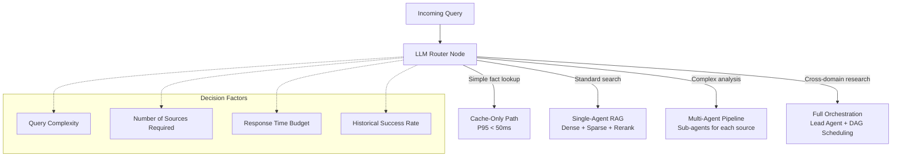

# CentRAG Cross-Repo Architecture Analysis

**Version:** 1.0  
**Date:** 2026-04-01  
**Purpose:** Deep synthesis of engineering patterns from 4 reference codebases, mapped to CentRAG's architecture.

---

## 1. Source Repositories

| Repository | Stars | Stack | Core Innovation |
|------------|:-----:|-------|-----------------|
| [bytedance/deer-flow](https://github.com/bytedance/deer-flow) | 55k | Python + TS (LangGraph) | Long-horizon SuperAgent harness with sub-agents, sandboxes, skills, memory, and context engineering |
| [agentscope-ai/agentscope](https://github.com/agentscope-ai/agentscope) | 22k | Python | Production agent framework with ReAct, MCP, A2A, memory compression, and multi-agent orchestration |
| [Agent-Field/SWE-AF](https://github.com/Agent-Field/SWE-AF) | 661 | Python (AgentField) | Autonomous software engineering factory with adaptive 3-loop control, DAG scheduling, continual learning |
| `claude-code` (Anthropic, local) | — | TypeScript | Performance engineering: caching, graceful shutdown, cost tracking, conversation recovery |

---

## 2. Master Pattern Synthesis (24 Patterns)

### 2.1 Orchestration & Control Flow

| # | Pattern | Source | Description | CentRAG Mapping | Priority |
|---|---------|--------|-------------|-----------------|:--------:|
| 1 | **SuperAgent / Lead Agent** | DeerFlow | Single orchestrator spawns sub-agents dynamically based on task complexity. Lead agent maintains overall plan state. | `RetrievalEngine` as coordinator, spawning specialized sub-retrieval agents for complex multi-source queries. | P3 |
| 2 | **3-Loop Adaptive Control** | SWE-AF | Inner loop (issue-level retry) → Middle loop (advisor escalation) → Outer loop (replanner with scope relaxation). Each loop has bounded iterations. | Inner: CRAG retry (✅ built). Middle: query advisor (rewrite, decompose). Outer: strategy replanner (switch retrieval approach entirely). | P3 |
| 3 | **Hardness-Aware Execution** | SWE-AF | Query complexity classifier routes easy tasks to fast-track, hard tasks to deeper adaptation with more iterations. | Query complexity classifier → route: cache-only (trivial) → standard RAG (moderate) → deep multi-source RAG (complex). | P3 |
| 4 | **DAG-based Parallel Execution** | SWE-AF | Dependency-level scheduling across isolated worktrees. Tasks at the same dependency level execute in parallel. | Parallel retrieval from dense ∥ sparse ∥ graph with RRF fusion. Each source is an independent DAG node. | P5 |
| 5 | **MsgHub Multi-Agent Orchestration** | AgentScope | Centralized message routing (`MsgHub`) enables multi-agent conversations with configurable topologies. | Future: Multi-agent retrieval pipeline where Retriever, Ranker, Generator are separate agents communicating via message bus. | P5 |
| 6 | **LLM-Driven Agent Selection** | User Decision | Based on input query complexity, the LLM itself decides whether to use full multi-agent orchestration or progressive sub-agent approach. | Add a "router node" at query entry that classifies complexity and selects orchestration strategy dynamically. | **P2** |

### 2.2 Context & Memory Engineering

| # | Pattern | Source | Description | CentRAG Mapping | Priority |
|---|---------|--------|-------------|-----------------|:--------:|
| 7 | **Isolated Sub-Agent Context** | DeerFlow | Each sub-agent gets its own context window. No cross-contamination between sub-agent contexts. | Critical for multi-tenant RAG — each team's retrieval context is already namespace-isolated. Extend to sub-agent level. | P2 |
| 8 | **Context Summarization** | DeerFlow | Aggressive mid-session summarization: completed sub-tasks are compressed, intermediate results offloaded to filesystem. | Extend `TokenBudgetManager` to encompass conversation-level compression. Summarize completed retrieval rounds. | **P2** |
| 9 | **Persistent Long-Term Memory** | DeerFlow | Cross-session memory with dedup at apply time. Builds user profile, preferences, recurring workflows. | Our Mem0 integration + temporal versioning. Add dedup to prevent memory bloat across sessions. | **P2** |
| 10 | **Memory Compression** | AgentScope | Database-backed memory with automatic compression. Older memories summarized to save context budget. | Extend Redis L2 cache with conversation memory compression. Older turns → summarized → stored compactly. | **P2** |
| 11 | **Skill-based Progressive Loading** | DeerFlow | Skills (capability modules) loaded lazily on demand, not all at once. Keeps context window lean. | Load retrieval strategies, connectors, and rerankers lazily based on query needs. Already partially implemented via lazy DI. | **P2** |
| 12 | **Token Budget Compression** | Claude Code | Dynamically compress/truncate context before LLM call. `TokenBudgetManager` with byte-level accounting. | ✅ Already built in `engine.py`. Inspired by `claude-code/tokenBudget.ts`. | ✅ Done |

### 2.3 Tool & Protocol Integration

| # | Pattern | Source | Description | CentRAG Mapping | Priority |
|---|---------|--------|-------------|-----------------|:--------:|
| 13 | **MCP Tool Integration** | AgentScope | Individual MCP tools registered as callable functions. Composable into toolkits. OAuth support for HTTP transports. | Maps directly to our MCP connector architecture. Each data source (Oracle GOS, DynamoDB) is an MCP server. | **P2** |
| 14 | **A2A Protocol** | AgentScope | Agent-to-Agent communication protocol for cross-system interoperability. Agents register capabilities and discover peers. | Future: Expose CentRAG itself as an A2A agent that other internal agents can discover and call. | P6 |
| 15 | **ReAct Agent with Toolkit** | AgentScope | First-class ReAct loop with registered tool functions. Reason → select tool → execute → observe → repeat. | Our CRAG advisor loop is a simplified ReAct pattern. Extend to full ReAct with tool selection. | P3 |
| 16 | **Human-in-the-Loop** | AgentScope | Real-time interruption with seamless resumption via memory preservation. User can approve/reject agent actions mid-flow. | Maps to hierarchical cancellation + session recovery. User can cancel retrieval and resume from checkpoint. | P4 |

### 2.4 Resilience & Production Engineering

| # | Pattern | Source | Description | CentRAG Mapping | Priority |
|---|---------|--------|-------------|-----------------|:--------:|
| 17 | **Checkpointed Execution + Resume** | SWE-AF | `resume_build` after crashes or interruptions. State persisted at each step boundary. | Session Recovery: checkpoint conversation state to PostgreSQL. Resume from last successful step. | P4 |
| 18 | **Continual Learning** | SWE-AF | Conventions and failure patterns discovered early are injected into downstream agents. `enable_learning` flag. | Learn from failed retrievals to improve query rewriting. Store successful patterns for reuse. | P5 |
| 19 | **Explicit Compromise Tracking** | SWE-AF | When scope is relaxed during replanning, debt is typed and severity-rated. Nothing is silently dropped. | Audit logging for quality trade-offs: "used cached answer instead of fresh retrieval due to timeout". | P4 |
| 20 | **Byte-bounded Caching** | Claude Code | Memory-safe LRU with `sys.getsizeof`. Prevents OOM from unbounded caches. | ✅ Already implemented in `cache.py` with `cachetools.LRUCache`. | ✅ Done |
| 21 | **In-flight Request Dedup** | Claude Code | Future/Task-based thundering herd prevention. Concurrent identical requests share one computation. | ✅ Already implemented in `cache.py` with `asyncio.Future`-based collapsing. | ✅ Done |
| 22 | **Graceful Shutdown** | Claude Code | 5-phase tiered shutdown: drain → flush → close → force-exit with failsafe timer. | ✅ Documented in LLD §8.4. Prevents data loss on SIGTERM during rolling deployments. | ✅ Documented |
| 23 | **Cost Tracking** | Claude Code | Per-session token cost accumulation and persistence. Budget alerts and enforcement. | 🔧 Designed in LLD §8.3. Per-team token usage → PostgreSQL → billing dashboard. | P1 |
| 24 | **Multi-Model Role Mapping** | SWE-AF | Different models assigned per agent role: `coder: opus, qa: haiku, verifier: sonnet`. Cascade override: runtime default < models.default < models.role. | Use different models for: embedding (Titan), generation (Claude), reranking (Cohere), classifier (Haiku). | P3 |

### 2.5 Sandbox & Execution

| # | Pattern | Source | Description | CentRAG Mapping | Priority |
|---|---------|--------|-------------|-----------------|:--------:|
| 25 | **Sandbox Isolation** | DeerFlow | `AioSandboxProvider` runs code in isolated Docker containers. `LocalSandboxProvider` for trusted local workflows. | Sandboxed code execution for code-aware RAG (e.g., running SQL queries, code analysis). | P6 |
| 26 | **Agentic RL (Trinity-RFT)** | AgentScope | Reinforcement Learning to fine-tune agent behavior based on reward signals. | Retrieval feedback signals → model improvement. Use RAGAS scores as reward signal. | P6 |

---

## 3. Architecture Decision: LLM-Driven Agent Selection

> **Decision:** Based on user input, the LLM itself decides the orchestration strategy at query time.

### How It Works



### Classification Prompt Template

```
Given the following user query, classify its complexity level:

Query: "{query}"

Classification criteria:
1. SIMPLE — Direct fact lookup, single source sufficient, cache likely has answer
2. STANDARD — Requires retrieval from 1-2 sources, standard RAG pipeline adequate
3. COMPLEX — Requires synthesis from 3+ sources, benefits from multi-step reasoning
4. RESEARCH — Open-ended analysis, needs decomposition into sub-queries, full orchestration

Respond with exactly one of: SIMPLE, STANDARD, COMPLEX, RESEARCH
```

### Routing Table

| Complexity | Orchestration Strategy | Sub-Agents | Max Latency |
|------------|----------------------|:----------:|:-----------:|
| SIMPLE | Cache-only → Single retriever | 0 | 50ms |
| STANDARD | Dense + Sparse + Rerank pipeline | 0 | 3s |
| COMPLEX | Lead agent + 2-3 sub-agents (per source) | 2-3 | 10s |
| RESEARCH | Full DAG orchestration + context summarization | 3-5 | 30s |

---

## 4. Gap Analysis: Current State vs Target

| Capability | Current State | Target (with cross-repo patterns) | Gap |
|------------|:------------:|:---------------------------------:|:---:|
| Single-agent retrieval | ✅ Built | ✅ | — |
| CRAG advisor loop | ✅ Built | ✅ | — |
| Token budget management | ✅ Built | ✅ | — |
| Multi-strategy retrieval | ✅ Built (dense + sparse + RRF) | ✅ | — |
| Byte-bounded caching + SWR | ✅ Built | ✅ | — |
| Query complexity classification | ❌ | ✅ (LLM-driven) | **P2** |
| Context summarization | ❌ | ✅ (DeerFlow-inspired) | **P2** |
| Persistent long-term memory | 🔧 Designed | ✅ (Mem0 + dedup) | **P2** |
| Memory compression | ❌ | ✅ (AgentScope-inspired) | **P2** |
| MCP for Oracle GOS DB | ❌ | ✅ (SQLcl MCP) | **P2** |
| MCP for AWS DynamoDB | ❌ | ✅ (AWS Labs MCP) | **P2** |
| Multi-agent orchestration | ❌ | ✅ (MsgHub-inspired) | P5 |
| 3-loop adaptive control | ❌ | ✅ (SWE-AF-inspired) | P3 |
| Session checkpointing | 🔧 Designed | ✅ (SWE-AF resume_build) | P4 |
| Continual learning | ❌ | ✅ (SWE-AF enable_learning) | P5 |
| A2A protocol | ❌ | ✅ (AgentScope A2A) | P6 |
| Cost tracking persistence | 🔧 Designed | ✅ (Claude Code) | P1 |
| Graceful shutdown code | 🔧 Documented | ✅ (Claude Code) | P1 |

---

## 5. Key Takeaways per Repository

### 5.1 DeerFlow — What CentRAG Should Adopt

1. **Sub-agent spawning with scoped context** — Each sub-agent gets isolated context window. Our retrieval sub-tasks should NOT share context to prevent cross-contamination.
2. **Progressive skill loading** — Load retrieval strategies lazily. Don't initialize all MCP connectors at startup.
3. **Aggressive context summarization** — After each retrieval round, summarize results before next round. Keeps LLM focused.
4. **Persistent memory with dedup** — Memory updates skip duplicate facts at apply time. Prevents memory bloat across sessions.
5. **Sandbox execution** — Isolated code execution for code-aware RAG queries.

### 5.2 AgentScope — What CentRAG Should Adopt

1. **ReAct loop with toolkit** — Full Reason-Act-Observe cycle for complex queries. Our CRAG is a simplified version.
2. **MCP tool as callable function** — Each MCP tool becomes a function the agent can call. Clean composition.
3. **Memory compression** — Automatic compression of older conversation turns. Essential for multi-turn sessions.
4. **A2A protocol** — Expose CentRAG as a discoverable agent for other systems.
5. **Human-in-the-loop** — User-approvable actions with seamless resume via memory preservation.

### 5.3 SWE-AF — What CentRAG Should Adopt

1. **3-loop adaptive control** — Most impactful pattern. Inner retry → middle advisor → outer replanner.
2. **Hardness-aware execution** — Query complexity determines how much computation to spend.
3. **Continual learning** — Failed retrievals teach the system. Store successful patterns for reuse.
4. **Checkpointed execution** — Resume after crash. Critical for long-running retrieval sessions.
5. **Multi-model role mapping** — Different models for different tasks (embed vs generate vs rerank).

### 5.4 Claude Code — What CentRAG Already Adopted ✅

1. ✅ **Byte-bounded LRU caching** — `cachetools.LRUCache` with `sys.getsizeof`
2. ✅ **In-flight request dedup** — `asyncio.Future`-based collapsing
3. ✅ **Stale-while-revalidate** — Background refresh of expired cache entries
4. ✅ **Token budget management** — `TokenBudgetManager` for dynamic context compression
5. 🔧 **Graceful shutdown** — Documented in LLD, pending code implementation
6. 🔧 **Cost tracking** — Designed in LLD, pending persistence layer

---

## 6. Recommended Implementation Order

Based on user decision to prioritize **Phase 2 (Memory & Context)** and use **LLM-driven agent selection**:

```
Phase 1 (Current)  → MVP Hardening: graceful shutdown code, cost tracking persistence
Phase 2 (Next)     → Memory & Context: memory compression, context summarization, lazy loading, MCP deployment
Phase 3            → Advanced Retrieval: complexity classifier, hardness-aware routing, contextual retrieval
Phase 4            → Resilience: checkpointing, circuit breaker, bulkhead, retry advisor
Phase 5            → Multi-Agent: lead agent, sub-agents, MsgHub, DAG scheduling, continual learning
Phase 6            → Ecosystem: A2A protocol, sandbox execution, GraphRAG, agentic RL
```

---

## References

- DeerFlow Architecture: https://github.com/bytedance/deer-flow/blob/main/backend/CLAUDE.md
- AgentScope Docs: https://doc.agentscope.io/
- SWE-AF Schemas: https://github.com/Agent-Field/SWE-AF/blob/main/swe_af/execution/schemas.py
- Claude Code Caching: `claude-code/src/utils/completionCache.ts`
- MCP Specification: https://modelcontextprotocol.io/specification/2025-03-26
