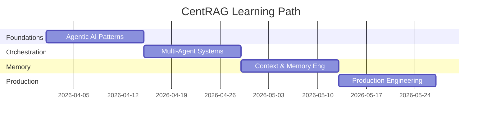

# CentRAG Learning Plan, MVP, & Phase-Wise Roadmap

**Version:** 1.0  
**Date:** 2026-04-01  
**Purpose:** Structured learning curriculum, MVP checklist, 6-phase development roadmap, and curated study resources.

---

## Part A: 8-Week Learning Curriculum

### Overview

### Week 1-2: Foundations — Agentic AI Patterns

| Topic | Resources | Hands-On | Time |
|-------|-----------|----------|:----:|
| **ReAct Pattern** | [Yao et al. 2023](https://arxiv.org/abs/2210.03629) — original paper. AgentScope ReAct example code. | Build a simple ReAct agent that reasons about which tool to call. | 6h |
| **CRAG (Corrective RAG)** | [Yan et al. 2024](https://arxiv.org/abs/2401.15884). Our `engine.py` advisor loop. | Review existing CRAG implementation. Trace through a query that triggers correction. | 3h |
| **Self-RAG** | [Asai et al. 2023](https://arxiv.org/abs/2310.08127) — Self-RAG: Learning to Retrieve, Generate, and Critique. | Extend CRAG with post-generation reflection token. | 4h |
| **Reflection & Self-Correction** | [Shinn et al. 2023](https://arxiv.org/abs/2303.11366) — Reflexion. | Implement a retry loop that logs failure reasons and adjusts approach. | 4h |
| **Tool Use Patterns** | AgentScope MCP tool examples. Claude Code tool registration (`commands.ts`). | Register a custom MCP tool as a callable function in CentRAG. | 3h |

**Week 1-2 Deliverables:**
- [ ] Annotated code walkthrough of CentRAG's CRAG advisor loop
- [ ] Working prototype of MCP tool as callable function
- [ ] Reading notes on ReAct and Self-RAG papers

### Week 3-4: Multi-Agent Orchestration

| Topic | Resources | Hands-On | Time |
|-------|-----------|----------|:----:|
| **Multi-Agent Workflow** | AgentScope `MsgHub` + `sequential_pipeline` docs. DeerFlow sub-agent architecture. | Build a 3-agent debate (retriever vs verifier vs synthesizer) using message passing. | 6h |
| **Sub-Agent Spawning** | DeerFlow lead agent pattern. Isolated sub-agent context design. | Design sub-agent decomposition for a complex multi-source query. | 4h |
| **DAG-based Scheduling** | SWE-AF `run_sprint_planner`, dependency sorting. | Map CentRAG retrieval pipeline as a DAG with parallel nodes for dense ∥ sparse ∥ graph. | 4h |
| **3-Loop Adaptive Control** | SWE-AF architecture: inner (retry) → middle (advisor) → outer (replanner). | Implement query complexity classification that routes to appropriate loop depth. | 6h |

**Week 3-4 Deliverables:**
- [ ] Mermaid diagram of CentRAG's multi-agent DAG
- [ ] Prototype complexity classifier (SIMPLE/STANDARD/COMPLEX/RESEARCH)
- [ ] Design doc for lead agent + sub-agent communication protocol

### Week 5-6: Context & Memory Engineering

| Topic | Resources | Hands-On | Time |
|-------|-----------|----------|:----:|
| **Context Window Management** | DeerFlow context summarization. Our `TokenBudgetManager`. | Implement conversation-level compression that summarizes completed retrieval rounds. | 6h |
| **Long-Term Memory Systems** | DeerFlow persistent memory with dedup. [Packer et al. 2023 — MemGPT](https://arxiv.org/abs/2310.08560). | Build temporal memory layer: Working (current turn) → Episodic (session) → Semantic (cross-session). | 8h |
| **Memory Compression** | AgentScope memory compression. Zep memory architecture. | Implement automatic compression of older conversation turns with configurable window. | 4h |
| **Skill-based Lazy Loading** | DeerFlow progressive skill loading. Our existing lazy DI pattern. | Extend lazy loading to retrieval strategies and MCP connectors — load on first use. | 3h |

**Week 5-6 Deliverables:**
- [ ] Working memory compression module
- [ ] Context summarization integration with `TokenBudgetManager`
- [ ] Memory layer design doc (Working/Episodic/Semantic)

### Week 7-8: Production Engineering

| Topic | Resources | Hands-On | Time |
|-------|-----------|----------|:----:|
| **Checkpointing & Resume** | SWE-AF `resume_build`. Claude Code conversation recovery patterns. | Implement session checkpointing to PostgreSQL with resume API endpoint. | 6h |
| **Continual Learning** | SWE-AF `enable_learning`, failure pattern injection. | Build retrieval feedback loop: log failed queries → analyze patterns → improve prompts. | 4h |
| **Performance Budgets** | Claude Code `slow_logger`. Our `track_slow_operation` middleware. | Review and extend performance budget system. Add alerts for P95 violations. | 3h |
| **MCP Deployment** | See `MCP_DEPLOYMENT_GUIDE.md`. Oracle SQLcl + AWS Labs MCP setup. | Deploy Oracle GOS DB and DynamoDB MCP servers locally. Verify end-to-end. | 4h |
| **RAG Evaluation** | [RAGAS](https://github.com/explodinggradients/ragas) — faithfulness, relevancy, context precision. | Set up RAGAS evaluation pipeline. Compare naive vs layout-aware chunking results. | 4h |
| **Advanced Chunking** | [RETRIEVAL_STRATEGY_DEEP_DIVE.md](file:///C:/Users/khars/PycharmProjects/scratch/docs/RETRIEVAL_STRATEGY_DEEP_DIVE.md). Table preservation patterns. | Implement "Row-Header" table preservation logic in a prototype worker. | 4h |

**Week 7-8 Deliverables:**
- [ ] Session checkpointing module (save/restore to PostgreSQL)
- [ ] Working MCP connections to Oracle GOS DB and DynamoDB
- [ ] RAGAS evaluation baseline numbers (Naive vs. Layout-Aware)

---

## Part B: MVP Checklist

### MVP Scope: "CentRAG v1.0 — Production-Ready Multi-Tenant RAG"

> **Goal:** Ship a production-ready RAG platform that handles document ingestion, multi-strategy retrieval, and generation with enterprise-grade reliability.

### ✅ Built Features

| Feature | Module | Evidence |
|---------|--------|---------|
| Multi-tenant document ingestion | `routes/documents.py` | API routes with team_id isolation |
| Multi-strategy retrieval (dense + sparse + RRF) | `retrieval/engine.py` | Strategy pattern with RRF fusion |
| CRAG advisor loop (context validation) | `retrieval/engine.py` | Critic node validates retrieval quality |
| Token budget management | `retrieval/engine.py` | `TokenBudgetManager` prevents truncation |
| Input/output guardrails (PII, validation) | `guardrails.py` | Composable decorator pipeline |
| 3-tier caching (L1 byte-bounded, L2 Redis, L3 Qdrant) | `abstractions/cache.py` | SWR + in-flight dedup + byte-bounded LRU |
| API key auth + team isolation (RLS) | `middleware/auth.py` | Row-level security via team_id |
| Observability (Langfuse traces) | `middleware/slow_logger.py` | Automatic slow operation detection |
| Health checks + structured logging | `routes/health.py` | `/health` endpoint with dependency checks |
| Parallel startup | `app.py` lifespan | `asyncio.gather` for Postgres/Redis/Qdrant |

### 🔧 Designed (Docs Complete, Code Pending)

| Feature | Design Location | Blocker |
|---------|----------------|---------|
| Cost tracking per team | LLD §8.3 | PostgreSQL persistence layer |
| Graceful shutdown | LLD §8.4 | `signal` handler code |
| Session recovery | LLD §8.5 | Checkpointing module |
| Circuit breaker | LLD §8.1 | `pybreaker` integration |

### ❌ Explicitly Deferred (MVP Non-Goals)

- Multi-agent orchestration (MsgHub pattern)
- A2A protocol support
- Agentic RL / continual learning
- Sandbox code execution
- Real-time voice / streaming responses
- GraphRAG (Neptune knowledge graph)

---

## Part C: 6-Phase Development Roadmap

### Phase 1: MVP Hardening (Current Sprint — 2 weeks)

> **Theme:** Ship what we have with production safety nets.

| Task | Status | Depends On |
|------|:------:|:----------:|
| Implement graceful shutdown (code) | ☐ | — |
| Implement cost tracking persistence (code) | ☐ | PostgreSQL |
| Add `signal` handlers for SIGTERM/SIGINT | ☐ | — |
| Per-team token usage → PostgreSQL | ☐ | cost tracking |
| Integrate slow_logger with Langfuse/CloudWatch | ☐ | — |

### Phase 2: Memory & Context Engineering (3 weeks)

> **Theme:** Multi-turn conversations and intelligent context management.  
> *Inspired by:* DeerFlow memory, AgentScope memory compression.

| Task | Status | Depends On |
|------|:------:|:----------:|
| Implement temporal memory persistence (Mem0 → PostgreSQL) | ☐ | Phase 1 |
| Add memory compression for long conversations | ☐ | memory persistence |
| Build context summarization for multi-turn sessions | ☐ | TokenBudgetManager |
| Implement skill-based progressive loading for strategies | ☐ | — |
| Add conversation-level token accounting | ☐ | cost tracking |
| Deploy Oracle GOS DB MCP server locally | ☐ | SQLcl 25.2+ |
| Deploy AWS DynamoDB MCP server locally | ☐ | AWS credentials |
| Build MCP connector abstraction (`ConnectorProtocol`) | ☐ | MCP Python SDK |

### Phase 3: Advanced Retrieval (3 weeks)

> **Theme:** Smarter retrieval through query understanding and adapter patterns.  
> *Inspired by:* DeerFlow sub-agents, SWE-AF hardness-aware execution.

| Task | Status | Depends On |
|------|:------:|:----------:|
| Implement LLM-driven query complexity classifier | ☐ | Phase 2 |
| Add complexity-based routing (cache → standard → deep) | ☐ | classifier |
| Implement **Layout-Aware Chunking** (preserves tables/lists) | ☐ | Unstructured/Docling |
| Add **Hierarchical Indexing** (parent-child retrieval) | ☐ | — |
| Build Contextual Retrieval (chunk-level document context) | ☐ | — |
| Implement Late Chunking for better embedding quality | ☐ | — |
| Add reranking with Cohere cross-encoder | ☐ | — |
| Build RAGAS evaluation pipeline (comparing strategies) | ☐ | — |

### Phase 4: Resilience & Session Recovery (2 weeks)

> **Theme:** Self-healing systems and crash recovery.  
> *Inspired by:* SWE-AF checkpointing, Claude Code conversation recovery.

| Task | Status | Depends On |
|------|:------:|:----------:|
| Implement session checkpointing to PostgreSQL | ☐ | Phase 2 |
| Build `resume_session` API for interrupted retrievals | ☐ | checkpointing |
| Add circuit breaker (pybreaker) for external deps | ☐ | — |
| Implement bulkhead pattern (asyncio.Semaphore/team) | ☐ | — |
| Add retry + exponential backoff (tenacity) | ☐ | — |
| Implement explicit compromise tracking | ☐ | audit logging |

### Phase 5: Multi-Agent Orchestration (4 weeks)

> **Theme:** From single-engine to coordinated agent systems.  
> *Inspired by:* AgentScope MsgHub, DeerFlow sub-agent spawning, SWE-AF DAG.

| Task | Status | Depends On |
|------|:------:|:----------:|
| Design Lead Agent / Sub-Agent architecture | ☐ | Phase 3, 4 |
| Implement LLM-driven agent selection router | ☐ | complexity classifier |
| Build message-based routing between sub-agents | ☐ | Lead Agent |
| Implement DAG-based parallel retrieval | ☐ | sub-agents |
| Add advisor + replanner loops (3-loop pattern) | ☐ | — |
| Implement continual learning (failure → improvement) | ☐ | — |

### Phase 6: Ecosystem & Scale (Ongoing)

> **Theme:** Open protocols, external integrations, horizontal scaling.  
> *Inspired by:* AgentScope A2A, DeerFlow cloud deployment, SWE-AF multi-repo.

| Task | Status | Depends On |
|------|:------:|:----------:|
| A2A protocol support (CentRAG as discoverable agent) | ☐ | Phase 5 |
| MCP server mode (expose retrieval as MCP tool) | ☐ | Phase 5 |
| GraphRAG integration (Neptune knowledge graph) | ☐ | — |
| Sandbox-isolated code execution | ☐ | Docker |
| Multi-model role mapping (embed/generate/rerank) | ☐ | — |
| Horizontal scaling (EKS + KEDA autoscaling) | ☐ | Phase 4 |

---

## Part D: Study Resources Catalog

### 📚 Essential Papers

| Paper | Year | Topic | Why It Matters |
|-------|:----:|-------|----------------|
| [ReAct: Synergizing Reasoning and Acting](https://arxiv.org/abs/2210.03629) | 2023 | ReAct pattern | Foundation of agentic reasoning loops |
| [Corrective RAG (CRAG)](https://arxiv.org/abs/2401.15884) | 2024 | Retrieval self-correction | Our advisor loop is based on this |
| [Reflexion](https://arxiv.org/abs/2303.11366) | 2023 | Self-correcting agents | Verbal reinforcement for agent improvement |
| [Self-RAG](https://arxiv.org/abs/2310.08127) | 2023 | Adaptive retrieval | Post-generation reflection tokens |
| [MemGPT](https://arxiv.org/abs/2310.08560) | 2023 | Memory management | LLMs as operating systems with memory tiers |
| [Adaptive RAG](https://arxiv.org/abs/2403.14403) | 2024 | Query complexity routing | Hardness-aware retrieval selection |
| [RAPTOR](https://arxiv.org/abs/2401.18059) | 2024 | Hierarchical retrieval | Recursive abstractive processing for trees |
| [Graph RAG](https://arxiv.org/abs/2404.16130) | 2024 | Knowledge graph + RAG | Community-level summarization |
| [Late Chunking](https://arxiv.org/abs/2409.04701) | 2024 | Embedding-aware chunking | Long-context embedding with late boundary |
| [Contextual Retrieval](https://www.anthropic.com/news/contextual-retrieval) | 2024 | Context-enriched chunks | Prepend document context to each chunk |

### 🔗 GitHub Repositories

| Repository | Stars | What to Study |
|------------|:-----:|---------------|
| [bytedance/deer-flow](https://github.com/bytedance/deer-flow) | 55k | Sub-agent spawning, context engineering, long-term memory, skill system |
| [agentscope-ai/agentscope](https://github.com/agentscope-ai/agentscope) | 22k | ReAct agents, MCP integration, MsgHub, memory compression, A2A |
| [Agent-Field/SWE-AF](https://github.com/Agent-Field/SWE-AF) | 661 | 3-loop adaptation, DAG scheduling, continual learning, checkpointing |
| [awslabs/mcp](https://github.com/awslabs/mcp) | 8.6k | Official AWS MCP servers (DynamoDB, API, Docs, Bedrock KB) |
| [langchain-ai/langgraph](https://github.com/langchain-ai/langgraph) | 10k+ | State machine orchestration, checkpointing, human-in-loop |
| [explodinggradients/ragas](https://github.com/explodinggradients/ragas) | 7k+ | RAG evaluation metrics (faithfulness, relevancy, context precision) |
| [mem0ai/mem0](https://github.com/mem0ai/mem0) | 25k+ | Memory layer for AI agents, temporal awareness |
| [getzep/zep](https://github.com/getzep/zep) | 2k+ | Memory for AI assistants with dialog classification |
| [modelcontextprotocol/python-sdk](https://github.com/modelcontextprotocol/python-sdk) | — | Official Python MCP SDK for building clients and servers |

### 🎬 Courses & Tutorials

| Resource | Platform | Topic | Time |
|----------|----------|-------|:----:|
| [Building Agentic RAG with LlamaIndex](https://learn.deeplearning.ai/courses/building-agentic-rag-with-llamaindex) | DeepLearning.AI | Agentic RAG patterns | 2h |
| [LangChain Academy](https://academy.langchain.com/) | LangChain | LangGraph, agents, RAG | 10h |
| [AI Agentic Design Patterns](https://www.deeplearning.ai/the-batch/how-agents-can-improve-llm-performance/) | DeepLearning.AI | ReAct, Tool Use, Planning, Multi-Agent | 2h |
| [Context Engineering blog post](https://blog.langchain.dev/context-engineering/) | LangChain | Context window management | 30m |
| [Building Effective Agents](https://www.anthropic.com/engineering/building-effective-agents) | Anthropic | Agent design principles | 30m |

### 📖 Articles & Blog Posts

| Article | Author | Key Insight |
|---------|--------|-------------|
| [The Atomic Unit of Intelligence](https://www.santoshkumarradha.com/writing/atomic-unit-of-intelligence) | SWE-AF team | Nested control loops as the core factory abstraction |
| [Building Effective Agents](https://www.anthropic.com/engineering/building-effective-agents) | Anthropic | Start simple, add complexity only when needed |
| [Context Engineering](https://simonwillison.net/2025/Jun/27/context-engineering/) | Simon Willison | Context as the critical abstraction for AI applications |
| [Patterns for Building LLM-based Systems](https://eugeneyan.com/writing/llm-patterns/) | Eugene Yan | Comprehensive production LLM patterns catalog |
| [RAG is Dead, Long Live RAG](https://www.philschmid.de/rag-is-dead) | Philipp Schmid | Advanced RAG techniques beyond naive retrieval |
| [Oracle SQLcl MCP Server Guide](https://docs.oracle.com/en/database/oracle/sql-developer/) | Oracle | Official Oracle MCP documentation |
| [AWS MCP Servers Documentation](https://awslabs.github.io/mcp) | AWS Labs | Official AWS MCP setup and usage guide |

---

## Part E: Milestone Definitions

| Milestone | Definition of Done | Target |
|-----------|-------------------|:------:|
| **M1: MVP Hardened** | Graceful shutdown + cost tracking running in staging | Week 2 |
| **M2: Memory Live** | Multi-turn conversations with memory compression working | Week 5 |
| **M3: MCP Connected** | Oracle GOS DB + DynamoDB accessible via MCP | Week 5 |
| **M4: Smart Retrieval** | Query complexity classifier routing to appropriate strategy | Week 8 |
| **M5: Resilient** | Session recovery + circuit breakers passing chaos tests | Week 10 |
| **M6: Multi-Agent** | Lead agent spawning sub-agents for RESEARCH-level queries | Week 14 |
