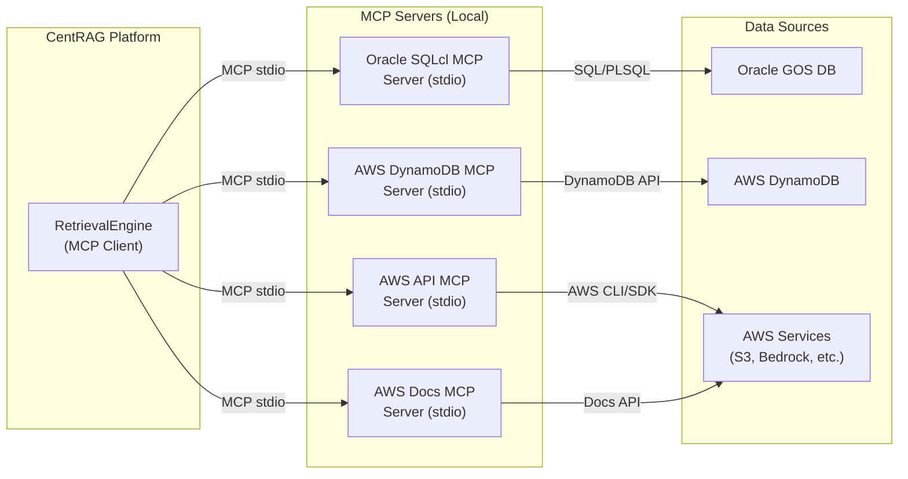

# CentRAG MCP Deployment Guide

**Version:** 1.0  
**Date:** 2026-04-01  
**Purpose:** Step-by-step guide for deploying MCP servers locally to connect CentRAG with Oracle GOS DB, AWS DynamoDB, and the AWS MCP ecosystem.

---

## 1. MCP Architecture Overview

### What is MCP?

The **Model Context Protocol (MCP)** is an open protocol (by Anthropic) that enables standardized integration between LLM applications and external data sources. Instead of building custom connectors for each database, MCP provides a universal interface.

### CentRAG MCP Architecture



### Transport Mechanisms

| Transport | Use Case | CentRAG Fit |
|-----------|----------|:-----------:|
| **stdio** | Local single-user, embedded workflows | ✅ Primary (development) |
| **Streamable HTTP** | Networked, multi-user, production-scale | 🔧 Future (production) |

> **Note:** As of 2025, SSE transport has been deprecated by the MCP spec in favor of Streamable HTTP. All `awslabs/mcp` servers currently support stdio only.

---

## 2. Oracle GOS DB — MCP Setup

### 2.1 Overview

Oracle provides **two MCP implementations** for connecting AI applications to Oracle databases:

| Implementation | Transport | Best For |
|---------------|:---------:|---------|
| **Oracle SQLcl MCP Server** | stdio (local) | Development, direct DB access via CLI |
| **Oracle Autonomous AI Database MCP** | In-database (native) | Production, enterprise governance |

For CentRAG local development, we use **Oracle SQLcl MCP Server**.

### 2.2 Prerequisites

| Requirement | Version | Check Command |
|-------------|:-------:|---------------|
| Java | 17+ | `java -version` |
| Oracle SQLcl | 25.2+ | Download from [oracle.com/tools/downloads/sqlcl-downloads.html](https://www.oracle.com/tools/downloads/sqlcl-downloads.html) |
| Oracle DB Access | — | Network connectivity to GOS DB instance |

### 2.3 Step-by-Step Setup

#### Step 1: Install SQLcl

```powershell
# Download Oracle SQLcl 25.2+
# Unzip to a directory, e.g., C:\tools\sqlcl
# Add to PATH
$env:PATH += ";C:\tools\sqlcl\bin"
```

#### Step 2: Create and Save Database Connection

```bash
# Launch SQLcl in no-login mode
sql -nolog

# Create a saved connection with stored password
SQL> conn -save gosdb_readonly -savepwd readonly_user/password@gos-db-host:1521/GOSDB_SVC
```

> **⚠️ Security:** The `-savepwd` flag stores credentials locally. Use a **read-only** database user with minimal privileges.

#### Step 3: Test the Connection

```bash
sql readonly_user/password@gos-db-host:1521/GOSDB_SVC
SQL> SELECT 1 FROM DUAL;
```

#### Step 4: Configure MCP Client

Create or update your MCP client configuration:

**For CentRAG local development (`.mcp.json`):**

```json
{
  "mcpServers": {
    "oracle-gosdb": {
      "command": "C:/tools/sqlcl/bin/sql",
      "args": ["-mcp"],
      "env": {}
    }
  }
}
```

**For VS Code (`.vscode/mcp.json`):**

```json
{
  "inputs": [],
  "servers": {
    "oracle-gosdb": {
      "command": "C:/tools/sqlcl/bin/sql",
      "args": ["-mcp"]
    }
  }
}
```

**For Claude Desktop (`claude_desktop_config.json`):**

```json
{
  "mcpServers": {
    "oracle-gosdb": {
      "command": "C:/tools/sqlcl/bin/sql",
      "args": ["-mcp"]
    }
  }
}
```

#### Step 5: Verify MCP Connection

Once configured, the MCP client should list available tools:
- `list_connections` — Show saved database connections
- `execute_sql` — Run SQL/PL-SQL scripts and retrieve results
- `list_tables` — Browse schema objects

### 2.4 Security Best Practices

| Practice | Implementation |
|----------|---------------|
| **Least privilege** | DB user with `SELECT` only on required tables |
| **Read-only replica** | Point MCP at a read replica, never production primary |
| **Audit trail** | Oracle SQLcl MCP logs to `DBTOOLS$MCP_LOG` table |
| **Query limits** | Add `WHERE ROWNUM <= 1000` guards in tool definitions |
| **No DDL** | Ensure DB user has zero DDL/DML privileges |
| **Connection rotation** | Rotate saved credentials regularly |

### 2.5 CentRAG Integration Architecture

```python
# centrag/connectors/oracle_mcp.py (Phase 2 design)
from centrag.abstractions.protocols import ConnectorProtocol
from mcp import ClientSession, StdioServerParameters

class OracleGOSMCPConnector(ConnectorProtocol):
    """MCP-based connector for Oracle GOS DB."""
    
    async def connect(self) -> ClientSession:
        server_params = StdioServerParameters(
            command="C:/tools/sqlcl/bin/sql",
            args=["-mcp"],
        )
        # Use MCP SDK to create stdio connection
        session = await ClientSession.connect(server_params)
        return session
    
    async def query(self, sql: str, team_id: str) -> list[dict]:
        """Execute read-only SQL via MCP tool call."""
        result = await self.session.call_tool(
            "execute_sql",
            arguments={"sql": sql, "connection": "gosdb_readonly"}
        )
        return result.content
```

---

## 3. AWS DynamoDB — MCP Setup

### 3.1 Available AWS MCP Servers

**✅ Yes, there is an official AWS DynamoDB MCP server!**

AWS Labs maintains the `awslabs/mcp` repository with **two relevant servers**:

| Server | Package Name | Purpose |
|--------|-------------|---------|
| **DynamoDB MCP Server** | `awslabs.dynamodb-mcp-server` | Data modeling guidance, schema design assistance, NoSQL optimization |
| **AWS API MCP Server** | `awslabs.aws-api-mcp-server` | Full DynamoDB CRUD operations via AWS CLI |

> **Important:** As of v2.0, the DynamoDB MCP Server focuses on **design and modeling guidance**, not CRUD operations. For operational tasks (query, put, scan), use the **AWS API MCP Server**.

### 3.2 Prerequisites

| Requirement | Version | Check Command |
|-------------|:-------:|---------------|
| Python | 3.10+ | `python --version` |
| `uvx` or `pip` | latest | `pip install uvx` |
| AWS Credentials | — | `~/.aws/credentials` or env vars |
| AWS Region | — | `AWS_REGION` env var |

### 3.3 Step-by-Step Setup

#### Step 1: Install DynamoDB MCP Server

```powershell
# Option A: Using pip
pip install awslabs.dynamodb-mcp-server

# Option B: Using uvx (recommended for isolation)
# uvx runs it directly without global install
```

#### Step 2: Install AWS API MCP Server (for CRUD)

```powershell
pip install awslabs.aws-api-mcp-server
```

#### Step 3: Configure AWS Credentials

```powershell
# Option A: AWS CLI credentials file (~/.aws/credentials)
aws configure
# Set: AWS_ACCESS_KEY_ID, AWS_SECRET_ACCESS_KEY, AWS_DEFAULT_REGION

# Option B: Environment variables
$env:AWS_ACCESS_KEY_ID = "your-key-id"
$env:AWS_SECRET_ACCESS_KEY = "your-secret-key"
$env:AWS_DEFAULT_REGION = "us-east-1"
```

#### Step 4: Configure MCP Client

**For CentRAG local development (`.mcp.json`):**

```json
{
  "mcpServers": {
    "dynamodb-design": {
      "command": "uvx",
      "args": ["awslabs.dynamodb-mcp-server@latest"],
      "env": {
        "AWS_REGION": "us-east-1",
        "AWS_PROFILE": "default",
        "FASTMCP_LOG_LEVEL": "ERROR"
      }
    },
    "aws-api": {
      "command": "uvx",
      "args": ["awslabs.aws-api-mcp-server@latest"],
      "env": {
        "AWS_REGION": "us-east-1",
        "AWS_PROFILE": "default"
      }
    }
  }
}
```

**For VS Code (`.vscode/mcp.json`):**

```json
{
  "inputs": [],
  "servers": {
    "dynamodb-design": {
      "command": "uvx",
      "args": ["awslabs.dynamodb-mcp-server@latest"],
      "env": {
        "AWS_REGION": "us-east-1"
      }
    },
    "aws-api": {
      "command": "uvx",
      "args": ["awslabs.aws-api-mcp-server@latest"],
      "env": {
        "AWS_REGION": "us-east-1"
      }
    }
  }
}
```

#### Step 5: Verify Tools Available

After configuration, verify these tools are exposed:

**DynamoDB Design MCP Server tools:**
- `analyze_access_patterns` — Analyze query patterns for table design
- `suggest_table_design` — Recommend GSI/LSI based on access patterns
- `analyze_existing_schema` — Audit existing MySQL/Postgres schema for DynamoDB migration

**AWS API MCP Server tools:**
- Full AWS CLI access including DynamoDB `get-item`, `put-item`, `query`, `scan`, `create-table`

### 3.4 CentRAG Integration Architecture

```python
# centrag/connectors/dynamodb_mcp.py (Phase 2 design)
from centrag.abstractions.protocols import ConnectorProtocol
from mcp import ClientSession, StdioServerParameters

class DynamoDBMCPConnector(ConnectorProtocol):
    """MCP-based connector for AWS DynamoDB."""
    
    async def connect(self) -> ClientSession:
        server_params = StdioServerParameters(
            command="uvx",
            args=["awslabs.aws-api-mcp-server@latest"],
            env={
                "AWS_REGION": self.config.aws_region,
                "AWS_PROFILE": self.config.aws_profile,
            }
        )
        session = await ClientSession.connect(server_params)
        return session
    
    async def query(self, table: str, key: dict, team_id: str) -> list[dict]:
        """Query DynamoDB via AWS API MCP tool call."""
        result = await self.session.call_tool(
            "aws_dynamodb_query",
            arguments={
                "table_name": table,
                "key_condition": key,
            }
        )
        return result.content
```

---

## 4. Full AWS MCP Server Catalog

### 4.1 Available Servers (from `awslabs/mcp`)

The AWS Labs MCP repository (8.6k ⭐) provides a comprehensive suite of servers:

#### 🚀 Essential (Start Here)

| Server | Package | Description | CentRAG Relevance |
|--------|---------|-------------|:-----------------:|
| **AWS API MCP** | `awslabs.aws-api-mcp-server` | Full AWS CLI access to all services | ✅ Core |
| **AWS Documentation MCP** | `awslabs.aws-documentation-mcp-server` | Real-time access to official AWS docs | ✅ Core |
| **AWS Knowledge MCP** | `awslabs.aws-knowledge-mcp-server` | Best practices and contextual guidance | ✅ Core |

#### 📊 Data & Analytics

| Server | Package | CentRAG Relevance |
|--------|---------|:-----------------:|
| **DynamoDB MCP** | `awslabs.dynamodb-mcp-server` | ✅ Data source |
| **Amazon S3 Tables MCP** | `awslabs.s3-tables-mcp-server` | ✅ Data lake |
| **Amazon Redshift MCP** | `awslabs.redshift-mcp-server` | 🔧 Future |
| **Amazon Timestream MCP** | `awslabs.timestream-mcp-server` | ❌ Not needed |

#### 🤖 AI & Machine Learning

| Server | Package | CentRAG Relevance |
|--------|---------|:-----------------:|
| **Bedrock KB Retrieval MCP** | `awslabs.bedrock-kb-retrieval-mcp-server` | ✅ Retrieval |
| **Amazon Kendra Index MCP** | `awslabs.amazon-kendra-index-mcp-server` | ✅ Search |
| **Amazon SageMaker AI MCP** | `awslabs.sagemaker-mcp-server` | 🔧 Future |
| **Amazon Rekognition MCP** | `awslabs.rekognition-mcp-server` | ❌ Not needed |

#### 🏗️ Infrastructure & Deployment

| Server | Package | CentRAG Relevance |
|--------|---------|:-----------------:|
| **AWS CDK MCP** | `awslabs.cdk-mcp-server` | ✅ IaC |
| **AWS CloudFormation MCP** | `awslabs.cfn-mcp-server` | 🔧 Future |
| **Amazon EKS MCP** | `awslabs.eks-mcp-server` | 🔧 Future (deployment) |
| **AWS Serverless MCP** | `awslabs.aws-serverless-mcp-server` | 🔧 Future |

#### 🛠️ Developer Tools

| Server | Package | CentRAG Relevance |
|--------|---------|:-----------------:|
| **AWS Support MCP** | `awslabs.aws-support-mcp-server` | 🔧 Nice-to-have |
| **IAM MCP** | `awslabs.iam-mcp-server` | ✅ Security audit |
| **Git Repo Research MCP** | `awslabs.git-repo-research-mcp-server` | 🔧 Future |

### 4.2 Recommended CentRAG MCP Stack

For CentRAG's data source integration, we recommend this MCP server stack:

```json
{
  "mcpServers": {
    "oracle-gosdb": {
      "command": "C:/tools/sqlcl/bin/sql",
      "args": ["-mcp"],
      "purpose": "Oracle GOS DB access"
    },
    "dynamodb-design": {
      "command": "uvx",
      "args": ["awslabs.dynamodb-mcp-server@latest"],
      "env": { "AWS_REGION": "us-east-1" },
      "purpose": "DynamoDB schema design"
    },
    "aws-api": {
      "command": "uvx",
      "args": ["awslabs.aws-api-mcp-server@latest"],
      "env": { "AWS_REGION": "us-east-1" },
      "purpose": "DynamoDB CRUD + all AWS services"
    },
    "aws-docs": {
      "command": "uvx",
      "args": ["awslabs.aws-documentation-mcp-server@latest"],
      "purpose": "AWS documentation retrieval"
    },
    "bedrock-kb": {
      "command": "uvx",
      "args": ["awslabs.bedrock-kb-retrieval-mcp-server@latest"],
      "env": { "AWS_REGION": "us-east-1" },
      "purpose": "Bedrock Knowledge Base retrieval"
    }
  }
}
```

---

## 5. Docker-based MCP Deployment

For team/production environments, run MCP servers in Docker containers:

### 5.1 Dockerfile for MCP Server Stack

```dockerfile
# Dockerfile.mcp-stack
FROM python:3.12-slim

# Install MCP servers
RUN pip install \
    awslabs.aws-api-mcp-server \
    awslabs.dynamodb-mcp-server \
    awslabs.aws-documentation-mcp-server \
    awslabs.bedrock-kb-retrieval-mcp-server

# Install Java for Oracle SQLcl
RUN apt-get update && apt-get install -y openjdk-17-jre-headless && rm -rf /var/lib/apt/lists/*
# Note: SQLcl binary must be mounted as a volume

WORKDIR /app
COPY mcp_config.json /app/mcp_config.json

# MCP servers use stdio, so this container is used as a sidecar
CMD ["echo", "MCP sidecar ready — attach via stdio"]
```

### 5.2 Docker Compose Integration

```yaml
# docker-compose.mcp.yml
services:
  centrag-api:
    build: .
    depends_on: [postgres, redis, qdrant]
    volumes:
      - ./mcp_config.json:/app/.mcp.json
      - /tools/sqlcl:/tools/sqlcl  # Mount SQLcl
    environment:
      - AWS_REGION=us-east-1
      - MCP_ENABLED=true

  # MCP servers run as sidecar processes managed by the CentRAG application
  # They are NOT separate containers — they run as stdio subprocesses
```

> **Important:** MCP servers using stdio transport run as **child processes** of the MCP client (CentRAG), not as separate containers. The Docker setup ensures all required binaries and credentials are available.

---

## 6. Security Checklist

| # | Check | Status |
|---|-------|:------:|
| 1 | Oracle DB user is read-only with `SELECT` grants only | ☐ |
| 2 | AWS credentials use IAM role with least-privilege policy | ☐ |
| 3 | No credentials hardcoded — use env vars or AWS Secrets Manager | ☐ |
| 4 | MCP servers run on localhost only (no network exposure) | ☐ |
| 5 | Oracle SQLcl audit log (`DBTOOLS$MCP_LOG`) is monitored | ☐ |
| 6 | DynamoDB access restricted to specific tables via IAM policy | ☐ |
| 7 | Query result size limited (guard against full table scans) | ☐ |
| 8 | MCP server versions pinned in production | ☐ |
| 9 | TLS enabled for all database connections | ☐ |
| 10 | Regular credential rotation schedule defined | ☐ |

---

## 7. Troubleshooting

### Common Issues

| Issue | Cause | Fix |
|-------|-------|-----|
| `java not found` | SQLcl requires Java 17+ | Install JDK 17+ and add to PATH |
| `connection refused` (Oracle) | No saved connection or wrong hostname | Re-run `conn -save` with correct details |
| `AccessDeniedException` (AWS) | Missing IAM permissions | Add required permissions to IAM policy |
| `uvx: command not found` | `uvx` not installed | `pip install uvx` or use `pip install` directly |
| MCP server not appearing in client | Config file syntax error | Validate JSON, check file path |
| Timeout on large queries | No result size limit | Add `LIMIT`/`ROWNUM` guards |

### Diagnostic Commands

```powershell
# Verify Oracle SQLcl MCP
sql -mcp < test_input.json

# Verify AWS MCP server
uvx awslabs.aws-api-mcp-server@latest --help

# Check AWS credentials
aws sts get-caller-identity

# Test DynamoDB access
aws dynamodb list-tables --region us-east-1
```

---

## References

- **AWS Labs MCP Repository:** https://github.com/awslabs/mcp (8.6k ⭐)
- **AWS MCP Documentation:** https://awslabs.github.io/mcp
- **Oracle SQLcl MCP Guide:** https://docs.oracle.com/en/database/oracle/sql-developer/
- **MCP Specification:** https://modelcontextprotocol.io/specification/2025-03-26
- **MCP Python SDK:** https://github.com/modelcontextprotocol/python-sdk
