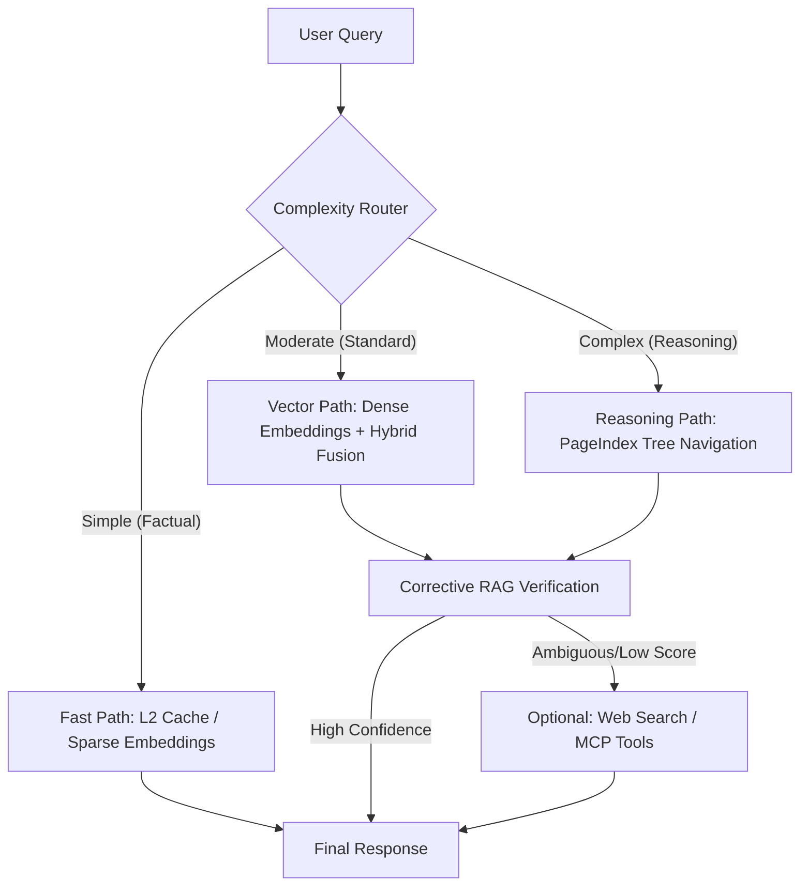

# CentRAG RAG Advancement Strategy

This document outlines the strategic roadmap for elevating CentRAG from a standard RAG platform to an enterprise-grade system, incorporating 12 advanced techniques from the "AI Engineering" standard (Sarthak's framework).

## 1. RAG Maturity Model

CentRAG currently operates at **Level 4 (Adaptive Agentic)**, having integrated PageIndex and Corrective RAG.

| Level | Classification | Key Capabilities | CentRAG Status |
|:---|:---|:---|:---|
| **L1** | **Naive RAG** | Fixed-size chunking, Single vector store. | ✅ Surpassed |
| **L2** | **Cognitive RAG** | Metadata filtering, Hybrid search, Re-ranking. | ✅ Surpassed |
| **L3** | **Advanced RAG** | HyDE, CRAG (Corrective RAG Loop), PII Guardrails. | ✅ Surpassed |
| **L4** | **Adaptive Agentic** | PageIndex Tree Search, Situated Contextual Retrieval. | ✅ Current |
| **L5** | **Infinite RAG** | Graph RAG, Self-Improving Memory, Temporal Facts. | 🚀 Target Q3 |

---

## 2. Advanced Performance Matrix (The 12 Techniques)

CentRAG's alignment with state-of-the-art engineering patterns:

| Technique | Status | Core Mechanism |
|:---|:---|:---|
| **PageIndex** | ✅ | Hierarchical Tree Reasoning (98%+ Accuracy) |
| **Contextual Retrieval** | ✅ | Anthropic-style Situated Context Preprocessing |
| **Corrective RAG** | ✅ | Self-reasoning loop for retrieval validation |
| **Hybrid Search** | ✅ | Parallel Dense + Sparse (BM25) with RRF |
| **Adaptive Routing** | ✅ | Query complexity classification & routing |
| **Reranking** | ✅ | Specialized Cross-Encoder refinement |
| **Query Rewriting** | ✅ | LLM-guided intent clarification |
| **Metadata Augm.** | ✅ | Dynamic filter extraction from queries |
| **Late Chunking** | ✅ | Preserving document context in embeddings |
| **Multivector** | ⚠️ | Multi-representation (Summary/Keywords) - PoC |
| **CAG** | ⚠️ | KV-cache pre-loading for static data - Roadmap |
| **Graph RAG** | ❌ | Knowledge connectivity - Target Phase 4 |

---

## 3. Adaptive Retrieval Flow

---

## 4. Short-Term Implementation Roadmap

### Phase 1: High-Performance Extraction (Complete)
*   **Goal:** Layout-aware extraction via MinerU/PyMuPDF.
*   **Benefit:** Accurate table and reading order handling.

### Phase 2: Contextual Hardening (Current)
*   **Goal:** Standardize `SituatedContextGenerator` for all production namespaces.
*   **Benefit:** 49% improvement in vague query resolution.

### Phase 3: Graph RAG Integration (Target)
*   **Goal:** 3rd retrieval path using knowledge networks for multi-hop synthesis.
*   **Benefit:** 40-50% better performance on connected complex entities.

---

> [!IMPORTANT]
> **Implementation Philosophy:** We adhere to SOLID principles. New techniques (like Graph RAG) are implemented as drop-in implementations of our `RetrieverProtocol` and wired in `wiring.py`. For a full technical audit, see [ADVANCED_RAG_ANALYSIS.md](ADVANCED_RAG_ANALYSIS.md).
