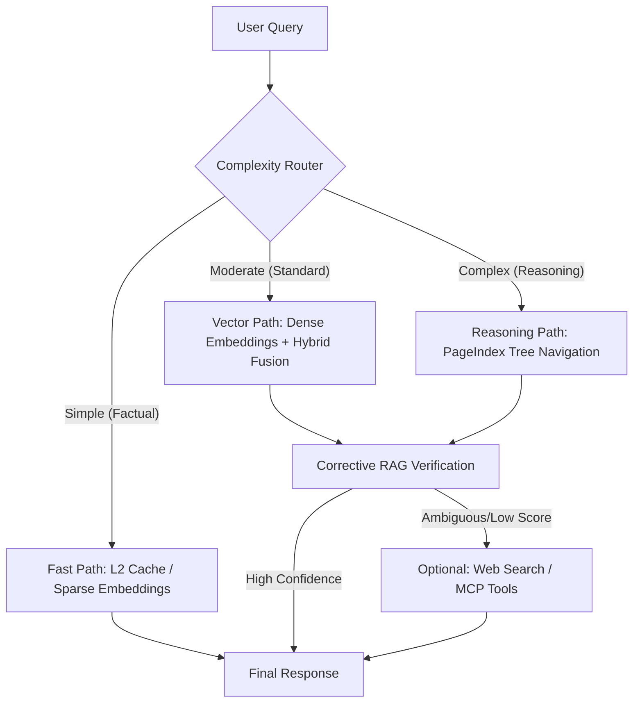
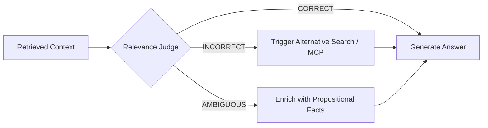

# CentRAG RAG Advancement Strategy

This document outlines the strategic roadmap for elevating CentRAG from a standard RAG platform to an enterprise-grade, advanced document intelligence system, drawing inspiration from Nir Diamant's "RAG Made Simple" and modern RAG engineering patterns.

## 1. RAG Maturity Model

We classify RAG implementations into five levels. CentRAG currently operates at **Level 3 (Advanced Standard)** and is moving toward **Level 4 (Adaptive Agentic)**.

| Level | Classification | Key Capabilities | CentRAG Status |
|:---|:---|:---|:---|
| **L1** | **Naive RAG** | Fixed-size chunking, Single vector store, Basic LLM generation. | ✅ Surpassed |
| **L2** | **Cognitive RAG** | Metadata filtering, Hybrid search, Recursive chunking, Re-ranking. | ✅ Surpassed |
| **L3** | **Advanced RAG** | HyDE, CRAG (Corrective RAG Loop), PII Guardrails, Tiered Caching. | ✅ Current |
| **L4** | **Adaptive Agentic** | Routing (Vector vs Tree vs Graph), Proposition Chunking, Adaptive Retrieval. | 🚀 Target Q2 |
| **L5** | **Infinite RAG** | Autonomous Fact-Checking, Self-Improving Memory, Temporal Facts. | 🔭 Vision |

---

## 2. Adaptive Retrieval Flow

Adaptive RAG allows the system to route queries based on their complexity. Simple factual queries bypass slow reasoning loops, while complex reasoning queries trigger multi-hop retrieval or PageIndex navigation.

---

## 3. Corrective RAG (CRAG) Integration

The Corrective RAG pattern introduces a "Self-Refiner" loop that validates the relevance of retrieved context before generation.

---

## 4. Short-Term Implementation Roadmap

### Phase 1: High-Performance Extraction (Current)
*   **Status:** Implementing.
*   **Goal:** Replace `unstructured`/`pypdf` with `PyMuPDF` for layout-aware, high-speed extraction.
*   **Benefit:** 10x reduction in ingestion latency and resolution of reading order bugs.

### Phase 2: Proposition Chunking PoC (Target)
*   **Status:** In Progress.
*   **Goal:** Implement atomic fact decomposition to improve retrieval precision.
*   **Benefit:** Enables retrieving exact facts instead of noisy text blocks, reducing LLM hallucination.

### Phase 3: Adaptive Query Routing
*   **Status:** Planned.
*   **Goal:** Implement the Routing layer to selectively use PageIndex or Vector store.
*   **Benefit:** Significant cost reduction by avoiding expensive reasoning models for simple questions.

---

> [!IMPORTANT]
> **Implementation Philosophy:** We adhere to SOLID principles. New retrieval strategies (like Proposition Chunking) are implemented as drop-in replacements for `ChunkerProtocol` and wired in `wiring.py`.
