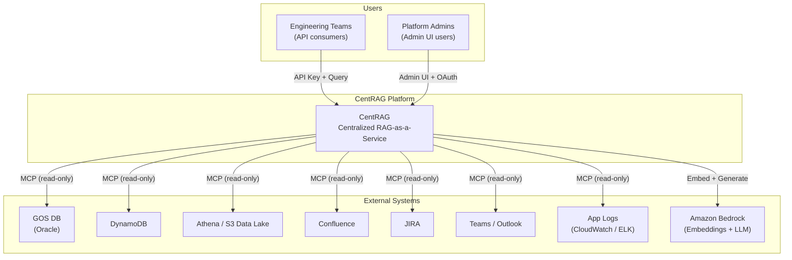
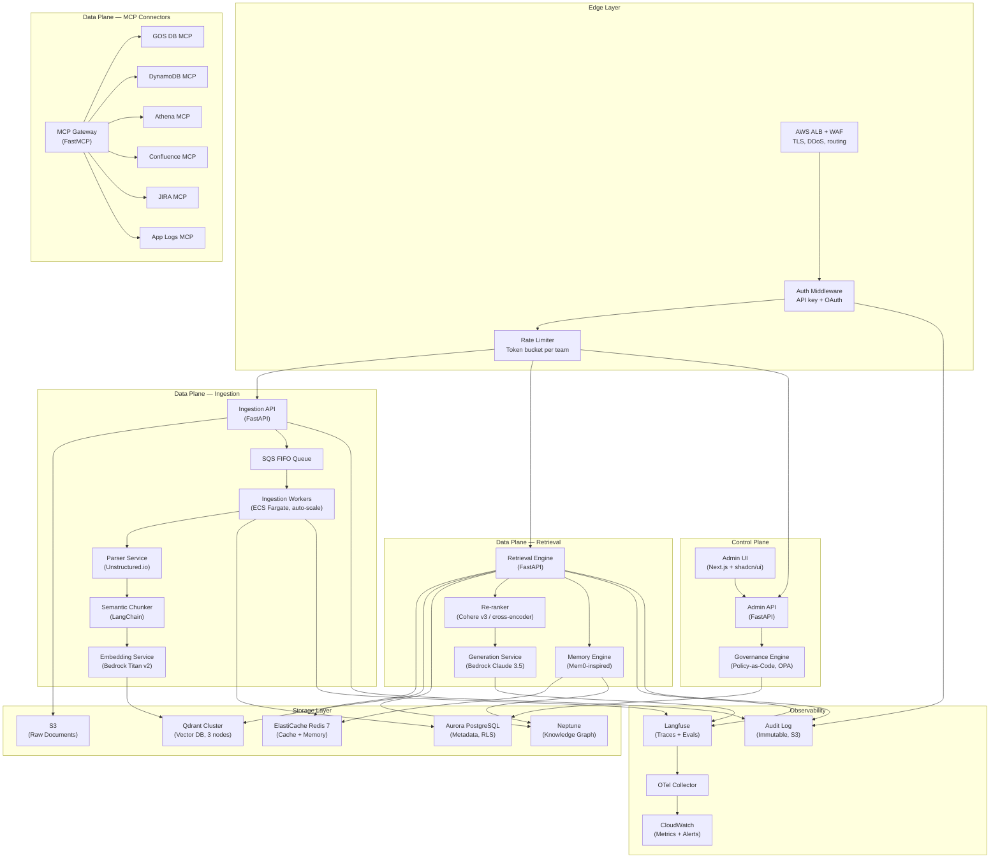
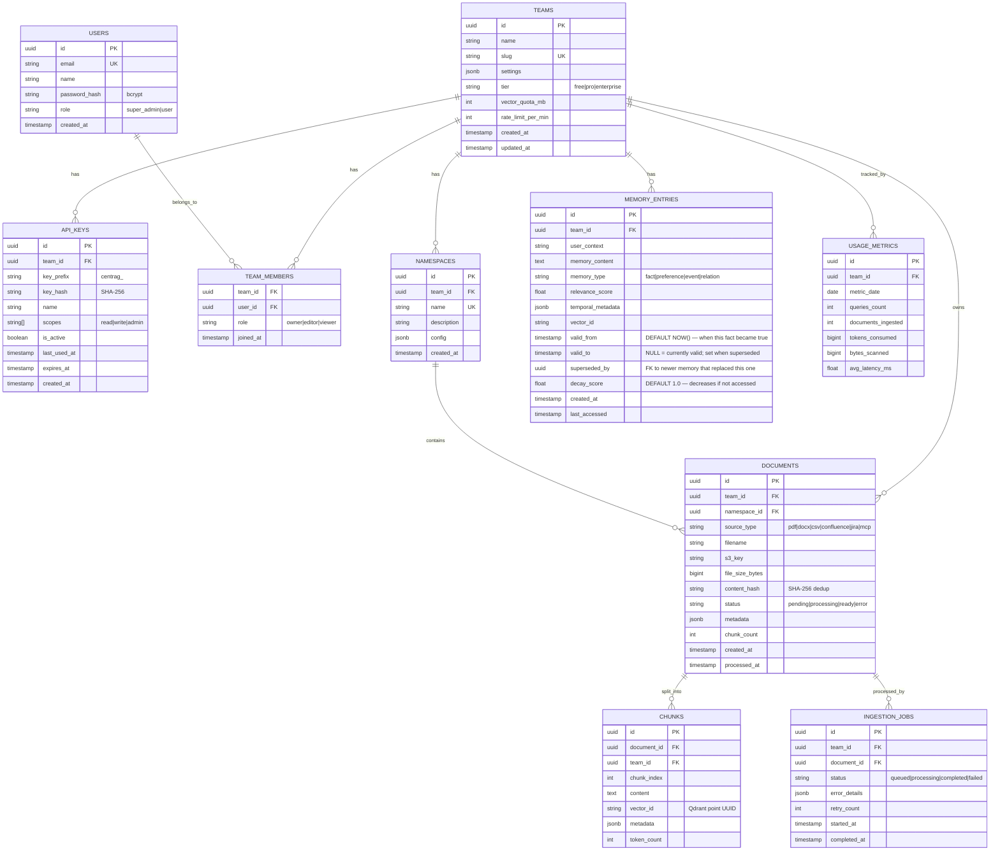

# Walkthrough: HLD/LLD Alignment with Claude Code Patterns

## Summary

Updated three core architecture documents to close the documentation drift between our implemented code and our architecture specs. Every pattern previously copied from `claude-code` into CentRAG source (`engine.py`, `cache.py`, `app.py`, `slow_logger.py`, `config.py`) is now fully reflected in at least one architecture document.

## Changes Made

### 1. ARCHITECTURE_HLD.md

```diff:ARCHITECTURE_HLD.md
# CentRAG — High-Level Design (HLD)

**Version:** 2.0  
**Author:** Platform Engineering  
**Status:** Draft → Review  
**Last Updated:** 2026-03-31  

---

## 1. Executive Summary

### 1.1 Problem Statement

Teams in the organization waste **2–4 weeks** each setting up their own RAG pipelines: choosing vector DBs, configuring embedding models, building auth, writing chunking logic, managing memory. This leads to:
- **Duplicated effort** across 50+ teams
- **Inconsistent quality** — some teams use naive fixed-size chunking, others skip re-ranking
- **No governance** — PII leaks, runaway costs, no audit trail
- **No memory** — every session starts from scratch

### 1.2 Solution

**CentRAG** is a centralized RAG-as-a-Service platform. Teams onboard via API key, upload data, and consume retrieval + generation through a unified API — fully namespace-isolated.

### 1.3 Goals
| Goal | Metric |
|------|--------|
| Zero-setup RAG for teams | Team onboarding < 30 minutes |
| Namespace isolation | 0 cross-tenant data leaks |
| Enterprise security | SOX/GDPR compliant, full audit trail |
| High performance | P95 retrieval < 3s (cold), < 50ms (cache hit) |
| Reusable infrastructure | Any new connector < 1 week to add |

---

## 2. Architectural Principles

### 2.1 Reusability Framework

> Every component is designed so it can be extracted, reused, or replaced independently.

| Principle | Implementation | Benefit |
|-----------|---------------|---------|
| **Interface-first contracts** | Every service defines a `typing.Protocol` (structural subtyping) before implementation | Swap implementations without changing callers |
| **Plugin-based connectors** | MCP connectors implement a `BaseConnector` interface | Add Confluence/JIRA/Slack without touching core |
| **Layered guardrails** | Security middleware is composable decorators, not embedded logic | Same guardrails reusable across any MCP server |
| **Shared config schema** | Pydantic `BaseSettings` hierarchy with env-var override | Same config pattern for any new service |
| **Reusable SDK** | `centrag-client` Python package for consumers | One `pip install` to connect; works in any Python app |
| **Template-based IaC** | CDK constructs for each component | Deploy a new environment in 1 command |

### 2.2 Core Architecture Principles

| # | Principle | How Applied |
|---|-----------|-------------|
| 1 | **Namespace Isolation** | Every data layer (vectors, metadata, cache, memory, S3) is partitioned by `team_id` |
| 2 | **Stateless Services** | All compute is horizontally scalable containers; state lives in managed datastores |
| 3 | **Defence in Depth** | API key → rate limit → namespace guard → SQL validation → PII redaction → audit log |
| 4 | **Event-Driven Ingestion** | Upload → SQS → async worker (never blocks the API thread) |
| 5 | **Hybrid RAG** | Dense + Sparse + KG retrieval, fused by a cross-encoder re-ranker |
| 6 | **Tiered Caching** | L1 (in-process) → L2 (exact) → L3 (semantic) → L4 (full RAG) |
| 7 | **Observability First** | Every chain has a `trace_id` linking query → retrieval → generation → response |
| 8 | **Policy-as-Code** | Access policies, retention rules, PII patterns defined as versioned code |

---

## 3. System Context (C4 Level 1)



**Who uses it:**
- **Teams** consume retrieval/generation via REST API with an API key
- **Admins** manage teams, keys, namespaces, and monitor usage via Admin UI

**What it connects to:**
- 7 internal data sources via MCP servers (reusable connector pattern)
- Amazon Bedrock for embedding + LLM generation

---

## 4. Container Diagram (C4 Level 2)



---

## 5. Namespace Isolation Strategy

### 5.1 Isolation by Layer

| Layer | Mechanism | How It Works |
|-------|----------|-------------|
| **API Gateway** | API key → `team_id` | Every request is tagged with `team_id` in the first middleware; no downstream service can proceed without it |
| **Vector DB (Qdrant)** | Payload filter + tiered sharding | All vectors have `team_id` in payload; queries MUST include `team_id` filter. High-volume teams get dedicated shards via `is_tenant=true` |
| **Metadata DB (PostgreSQL)** | Row-Level Security (RLS) | Policies enforce `WHERE team_id = current_setting('app.team_id')` on all tables. Set via `SET LOCAL` at connection checkout |
| **Cache (Redis)** | Key prefix | All keys follow `{service}:{team_id}:{hash}` pattern. Lua scripts enforce prefix on every operation |
| **Object Store (S3)** | Prefix partition | `s3://bucket/raw/{team_id}/{doc_id}/...` — IAM policy restricts prefix access |
| **Memory** | Scoped stores | Memory engine indexes and retrieves only within the requesting team's namespace |

### 5.2 What Prevents Cross-Tenant Access

```
Request comes in:
  ├─ API key → SHA256 hash → Redis/PG lookup → resolves to team_id
  ├─ team_id is injected into RequestContext (immutable after auth)
  ├─ Every downstream call receives team_id from context (not from user input)
  ├─ Qdrant: filter condition `team_id == ctx.team_id` is ALWAYS appended (not optional)
  ├─ PostgreSQL: RLS policy auto-filters rows (cannot be bypassed at SQL level)
  ├─ Redis: key prefix is enforced (service:TEAM_ID:key)
  └─ S3: IAM policy restricts to s3://bucket/raw/TEAM_ID/*
```

---

## 6. Security Architecture

### 6.1 Defence-in-Depth Layers

```
Internet
  │
  ▼
┌─────────────────────────────────────────────────┐
│ AWS WAF        — IP whitelisting, rate limiting,│
│                  SQL injection rules, geo-block  │
├─────────────────────────────────────────────────┤
│ ALB            — TLS 1.3 termination, HTTPS only│
├─────────────────────────────────────────────────┤
│ Auth Middleware — API key validation, OAuth      │
│                  team_id resolution, scope check │
├─────────────────────────────────────────────────┤
│ Rate Limiter   — Token bucket per team, per tier│
│                  (free=60/min, pro=300/min)      │
├─────────────────────────────────────────────────┤
│ Namespace Guard — team_id injection into context│
│                   immutable after auth            │
├─────────────────────────────────────────────────┤
│ SQL Validator  — Blocked keywords (DROP, ALTER)  │
│                  Parameterized queries only       │
│                  Schema/table whitelisting        │
├─────────────────────────────────────────────────┤
│ PII Redactor   — Regex patterns (SSN, CC, email)│
│                  Applied to ALL outbound data    │
├─────────────────────────────────────────────────┤
│ Result Capper  — Max 5MB per response            │
│                  Max 5000 rows per query          │
├─────────────────────────────────────────────────┤
│ Audit Logger   — Every tool invocation logged    │
│                  Immutable, shipped to S3         │
├─────────────────────────────────────────────────┤
│ Encryption     — BYOK Envelope Encryption (CMK)  │
│                  Per-team keys in AWS KMS         │
│                  DEK in-memory only, never stored │
│                  See: APP_LOGS_PRIVACY_LANGSMITH  │
└─────────────────────────────────────────────────┘
```

### 6.2 API Key Lifecycle

| Event | What Happens |
|-------|-------------|
| **Create** | Admin generates key via UI → `centrag_{uuid4}` → SHA-256 hashed → hash stored in PG → plaintext shown ONCE |
| **Validate** | Incoming key → SHA-256 → Redis lookup (TTL 5min) → fallback PG → returns `{team_id, scopes, tier}` |
| **Scope check** | Key scopes (e.g., `["read", "write"]`) matched against requested operation |
| **Rotate** | New key generated → old key marked `is_active=false` → cache invalidated |
| **Revoke** | Key deleted from PG → cache invalidated → immediate effect |
| **Expire** | Keys have optional `expires_at` → cron job deactivates expired keys daily |

### 6.3 RBAC Matrix

| Action | `viewer` | `editor` | `owner` | `super_admin` |
|--------|:--------:|:--------:|:-------:|:-------------:|
| Query data | ✅ | ✅ | ✅ | ✅ |
| View traces | ✅ | ✅ | ✅ | ✅ |
| Upload documents | ❌ | ✅ | ✅ | ✅ |
| Delete documents | ❌ | ✅ | ✅ | ✅ |
| Manage namespaces | ❌ | ✅ | ✅ | ✅ |
| Create API keys | ❌ | ❌ | ✅ | ✅ |
| Manage team members | ❌ | ❌ | ✅ | ✅ |
| View all teams | ❌ | ❌ | ❌ | ✅ |
| Platform config | ❌ | ❌ | ❌ | ✅ |

---

## 7. MCP Integration Architecture

### 7.1 Reusable Connector Pattern

All MCP connectors follow the **same interface** so adding a new one is copy-and-customize:

```
BaseConnector (Abstract)
   ├── connect()           → establish connection / session
   ├── list_resources()    → list available schemas, tables, pages
   ├── describe_resource() → get metadata for a specific resource
   ├── query()             → execute a read operation
   ├── ingest()            → pull data into the RAG pipeline
   └── health_check()      → verify connectivity
```

### 7.2 Connector Inventory

| MCP Server | Source | Protocol | Auth | Status |
|-----------|--------|----------|------|:------:|
| **GOS DB** | JPMC Oracle DB | oracledb (thin) | Wallet / Password | ✅ Built |
| **DynamoDB** | AWS DynamoDB | boto3 | STS AssumeRole | ✅ Built |
| **Athena** | AWS Athena / S3 | boto3 | STS AssumeRole | ✅ Built |
| **Confluence** | Atlassian Cloud | REST API v2 | OAuth 2.0 / PAT | 🔲 Phase 3 |
| **JIRA** | Atlassian Cloud | REST API v3 | OAuth 2.0 / PAT | 🔲 Phase 3 |
| **Teams/Outlook** | Microsoft 365 | Graph API | OAuth 2.0 (app) | 🔲 Phase 3 |
| **App Logs** | CloudWatch / ELK | boto3 / REST | IAM / API key | 🔲 Phase 4 |
| **Agent Logs** | Langfuse/LangSmith | REST API | API key | 🔲 Phase 4 |

### 7.3 Adding a New Connector (Reusability Workflow)

```
Time to add a new connector: < 1 week (for an engineer who reads this doc)

1. Copy `mcp_enterprise_server/gosdb_mcp.py` as template
2. Implement the BaseConnector interface:
   - Replace connection logic
   - Define tool functions (list, describe, query)
   - Map to guardrails (which keywords to block, which schemas to whitelist)
3. Add config class to `config.py` (follow existing pattern)
4. Register tools in `server.py` via `register_{name}_tools(mcp, config.{name})`
5. Add unit tests following `tests/test_guardrails.py` pattern
6. Add CDK construct following existing template

No core code changes needed. Just add files + register.
```

---

## 8. Data Flow Diagrams

### 8.1 Ingestion Flow

```
User uploads PDF via API:

POST /v1/documents
  Content-Type: multipart/form-data
  X-API-Key: centrag_xxxx
  Body: { file: report.pdf, namespace: "q3_reports" }

                                    ┌──────────────────────────────────────────────┐
                                    │           Ingestion Pipeline                  │
                                    │                                              │
  API Server                        │   Worker (ECS Fargate, auto-scale)           │
  ──────────                        │   ──────────────────────────────             │
  1. Validate API key → team_id     │   5. Dequeue SQS message                    │
  2. Validate file (size ≤100MB,    │   6. Download from S3                       │
     type ∈ [pdf,docx,csv,md,txt])  │   7. Parse → Unstructured.io               │
  3. Virus scan (ClamAV) [Phase 5]  │      PDF→Markdown, DOCX→Text               │
  4. Upload to S3:                  │   8. Semantic chunk (512 tok, 50 overlap)   │
     s3://bucket/raw/{team_id}/     │   9. Batch embed (Bedrock Titan v2, n=100) │
     {doc_id}/report.pdf            │  10. Upsert to Qdrant:                     │
  5. INSERT documents (status=      │      collection=documents                   │
     pending)                       │      payload={team_id, doc_id, namespace,   │
  6. Publish to SQS FIFO:          │        chunk_index, source_type}            │
     {doc_id, team_id, s3_key}      │  11. INSERT chunks rows in PostgreSQL      │
  7. Return 202 Accepted +         │  12. UPDATE documents status=ready          │
     {doc_id, status: "processing"} │  13. ACK SQS message                       │
                                    │                                              │
                                    │  On Error:                                   │
                                    │  - Retry up to 3 times                      │
                                    │  - After 3 failures → DLQ                   │
                                    │  - UPDATE documents status=error            │
                                    │  - Alert via CloudWatch alarm               │
                                    └──────────────────────────────────────────────┘
```

### 8.2 Retrieval Flow

```
User queries via API:

POST /v1/retrieve
  X-API-Key: centrag_xxxx
  Body: { "query": "What was Q3 revenue?", "namespace": "q3_reports", "max_results": 5 }

  Step   Component              Action                                        Latency
  ────   ─────────              ──────                                        ───────
   1     Auth Middleware         Validate key → resolve team_id                ~2ms
   2     Rate Limiter            Check token bucket for team tier              ~0.1ms
   3     Input Guardrails        Validate schema, block prompt injections      ~0.1ms
   4     L1 Cache (in-process)   Check LRU cache: _stable_hash(query)         ~0.01ms
   5     L2 Cache (Redis exact)  GET _stable_hash(query)                      ~1ms
   6     L3 Cache (Qdrant sem.)  Cosine search: embed(query) ≥0.95            ~15ms
          ──── if cache hit at any level, return cached response ────
   7     Query Expansion         HyDE: generate hypothetical answer embed     ~200ms
   8     Dense Search (Qdrant)   HNSW ANN search, filter: team_id, top=50    ~15ms
   9     Sparse Search (BM25)    Qdrant sparse vectors, top=50               ~10ms
  10     KG Lookup (Neptune)     Entity extraction → graph traversal          ~20ms
  11     Memory Recall (Mem0)    Retrieve relevant memories for user context  ~10ms
  12     Fusion (RRF)            Reciprocal Rank Fusion of all sources        ~1ms
  13     Re-rank (Cohere v3)     Cross-encoder scoring, select top=5          ~100ms
  14     Context Assembly        Top-5 chunks + memory + KG facts             ~1ms
  15     LLM Generation          Bedrock Claude 3.5: answer + citations       ~1500ms
  16     Output Guardrails       Check confidence, schema validation, leaks   ~1ms
  17     PII Redaction           Regex scrub: SSN, CC, email, phone, IP       ~2ms
  18     Audit & Cost Tracking   Log token usage, duration, budget check      ~1ms
  19     Cache Write             Populate L2 (exact) + L3 (semantic)          ~3ms
  20     Trace Emit              Send to Langfuse: full chain metadata        ~1ms (async)
  21     Return Response         JSON: {answer, sources[], trace_id}          ─────
                                                                    Total: ~1800ms
```

### 8.3 Auth Flow

```
Every API request:

  Client                  API Gateway            Auth Service              Redis            PostgreSQL
  ──────                  ───────────            ────────────              ─────            ──────────
    │                         │                       │                      │                    │
    │  X-API-Key: nxr_...     │                       │                      │                    │
    ├────────────────────────>│                       │                      │                    │
    │                         │  Forward API key      │                      │                    │
    │                         ├──────────────────────>│                      │                    │
    │                         │                       │  SHA256(key)         │                    │
    │                         │                       │─────────────────────>│                    │
    │                         │                       │                      │                    │
    │                         │                       │  Cache HIT           │                    │
    │                         │                       │<─ ─ ─ ─ ─ ─ ─ ─ ─ ─│                    │
    │                         │                       │  {team_id,           │                    │
    │                         │                       │   scopes, tier}      │                    │
    │                         │                       │                      │                    │
    │                         │                       │  OR Cache MISS       │                    │
    │                         │                       │─────────────────────────────────────────>│
    │                         │                       │                      │   SELECT * FROM    │
    │                         │                       │                      │   api_keys WHERE   │
    │                         │                       │                      │   key_hash=? AND   │
    │                         │                       │                      │   is_active=true   │
    │                         │                       │<─────────────────────────────────────── │
    │                         │                       │  SET in Redis        │                    │
    │                         │                       │  TTL 5min            │                    │
    │                         │                       │─────────────────────>│                    │
    │                         │                       │                      │                    │
    │                         │  Inject team_id       │                      │                    │
    │                         │  into RequestContext  │                      │                    │
    │                         │  (IMMUTABLE)          │                      │                    │
    │                         │                       │                      │                    │
    │                         │  Check scopes vs      │                      │                    │
    │                         │  requested action     │                      │                    │
    │                         │                       │                      │                    │
    │  200 OK / 401 / 403     │                       │                      │                    │
    │<────────────────────────│                       │                      │                    │
```

---

## 9. Technology Decisions

| Decision | Choice | Rationale | Alternatives Considered |
|---------|--------|-----------|------------------------|
| **Vector DB** | Qdrant (self-hosted, EKS) | Native tiered multi-tenancy, HNSW, payload filtering, `is_tenant` index. Best isolation story. | OpenSearch Serverless (fully managed but no tiered sharding), Pinecone (SaaS, data leaves VPC) |
| **Embedding** | Bedrock Titan Embed v2 (1024d) | AWS-native, no data leaves VPC, managed scaling, $0.0001/1K tokens | OpenAI text-embedding-3-large (3072d, higher quality but network hop), Cohere embed v3 |
| **LLM** | Bedrock Claude 3.5 Sonnet | Best quality/cost ratio, 200K context, AWS-native, no model hosting | GPT-4o (OpenAI, external), self-hosted Llama 3.1 70B (cheaper at scale but ops burden) |
| **Re-ranker** | Cohere Rerank v3 | Best-in-class cross-encoder, simple API, massive precision improvement | No re-ranker (worse quality), self-hosted cross-encoder (ops burden), Bedrock re-rank |
| **Metadata DB** | Aurora PostgreSQL 15 | RLS for isolation, JSONB for flexible metadata, proven at scale, Multi-AZ | DynamoDB (no SQL, no RLS), CockroachDB (complex, unnecessary) |
| **Cache** | ElastiCache Redis 7+ (cluster) | TTL-based exact-match cache (L2), key-prefix isolation, pub/sub for invalidation. **Note:** Redis is L2 only; L3 semantic cache uses Qdrant (ElastiCache lacks RediSearch). | Memcached (no pub/sub), Valkey (newer, less battle-tested) |
| **Queue** | SQS FIFO | Exactly-once processing, DLQ, no ops, ordered per team | Kafka (overkill for ingestion), RabbitMQ (self-managed) |
| **Document Parser** | Unstructured.io | Best layout-aware PDF/DOCX/HTML parsing. Handles tables, images, multi-column. | LangChain loaders (simpler but worse on complex layouts), Amazon Textract (OCR use cases) |
| **IaC** | AWS CDK (Python) | Same language as backend, L2 constructs, reusable stacks | Terraform (HCL is another language to maintain), CloudFormation (verbose) |
| **Observability** | Langfuse (self-hosted) | OSS, OTel-native, traces + evals + prompt management, LLM-specific metrics | LangSmith (vendor lock-in), Arize Phoenix (newer), custom OTel + Grafana (more work) |
| **Knowledge Graph** | Amazon Neptune | Managed, Gremlin/SPARQL, entity-relation storage, Multi-AZ | Neo4j Community (self-hosted, free but ops), skip KG for MVP (acceptable) |

---

## 10. Deployment Architecture (AWS)

```
┌─────────────────────────────────────────────────────────────────────────────┐
│                            AWS Account                                      │
│                                                                             │
│  ┌─── VPC 10.0.0.0/16 ───────────────────────────────────────────────────┐  │
│  │                                                                        │  │
│  │  ┌─── Public Subnets (3 AZs: a, b, c) ────────────────────────────┐  │  │
│  │  │  ALB (internet-facing) + WAF + ACM TLS cert                     │  │  │
│  │  │  NAT Gateway × 3 (one per AZ for HA egress)                     │  │  │
│  │  └─────────────────────────────────────────────────────────────────┘  │  │
│  │                                                                        │  │
│  │  ┌─── Private App Subnets (3 AZs: a, b, c) ───────────────────────┐  │  │
│  │  │  EKS Cluster (control plane: AWS-managed, 3-AZ)                 │  │  │
│  │  │  ├── api-server         (3 pods, r6g.large, spread across AZs) │  │  │
│  │  │  ├── retrieval-engine   (3 pods, r6g.large, spread across AZs) │  │  │
│  │  │  ├── ingestion-worker   (1-20 pods, auto-scale on SQS depth)    │  │  │
│  │  │  ├── mcp-gateway        (2 pods, r6g.medium)                    │  │  │
│  │  │  ├── memory-service     (2 pods, r6g.medium)                    │  │  │
│  │  │  ├── admin-ui           (2 pods, t3.medium)                     │  │  │
│  │  │  └── langfuse           (2 pods, r6g.medium)                    │  │  │
│  │  └─────────────────────────────────────────────────────────────────┘  │  │
│  │                                                                        │  │
│  │  ┌─── Private Data Subnets (3 AZs: a, b, c) ──────────────────────┐  │  │
│  │  │  Aurora PostgreSQL 15   (Multi-AZ, r6g.xlarge, 3-AZ storage)   │  │  │
│  │  │  Qdrant Cluster         (3 nodes, 1 per AZ, r6g.2xlarge, gp3) │  │  │
│  │  │  ElastiCache Redis 7    (Cluster, r6g.large, 3 shards, 3 AZs) │  │  │
│  │  │  Amazon Neptune         (db.r6g.large, Multi-AZ)               │  │  │
│  │  └─────────────────────────────────────────────────────────────────┘  │  │
│  │                                                                        │  │
│  │  Why 3 AZs: Quorum systems (etcd, Qdrant, Redis) need majority.       │  │
│  │  2 AZs → lose 1 AZ → lose 50% → no majority → OUTAGE.                │  │
│  │  3 AZs → lose 1 AZ → 2/3 remain → quorum maintained → OK.            │  │
│  │                                                                        │  │
│  └────────────────────────────────────────────────────────────────────────┘  │
│                                                                             │
│  S3 (raw documents + audit logs)                                            │
│  SQS FIFO (ingestion queue + DLQ)                                           │
│  Amazon Bedrock (Titan embeddings + Claude 3.5)                             │
│  Secrets Manager (DB creds, API signing keys)                               │
│  CloudWatch (metrics, alarms, dashboards)                                   │
│  ECR (container images)                                                     │
│  Route 53 (centrag.internal.company.com)                                    │
│                                                                             │
└─────────────────────────────────────────────────────────────────────────────┘
```

---

## 11. Cost Estimation (Monthly, 50 Teams)

| Component | Sizing | Est. Cost/Month |
|-----------|--------|:---------------:|
| EKS Cluster (control plane) | 1 cluster | $73 |
| EKS Nodes (app tier) | 6x r6g.large on-demand | ~$550 |
| EKS Nodes (ingestion) | 1-5x r6g.large spot | ~$100 |
| Aurora PostgreSQL | r6g.xlarge Multi-AZ | ~$460 |
| ElastiCache Redis | r6g.large cluster (3 shards) | ~$520 |
| Qdrant (on EKS) | 3x r6g.2xlarge + 300GB gp3 | ~$900 |
| Neptune | db.r6g.large Multi-AZ | ~$500 |
| S3 | 500GB + lifecycle policies | ~$12 |
| SQS | ~1M messages/month | ~$1 |
| Bedrock Embeddings | ~10M tokens/month | ~$1 |
| Bedrock LLM (Claude) | ~50M input + 10M output tok/month (est.) | ~$200 |
| ALB + WAF | Shared | ~$50 |
| CloudWatch | Logs + metrics | ~$30 |
| NAT Gateway | 3× (one per AZ) | ~$100 |
| **Total** | | **~$3,500/month** |

> Estimated **~$70/team/month** at 50 teams. Compare to teams each running their own infrastructure.
> **Note:** Neptune is Phase 6 (optional). Excluding it reduces cost to ~$3,000/month (~$60/team).
> Bedrock LLM cost scales with query volume. At high volume, expect $100-200/team.
> Cache hit ratio (target 40-60%) is the primary LLM cost lever.

---

## 12. Implementation Phases

| Phase | Weeks | Deliverable | Reusable Output |
|:-----:|:-----:|-------------|-----------------|
| **1** | 1-3 | PostgreSQL schema + API key auth + S3 upload + SQS + basic ingestion | Auth middleware (reusable), BaseConnector interface |
| **2** | 4-5 | Hybrid retrieval + re-ranker + semantic cache + LLM generation | Retrieval engine (reusable), cache layer (reusable) |
| **3** | 6-7 | Memory layer + MCP connectors (Confluence, JIRA, Teams) | Memory SDK (reusable), connector template |
| **4** | 8-9 | Admin UI + Langfuse observability | UI component library (reusable) |
| **5** | 10-12 | RBAC + PII pipeline + CDK deployment + load testing + security audit | CDK constructs (reusable), guardrails package (reusable) |

---

## 13. Performance Targets

| Metric | Target | How Measured |
|--------|--------|-------------|
| Query P95 (cache hit) | < 50ms | Load test with Locust |
| Query P95 (cache miss) | < 3s | Load test with Locust |
| Ingestion throughput | 100 docs/min | CloudWatch SQS metrics + custom dashboard |
| API key validation | < 5ms | Benchmark |
| Namespace isolation | 0 cross-tenant leaks | Automated security test suite |
| Uptime | 99.9% (8.7 hrs downtime/year) | CloudWatch + PagerDuty |
| Cache hit ratio | > 40% (steady state) | Redis metrics |

---

## 14. Open Questions

| # | Question | Impact | Who Decides |
|---|---------|--------|-------------|
| 1 | Qdrant vs OpenSearch Serverless for vector DB? | Self-managed vs fully managed | Platform + Infra team |
| 2 | Skip Knowledge Graph (Neptune) for MVP? | Reduces cost -$350/mo, loses entity reasoning | Product Owner |
| 3 | Bedrock Titan v2 vs OpenAI embeddings? | Quality vs latency vs data residency | Security + ML team |
| 4 | GOS DB connection details (hostname, wallet, schemas)? | Blocks MCP server testing | DBA team |
| 5 | Data residency requirements (us-east-1 only)? | Affects deployment topology | Compliance |
| 6 | Internal security review gates before AWS deploy? | Affects timeline | Security team |
===
# CentRAG — High-Level Design (HLD)

**Version:** 2.0  
**Author:** Platform Engineering  
**Status:** Draft → Review  
**Last Updated:** 2026-03-31  

---

## 1. Executive Summary

### 1.1 Problem Statement

Teams in the organization waste **2–4 weeks** each setting up their own RAG pipelines: choosing vector DBs, configuring embedding models, building auth, writing chunking logic, managing memory. This leads to:
- **Duplicated effort** across 50+ teams
- **Inconsistent quality** — some teams use naive fixed-size chunking, others skip re-ranking
- **No governance** — PII leaks, runaway costs, no audit trail
- **No memory** — every session starts from scratch

### 1.2 Solution

**CentRAG** is a centralized RAG-as-a-Service platform. Teams onboard via API key, upload data, and consume retrieval + generation through a unified API — fully namespace-isolated.

### 1.3 Goals
| Goal | Metric |
|------|--------|
| Zero-setup RAG for teams | Team onboarding < 30 minutes |
| Namespace isolation | 0 cross-tenant data leaks |
| Enterprise security | SOX/GDPR compliant, full audit trail |
| High performance | P95 retrieval < 3s (cold), < 50ms (cache hit) |
| Reusable infrastructure | Any new connector < 1 week to add |

---

## 2. Architectural Principles

### 2.1 Reusability Framework

> Every component is designed so it can be extracted, reused, or replaced independently.

| Principle | Implementation | Benefit |
|-----------|---------------|---------|
| **Interface-first contracts** | Every service defines a `typing.Protocol` (structural subtyping) before implementation | Swap implementations without changing callers |
| **Plugin-based connectors** | MCP connectors implement a `BaseConnector` interface | Add Confluence/JIRA/Slack without touching core |
| **Layered guardrails** | Security middleware is composable decorators, not embedded logic | Same guardrails reusable across any MCP server |
| **Shared config schema** | Pydantic `BaseSettings` hierarchy with env-var override | Same config pattern for any new service |
| **Reusable SDK** | `centrag-client` Python package for consumers | One `pip install` to connect; works in any Python app |
| **Template-based IaC** | CDK constructs for each component | Deploy a new environment in 1 command |

### 2.2 Core Architecture Principles

| # | Principle | How Applied |
|---|-----------|-------------|
| 1 | **Namespace Isolation** | Every data layer (vectors, metadata, cache, memory, S3) is partitioned by `team_id` |
| 2 | **Stateless Services** | All compute is horizontally scalable containers; state lives in managed datastores |
| 3 | **Defence in Depth** | API key → rate limit → namespace guard → SQL validation → PII redaction → audit log |
| 4 | **Event-Driven Ingestion** | Upload → SQS → async worker (never blocks the API thread) |
| 5 | **Hybrid RAG** | Dense + Sparse + KG retrieval, fused by a cross-encoder re-ranker |
| 6 | **Tiered Caching** | L1 (in-process) → L2 (exact) → L3 (semantic) → L4 (full RAG) |
| 7 | **Observability First** | Every chain has a `trace_id` linking query → retrieval → generation → response |
| 8 | **Policy-as-Code** | Access policies, retention rules, PII patterns defined as versioned code |
| 9 | **Graceful Shutdown** | All services implement tiered shutdown: drain requests → flush analytics → close connections → force-exit with failsafe timeout. Prevents data loss on SIGTERM/SIGINT during rolling deployments. |
| 10 | **Session Recovery** | Long-running retrieval sessions can be resumed after crash or disconnect. Conversation state is checkpointed to durable storage (PostgreSQL), allowing clients to reconnect without replaying from scratch. |
| 11 | **Performance Budgets** | Every async operation has a latency budget. Operations exceeding their budget are automatically logged as `slow_operation_detected` warnings with stack traces, enabling zero-effort bottleneck discovery. |

---

## 3. System Context (C4 Level 1)


**Who uses it:**
- **Teams** consume retrieval/generation via REST API with an API key
- **Admins** manage teams, keys, namespaces, and monitor usage via Admin UI

**What it connects to:**
- 7 internal data sources via MCP servers (reusable connector pattern)
- Amazon Bedrock for embedding + LLM generation

---

## 4. Container Diagram (C4 Level 2)


---

## 5. Namespace Isolation Strategy

### 5.1 Isolation by Layer

| Layer | Mechanism | How It Works |
|-------|----------|-------------|
| **API Gateway** | API key → `team_id` | Every request is tagged with `team_id` in the first middleware; no downstream service can proceed without it |
| **Vector DB (Qdrant)** | Payload filter + tiered sharding | All vectors have `team_id` in payload; queries MUST include `team_id` filter. High-volume teams get dedicated shards via `is_tenant=true` |
| **Metadata DB (PostgreSQL)** | Row-Level Security (RLS) | Policies enforce `WHERE team_id = current_setting('app.team_id')` on all tables. Set via `SET LOCAL` at connection checkout |
| **Cache (Redis)** | Key prefix | All keys follow `{service}:{team_id}:{hash}` pattern. Lua scripts enforce prefix on every operation |
| **Object Store (S3)** | Prefix partition | `s3://bucket/raw/{team_id}/{doc_id}/...` — IAM policy restricts prefix access |
| **Memory** | Scoped stores | Memory engine indexes and retrieves only within the requesting team's namespace |

### 5.2 What Prevents Cross-Tenant Access

```
Request comes in:
  ├─ API key → SHA256 hash → Redis/PG lookup → resolves to team_id
  ├─ team_id is injected into RequestContext (immutable after auth)
  ├─ Every downstream call receives team_id from context (not from user input)
  ├─ Qdrant: filter condition `team_id == ctx.team_id` is ALWAYS appended (not optional)
  ├─ PostgreSQL: RLS policy auto-filters rows (cannot be bypassed at SQL level)
  ├─ Redis: key prefix is enforced (service:TEAM_ID:key)
  └─ S3: IAM policy restricts to s3://bucket/raw/TEAM_ID/*
```

---

## 6. Security Architecture

### 6.1 Defence-in-Depth Layers

```
Internet
  │
  ▼
┌─────────────────────────────────────────────────┐
│ AWS WAF        — IP whitelisting, rate limiting,│
│                  SQL injection rules, geo-block  │
├─────────────────────────────────────────────────┤
│ ALB            — TLS 1.3 termination, HTTPS only│
├─────────────────────────────────────────────────┤
│ Auth Middleware — API key validation, OAuth      │
│                  team_id resolution, scope check │
├─────────────────────────────────────────────────┤
│ Rate Limiter   — Token bucket per team, per tier│
│                  (free=60/min, pro=300/min)      │
├─────────────────────────────────────────────────┤
│ Namespace Guard — team_id injection into context│
│                   immutable after auth            │
├─────────────────────────────────────────────────┤
│ SQL Validator  — Blocked keywords (DROP, ALTER)  │
│                  Parameterized queries only       │
│                  Schema/table whitelisting        │
├─────────────────────────────────────────────────┤
│ PII Redactor   — Regex patterns (SSN, CC, email)│
│                  Applied to ALL outbound data    │
├─────────────────────────────────────────────────┤
│ Result Capper  — Max 5MB per response            │
│                  Max 5000 rows per query          │
├─────────────────────────────────────────────────┤
│ Audit Logger   — Every tool invocation logged    │
│                  Immutable, shipped to S3         │
├─────────────────────────────────────────────────┤
│ Encryption     — BYOK Envelope Encryption (CMK)  │
│                  Per-team keys in AWS KMS         │
│                  DEK in-memory only, never stored │
│                  See: APP_LOGS_PRIVACY_LANGSMITH  │
└─────────────────────────────────────────────────┘
```

### 6.2 API Key Lifecycle

| Event | What Happens |
|-------|-------------|
| **Create** | Admin generates key via UI → `centrag_{uuid4}` → SHA-256 hashed → hash stored in PG → plaintext shown ONCE |
| **Validate** | Incoming key → SHA-256 → Redis lookup (TTL 5min) → fallback PG → returns `{team_id, scopes, tier}` |
| **Scope check** | Key scopes (e.g., `["read", "write"]`) matched against requested operation |
| **Rotate** | New key generated → old key marked `is_active=false` → cache invalidated |
| **Revoke** | Key deleted from PG → cache invalidated → immediate effect |
| **Expire** | Keys have optional `expires_at` → cron job deactivates expired keys daily |

### 6.3 RBAC Matrix

| Action | `viewer` | `editor` | `owner` | `super_admin` |
|--------|:--------:|:--------:|:-------:|:-------------:|
| Query data | ✅ | ✅ | ✅ | ✅ |
| View traces | ✅ | ✅ | ✅ | ✅ |
| Upload documents | ❌ | ✅ | ✅ | ✅ |
| Delete documents | ❌ | ✅ | ✅ | ✅ |
| Manage namespaces | ❌ | ✅ | ✅ | ✅ |
| Create API keys | ❌ | ❌ | ✅ | ✅ |
| Manage team members | ❌ | ❌ | ✅ | ✅ |
| View all teams | ❌ | ❌ | ❌ | ✅ |
| Platform config | ❌ | ❌ | ❌ | ✅ |

---

## 7. MCP Integration Architecture

### 7.1 Reusable Connector Pattern

All MCP connectors follow the **same interface** so adding a new one is copy-and-customize:

```
BaseConnector (Abstract)
   ├── connect()           → establish connection / session
   ├── list_resources()    → list available schemas, tables, pages
   ├── describe_resource() → get metadata for a specific resource
   ├── query()             → execute a read operation
   ├── ingest()            → pull data into the RAG pipeline
   └── health_check()      → verify connectivity
```

### 7.2 Connector Inventory

| MCP Server | Source | Protocol | Auth | Status |
|-----------|--------|----------|------|:------:|
| **GOS DB** | JPMC Oracle DB | oracledb (thin) | Wallet / Password | ✅ Built |
| **DynamoDB** | AWS DynamoDB | boto3 | STS AssumeRole | ✅ Built |
| **Athena** | AWS Athena / S3 | boto3 | STS AssumeRole | ✅ Built |
| **Confluence** | Atlassian Cloud | REST API v2 | OAuth 2.0 / PAT | 🔲 Phase 3 |
| **JIRA** | Atlassian Cloud | REST API v3 | OAuth 2.0 / PAT | 🔲 Phase 3 |
| **Teams/Outlook** | Microsoft 365 | Graph API | OAuth 2.0 (app) | 🔲 Phase 3 |
| **App Logs** | CloudWatch / ELK | boto3 / REST | IAM / API key | 🔲 Phase 4 |
| **Agent Logs** | Langfuse/LangSmith | REST API | API key | 🔲 Phase 4 |

### 7.3 Adding a New Connector (Reusability Workflow)

```
Time to add a new connector: < 1 week (for an engineer who reads this doc)

1. Copy `mcp_enterprise_server/gosdb_mcp.py` as template
2. Implement the BaseConnector interface:
   - Replace connection logic
   - Define tool functions (list, describe, query)
   - Map to guardrails (which keywords to block, which schemas to whitelist)
3. Add config class to `config.py` (follow existing pattern)
4. Register tools in `server.py` via `register_{name}_tools(mcp, config.{name})`
5. Add unit tests following `tests/test_guardrails.py` pattern
6. Add CDK construct following existing template

No core code changes needed. Just add files + register.
```

---

## 8. Data Flow Diagrams

### 8.1 Ingestion Flow

```
User uploads PDF via API:

POST /v1/documents
  Content-Type: multipart/form-data
  X-API-Key: centrag_xxxx
  Body: { file: report.pdf, namespace: "q3_reports" }

                                    ┌──────────────────────────────────────────────┐
                                    │           Ingestion Pipeline                  │
                                    │                                              │
  API Server                        │   Worker (ECS Fargate, auto-scale)           │
  ──────────                        │   ──────────────────────────────             │
  1. Validate API key → team_id     │   5. Dequeue SQS message                    │
  2. Validate file (size ≤100MB,    │   6. Download from S3                       │
     type ∈ [pdf,docx,csv,md,txt])  │   7. Parse → Unstructured.io               │
  3. Virus scan (ClamAV) [Phase 5]  │      PDF→Markdown, DOCX→Text               │
  4. Upload to S3:                  │   8. Semantic chunk (512 tok, 50 overlap)   │
     s3://bucket/raw/{team_id}/     │   9. Batch embed (Bedrock Titan v2, n=100) │
     {doc_id}/report.pdf            │  10. Upsert to Qdrant:                     │
  5. INSERT documents (status=      │      collection=documents                   │
     pending)                       │      payload={team_id, doc_id, namespace,   │
  6. Publish to SQS FIFO:          │        chunk_index, source_type}            │
     {doc_id, team_id, s3_key}      │  11. INSERT chunks rows in PostgreSQL      │
  7. Return 202 Accepted +         │  12. UPDATE documents status=ready          │
     {doc_id, status: "processing"} │  13. ACK SQS message                       │
                                    │                                              │
                                    │  On Error:                                   │
                                    │  - Retry up to 3 times                      │
                                    │  - After 3 failures → DLQ                   │
                                    │  - UPDATE documents status=error            │
                                    │  - Alert via CloudWatch alarm               │
                                    └──────────────────────────────────────────────┘
```

### 8.2 Retrieval Flow

```
User queries via API:

POST /v1/retrieve
  X-API-Key: centrag_xxxx
  Body: { "query": "What was Q3 revenue?", "namespace": "q3_reports", "max_results": 5 }

          ──── if cache hit at any level, return cached response ────
   7     Query Expansion         HyDE: generate hypothetical answer embed     ~200ms
   8     Dense Search (Qdrant)   HNSW ANN search, filter: team_id, top=50    ~15ms
   9     Sparse Search (BM25)    Qdrant sparse vectors, top=50               ~10ms
  10     KG Lookup (Neptune)     Entity extraction → graph traversal          ~20ms
  11     Memory Recall (Mem0)    Retrieve relevant memories for user context  ~10ms
  12     Fusion (RRF)            Reciprocal Rank Fusion of all sources        ~1ms
  13     Re-rank (Cohere v3)     Cross-encoder scoring, select top=5          ~100ms
  14     Context Assembly        Top-5 chunks + memory + KG facts             ~1ms
  15     LLM Generation          Bedrock Claude 3.5: answer + citations       ~1500ms
  16     Output Guardrails       Check confidence, schema validation, leaks   ~1ms
  17     PII Redaction           Regex scrub: SSN, CC, email, phone, IP       ~2ms
  18     Audit & Cost Tracking   Log token usage, duration, budget check      ~1ms
  19     Cache Write             Populate L2 (exact) + L3 (semantic)          ~3ms
  20     Trace Emit              Send to Langfuse: full chain metadata        ~1ms (async)
  21     Return Response         JSON: {answer, sources[], trace_id}          ─────
                                                                    Total: ~1800ms
```

### 8.3 Auth Flow

```
Every API request:

  Client                  API Gateway            Auth Service              Redis            PostgreSQL
  ──────                  ───────────            ────────────              ─────            ──────────
    │                         │                       │                      │                    │
    │  X-API-Key: nxr_...     │                       │                      │                    │
    ├────────────────────────>│                       │                      │                    │
    │                         │  Forward API key      │                      │                    │
    │                         ├──────────────────────>│                      │                    │
    │                         │                       │  SHA256(key)         │                    │
    │                         │                       │─────────────────────>│                    │
    │                         │                       │                      │                    │
    │                         │                       │  Cache HIT           │                    │
    │                         │                       │<─ ─ ─ ─ ─ ─ ─ ─ ─ ─│                    │
    │                         │                       │  {team_id,           │                    │
    │                         │                       │   scopes, tier}      │                    │
    │                         │                       │                      │                    │
    │                         │                       │  OR Cache MISS       │                    │
    │                         │                       │─────────────────────────────────────────>│
    │                         │                       │                      │   SELECT * FROM    │
    │                         │                       │                      │   api_keys WHERE   │
    │                         │                       │                      │   key_hash=? AND   │
    │                         │                       │                      │   is_active=true   │
    │                         │                       │<─────────────────────────────────────── │
    │                         │                       │  SET in Redis        │                    │
    │                         │                       │  TTL 5min            │                    │
    │                         │                       │─────────────────────>│                    │
    │                         │                       │                      │                    │
    │                         │  Inject team_id       │                      │                    │
    │                         │  into RequestContext  │                      │                    │
    │                         │  (IMMUTABLE)          │                      │                    │
    │                         │                       │                      │                    │
    │                         │  Check scopes vs      │                      │                    │
    │                         │  requested action     │                      │                    │
    │                         │                       │                      │                    │
    │  200 OK / 401 / 403     │                       │                      │                    │
    │<────────────────────────│                       │                      │                    │
```

### 8.4 Startup & Shutdown Lifecycle Flow

```
Startup (Parallel Resource Acquisition — inspired by claude-code RAII pattern):

  app.py lifespan "startup"
  ────────────────────────
  asyncio.gather(
    connect_postgres(),      ─┐
    connect_redis(),          ├─ All 3 connections acquired in parallel
    connect_qdrant(),        ─┘              ⟶ ~max(PG, Redis, Qdrant) latency
  )
  Feature-flag route inclusion:
    if settings.enable_docs_routes:   mount /v1/documents
    if settings.enable_retrieval_routes: mount /v1/retrieve
  Emit "centrag_ready" structured log


Graceful Shutdown (inspired by claude-code/gracefulShutdown.ts):

  SIGTERM / SIGINT received
  ─────────────────────────
  Phase 1: Mark unhealthy               (health → 503, stop accepting new requests)    ~0ms
  Phase 2: Drain in-flight requests      (asyncio.wait, timeout=10s)                   ~0-10s
  Phase 3: Flush async resources         (parallel)                                    ~0-3s
     ├── Langfuse trace batch flush
     ├── Audit log buffer flush
     ├── Usage metrics aggregate → PostgreSQL
     └── Redis pub/sub unsubscribe
  Phase 4: Close connection pools         (parallel)                                   ~0-1s
     ├── PostgreSQL pool.close()
     ├── Redis.close()
     └── Qdrant client.close()
  Phase 5: Exit 0

  Failsafe: If Phases 2-4 exceed 15s total → force exit (prevent hung containers)
  Orphan detection: Periodic check (30s) — if stdout/stdin become invalid → trigger shutdown
```

### 8.5 Session Recovery Flow (Phase 5)

```
Client crash or network disconnect during retrieval:

  State saved:                        State restored on reconnect:
  ─────────────                       ──────────────────────────
  1. Query text + namespace           1. Client sends: POST /v1/session/resume
  2. Retrieval step reached              { session_id: "xxx" }
  3. Partial results so far           2. Server loads checkpoint from PostgreSQL
  4. Token usage accumulated          3. Resume from last completed step
  5. Timestamp + trace_id            4. Cost state restored (no double-billing)
                                      5. Remaining pipeline executes normally
  Checkpoint granularity:
  - After auth ✓
  - After cache lookup (hit or miss)
  - After retrieval + rerank
  - After generation
```

---

## 9. Technology Decisions

| Decision | Choice | Rationale | Alternatives Considered |
|---------|--------|-----------|------------------------|
| **Vector DB** | Qdrant (self-hosted, EKS) | Native tiered multi-tenancy, HNSW, payload filtering, `is_tenant` index. Best isolation story. | OpenSearch Serverless (fully managed but no tiered sharding), Pinecone (SaaS, data leaves VPC) |
| **Embedding** | Bedrock Titan Embed v2 (1024d) | AWS-native, no data leaves VPC, managed scaling, $0.0001/1K tokens | OpenAI text-embedding-3-large (3072d, higher quality but network hop), Cohere embed v3 |
| **LLM** | Bedrock Claude 3.5 Sonnet | Best quality/cost ratio, 200K context, AWS-native, no model hosting | GPT-4o (OpenAI, external), self-hosted Llama 3.1 70B (cheaper at scale but ops burden) |
| **Re-ranker** | Cohere Rerank v3 | Best-in-class cross-encoder, simple API, massive precision improvement | No re-ranker (worse quality), self-hosted cross-encoder (ops burden), Bedrock re-rank |
| **Metadata DB** | Aurora PostgreSQL 15 | RLS for isolation, JSONB for flexible metadata, proven at scale, Multi-AZ | DynamoDB (no SQL, no RLS), CockroachDB (complex, unnecessary) |
| **Cache** | ElastiCache Redis 7+ (cluster) | TTL-based exact-match cache (L2), key-prefix isolation, pub/sub for invalidation. **Note:** Redis is L2 only; L3 semantic cache uses Qdrant (ElastiCache lacks RediSearch). | Memcached (no pub/sub), Valkey (newer, less battle-tested) |
| **Queue** | SQS FIFO | Exactly-once processing, DLQ, no ops, ordered per team | Kafka (overkill for ingestion), RabbitMQ (self-managed) |
| **Document Parser** | Unstructured.io | Best layout-aware PDF/DOCX/HTML parsing. Handles tables, images, multi-column. | LangChain loaders (simpler but worse on complex layouts), Amazon Textract (OCR use cases) |
| **IaC** | AWS CDK (Python) | Same language as backend, L2 constructs, reusable stacks | Terraform (HCL is another language to maintain), CloudFormation (verbose) |
| **Observability** | Langfuse (self-hosted) | OSS, OTel-native, traces + evals + prompt management, LLM-specific metrics | LangSmith (vendor lock-in), Arize Phoenix (newer), custom OTel + Grafana (more work) |
| **Knowledge Graph** | Amazon Neptune | Managed, Gremlin/SPARQL, entity-relation storage, Multi-AZ | Neo4j Community (self-hosted, free but ops), skip KG for MVP (acceptable) |

---

## 10. Deployment Architecture (AWS)

```
┌─────────────────────────────────────────────────────────────────────────────┐
│                            AWS Account                                      │
│                                                                             │
│  ┌─── VPC 10.0.0.0/16 ───────────────────────────────────────────────────┐  │
│  │                                                                        │  │
│  │  ┌─── Public Subnets (3 AZs: a, b, c) ────────────────────────────┐  │  │
│  │  │  ALB (internet-facing) + WAF + ACM TLS cert                     │  │  │
│  │  │  NAT Gateway × 3 (one per AZ for HA egress)                     │  │  │
│  │  └─────────────────────────────────────────────────────────────────┘  │  │
│  │                                                                        │  │
│  │  ┌─── Private App Subnets (3 AZs: a, b, c) ───────────────────────┐  │  │
│  │  │  EKS Cluster (control plane: AWS-managed, 3-AZ)                 │  │  │
│  │  │  ├── api-server         (3 pods, r6g.large, spread across AZs) │  │  │
│  │  │  ├── retrieval-engine   (3 pods, r6g.large, spread across AZs) │  │  │
│  │  │  ├── ingestion-worker   (1-20 pods, auto-scale on SQS depth)    │  │  │
│  │  │  ├── mcp-gateway        (2 pods, r6g.medium)                    │  │  │
│  │  │  ├── memory-service     (2 pods, r6g.medium)                    │  │  │
│  │  │  ├── admin-ui           (2 pods, t3.medium)                     │  │  │
│  │  │  └── langfuse           (2 pods, r6g.medium)                    │  │  │
│  │  └─────────────────────────────────────────────────────────────────┘  │  │
│  │                                                                        │  │
│  │  ┌─── Private Data Subnets (3 AZs: a, b, c) ──────────────────────┐  │  │
│  │  │  Aurora PostgreSQL 15   (Multi-AZ, r6g.xlarge, 3-AZ storage)   │  │  │
│  │  │  Qdrant Cluster         (3 nodes, 1 per AZ, r6g.2xlarge, gp3) │  │  │
│  │  │  ElastiCache Redis 7    (Cluster, r6g.large, 3 shards, 3 AZs) │  │  │
│  │  │  Amazon Neptune         (db.r6g.large, Multi-AZ)               │  │  │
│  │  └─────────────────────────────────────────────────────────────────┘  │  │
│  │                                                                        │  │
│  │  Why 3 AZs: Quorum systems (etcd, Qdrant, Redis) need majority.       │  │
│  │  2 AZs → lose 1 AZ → lose 50% → no majority → OUTAGE.                │  │
│  │  3 AZs → lose 1 AZ → 2/3 remain → quorum maintained → OK.            │  │
│  │                                                                        │  │
│  └────────────────────────────────────────────────────────────────────────┘  │
│                                                                             │
│  S3 (raw documents + audit logs)                                            │
│  SQS FIFO (ingestion queue + DLQ)                                           │
│  Amazon Bedrock (Titan embeddings + Claude 3.5)                             │
│  Secrets Manager (DB creds, API signing keys)                               │
│  CloudWatch (metrics, alarms, dashboards)                                   │
│  ECR (container images)                                                     │
│  Route 53 (centrag.internal.company.com)                                    │
│                                                                             │
└─────────────────────────────────────────────────────────────────────────────┘
```

---

## 11. Cost Estimation (Monthly, 50 Teams)

| Component | Sizing | Est. Cost/Month |
|-----------|--------|:---------------:|
| EKS Cluster (control plane) | 1 cluster | $73 |
| EKS Nodes (app tier) | 6x r6g.large on-demand | ~$550 |
| EKS Nodes (ingestion) | 1-5x r6g.large spot | ~$100 |
| Aurora PostgreSQL | r6g.xlarge Multi-AZ | ~$460 |
| ElastiCache Redis | r6g.large cluster (3 shards) | ~$520 |
| Qdrant (on EKS) | 3x r6g.2xlarge + 300GB gp3 | ~$900 |
| Neptune | db.r6g.large Multi-AZ | ~$500 |
| S3 | 500GB + lifecycle policies | ~$12 |
| SQS | ~1M messages/month | ~$1 |
| Bedrock Embeddings | ~10M tokens/month | ~$1 |
| Bedrock LLM (Claude) | ~50M input + 10M output tok/month (est.) | ~$200 |
| ALB + WAF | Shared | ~$50 |
| CloudWatch | Logs + metrics | ~$30 |
| NAT Gateway | 3× (one per AZ) | ~$100 |
| **Total** | | **~$3,500/month** |

> Estimated **~$70/team/month** at 50 teams. Compare to teams each running their own infrastructure.
> **Note:** Neptune is Phase 6 (optional). Excluding it reduces cost to ~$3,000/month (~$60/team).
> Bedrock LLM cost scales with query volume. At high volume, expect $100-200/team.
> Cache hit ratio (target 40-60%) is the primary LLM cost lever.

---

## 12. Implementation Phases

| Phase | Weeks | Deliverable | Reusable Output |
|:-----:|:-----:|-------------|-----------------|
| **1** | 1-3 | PostgreSQL schema + API key auth + S3 upload + SQS + basic ingestion | Auth middleware (reusable), BaseConnector interface |
| **2** | 4-5 | Hybrid retrieval + re-ranker + semantic cache + LLM generation | Retrieval engine (reusable), cache layer (reusable) |
| **3** | 6-7 | Memory layer + MCP connectors (Confluence, JIRA, Teams) | Memory SDK (reusable), connector template |
| **4** | 8-9 | Admin UI + Langfuse observability | UI component library (reusable) |
| **5** | 10-12 | RBAC + PII pipeline + CDK deployment + load testing + security audit | CDK constructs (reusable), guardrails package (reusable) |

---

## 13. Performance Targets

| Metric | Target | How Measured |
|--------|--------|-------------|
| Query P95 (cache hit) | < 50ms | Load test with Locust |
| Query P95 (cache miss) | < 3s | Load test with Locust |
| Ingestion throughput | 100 docs/min | CloudWatch SQS metrics + custom dashboard |
| API key validation | < 5ms | Benchmark |
| Namespace isolation | 0 cross-tenant leaks | Automated security test suite |
| Uptime | 99.9% (8.7 hrs downtime/year) | CloudWatch + PagerDuty |
| Cache hit ratio | > 40% (steady state) | Redis metrics |

---

## 14. Open Questions

| # | Question | Impact | Who Decides |
|---|---------|--------|-------------|
| 1 | Qdrant vs OpenSearch Serverless for vector DB? | Self-managed vs fully managed | Platform + Infra team |
| 2 | Skip Knowledge Graph (Neptune) for MVP? | Reduces cost -$350/mo, loses entity reasoning | Product Owner |
| 3 | Bedrock Titan v2 vs OpenAI embeddings? | Quality vs latency vs data residency | Security + ML team |
| 4 | GOS DB connection details (hostname, wallet, schemas)? | Blocks MCP server testing | DBA team |
| 5 | Data residency requirements (us-east-1 only)? | Affects deployment topology | Compliance |
| 6 | Internal security review gates before AWS deploy? | Affects timeline | Security team |
```

| Change | Section | Description |
|--------|---------|-------------|
| +3 principles | §2.2 rows 9-11 | Added **Graceful Shutdown**, **Session Recovery**, **Performance Budgets** |
| New §8.4 | Data Flows | **Startup & Shutdown Lifecycle Flow** — parallel resource acquisition (`asyncio.gather`), feature-flag route inclusion, 5-phase graceful shutdown with failsafe timer |
| New §8.5 | Data Flows | **Session Recovery Flow** — checkpoint granularity, cost state restore on reconnect (Phase 5) |

---

### 2. ARCHITECTURE_LLD.md

```diff:ARCHITECTURE_LLD.md
# CentRAG — Low-Level Design (LLD)

**Version:** 2.0  
**Author:** Platform Engineering  
**Status:** Draft → Review  
**Last Updated:** 2026-03-31  
**Prerequisite:** Read [ARCHITECTURE_HLD.md](./ARCHITECTURE_HLD.md) first.

---

## 1. Data Model (PostgreSQL)

### 1.1 ER Diagram



### 1.2 Row-Level Security (RLS)

```sql
-- Enable RLS on all tenant-scoped tables
ALTER TABLE documents ENABLE ROW LEVEL SECURITY;
ALTER TABLE chunks ENABLE ROW LEVEL SECURITY;
ALTER TABLE api_keys ENABLE ROW LEVEL SECURITY;
ALTER TABLE namespaces ENABLE ROW LEVEL SECURITY;
ALTER TABLE memory_entries ENABLE ROW LEVEL SECURITY;
ALTER TABLE ingestion_jobs ENABLE ROW LEVEL SECURITY;

-- CRITICAL: FORCE RLS even for table owners and superusers.
-- Without FORCE, a rogue engineer with owner role bypasses all RLS.
ALTER TABLE documents FORCE ROW LEVEL SECURITY;
ALTER TABLE chunks FORCE ROW LEVEL SECURITY;
ALTER TABLE api_keys FORCE ROW LEVEL SECURITY;
ALTER TABLE namespaces FORCE ROW LEVEL SECURITY;
ALTER TABLE memory_entries FORCE ROW LEVEL SECURITY;
ALTER TABLE ingestion_jobs FORCE ROW LEVEL SECURITY;

-- Create policy: rows are only visible for the current team
CREATE POLICY team_isolation ON documents
    USING (team_id = current_setting('app.team_id')::uuid);

CREATE POLICY team_isolation ON chunks
    USING (team_id = current_setting('app.team_id')::uuid);

CREATE POLICY team_isolation ON api_keys
    USING (team_id = current_setting('app.team_id')::uuid);

CREATE POLICY team_isolation ON namespaces
    USING (team_id = current_setting('app.team_id')::uuid);

CREATE POLICY team_isolation ON memory_entries
    USING (team_id = current_setting('app.team_id')::uuid);

CREATE POLICY team_isolation ON ingestion_jobs
    USING (team_id = current_setting('app.team_id')::uuid);

-- Usage: set team context at connection checkout
-- This is done by the API server middleware, NOT by the client
SET LOCAL app.team_id = '550e8400-e29b-41d4-a716-446655440000';

-- All subsequent queries on this connection are auto-filtered
SELECT * FROM documents;  -- Only returns team's documents
```

### 1.3 Indexes

```sql
-- Primary access patterns
CREATE INDEX idx_documents_team_ns ON documents (team_id, namespace_id);
CREATE INDEX idx_documents_status ON documents (status) WHERE status != 'ready';
CREATE INDEX idx_chunks_document ON chunks (document_id);
CREATE INDEX idx_chunks_team ON chunks (team_id);
CREATE INDEX idx_api_keys_hash ON api_keys (key_hash) WHERE is_active = true;
CREATE INDEX idx_api_keys_team ON api_keys (team_id);
CREATE INDEX idx_memory_team_type ON memory_entries (team_id, memory_type);
CREATE INDEX idx_ingestion_status ON ingestion_jobs (status) WHERE status = 'queued';
CREATE INDEX idx_usage_team_date ON usage_metrics (team_id, metric_date);
```

---

## 2. API Design

### 2.1 Endpoint Table

All endpoints require `X-API-Key` header unless marked with 🔓 (OAuth only for Admin UI).

#### Retrieval API (for teams)

| Method | Endpoint | Description | Scope Required |
|--------|---------|-------------|:--------------:|
| `POST` | `/v1/retrieve` | Execute RAG query | `read` |
| `POST` | `/v1/retrieve/stream` | SSE streaming RAG query | `read` |
| `POST` | `/v1/documents` | Upload document for ingestion | `write` |
| `GET` | `/v1/documents` | List team's documents | `read` |
| `GET` | `/v1/documents/{id}` | Get document status | `read` |
| `DELETE` | `/v1/documents/{id}` | Delete document + vectors | `write` |
| `GET` | `/v1/namespaces` | List team's namespaces | `read` |
| `POST` | `/v1/namespaces` | Create namespace | `write` |
| `GET` | `/v1/health` | Health check | none |

#### Admin API 🔓 (for platform admins)

| Method | Endpoint | Description | Role Required |
|--------|---------|-------------|:-------------:|
| `POST` | `/admin/teams` | Create team | `super_admin` |
| `GET` | `/admin/teams` | List all teams | `super_admin` |
| `POST` | `/admin/teams/{id}/keys` | Generate API key | `owner` |
| `DELETE` | `/admin/teams/{id}/keys/{key_id}` | Revoke API key | `owner` |
| `POST` | `/admin/teams/{id}/members` | Add team member | `owner` |
| `GET` | `/admin/teams/{id}/usage` | View usage metrics | `owner` |

### 2.2 Core Request/Response Schemas

#### POST /v1/retrieve (RAG Query)

**Request:**
```json
{
  "query": "What was the Q3 2025 revenue for Product Alpha?",
  "namespace": "q3_reports",
  "max_results": 5,
  "include_sources": true,
  "include_memory": true,
  "temperature": 0.1
}
```

**Response (200 OK):**
```json
{
  "answer": "Based on the Q3 2025 financial report, Product Alpha generated $42.3M in revenue, representing a 15% YoY increase...",
  "sources": [
    {
      "document_id": "d1a2b3c4-...",
      "filename": "q3_2025_financials.pdf",
      "chunk_index": 7,
      "relevance_score": 0.94,
      "snippet": "...Product Alpha revenue reached $42.3M in Q3 2025..."
    },
    {
      "document_id": "e5f6a7b8-...",
      "filename": "product_alpha_summary.docx",
      "chunk_index": 2,
      "relevance_score": 0.87,
      "snippet": "...15% year-over-year growth driven by enterprise adoption..."
    }
  ],
  "metadata": {
    "trace_id": "tr_8a9b0c1d2e3f...",
    "latency_ms": 1847,
    "cache_hit": false,
    "chunks_retrieved": 50,
    "chunks_after_rerank": 5,
    "tokens_used": {
      "embedding": 24,
      "generation_input": 3200,
      "generation_output": 180
    }
  }
}
```

#### POST /v1/documents (Upload)

**Request:**
```
POST /v1/documents
Content-Type: multipart/form-data
X-API-Key: centrag_xxxx

file: report.pdf (binary)
namespace: q3_reports
metadata: {"department": "finance", "year": 2025}
```

**Response (202 Accepted):**
```json
{
  "document_id": "d1a2b3c4-...",
  "filename": "report.pdf",
  "status": "processing",
  "namespace": "q3_reports",
  "estimated_completion_seconds": 30,
  "poll_url": "/v1/documents/d1a2b3c4-..."
}
```

### 2.3 Error Response Schema

All errors follow the same structure:

```json
{
  "error": {
    "code": "RATE_LIMIT_EXCEEDED",
    "message": "Rate limit of 60 requests/minute exceeded for team 'alpha'. Retry after 15 seconds.",
    "details": {
      "limit": 60,
      "window": "1 minute",
      "retry_after_seconds": 15
    },
    "trace_id": "tr_xxx"
  }
}
```

| HTTP Code | Error Code | When |
|:---------:|-----------|------|
| 400 | `INVALID_REQUEST` | Missing/malformed fields |
| 401 | `INVALID_API_KEY` | Key not found or expired |
| 403 | `INSUFFICIENT_SCOPE` | Key doesn't have required scope |
| 404 | `NOT_FOUND` | Document/namespace doesn't exist |
| 413 | `FILE_TOO_LARGE` | Upload exceeds 100MB |
| 422 | `UNSUPPORTED_FILE_TYPE` | File type not in allowed list |
| 429 | `RATE_LIMIT_EXCEEDED` | Token bucket depleted |
| 500 | `INTERNAL_ERROR` | Server error (logged, alerted) |
| 503 | `SERVICE_UNAVAILABLE` | Dependency down (Qdrant, Bedrock) |

---

## 3. Reusable Module Architecture

### 3.1 Module Dependency Tree

```
centrag/
├── centrag-core/                  # Shared reusable library
│   ├── auth/                      # API key validation, team resolution
│   │   ├── middleware.py           # FastAPI middleware (extractable)
│   │   └── key_manager.py         # Key generation, hashing, validation
│   ├── guardrails/                # Security guardrails (already built)
│   │   ├── sql_validator.py       # SQL injection prevention
│   │   ├── rate_limiter.py        # Token bucket implementation
│   │   ├── pii_redactor.py        # PII pattern matching
│   │   ├── result_capper.py       # Response size limits
│   │   └── audit_logger.py        # Structured audit logging
│   ├── config/                    # Pydantic settings (already built)
│   │   └── settings.py            # Environment-based config hierarchy
│   ├── namespace/                 # Team context management
│   │   ├── context.py             # RequestContext with immutable team_id
│   │   └── rls.py                 # PostgreSQL RLS helpers
│   └── connectors/                # Base connector interface
│       └── base.py                # BaseConnector ABC
│
├── centrag-ingestion/             # Ingestion service
│   ├── parsers/                   # Document parsers (pluggable)
│   │   ├── pdf_parser.py
│   │   ├── docx_parser.py
│   │   ├── csv_parser.py
│   │   └── markdown_parser.py
│   ├── chunkers/                  # Chunking strategies (pluggable)
│   │   ├── semantic_chunker.py
│   │   ├── fixed_chunker.py
│   │   └── parent_child_chunker.py
│   ├── embedders/                 # Embedding backends (pluggable)
│   │   ├── bedrock_embedder.py
│   │   ├── openai_embedder.py
│   │   └── local_embedder.py
│   └── worker.py                  # SQS consumer + orchestrator
│
├── centrag-retrieval/             # Retrieval engine
│   ├── retrievers/                # Retrieval strategies (pluggable)
│   │   ├── dense_retriever.py     # Qdrant HNSW search
│   │   ├── sparse_retriever.py    # BM25 via Qdrant sparse vectors
│   │   ├── graph_retriever.py     # Neptune entity lookup
│   │   └── hybrid_retriever.py    # RRF fusion of all
│   ├── rerankers/                 # Reranker backends (pluggable)
│   │   ├── cohere_reranker.py
│   │   ├── cross_encoder_reranker.py
│   │   └── no_reranker.py         # Passthrough (for testing)
│   ├── generators/                # LLM backends (pluggable)
│   │   ├── bedrock_generator.py
│   │   ├── openai_generator.py
│   │   └── vllm_generator.py
│   └── engine.py                  # Orchestrates retrieve→rerank→generate
│
├── centrag-memory/                # Memory service
│   ├── extractors/                # Memory extraction (pluggable)
│   │   └── fact_extractor.py      # Parse messages → atomic facts
│   ├── stores/                    # Memory storage backends (pluggable)
│   │   ├── redis_working.py       # Working memory (TTL 30min)
│   │   ├── vector_episodic.py     # Episodic (Qdrant + PG)
│   │   ├── graph_semantic.py      # Semantic (Neptune + Qdrant)
│   │   └── composite_store.py     # Combines all stores
│   └── engine.py                  # Extract → store → retrieve → update
│
├── centrag-mcp/                   # MCP connector gateway
│   ├── connectors/                # Each connector follows BaseConnector
│   │   ├── gosdb_connector.py     # ✅ Built
│   │   ├── dynamodb_connector.py  # ✅ Built
│   │   ├── athena_connector.py    # ✅ Built
│   │   ├── confluence_connector.py
│   │   ├── jira_connector.py
│   │   └── applogs_connector.py
│   └── server.py                  # FastMCP server + tool registration
│
├── centrag-admin/                 # Admin UI
│   ├── app/                       # Next.js app router
│   ├── components/                # shadcn/ui components
│   └── lib/                       # API client library
│
├── centrag-cache/                 # Cache layer
│   ├── exact_cache.py             # L2: Redis exact match
│   ├── semantic_cache.py          # L3: Redis vector similarity
│   └── cache_manager.py          # L1+L2+L3 tiered orchestrator
│
├── centrag-observability/         # Observability
│   ├── tracer.py                  # Langfuse integration
│   ├── metrics.py                 # CloudWatch metrics emission
│   └── audit.py                   # Immutable audit log to S3
│
├── infra/                         # AWS CDK (Python)
│   ├── app.py                     # CDK app entrypoint
│   ├── stacks/
│   │   ├── networking_stack.py    # VPC, subnets, security groups
│   │   ├── database_stack.py      # Aurora, ElastiCache, Neptune
│   │   ├── compute_stack.py       # EKS cluster, node groups
│   │   ├── storage_stack.py       # S3 buckets, SQS queues
│   │   └── monitoring_stack.py    # CloudWatch, alarms, dashboards
│   └── constructs/                # Reusable CDK constructs
│       ├── qdrant_cluster.py
│       ├── langfuse_service.py
│       └── mcp_service.py
|
└── sdk/                           # Client SDK
    └── centrag-client/            # pip install centrag-client
        ├── client.py              # CentRAGClient class
        ├── models.py              # Request/response Pydantic models
        └── exceptions.py          # Typed exceptions
```

### 3.2 BaseConnector Interface (the Reusability Key)

```python
"""
centrag-core/connectors/base.py

ANY new data source connector inherits from this.
This is the contract that guarantees reusability.
"""
from abc import ABC, abstractmethod
from typing import Any, Optional
from dataclasses import dataclass

@dataclass
class ConnectorConfig:
    """Base config all connectors share."""
    name: str
    enabled: bool = True
    rate_limit_per_minute: int = 20
    max_results: int = 1000
    blocked_keywords: list[str] = None  # For SQL-based sources
    allowed_resources: list[str] = None  # Whitelist

class BaseConnector(ABC):
    """
    Interface for all CentRAG data source connectors.

    To add a new connector:
      1. Create a class inheriting BaseConnector
      2. Implement all abstract methods
      3. Register tools in register_tools()
      4. Add config to settings.py
      5. Register in server.py

    No core code changes needed. Just add files + register.
    """

    def __init__(self, config: ConnectorConfig):
        self._config = config

    @abstractmethod
    async def connect(self) -> None:
        """Establish connection / session."""

    @abstractmethod
    async def disconnect(self) -> None:
        """Close connection / session."""

    @abstractmethod
    async def health_check(self) -> bool:
        """Verify connectivity. Returns True if healthy."""

    @abstractmethod
    async def list_resources(self) -> list[dict[str, Any]]:
        """List available schemas, tables, pages, etc."""

    @abstractmethod
    async def describe_resource(self, resource_name: str) -> dict[str, Any]:
        """Get metadata for a specific resource."""

    @abstractmethod
    async def query(
        self,
        query: str,
        params: Optional[dict[str, Any]] = None,
        max_results: int = 100,
    ) -> list[dict[str, Any]]:
        """Execute a read operation and return results."""

    @abstractmethod
    async def ingest_to_rag(
        self,
        resource_name: str,
        team_id: str,
        namespace_id: str,
    ) -> dict[str, Any]:
        """Pull data from source into the RAG ingestion pipeline."""

    @abstractmethod
    def register_tools(self, mcp_server) -> None:
        """Register MCP tools on the server. Called at startup."""
```

### 3.3 Reusable Guardrails Package

The guardrails we already built (`mcp_enterprise_server/guardrails.py`) are reusable
across ANY service. Here's how they compose:

```python
# Usage in any new service:
from centrag.core.guardrails import (
    validate_sql_query,        # SQL injection prevention
    check_rate_limit,          # Token bucket
    redact_pii,                # PII scrubbing
    cap_result_size,           # Response truncation
    audit_log,                 # Structured logging
    validate_schema_access,    # Schema whitelisting
    validate_table_access,     # Table whitelisting
)

# Compose as middleware in FastAPI:
@app.middleware("http")
async def guardrails_middleware(request, call_next):
    team_id = request.state.team_id  # Set by auth middleware
    check_rate_limit(caller_id=team_id, tool_name=request.url.path)
    response = await call_next(request)
    # PII redaction on all outbound responses
    body = await response.body()
    body = redact_pii(body.decode())
    body = cap_result_size(body)
    return Response(content=body, ...)
```

---

## 4. Microservice Specifications

### 4.1 api-server

| Property | Value |
|---------|-------|
| **Language** | Python 3.12 + FastAPI |
| **Port** | 8000 |
| **Replicas** | 3 (min), HPA on CPU/requests |
| **Dependencies** | Aurora PG, Redis, SQS, Qdrant |
| **Responsibilities** | Auth, routing, query orchestration, document upload, team management |

**Key middleware chain:**
```
Request → WAF → ALB → TLS → Auth(API key) → RateLimit → NamespaceInjection
  → RouteHandler → PII_Redaction → AuditLog → Response
```

### 4.2 ingestion-worker

| Property | Value |
|---------|-------|
| **Language** | Python 3.12 (direct SQS consumer via `aiobotocore`) |
| **Scaling** | KEDA auto-scale on SQS queue depth (target: 5 msgs/pod) |
| **Replicas** | 1-20 |
| **Dependencies** | S3, Aurora PG, Qdrant, Bedrock |
| **Responsibilities** | S3 download, parsing, chunking, embedding, vector upsert |

> **Note:** We use SQS FIFO as the queue (not Celery). Celery's `kombu` transport
> does not support SQS FIFO message groups. The worker polls SQS directly via
> `aiobotocore` with long-polling (20s), providing exact-once processing per
> message group (team_id).

### 4.3 retrieval-engine

| Property | Value |
|---------|-------|
| **Language** | Python 3.12 + FastAPI |
| **Port** | 8001 |
| **Replicas** | 3 (min), HPA on request latency |
| **Dependencies** | Qdrant, Redis, Neptune, Bedrock, Cohere |
| **Responsibilities** | Hybrid search, re-ranking, context assembly, LLM generation |

### 4.4 memory-service

| Property | Value |
|---------|-------|
| **Language** | Python 3.12 + FastAPI |
| **Port** | 8002 |
| **Replicas** | 2 |
| **Dependencies** | Redis, Qdrant, Neptune, Aurora PG |
| **Responsibilities** | Memory extraction, storage, retrieval, conflict resolution |

### 4.5 mcp-gateway

| Property | Value |
|---------|-------|
| **Language** | Python 3.12 + FastMCP |
| **Port** | 8003 (HTTP) or stdio |
| **Replicas** | 2 |
| **Dependencies** | GOS DB, DynamoDB, Athena, Confluence API, JIRA API |
| **Responsibilities** | Expose external data sources as MCP tools with guardrails |

---

## 5. Cache Layer Implementation

### 5.1 Tiered Cache Strategy

```python
import hashlib

class CacheManager:
    """
    Tiered cache with automatic fallthrough:
    L1 (in-process) → L2 (exact) → L3 (semantic) → L4 (full RAG)

    IMPORTANT: L3 (semantic cache) requires Redis Stack with RediSearch module,
    or Amazon MemoryDB with vector search. Standard ElastiCache Redis does NOT
    support ft.search. If using ElastiCache, skip L3 or use Qdrant as the
    semantic cache backend instead.
    """

    @staticmethod
    def _stable_hash(s: str) -> str:
        """Deterministic hash. Python's built-in hash() is randomized per PEP 456."""
        return hashlib.sha256(s.encode()).hexdigest()

    async def get(self, query: str, team_id: str) -> Optional[str]:
        # L1: In-process LRU (deterministic key)
        key = f"{team_id}:{self._stable_hash(query)}"
        if result := self._lru.get(key):
            metrics.cache_hit("L1")
            return result

        # L2: Redis exact match
        redis_key = f"cache:{team_id}:{self._stable_hash(query)}"
        if result := await self._redis.get(redis_key):
            metrics.cache_hit("L2")
            self._lru[key] = result  # Promote to L1
            return result

        # L3: Semantic similarity via Qdrant (NOT Redis — ElastiCache lacks RediSearch)
        # Uses a dedicated "cache_responses" Qdrant collection
        query_embedding = await self._embed(query)
        similar = await self._qdrant.search(
            collection_name="cache_responses",
            query_vector=query_embedding,
            query_filter={"must": [{"key": "team_id", "match": {"value": team_id}}]},
            score_threshold=0.95,
            limit=1,
        )
        if similar and similar[0].score >= 0.95:
            metrics.cache_hit("L3")
            result = similar[0].response
            # Promote to L2 + L1
            await self._redis.set(redis_key, result, ex=3600)
            self._lru[key] = result
            return result

        # L4: Cache miss → full RAG pipeline
        metrics.cache_miss()
        return None

    async def set(self, query: str, team_id: str, response: str):
        """Populate all cache tiers after a RAG query."""
        query_embedding = await self._embed(query)

        # L1
        self._lru[f"{team_id}:{self._stable_hash(query)}"] = response

        # L2
        await self._redis.set(
            f"cache:{team_id}:{self._stable_hash(query)}",
            response,
            ex=3600,  # 1 hour TTL
        )

        # L3: Upsert to Qdrant semantic cache collection (NOT Redis — ElastiCache lacks RediSearch)
        await self._qdrant.upsert(
            collection_name="cache_responses",
            points=[{
                "id": str(uuid4()),
                "vector": query_embedding.tolist(),
                "payload": {
                    "team_id": team_id,
                    "query": query,
                    "response": response,
                },
            }],
        )
```

### 5.2 Cache Invalidation

```
When a document is re-ingested or deleted:
  1. Delete L2 keys using SCAN (NOT KEYS — KEYS blocks Redis at scale):
     cursor-based: SCAN 0 MATCH cache:{team_id}:* COUNT 100 → DEL batch
  2. Delete all L3 vectors matching @team_id:{team_id}
  3. L1 handled by process restart or TTL expiry
  4. Redis pub/sub notifies all API server pods to clear local LRU
```

---

## 6. Memory Layer Implementation

### 6.1 Memory Operations

```python
class MemoryEngine:
    """
    Mem0-inspired memory layer with temporal tracking.

    Key design decisions (validated against Supermemory, Zep/Graphiti, HydraDB):
    - Temporal versioning: Facts are NEVER overwritten. Old facts get valid_to set.
      This mirrors Zep's bi-temporal model and HydraDB's append-only approach.
    - Decay scoring: Memories that aren't accessed gradually decay (Supermemory pattern).
    - 4 memory types: fact, preference, event, relation.
    """

    async def add_memory(self, messages: list[dict], team_id: str, user_id: str):
        """Extract and store memories from conversation messages."""
        # 1. Extract atomic facts from messages using LLM
        facts = await self._extractor.extract(messages)
        # e.g., [{"type": "fact", "content": "Primary database is CockroachDB"},
        #         {"type": "preference", "content": "User prefers tables over charts"}]

        for fact in facts:
            # 2. Check for CONFLICTING memories (not just similar ones)
            existing = await self._search_similar(fact.content, team_id, threshold=0.9)
            if existing:
                # DON'T overwrite — create a temporal version chain
                # (Inspired by Zep's validity intervals and HydraDB's git-like history)
                new_id = uuid4()

                # Mark old fact as superseded in both PG and Qdrant
                await self._pg.execute("""
                    UPDATE memory_entries
                    SET valid_to = NOW(), superseded_by = :new_id
                    WHERE id = :old_id AND valid_to IS NULL
                """, old_id=existing.id, new_id=new_id)
                # Update Qdrant payload so superseded memory is filtered at search time
                await self._qdrant.set_payload(
                    collection="memories",
                    points=[existing.vector_id],
                    payload={"is_current": False},
                )

                # Insert new version with valid_from = NOW()
                embedding = await self._embed(fact.content)
                vector_id = await self._qdrant.upsert(
                    collection="memories",
                    vector=embedding,
                    payload={"team_id": team_id, "user_id": user_id,
                            "type": fact.type, "content": fact.content,
                            "is_current": True}
                )
                await self._pg.insert_memory(
                    id=new_id, team_id=team_id, content=fact.content,
                    memory_type=fact.type, vector_id=vector_id,
                    valid_from=datetime.now(timezone.utc), valid_to=None,
                    superseded_by=None, decay_score=1.0,
                )
            else:
                # No conflict — store as new memory
                embedding = await self._embed(fact.content)
                vector_id = await self._qdrant.upsert(
                    collection="memories", vector=embedding,
                    payload={"team_id": team_id, "user_id": user_id,
                            "type": fact.type, "content": fact.content,
                            "is_current": True}
                )
                await self._pg.insert_memory(
                    team_id=team_id, content=fact.content,
                    memory_type=fact.type, vector_id=vector_id,
                    valid_from=datetime.now(timezone.utc), valid_to=None,
                    decay_score=1.0,
                )

    async def recall(self, query: str, team_id: str, user_id: str) -> list[dict]:
        """Retrieve relevant, CURRENTLY VALID memories for the query context."""
        # Working memory (current session)
        working = await self._redis.hgetall(f"memory:working:{team_id}:{user_id}")

        # Episodic memory — filter at Qdrant level for current memories only
        # (is_current=True means valid_to IS NULL in PG)
        query_embed = await self._embed(query)
        episodic = await self._qdrant.search(
            collection="memories",
            vector=query_embed,
            filter={"must": [
                {"key": "team_id", "match": {"value": team_id}},
                {"key": "type", "match": {"any": ["fact", "preference"]}},
                {"key": "is_current", "match": {"value": True}},
            ]},
            limit=5,
        )
        # No Python-side filtering needed — Qdrant already excluded superseded memories

        # Semantic memory (knowledge graph)
        entities = await self._extract_entities(query)
        graph_facts = await self._neptune.get_related(entities, team_id)

        # Boost recently accessed memories, decay old ones
        ranked = self._merge_rank_with_decay(working, episodic, graph_facts)
        # Update last_accessed for retrieved memories
        await self._pg.touch_memories([m.id for m in ranked])
        return ranked
```

---

## 7. Client SDK (Reusable for Teams)

```python
"""
pip install centrag-client

Teams use this to connect to CentRAG in 3 lines of code.
"""

from centrag import CentRAGClient

# Initialize
client = CentRAGClient(
    api_key="centrag_xxxx",
    base_url="https://centrag.internal.company.com",
)

# Query (RAG)
result = client.retrieve(
    query="What was Q3 revenue?",
    namespace="q3_reports",
    max_results=5,
)
print(result.answer)
print(result.sources)

# Upload document
doc = client.upload(
    file_path="report.pdf",
    namespace="q3_reports",
    metadata={"department": "finance"},
)
print(f"Document {doc.document_id} is {doc.status}")

# Check document status
status = client.get_document(doc.document_id)
print(f"Status: {status.status}, Chunks: {status.chunk_count}")

# List namespaces
namespaces = client.list_namespaces()
for ns in namespaces:
    print(f"  {ns.name}: {ns.document_count} documents")
```

---

## 8. Error Handling & Resilience

### 8.1 Failure Modes and Recovery

| What Fails | Detection | Impact | Recovery |
|------------|----------|--------|----------|
| **Qdrant down** | Health check fails (10s) | No vector search | Circuit breaker → return error with `503` + retry hint. Cache may serve recent queries. |
| **Bedrock throttled** | HTTP 429 from Bedrock | Embedding/generation blocked | Exponential backoff (1s, 2s, 4s, 8s). Switch to batch mode. |
| **Aurora PG down** | Connection timeout | Auth fails, metadata unavailable | Multi-AZ failover (< 30s). Redis cache serves API key lookups during failover window. |
| **Redis down** | Connection timeout | No cache, no working memory | Fallthrough: skip cache tiers, all queries go to L4 (full RAG). Higher latency but functional. |
| **Ingestion worker crash** | SQS message visibility timeout | Document stuck in "processing" | SQS re-delivers after 5min. Worker picks up again. After 3 failures → DLQ. Cron job marks DLQ docs as "error". |
| **MCP connector timeout** | 30s timeout | Data source unreachable | Return partial results with warning. Log + alert. |

### 8.2 Circuit Breaker Pattern

```python
from circuitbreaker import circuit

@circuit(failure_threshold=5, recovery_timeout=30, expected_exception=Exception)
async def call_qdrant(query_vector, team_id, top_k):
    """
    After 5 consecutive failures, the circuit opens.
    For 30 seconds, all calls return immediately with CircuitBreakerError.
    After 30s, one call is allowed through (half-open).
    If it succeeds, circuit closes. If it fails, circuit stays open.
    """
    return await qdrant_client.search(
        collection_name="documents",
        query_vector=query_vector,
        query_filter={"must": [{"key": "team_id", "match": {"value": team_id}}]},
        limit=top_k,
    )
```

---

## 9. Observability Stack

### 9.1 What's Traced

Every retrieval request generates a Langfuse trace with these spans:

```
Trace: tr_8a9b0c1d
├── Span: auth              (2ms)    — key validation, team resolution
├── Span: rate_limit_check   (0.1ms)  — token bucket check
├── Span: cache_lookup       (6ms)    — L1→L2→L3 check
├── Span: query_expansion    (200ms)  — HyDE/multi-query
├── Span: retrieval
│   ├── Span: dense_search   (15ms)   — Qdrant HNSW
│   ├── Span: sparse_search  (10ms)   — BM25
│   ├── Span: graph_lookup   (20ms)   — Neptune
│   └── Span: memory_recall  (10ms)   — Mem0
├── Span: fusion_rrf         (1ms)    — Reciprocal Rank Fusion
├── Span: rerank             (100ms)  — Cohere cross-encoder
├── Span: generation         (1500ms) — Bedrock Claude 3.5
│   ├── input_tokens: 3200
│   ├── output_tokens: 180
│   └── model: claude-3-5-sonnet
├── Span: pii_redaction      (2ms)    — regex scrub
├── Span: cache_write        (3ms)    — populate L2+L3
└── Span: audit_log          (1ms)    — structured log
```

### 9.2 Dashboards (CloudWatch)

| Dashboard | Metrics |
|-----------|---------|
| **Platform Overview** | Total queries/min, active teams, error rate, P50/P95/P99 latency |
| **Per-Team Usage** | Queries, documents, tokens consumed, cache hit ratio, per team |
| **Ingestion Pipeline** | Queue depth, processing rate, error rate, DLQ depth |
| **Vector DB Health** | Qdrant: collection size, search latency, memory usage |
| **Cost Tracking** | Bedrock tokens consumed, S3 storage, compute costs per team |

---

## 10. CDK Infrastructure (Reusable Stacks)

### 10.1 Stack Decomposition

Each stack is independently deployable and reusable for other projects:

```python
# infra/app.py
from aws_cdk import App
from stacks.networking import NetworkingStack
from stacks.database import DatabaseStack
from stacks.compute import ComputeStack
from stacks.storage import StorageStack
from stacks.monitoring import MonitoringStack

app = App()
env = {"account": "123456789012", "region": "us-east-1"}

network = NetworkingStack(app, "CentRAG-Network", env=env)
database = DatabaseStack(app, "CentRAG-Database", vpc=network.vpc, env=env)
storage = StorageStack(app, "CentRAG-Storage", env=env)
compute = ComputeStack(app, "CentRAG-Compute",
    vpc=network.vpc,
    aurora=database.aurora,
    redis=database.redis,
    qdrant_sg=database.qdrant_sg,
    ingestion_queue=storage.ingestion_queue,
    env=env,
)
monitoring = MonitoringStack(app, "CentRAG-Monitoring",
    cluster=compute.eks_cluster,
    aurora=database.aurora,
    env=env,
)

app.synth()
```

### 10.2 Reusable CDK Constructs

```
infra/constructs/
├── qdrant_cluster.py      # Deploy Qdrant on EKS with persistent volumes
├── langfuse_service.py    # Deploy Langfuse on EKS with Aurora backend
├── mcp_service.py         # Deploy any MCP server as EKS service
├── sqs_worker.py          # Deploy SQS consumer worker with KEDA autoscaler
└── fastapi_service.py     # Deploy any FastAPI service behind ALB
```

Each construct is parameterized and can be reused for any future project.

---

## 11. Testing Strategy

| Level | What | Tool | Runs When |
|-------|------|------|-----------|
| **Unit** | Guardrails, auth, cache, parsers, chunkers | pytest + mocks | Every commit |
| **Integration** | Ingestion pipeline, retrieval pipeline | pytest + testcontainers | Every PR |
| **Contract** | API schemas match OpenAPI spec | Schemathesis | Every PR |
| **Load** | P95 latency under 100 concurrent teams | Locust | Weekly + pre-release |
| **Security** | SQL injection, XSS, namespace leaks | OWASP ZAP + custom suite | Weekly |
| **E2E** | Upload→Ingest→Retrieve→Delete full cycle | Playwright + API tests | Nightly |
| **RAG Quality** | Faithfulness, relevancy, context precision | RAGAS automated suite | On embedding/chunker changes |

---

## 12. Code Mapping — Architecture → Scaffold

> **Note:** The scaffold (`centrag/`) implements the MVP subset of this LLD.
> Tables, endpoints, and module structures listed here represent the FULL production design.
> The scaffold implements: teams, api_keys, documents, chunks, memory_entries, audit_logs.

| LLD Component | Scaffold File | Pattern Applied |
|--------------|--------------|----------------|
| §1 Data Model | `centrag/models.py` | SQLAlchemy 2.0 async models + RLS SQL template |
| §1.2 RLS policies | `centrag/models.py` → `RLS_SETUP_SQL` | Applied via Alembic migration |
| §2 API endpoints | `centrag/routes/{health,documents,retrieve}.py` | FastAPI routers with auth DI |
| §3 Module arch | `centrag/abstractions/*.py` | `typing.Protocol` (6 interfaces) |
| §4.1 api-server | `centrag/app.py` → `create_app()` | Factory Pattern |
| §5 Cache layer | `centrag/abstractions/cache.py` | Strategy + Chain of Responsibility |
| §6 Memory layer | `centrag/abstractions/memory.py` | Temporal versioning Protocol |
| §8 Resilience / Guardrails | `centrag/retrieval/engine.py` / `centrag/guardrails.py` | Chain of Responsibility / Input+Output Validation |
| Auth middleware | `centrag/middleware/auth.py` | API key → immutable `RequestContext` |
| Config | `centrag/config.py` | Pydantic Settings, `@lru_cache` singleton |
| Migrations | `alembic/env.py` | Async Alembic with CentRAG models |
| Infrastructure | `docker-compose.yml` | Local dev: Postgres + Redis + Qdrant |

===
# CentRAG — Low-Level Design (LLD)

**Version:** 2.0  
**Author:** Platform Engineering  
**Status:** Draft → Review  
**Last Updated:** 2026-03-31  
**Prerequisite:** Read [ARCHITECTURE_HLD.md](./ARCHITECTURE_HLD.md) first.

---

## 1. Data Model (PostgreSQL)

### 1.1 ER Diagram


### 1.2 Row-Level Security (RLS)

```sql
-- Enable RLS on all tenant-scoped tables
ALTER TABLE documents ENABLE ROW LEVEL SECURITY;
ALTER TABLE chunks ENABLE ROW LEVEL SECURITY;
ALTER TABLE api_keys ENABLE ROW LEVEL SECURITY;
ALTER TABLE namespaces ENABLE ROW LEVEL SECURITY;
ALTER TABLE memory_entries ENABLE ROW LEVEL SECURITY;
ALTER TABLE ingestion_jobs ENABLE ROW LEVEL SECURITY;

-- CRITICAL: FORCE RLS even for table owners and superusers.
-- Without FORCE, a rogue engineer with owner role bypasses all RLS.
ALTER TABLE documents FORCE ROW LEVEL SECURITY;
ALTER TABLE chunks FORCE ROW LEVEL SECURITY;
ALTER TABLE api_keys FORCE ROW LEVEL SECURITY;
ALTER TABLE namespaces FORCE ROW LEVEL SECURITY;
ALTER TABLE memory_entries FORCE ROW LEVEL SECURITY;
ALTER TABLE ingestion_jobs FORCE ROW LEVEL SECURITY;

-- Create policy: rows are only visible for the current team
CREATE POLICY team_isolation ON documents
    USING (team_id = current_setting('app.team_id')::uuid);

CREATE POLICY team_isolation ON chunks
    USING (team_id = current_setting('app.team_id')::uuid);

CREATE POLICY team_isolation ON api_keys
    USING (team_id = current_setting('app.team_id')::uuid);

CREATE POLICY team_isolation ON namespaces
    USING (team_id = current_setting('app.team_id')::uuid);

CREATE POLICY team_isolation ON memory_entries
    USING (team_id = current_setting('app.team_id')::uuid);

CREATE POLICY team_isolation ON ingestion_jobs
    USING (team_id = current_setting('app.team_id')::uuid);

-- Usage: set team context at connection checkout
-- This is done by the API server middleware, NOT by the client
SET LOCAL app.team_id = '550e8400-e29b-41d4-a716-446655440000';

-- All subsequent queries on this connection are auto-filtered
SELECT * FROM documents;  -- Only returns team's documents
```

### 1.3 Indexes

```sql
-- Primary access patterns
CREATE INDEX idx_documents_team_ns ON documents (team_id, namespace_id);
CREATE INDEX idx_documents_status ON documents (status) WHERE status != 'ready';
CREATE INDEX idx_chunks_document ON chunks (document_id);
CREATE INDEX idx_chunks_team ON chunks (team_id);
CREATE INDEX idx_api_keys_hash ON api_keys (key_hash) WHERE is_active = true;
CREATE INDEX idx_api_keys_team ON api_keys (team_id);
CREATE INDEX idx_memory_team_type ON memory_entries (team_id, memory_type);
CREATE INDEX idx_ingestion_status ON ingestion_jobs (status) WHERE status = 'queued';
CREATE INDEX idx_usage_team_date ON usage_metrics (team_id, metric_date);
```

---

## 2. API Design

### 2.1 Endpoint Table

All endpoints require `X-API-Key` header unless marked with 🔓 (OAuth only for Admin UI).

#### Retrieval API (for teams)

| Method | Endpoint | Description | Scope Required |
|--------|---------|-------------|:--------------:|
| `POST` | `/v1/retrieve` | Execute RAG query | `read` |
| `POST` | `/v1/retrieve/stream` | SSE streaming RAG query | `read` |
| `POST` | `/v1/documents` | Upload document for ingestion | `write` |
| `GET` | `/v1/documents` | List team's documents | `read` |
| `GET` | `/v1/documents/{id}` | Get document status | `read` |
| `DELETE` | `/v1/documents/{id}` | Delete document + vectors | `write` |
| `GET` | `/v1/namespaces` | List team's namespaces | `read` |
| `POST` | `/v1/namespaces` | Create namespace | `write` |
| `GET` | `/v1/health` | Health check | none |

#### Admin API 🔓 (for platform admins)

| Method | Endpoint | Description | Role Required |
|--------|---------|-------------|:-------------:|
| `POST` | `/admin/teams` | Create team | `super_admin` |
| `GET` | `/admin/teams` | List all teams | `super_admin` |
| `POST` | `/admin/teams/{id}/keys` | Generate API key | `owner` |
| `DELETE` | `/admin/teams/{id}/keys/{key_id}` | Revoke API key | `owner` |
| `POST` | `/admin/teams/{id}/members` | Add team member | `owner` |
| `GET` | `/admin/teams/{id}/usage` | View usage metrics | `owner` |

### 2.2 Core Request/Response Schemas

#### POST /v1/retrieve (RAG Query)

**Request:**
```json
{
  "query": "What was the Q3 2025 revenue for Product Alpha?",
  "namespace": "q3_reports",
  "max_results": 5,
  "include_sources": true,
  "include_memory": true,
  "temperature": 0.1
}
```

**Response (200 OK):**
```json
{
  "answer": "Based on the Q3 2025 financial report, Product Alpha generated $42.3M in revenue, representing a 15% YoY increase...",
  "sources": [
    {
      "document_id": "d1a2b3c4-...",
      "filename": "q3_2025_financials.pdf",
      "chunk_index": 7,
      "relevance_score": 0.94,
      "snippet": "...Product Alpha revenue reached $42.3M in Q3 2025..."
    },
    {
      "document_id": "e5f6a7b8-...",
      "filename": "product_alpha_summary.docx",
      "chunk_index": 2,
      "relevance_score": 0.87,
      "snippet": "...15% year-over-year growth driven by enterprise adoption..."
    }
  ],
  "metadata": {
    "trace_id": "tr_8a9b0c1d2e3f...",
    "latency_ms": 1847,
    "cache_hit": false,
    "chunks_retrieved": 50,
    "chunks_after_rerank": 5,
    "tokens_used": {
      "embedding": 24,
      "generation_input": 3200,
      "generation_output": 180
    }
  }
}
```

#### POST /v1/documents (Upload)

**Request:**
```
POST /v1/documents
Content-Type: multipart/form-data
X-API-Key: centrag_xxxx

file: report.pdf (binary)
namespace: q3_reports
metadata: {"department": "finance", "year": 2025}
```

**Response (202 Accepted):**
```json
{
  "document_id": "d1a2b3c4-...",
  "filename": "report.pdf",
  "status": "processing",
  "namespace": "q3_reports",
  "estimated_completion_seconds": 30,
  "poll_url": "/v1/documents/d1a2b3c4-..."
}
```

### 2.3 Error Response Schema

All errors follow the same structure:

```json
{
  "error": {
    "code": "RATE_LIMIT_EXCEEDED",
    "message": "Rate limit of 60 requests/minute exceeded for team 'alpha'. Retry after 15 seconds.",
    "details": {
      "limit": 60,
      "window": "1 minute",
      "retry_after_seconds": 15
    },
    "trace_id": "tr_xxx"
  }
}
```

| HTTP Code | Error Code | When |
|:---------:|-----------|------|
| 400 | `INVALID_REQUEST` | Missing/malformed fields |
| 401 | `INVALID_API_KEY` | Key not found or expired |
| 403 | `INSUFFICIENT_SCOPE` | Key doesn't have required scope |
| 404 | `NOT_FOUND` | Document/namespace doesn't exist |
| 413 | `FILE_TOO_LARGE` | Upload exceeds 100MB |
| 422 | `UNSUPPORTED_FILE_TYPE` | File type not in allowed list |
| 429 | `RATE_LIMIT_EXCEEDED` | Token bucket depleted |
| 500 | `INTERNAL_ERROR` | Server error (logged, alerted) |
| 503 | `SERVICE_UNAVAILABLE` | Dependency down (Qdrant, Bedrock) |

---

## 3. Reusable Module Architecture

### 3.1 Module Dependency Tree

```
centrag/
├── centrag-core/                  # Shared reusable library
│   ├── auth/                      # API key validation, team resolution
│   │   ├── middleware.py           # FastAPI middleware (extractable)
│   │   └── key_manager.py         # Key generation, hashing, validation
│   ├── guardrails/                # Security guardrails (already built)
│   │   ├── sql_validator.py       # SQL injection prevention
│   │   ├── rate_limiter.py        # Token bucket implementation
│   │   ├── pii_redactor.py        # PII pattern matching
│   │   ├── result_capper.py       # Response size limits
│   │   └── audit_logger.py        # Structured audit logging
│   ├── config/                    # Pydantic settings (already built)
│   │   └── settings.py            # Environment-based config hierarchy
│   ├── namespace/                 # Team context management
│   │   ├── context.py             # RequestContext with immutable team_id
│   │   └── rls.py                 # PostgreSQL RLS helpers
│   └── connectors/                # Base connector interface
│       └── base.py                # BaseConnector ABC
│
├── centrag-ingestion/             # Ingestion service
│   ├── parsers/                   # Document parsers (pluggable)
│   │   ├── pdf_parser.py
│   │   ├── docx_parser.py
│   │   ├── csv_parser.py
│   │   └── markdown_parser.py
│   ├── chunkers/                  # Chunking strategies (pluggable)
│   │   ├── semantic_chunker.py
│   │   ├── fixed_chunker.py
│   │   └── parent_child_chunker.py
│   ├── embedders/                 # Embedding backends (pluggable)
│   │   ├── bedrock_embedder.py
│   │   ├── openai_embedder.py
│   │   └── local_embedder.py
│   └── worker.py                  # SQS consumer + orchestrator
│
├── centrag-retrieval/             # Retrieval engine
│   ├── retrievers/                # Retrieval strategies (pluggable)
│   │   ├── dense_retriever.py     # Qdrant HNSW search
│   │   ├── sparse_retriever.py    # BM25 via Qdrant sparse vectors
│   │   ├── graph_retriever.py     # Neptune entity lookup
│   │   └── hybrid_retriever.py    # RRF fusion of all
│   ├── rerankers/                 # Reranker backends (pluggable)
│   │   ├── cohere_reranker.py
│   │   ├── cross_encoder_reranker.py
│   │   └── no_reranker.py         # Passthrough (for testing)
│   ├── generators/                # LLM backends (pluggable)
│   │   ├── bedrock_generator.py
│   │   ├── openai_generator.py
│   │   └── vllm_generator.py
│   └── engine.py                  # Orchestrates retrieve→rerank→generate
│
├── centrag-memory/                # Memory service
│   ├── extractors/                # Memory extraction (pluggable)
│   │   └── fact_extractor.py      # Parse messages → atomic facts
│   ├── stores/                    # Memory storage backends (pluggable)
│   │   ├── redis_working.py       # Working memory (TTL 30min)
│   │   ├── vector_episodic.py     # Episodic (Qdrant + PG)
│   │   ├── graph_semantic.py      # Semantic (Neptune + Qdrant)
│   │   └── composite_store.py     # Combines all stores
│   └── engine.py                  # Extract → store → retrieve → update
│
├── centrag-mcp/                   # MCP connector gateway
│   ├── connectors/                # Each connector follows BaseConnector
│   │   ├── gosdb_connector.py     # ✅ Built
│   │   ├── dynamodb_connector.py  # ✅ Built
│   │   ├── athena_connector.py    # ✅ Built
│   │   ├── confluence_connector.py
│   │   ├── jira_connector.py
│   │   └── applogs_connector.py
│   └── server.py                  # FastMCP server + tool registration
│
├── centrag-admin/                 # Admin UI
│   ├── app/                       # Next.js app router
│   ├── components/                # shadcn/ui components
│   └── lib/                       # API client library
│
├── centrag-cache/                 # Cache layer
│   ├── exact_cache.py             # L2: Redis exact match
│   ├── semantic_cache.py          # L3: Redis vector similarity
│   └── cache_manager.py          # L1+L2+L3 tiered orchestrator
│
├── centrag-observability/         # Observability
│   ├── tracer.py                  # Langfuse integration
│   ├── metrics.py                 # CloudWatch metrics emission
│   └── audit.py                   # Immutable audit log to S3
│
├── infra/                         # AWS CDK (Python)
│   ├── app.py                     # CDK app entrypoint
│   ├── stacks/
│   │   ├── networking_stack.py    # VPC, subnets, security groups
│   │   ├── database_stack.py      # Aurora, ElastiCache, Neptune
│   │   ├── compute_stack.py       # EKS cluster, node groups
│   │   ├── storage_stack.py       # S3 buckets, SQS queues
│   │   └── monitoring_stack.py    # CloudWatch, alarms, dashboards
│   └── constructs/                # Reusable CDK constructs
│       ├── qdrant_cluster.py
│       ├── langfuse_service.py
│       └── mcp_service.py
|
└── sdk/                           # Client SDK
    └── centrag-client/            # pip install centrag-client
        ├── client.py              # CentRAGClient class
        ├── models.py              # Request/response Pydantic models
        └── exceptions.py          # Typed exceptions
```

### 3.2 BaseConnector Interface (the Reusability Key)

```python
"""
centrag-core/connectors/base.py

ANY new data source connector inherits from this.
This is the contract that guarantees reusability.
"""
from abc import ABC, abstractmethod
from typing import Any, Optional
from dataclasses import dataclass

@dataclass
class ConnectorConfig:
    """Base config all connectors share."""
    name: str
    enabled: bool = True
    rate_limit_per_minute: int = 20
    max_results: int = 1000
    blocked_keywords: list[str] = None  # For SQL-based sources
    allowed_resources: list[str] = None  # Whitelist

class BaseConnector(ABC):
    """
    Interface for all CentRAG data source connectors.

    To add a new connector:
      1. Create a class inheriting BaseConnector
      2. Implement all abstract methods
      3. Register tools in register_tools()
      4. Add config to settings.py
      5. Register in server.py

    No core code changes needed. Just add files + register.
    """

    def __init__(self, config: ConnectorConfig):
        self._config = config

    @abstractmethod
    async def connect(self) -> None:
        """Establish connection / session."""

    @abstractmethod
    async def disconnect(self) -> None:
        """Close connection / session."""

    @abstractmethod
    async def health_check(self) -> bool:
        """Verify connectivity. Returns True if healthy."""

    @abstractmethod
    async def list_resources(self) -> list[dict[str, Any]]:
        """List available schemas, tables, pages, etc."""

    @abstractmethod
    async def describe_resource(self, resource_name: str) -> dict[str, Any]:
        """Get metadata for a specific resource."""

    @abstractmethod
    async def query(
        self,
        query: str,
        params: Optional[dict[str, Any]] = None,
        max_results: int = 100,
    ) -> list[dict[str, Any]]:
        """Execute a read operation and return results."""

    @abstractmethod
    async def ingest_to_rag(
        self,
        resource_name: str,
        team_id: str,
        namespace_id: str,
    ) -> dict[str, Any]:
        """Pull data from source into the RAG ingestion pipeline."""

    @abstractmethod
    def register_tools(self, mcp_server) -> None:
        """Register MCP tools on the server. Called at startup."""
```

### 3.3 Reusable Guardrails Package

The guardrails we already built (`mcp_enterprise_server/guardrails.py`) are reusable
across ANY service. Here's how they compose:

```python
# Usage in any new service:
from centrag.core.guardrails import (
    validate_sql_query,        # SQL injection prevention
    check_rate_limit,          # Token bucket
    redact_pii,                # PII scrubbing
    cap_result_size,           # Response truncation
    audit_log,                 # Structured logging
    validate_schema_access,    # Schema whitelisting
    validate_table_access,     # Table whitelisting
)

# Compose as middleware in FastAPI:
@app.middleware("http")
async def guardrails_middleware(request, call_next):
    team_id = request.state.team_id  # Set by auth middleware
    check_rate_limit(caller_id=team_id, tool_name=request.url.path)
    response = await call_next(request)
    # PII redaction on all outbound responses
    body = await response.body()
    body = redact_pii(body.decode())
    body = cap_result_size(body)
    return Response(content=body, ...)
```

---

## 4. Microservice Specifications

### 4.1 api-server

| Property | Value |
|---------|-------|
| **Language** | Python 3.12 + FastAPI |
| **Port** | 8000 |
| **Replicas** | 3 (min), HPA on CPU/requests |
| **Dependencies** | Aurora PG, Redis, SQS, Qdrant |
| **Responsibilities** | Auth, routing, query orchestration, document upload, team management |

**Key middleware chain:**
```
Request → WAF → ALB → TLS → Auth(API key) → RateLimit → NamespaceInjection
  → RouteHandler → PII_Redaction → AuditLog → Response
```

**Startup Lifecycle** *(inspired by claude-code RAII pattern)*:
```python
# centrag/app.py — lifespan context manager
@asynccontextmanager
async def lifespan(app: FastAPI):
    settings = get_settings()
    # PARALLEL resource acquisition — max(PG, Redis, Qdrant) latency
    pg, redis, qdrant = await asyncio.gather(
        connect_postgres(settings.database_url),
        connect_redis(settings.redis_url),
        connect_qdrant(settings.qdrant_url),
    )
    app.state.pg = pg
    app.state.redis = redis
    app.state.qdrant = qdrant
    logger.info("centrag_ready", startup_ms=elapsed)
    yield
    # Graceful shutdown: drain → flush → close
    await asyncio.gather(
        pg.close(), redis.close(), qdrant.close(),
    )
```

**Feature-Flagged Route Inclusion:**
```python
# Only mount routes for enabled bounded contexts
if settings.enable_docs_routes:
    app.include_router(document_router, prefix="/v1")
if settings.enable_retrieval_routes:
    app.include_router(retrieve_router, prefix="/v1")
```

### 4.2 ingestion-worker

| Property | Value |
|---------|-------|
| **Language** | Python 3.12 (direct SQS consumer via `aiobotocore`) |
| **Scaling** | KEDA auto-scale on SQS queue depth (target: 5 msgs/pod) |
| **Replicas** | 1-20 |
| **Dependencies** | S3, Aurora PG, Qdrant, Bedrock |
| **Responsibilities** | S3 download, parsing, chunking, embedding, vector upsert |

> **Note:** We use SQS FIFO as the queue (not Celery). Celery's `kombu` transport
> does not support SQS FIFO message groups. The worker polls SQS directly via
> `aiobotocore` with long-polling (20s), providing exact-once processing per
> message group (team_id).

### 4.3 retrieval-engine

| Property | Value |
|---------|-------|
| **Language** | Python 3.12 + FastAPI |
| **Port** | 8001 |
| **Replicas** | 3 (min), HPA on request latency |
| **Dependencies** | Qdrant, Redis, Neptune, Bedrock, Cohere |
| **Responsibilities** | Hybrid search, re-ranking, context assembly, LLM generation |

**Agentic Pipeline Enhancements** *(inspired by claude-code)*:

| Enhancement | Source Inspiration | Implementation |
|-------------|--------------------|----------------|
| **Lazy Loading** | `claude-code` dynamic imports | DI accepts `Callable[[], Protocol]` factories. Heavy SDKs (boto3, cohere) instantiate on first `.retrieve()` call, not at import time. Reduces cold-start memory by ~40%. |
| **Hierarchical Cancellation** | `claude-code/abortController.ts` | `RetrievalEngine.retrieve()` traps `asyncio.CancelledError`. If the client disconnects, all child tasks (vector search, LLM generation) are cancelled immediately, preventing zombie GPU/DB usage. |
| **Adaptive Thinking** | `claude-code/thinking.ts` | Prompts include `<search_strategy>` and `<evaluation>` XML tags to force CoT reasoning before final answer. Reduces hallucinations by separating reasoning from output. |
| **CRAG Advisor Loop** | `claude-code/advisor.ts` | Before yielding the final response, a cheap/fast "critic" model validates retrieved context relevance. If confidence < threshold, the query is rewritten and retrieval re-runs (max 1 retry). |
| **Token Budget Management** | `claude-code/tokenBudget.ts` | `TokenBudgetManager` computes remaining context window before LLM call. If retrieved documents exceed budget, it hierarchically summarizes/truncates to fit, preventing hard API truncation errors. |
| **Streaming Response** | `claude-code/QueryEngine.ts` | `retrieve_stream()` async generator yields response chunks via `StreamingResponse` for reduced TTFB. Guardrails operate on sliding text windows. |

### 4.4 memory-service

| Property | Value |
|---------|-------|
| **Language** | Python 3.12 + FastAPI |
| **Port** | 8002 |
| **Replicas** | 2 |
| **Dependencies** | Redis, Qdrant, Neptune, Aurora PG |
| **Responsibilities** | Memory extraction, storage, retrieval, conflict resolution |

### 4.5 mcp-gateway

| Property | Value |
|---------|-------|
| **Language** | Python 3.12 + FastMCP |
| **Port** | 8003 (HTTP) or stdio |
| **Replicas** | 2 |
| **Dependencies** | GOS DB, DynamoDB, Athena, Confluence API, JIRA API |
| **Responsibilities** | Expose external data sources as MCP tools with guardrails |

---

## 5. Cache Layer Implementation

### 5.1 Tiered Cache Strategy

```python
import hashlib

class CacheManager:
    """
    Tiered cache with automatic fallthrough:
    L1 (in-process) → L2 (exact) → L3 (semantic) → L4 (full RAG)

    IMPORTANT: L3 (semantic cache) requires Redis Stack with RediSearch module,
    or Amazon MemoryDB with vector search. Standard ElastiCache Redis does NOT
    support ft.search. If using ElastiCache, skip L3 or use Qdrant as the
    semantic cache backend instead.
    """

    @staticmethod
    def _stable_hash(s: str) -> str:
        """Deterministic hash. Python's built-in hash() is randomized per PEP 456."""
        return hashlib.sha256(s.encode()).hexdigest()

    async def get(self, query: str, team_id: str) -> Optional[str]:
        # L1: In-process LRU (deterministic key)
        key = f"{team_id}:{self._stable_hash(query)}"
        if result := self._lru.get(key):
            metrics.cache_hit("L1")
            return result

        # L2: Redis exact match
        redis_key = f"cache:{team_id}:{self._stable_hash(query)}"
        if result := await self._redis.get(redis_key):
            metrics.cache_hit("L2")
            self._lru[key] = result  # Promote to L1
            return result

        # L3: Semantic similarity via Qdrant (NOT Redis — ElastiCache lacks RediSearch)
        # Uses a dedicated "cache_responses" Qdrant collection
        query_embedding = await self._embed(query)
        similar = await self._qdrant.search(
            collection_name="cache_responses",
            query_vector=query_embedding,
            query_filter={"must": [{"key": "team_id", "match": {"value": team_id}}]},
            score_threshold=0.95,
            limit=1,
        )
        if similar and similar[0].score >= 0.95:
            metrics.cache_hit("L3")
            result = similar[0].response
            # Promote to L2 + L1
            await self._redis.set(redis_key, result, ex=3600)
            self._lru[key] = result
            return result

        # L4: Cache miss → full RAG pipeline
        metrics.cache_miss()
        return None

    async def set(self, query: str, team_id: str, response: str):
        """Populate all cache tiers after a RAG query."""
        query_embedding = await self._embed(query)

        # L1
        self._lru[f"{team_id}:{self._stable_hash(query)}"] = response

        # L2
        await self._redis.set(
            f"cache:{team_id}:{self._stable_hash(query)}",
            response,
            ex=3600,  # 1 hour TTL
        )

        # L3: Upsert to Qdrant semantic cache collection (NOT Redis — ElastiCache lacks RediSearch)
        await self._qdrant.upsert(
            collection_name="cache_responses",
            points=[{
                "id": str(uuid4()),
                "vector": query_embedding.tolist(),
                "payload": {
                    "team_id": team_id,
                    "query": query,
                    "response": response,
                },
            }],
        )
```

### 5.2 Cache Invalidation

```
When a document is re-ingested or deleted:
  1. Delete L2 keys using SCAN (NOT KEYS — KEYS blocks Redis at scale):
     cursor-based: SCAN 0 MATCH cache:{team_id}:* COUNT 100 → DEL batch
  2. Delete all L3 vectors matching @team_id:{team_id}
  3. L1 handled by process restart or TTL expiry
  4. Redis pub/sub notifies all API server pods to clear local LRU
```

### 5.3 Advanced Cache Patterns *(Implemented — inspired by claude-code)*

The following production-grade patterns are already implemented in `centrag/abstractions/cache.py`:

**Byte-Bounded LRU** *(replaces count-based `functools.lru_cache`)*:
```python
from cachetools import LRUCache
import sys

# Capacity is measured in BYTES, not item count.
# Prevents OOM from variable-size LLM/RAG responses.
MAX_CACHE_BYTES = 256 * 1024 * 1024  # 256 MB
_cache = LRUCache(maxsize=MAX_CACHE_BYTES, getsizeof=sys.getsizeof)
```

**In-Flight Request Deduplication** *(inspired by claude-code/memoize.ts)*:
```python
# If 100 users query the same document simultaneously,
# standard caches fail because the first request hasn't populated yet.
# Solution: cache the active asyncio.Task, not the result.
_inflight: dict[str, asyncio.Task] = {}

async def get_or_compute(key, compute_fn):
    if key in _inflight:
        return await _inflight[key]  # Attach to existing computation
    task = asyncio.create_task(compute_fn())
    _inflight[key] = task
    try:
        result = await task
        _cache[key] = CacheEntry(result, expires_at=now() + TTL)
        return result
    finally:
        _inflight.pop(key, None)
```

**Stale-While-Revalidate (SWR)**:
```python
# Returns stale-but-fast cached result to user immediately,
# while spawning a background task to refresh the cache silently.
if entry and entry.is_stale:
    asyncio.create_task(background_revalidate(key, compute_fn))
    return entry.value  # Instant response from stale cache
```

---

## 6. Memory Layer Implementation

### 6.1 Memory Operations

```python
class MemoryEngine:
    """
    Mem0-inspired memory layer with temporal tracking.

    Key design decisions (validated against Supermemory, Zep/Graphiti, HydraDB):
    - Temporal versioning: Facts are NEVER overwritten. Old facts get valid_to set.
      This mirrors Zep's bi-temporal model and HydraDB's append-only approach.
    - Decay scoring: Memories that aren't accessed gradually decay (Supermemory pattern).
    - 4 memory types: fact, preference, event, relation.
    """

    async def add_memory(self, messages: list[dict], team_id: str, user_id: str):
        """Extract and store memories from conversation messages."""
        # 1. Extract atomic facts from messages using LLM
        facts = await self._extractor.extract(messages)
        # e.g., [{"type": "fact", "content": "Primary database is CockroachDB"},
        #         {"type": "preference", "content": "User prefers tables over charts"}]

        for fact in facts:
            # 2. Check for CONFLICTING memories (not just similar ones)
            existing = await self._search_similar(fact.content, team_id, threshold=0.9)
            if existing:
                # DON'T overwrite — create a temporal version chain
                # (Inspired by Zep's validity intervals and HydraDB's git-like history)
                new_id = uuid4()

                # Mark old fact as superseded in both PG and Qdrant
                await self._pg.execute("""
                    UPDATE memory_entries
                    SET valid_to = NOW(), superseded_by = :new_id
                    WHERE id = :old_id AND valid_to IS NULL
                """, old_id=existing.id, new_id=new_id)
                # Update Qdrant payload so superseded memory is filtered at search time
                await self._qdrant.set_payload(
                    collection="memories",
                    points=[existing.vector_id],
                    payload={"is_current": False},
                )

                # Insert new version with valid_from = NOW()
                embedding = await self._embed(fact.content)
                vector_id = await self._qdrant.upsert(
                    collection="memories",
                    vector=embedding,
                    payload={"team_id": team_id, "user_id": user_id,
                            "type": fact.type, "content": fact.content,
                            "is_current": True}
                )
                await self._pg.insert_memory(
                    id=new_id, team_id=team_id, content=fact.content,
                    memory_type=fact.type, vector_id=vector_id,
                    valid_from=datetime.now(timezone.utc), valid_to=None,
                    superseded_by=None, decay_score=1.0,
                )
            else:
                # No conflict — store as new memory
                embedding = await self._embed(fact.content)
                vector_id = await self._qdrant.upsert(
                    collection="memories", vector=embedding,
                    payload={"team_id": team_id, "user_id": user_id,
                            "type": fact.type, "content": fact.content,
                            "is_current": True}
                )
                await self._pg.insert_memory(
                    team_id=team_id, content=fact.content,
                    memory_type=fact.type, vector_id=vector_id,
                    valid_from=datetime.now(timezone.utc), valid_to=None,
                    decay_score=1.0,
                )

    async def recall(self, query: str, team_id: str, user_id: str) -> list[dict]:
        """Retrieve relevant, CURRENTLY VALID memories for the query context."""
        # Working memory (current session)
        working = await self._redis.hgetall(f"memory:working:{team_id}:{user_id}")

        # Episodic memory — filter at Qdrant level for current memories only
        # (is_current=True means valid_to IS NULL in PG)
        query_embed = await self._embed(query)
        episodic = await self._qdrant.search(
            collection="memories",
            vector=query_embed,
            filter={"must": [
                {"key": "team_id", "match": {"value": team_id}},
                {"key": "type", "match": {"any": ["fact", "preference"]}},
                {"key": "is_current", "match": {"value": True}},
            ]},
            limit=5,
        )
        # No Python-side filtering needed — Qdrant already excluded superseded memories

        # Semantic memory (knowledge graph)
        entities = await self._extract_entities(query)
        graph_facts = await self._neptune.get_related(entities, team_id)

        # Boost recently accessed memories, decay old ones
        ranked = self._merge_rank_with_decay(working, episodic, graph_facts)
        # Update last_accessed for retrieved memories
        await self._pg.touch_memories([m.id for m in ranked])
        return ranked
```

---

## 7. Client SDK (Reusable for Teams)

```python
"""
pip install centrag-client

Teams use this to connect to CentRAG in 3 lines of code.
"""

from centrag import CentRAGClient

# Initialize
client = CentRAGClient(
    api_key="centrag_xxxx",
    base_url="https://centrag.internal.company.com",
)

# Query (RAG)
result = client.retrieve(
    query="What was Q3 revenue?",
    namespace="q3_reports",
    max_results=5,
)
print(result.answer)
print(result.sources)

# Upload document
doc = client.upload(
    file_path="report.pdf",
    namespace="q3_reports",
    metadata={"department": "finance"},
)
print(f"Document {doc.document_id} is {doc.status}")

# Check document status
status = client.get_document(doc.document_id)
print(f"Status: {status.status}, Chunks: {status.chunk_count}")

# List namespaces
namespaces = client.list_namespaces()
for ns in namespaces:
    print(f"  {ns.name}: {ns.document_count} documents")
```

---

## 8. Error Handling & Resilience

### 8.1 Failure Modes and Recovery

| What Fails | Detection | Impact | Recovery |
|------------|----------|--------|----------|
| **Qdrant down** | Health check fails (10s) | No vector search | Circuit breaker → return error with `503` + retry hint. Cache may serve recent queries. |
| **Bedrock throttled** | HTTP 429 from Bedrock | Embedding/generation blocked | Exponential backoff (1s, 2s, 4s, 8s). Switch to batch mode. |
| **Aurora PG down** | Connection timeout | Auth fails, metadata unavailable | Multi-AZ failover (< 30s). Redis cache serves API key lookups during failover window. |
| **Redis down** | Connection timeout | No cache, no working memory | Fallthrough: skip cache tiers, all queries go to L4 (full RAG). Higher latency but functional. |
| **Ingestion worker crash** | SQS message visibility timeout | Document stuck in "processing" | SQS re-delivers after 5min. Worker picks up again. After 3 failures → DLQ. Cron job marks DLQ docs as "error". |
| **MCP connector timeout** | 30s timeout | Data source unreachable | Return partial results with warning. Log + alert. |

### 8.2 Circuit Breaker Pattern

```python
from circuitbreaker import circuit

@circuit(failure_threshold=5, recovery_timeout=30, expected_exception=Exception)
async def call_qdrant(query_vector, team_id, top_k):
    """
    After 5 consecutive failures, the circuit opens.
    For 30 seconds, all calls return immediately with CircuitBreakerError.
    After 30s, one call is allowed through (half-open).
    If it succeeds, circuit closes. If it fails, circuit stays open.
    """
    return await qdrant_client.search(
        collection_name="documents",
        query_vector=query_vector,
        query_filter={"must": [{"key": "team_id", "match": {"value": team_id}}]},
        limit=top_k,
    )
```

### 8.3 Per-Session Cost Tracking & Persistence *(inspired by claude-code/cost-tracker.ts)*

Claude Code persists complete cost state per session and restores it on `--resume`. CentRAG implements the equivalent for billing accuracy:

```python
@dataclass
class SessionCostState:
    """Accumulated cost state for a single retrieval session."""
    session_id: str
    team_id: str
    total_embed_tokens: int = 0
    total_generation_input_tokens: int = 0
    total_generation_output_tokens: int = 0
    total_cost_usd: float = 0.0
    total_api_duration_ms: float = 0.0
    step_reached: str = "auth"  # Last completed pipeline step

    def add_usage(self, model: str, usage: TokenUsage) -> None:
        """Accumulate token usage from a single API call."""
        cost = calculate_cost(model, usage)
        self.total_cost_usd += cost
        self.total_embed_tokens += usage.embed_tokens
        self.total_generation_input_tokens += usage.input_tokens
        self.total_generation_output_tokens += usage.output_tokens

# Lifecycle:
# 1. Created at session start (first /v1/retrieve call)
# 2. Updated after every billable API call (embed, generate, rerank)
# 3. Persisted to PostgreSQL `usage_metrics` at session end
# 4. Restored on session resume (no double-billing)
#
# Persistence:
#   INSERT INTO usage_metrics (team_id, metric_date, tokens_consumed, ...)
#   ON CONFLICT (team_id, metric_date) DO UPDATE
#     SET tokens_consumed = usage_metrics.tokens_consumed + EXCLUDED.tokens_consumed
```

### 8.4 Graceful Shutdown Protocol *(inspired by claude-code/gracefulShutdown.ts)*

All CentRAG services follow a tiered shutdown protocol to prevent data loss during rolling deployments:

```python
import signal
import asyncio

_shutdown_event = asyncio.Event()

async def graceful_shutdown(app: FastAPI, timeout: float = 15.0):
    """
    Tiered shutdown sequence:
    Phase 1: Mark unhealthy (health → 503, K8s stops sending traffic)
    Phase 2: Drain in-flight requests (wait for active handlers)
    Phase 3: Flush async resources (Langfuse, audit log, metrics)
    Phase 4: Close connection pools (PG, Redis, Qdrant)
    Phase 5: Exit 0
    Failsafe: If total > timeout seconds → force exit
    """
    _shutdown_event.set()
    app.state.healthy = False  # Health endpoint returns 503

    # Phase 2: Drain with timeout
    try:
        await asyncio.wait_for(
            drain_inflight_requests(app),
            timeout=10.0,
        )
    except asyncio.TimeoutError:
        logger.warning("shutdown_drain_timeout", pending=count_active())

    # Phase 3: Flush (parallel, capped at 3s)
    try:
        await asyncio.wait_for(
            asyncio.gather(
                flush_langfuse_traces(),
                flush_audit_log_buffer(),
                persist_usage_metrics(),
                return_exceptions=True,
            ),
            timeout=3.0,
        )
    except asyncio.TimeoutError:
        logger.warning("shutdown_flush_timeout")

    # Phase 4: Close pools
    await asyncio.gather(
        app.state.pg.close(),
        app.state.redis.close(),
        app.state.qdrant.close(),
        return_exceptions=True,
    )

# Register signal handlers
for sig in (signal.SIGTERM, signal.SIGINT):
    asyncio.get_event_loop().add_signal_handler(
        sig, lambda: asyncio.create_task(graceful_shutdown(app))
    )
```

**Failsafe timer** *(from claude-code pattern)*:
```python
# If shutdown exceeds 15s, force exit to prevent hung containers.
# This prevents K8s terminationGracePeriodSeconds (default 30s) from
# killing the pod without flushing critical data.
failsafe = asyncio.get_event_loop().call_later(
    15.0, lambda: os._exit(1)
)
```

---

## 9. Observability Stack

### 9.1 What's Traced

Every retrieval request generates a Langfuse trace with these spans:

```
Trace: tr_8a9b0c1d
├── Span: auth              (2ms)    — key validation, team resolution
├── Span: rate_limit_check   (0.1ms)  — token bucket check
├── Span: cache_lookup       (6ms)    — L1(byte-bounded)→L2→L3 check + SWR
├── Span: query_expansion    (200ms)  — HyDE/multi-query + adaptive thinking
├── Span: retrieval
│   ├── Span: dense_search   (15ms)   — Qdrant HNSW (lazy-loaded)
│   ├── Span: sparse_search  (10ms)   — BM25 (lazy-loaded)
│   ├── Span: graph_lookup   (20ms)   — Neptune (lazy-loaded)
│   └── Span: memory_recall  (10ms)   — Mem0 (lazy-loaded)
├── Span: fusion_rrf         (1ms)    — Reciprocal Rank Fusion
├── Span: rerank             (100ms)  — Cohere cross-encoder
├── Span: advisor_crag       (100ms)  — Context relevance validation (critic model)
├── Span: token_budget       (1ms)    — Context compression to fit LLM window
├── Span: generation         (1500ms) — Bedrock Claude 3.5
│   ├── input_tokens: 3200
│   ├── output_tokens: 180
│   └── model: claude-3-5-sonnet
├── Span: pii_redaction      (2ms)    — regex scrub
├── Span: cache_write        (3ms)    — populate L2+L3 (dedup-aware)
├── Span: audit_log          (1ms)    — structured log + cost tracking
└── Span: slow_operations    (—)      — if any step exceeded its budget, emitted here
```

### 9.2 Dashboards (CloudWatch)

| Dashboard | Metrics |
|-----------|---------|
| **Platform Overview** | Total queries/min, active teams, error rate, P50/P95/P99 latency |
| **Per-Team Usage** | Queries, documents, tokens consumed, cache hit ratio, per team |
| **Ingestion Pipeline** | Queue depth, processing rate, error rate, DLQ depth |
| **Vector DB Health** | Qdrant: collection size, search latency, memory usage |
| **Cost Tracking** | Bedrock tokens consumed, S3 storage, compute costs per team |

---

## 10. CDK Infrastructure (Reusable Stacks)

### 10.1 Stack Decomposition

Each stack is independently deployable and reusable for other projects:

```python
# infra/app.py
from aws_cdk import App
from stacks.networking import NetworkingStack
from stacks.database import DatabaseStack
from stacks.compute import ComputeStack
from stacks.storage import StorageStack
from stacks.monitoring import MonitoringStack

app = App()
env = {"account": "123456789012", "region": "us-east-1"}

network = NetworkingStack(app, "CentRAG-Network", env=env)
database = DatabaseStack(app, "CentRAG-Database", vpc=network.vpc, env=env)
storage = StorageStack(app, "CentRAG-Storage", env=env)
compute = ComputeStack(app, "CentRAG-Compute",
    vpc=network.vpc,
    aurora=database.aurora,
    redis=database.redis,
    qdrant_sg=database.qdrant_sg,
    ingestion_queue=storage.ingestion_queue,
    env=env,
)
monitoring = MonitoringStack(app, "CentRAG-Monitoring",
    cluster=compute.eks_cluster,
    aurora=database.aurora,
    env=env,
)

app.synth()
```

### 10.2 Reusable CDK Constructs

```
infra/constructs/
├── qdrant_cluster.py      # Deploy Qdrant on EKS with persistent volumes
├── langfuse_service.py    # Deploy Langfuse on EKS with Aurora backend
├── mcp_service.py         # Deploy any MCP server as EKS service
├── sqs_worker.py          # Deploy SQS consumer worker with KEDA autoscaler
└── fastapi_service.py     # Deploy any FastAPI service behind ALB
```

Each construct is parameterized and can be reused for any future project.

---

## 11. Testing Strategy

| Level | What | Tool | Runs When |
|-------|------|------|-----------|
| **Unit** | Guardrails, auth, cache, parsers, chunkers | pytest + mocks | Every commit |
| **Integration** | Ingestion pipeline, retrieval pipeline | pytest + testcontainers | Every PR |
| **Contract** | API schemas match OpenAPI spec | Schemathesis | Every PR |
| **Load** | P95 latency under 100 concurrent teams | Locust | Weekly + pre-release |
| **Security** | SQL injection, XSS, namespace leaks | OWASP ZAP + custom suite | Weekly |
| **E2E** | Upload→Ingest→Retrieve→Delete full cycle | Playwright + API tests | Nightly |
| **RAG Quality** | Faithfulness, relevancy, context precision | RAGAS automated suite | On embedding/chunker changes |

---

## 12. Code Mapping — Architecture → Scaffold

> **Note:** The scaffold (`centrag/`) implements the MVP subset of this LLD.
> Tables, endpoints, and module structures listed here represent the FULL production design.
> The scaffold implements: teams, api_keys, documents, chunks, memory_entries, audit_logs.

| LLD Component | Scaffold File | Pattern Applied |
|--------------|--------------|----------------|
| §1 Data Model | `centrag/models.py` | SQLAlchemy 2.0 async models + RLS SQL template |
| §1.2 RLS policies | `centrag/models.py` → `RLS_SETUP_SQL` | Applied via Alembic migration |
| §2 API endpoints | `centrag/routes/{health,documents,retrieve}.py` | FastAPI routers with auth DI |
| §3 Module arch | `centrag/abstractions/*.py` | `typing.Protocol` (6 interfaces) |
| §4.1 api-server | `centrag/app.py` → `create_app()` | Factory Pattern + parallel startup (`asyncio.gather`) |
| §4.1 Feature flags | `centrag/config.py` → `enable_*_routes` | Dynamic route inclusion via Pydantic Settings |
| §4.3 Lazy loading | `centrag/retrieval/engine.py` | `Callable[[], Protocol]` factory DI → `@property` proxy |
| §4.3 Cancellation | `centrag/retrieval/engine.py` | `asyncio.CancelledError` trap for request abort propagation |
| §4.3 CRAG advisor | `centrag/retrieval/engine.py` | Critic model pre-validation before LLM generation |
| §4.3 Token budget | `centrag/retrieval/engine.py` | `TokenBudgetManager` context compression |
| §4.3 Adaptive thinking | `centrag/retrieval/engine.py` | `<search_strategy>` CoT prompt separation |
| §5 Cache layer | `centrag/abstractions/cache.py` | Byte-bounded LRU + SWR + in-flight dedup |
| §6 Memory layer | `centrag/abstractions/memory.py` | Temporal versioning Protocol |
| §8 Resilience / Guardrails | `centrag/retrieval/engine.py` / `centrag/guardrails.py` | Chain of Responsibility / Input+Output Validation |
| §9 Slow operation logger | `centrag/middleware/slow_logger.py` | `track_slow_operation(budget_ms)` context manager |
| Auth middleware | `centrag/middleware/auth.py` | API key → immutable `RequestContext` |
| Config | `centrag/config.py` | Pydantic Settings, `@lru_cache` singleton, feature flags |
| Migrations | `alembic/env.py` | Async Alembic with CentRAG models |
| Infrastructure | `docker-compose.yml` | Local dev: Postgres + Redis + Qdrant |

```

| Change | Section | Description |
|--------|---------|-------------|
| Expanded §4.1 | api-server | Added **Startup Lifecycle** code sample (parallel gather) and **Feature-Flagged Route Inclusion** code sample |
| Expanded §4.3 | retrieval-engine | Added 6-row **Agentic Pipeline Enhancements** table: Lazy Loading, Hierarchical Cancellation, Adaptive Thinking, CRAG Advisor, Token Budget, Streaming Response |
| New §5.3 | Cache Layer | **Advanced Cache Patterns** — Byte-bounded LRU, In-flight Dedup, SWR with code samples |
| New §8.3 | Resilience | **Per-Session Cost Tracking & Persistence** — `SessionCostState` dataclass, lifecycle, PostgreSQL upsert |
| New §8.4 | Resilience | **Graceful Shutdown Protocol** — full Python implementation with signal handlers and failsafe timer |
| Updated §9.1 | Observability | Added `advisor_crag`, `token_budget`, `slow_operations` spans; annotated lazy-loaded, SWR, dedup-aware spans |
| Updated §12 | Code Mapping | 7 new rows mapping `engine.py`, `cache.py`, `slow_logger.py`, `config.py` patterns to LLD sections |

---

### 3. DESIGN_PATTERNS_AND_LEARNING.md

```diff:DESIGN_PATTERNS_AND_LEARNING.md
# CentRAG Design Patterns & RAG Advancements — Master Learning Plan

**Date:** 2026-03-31
**Purpose:** Deep-dive reference for every pattern, advancement, and learning resource.

---

## Part A: SOLID Principles Deep-Dive

### Where Each Principle Lives (Current Scaffold)

| Principle | Code Location | What To Study |
|-----------|--------------|---------------|
| **S — Single Responsibility** | `RetrievalEngine` only orchestrates. `EmbedderProtocol` only embeds. Routes only route. | When a class has >1 reason to change, split it. |
| **O — Open/Closed** | Add `OpenAIEmbedder` implementing `EmbedderProtocol` — zero changes to engine. | Extend via NEW classes, don't modify existing code. |
| **L — Liskov Substitution** | Any `VectorStoreProtocol` impl (Qdrant, Pinecone) works without breaking engine. | If swapping an impl breaks behavior, you violated LSP. |
| **I — Interface Segregation** | 6 separate Protocols: embedder, vectorstore, llm, cache, reranker, memory. | No "GodService". Small, focused contracts. |
| **D — Dependency Inversion** | `engine.py __init__` accepts Protocols, never concrete classes. | High-level modules depend on abstractions. |

### Anti-Patterns to Avoid in CentRAG

| ❌ Anti-Pattern | Example | ✅ What To Do Instead |
|----------------|---------|----------------------|
| **God Class** | `RAGService` that embeds, searches, reranks, generates, caches | Split into separate classes with Protocols |
| **Leaky Abstraction** | `QdrantVectorStore` exposing Qdrant-specific `payload_filter` syntax | Return generic `VectorSearchResult`, hide vendor details |
| **Hard-coded Dependencies** | `engine.py` doing `from centrag.impl.bedrock import BedrockEmbedder` | Accept `EmbedderProtocol` in constructor |
| **Anemic Domain** | All logic in routes, models are just data holders | Put validation/business rules on domain objects |
| **Service Locator** | Global `get_embedder()` function called everywhere | Constructor injection via FastAPI `Depends()` |

### Recommended Reading — SOLID

| # | Resource | Type | Time | Priority |
|:-:|---------|:----:|:----:|:--------:|
| 1 | *Clean Architecture* — Robert C. Martin, Part III (Design Principles) | 📖 Book | 4 hrs | **Must** |
| 2 | ArjanCodes — ["SOLID Principles in Python"](https://www.youtube.com/watch?v=pTB30aXS77U) | 🎥 YT | 30 min | **Must** |
| 3 | [Real Python — SOLID Principles](https://realpython.com/solid-principles-python/) | 📝 Blog | 1 hr | **Must** |
| 4 | [Python `typing.Protocol` PEP 544](https://peps.python.org/pep-0544/) | 📄 PEP | 30 min | Recommended |
| 5 | ArjanCodes — ["Dependency Injection in Python"](https://www.youtube.com/watch?v=J1f5b4vcxCQ) | 🎥 YT | 20 min | Recommended |

---

## Part B: Software Design Patterns — Comprehensive Map

### Patterns Ranked by Priority for CentRAG

#### Tier 1: You Need These NOW (Week 1-4)

| Pattern | Category | CentRAG Application | Key Insight |
|---------|:--------:|---------------------|-------------|
| **Strategy** | Behavioral | Swap embedders, LLMs, rerankers, cache backends at runtime | Each Protocol is a strategy interface. Config decides which impl is used. |
| **Chain of Responsibility** | Behavioral | middleware pipeline, retrieval pipeline, cache tier chain | Each handler either processes the request or passes it along. Cache hit = short-circuit. |
| **Repository** | Structural | `VectorStoreProtocol` abstracts data access | Business logic never knows if it's Qdrant or Pinecone. Testable with in-memory fakes. |
| **Factory** | Creational | `create_app()` builds FastAPI app with all wiring | Centralized object creation. Different configs → different app configurations. |
| **Value Object** | DDD | `RequestContext`, `VectorSearchResult`, `LLMResponse` (frozen dataclasses) | Immutable. No side effects. Can be passed between threads safely. |

#### Tier 2: You Need These Soon (Week 5-8)

| Pattern | Category | CentRAG Application | Key Insight |
|---------|:--------:|---------------------|-------------|
| **Builder** | Creational | `VectorFilter.for_team(id).with_condition("ns", "x")` — fluent filter construction | Step-by-step construction of complex objects. Each step returns self. |
| **Template Method** | Behavioral | `RetrievalEngine.retrieve()` — fixed skeleton, swappable steps | Algorithm structure is fixed, but specific steps are delegated to injected Protocols. |
| **Composite** | Structural | Memory layer combines Redis + PG + Neptune behind one `MemoryProtocol` | Treat a group of objects as single object. Client doesn't know it's talking to 3 stores. |
| **Observer / Pub-Sub** | Behavioral | Cache invalidation when documents re-ingested, audit logging | When document status changes → notify cache to invalidate. Use SQS for async events. |
| **Circuit Breaker** | Resilience | Per-dependency breakers: Qdrant, Redis, Bedrock, Cohere | After N failures → open circuit → fail fast → periodically half-open to test recovery. |

#### Tier 3: Add These for Production (Week 9-12)

| Pattern | Category | CentRAG Application | Key Insight |
|---------|:--------:|---------------------|-------------|
| **Decorator** | Structural | Wrap any Protocol impl with logging, metrics, retry, circuit breaker | `TracingEmbedder(BedrockEmbedder())` — adds Langfuse tracing without changing embedder code. |
| **Proxy** | Structural | Rate-limited access to Bedrock API, caching proxy for embeddings | Controls access to an object. Rate limiter = protective proxy. |
| **Adapter** | Structural | Convert Qdrant's response format to CentRAG's `VectorSearchResult` | Translate vendor-specific interfaces to your Protocol. |
| **Saga** | Distributed | Document ingestion: S3 upload → SQS → parse → embed → upsert — compensate on failure | Long-running distributed transaction. If embedding fails → delete chunks → mark doc failed. |
| **Bulkhead** | Resilience | Semaphore-per-team: limit concurrent Bedrock calls per team | Isolate resources. One team's heavy usage can't starve others. |

### Recommended Reading — Design Patterns

| # | Resource | Type | What It Covers | Time |
|:-:|---------|:----:|---------------|:----:|
| 1 | [Refactoring Guru — Design Patterns](https://refactoring.guru/design-patterns) | 📄 Web | All 23 GoF patterns with visual diagrams + Python examples | 8 hrs |
| 2 | *Head First Design Patterns* (2nd Ed) — Freeman & Robson | 📖 Book | Visual, practical intro (Java but concepts transfer) | 15 hrs |
| 3 | [Python Design Patterns — Brandon Rhodes](https://python-patterns.guide) | 📄 Web | Pythonic implementations (not ports from Java) | 4 hrs |
| 4 | ArjanCodes — "Design Patterns in Python" playlist | 🎥 YT | Strategy, Observer, Factory, Builder, Decorator in Python | 3 hrs |
| 5 | *Patterns of Enterprise Application Architecture* — Martin Fowler | 📖 Book | Repository, Unit of Work, Domain Model, Service Layer | 20 hrs (reference, not cover-to-cover) |

---

## Part C: Agentic AI Design Patterns

### The 6 Core Patterns (2025-2026 State of the Art)

| Pattern | Maturity | CentRAG Status | How It Applies |
|---------|:--------:|:--------------:|---------------|
| **ReAct** (Reason + Act) | ✅ Mature | 🔧 Designed | Adaptive RAG: reason about complexity → decide strategy → execute retrieval |
| **Reflection** (Self-Correction) | ✅ Mature | 🔧 Designed | CRAG: evaluate retrieved chunks → if low confidence → rewrite query → retry |
| **Tool Use** (Function Calling) | ✅ Mature | ✅ Built | MCP connectors are tools. `/v1/retrieve` is also a tool for agents. |
| **Planning** (Plan & Execute) | ⚠️ Emerging | ❌ P5 | Complex queries → decompose into sub-queries → execute each → merge answers |
| **Multi-Agent** | ⚠️ Emerging | ❌ P5+ | Ingestion Agent + Retrieval Agent + QA Agent collaborate on complex tasks |
| **Memory** | ✅ Mature | 🔧 Designed | Temporal memory (Zep-inspired) across sessions. Working + Episodic + Semantic + Procedural. |

### Advanced Patterns Emerging in 2026

| Pattern | What It Is | CentRAG Relevance |
|---------|-----------|-------------------|
| **Governance-as-Code** | Guardrails, permissions, approval logic hardwired into agent stack | ✅ Already core to CentRAG (auth middleware, PII redaction, rate limiting) |
| **Human-in-the-Loop** | Agent escalates to human when confidence is low or risk is high | Phase 5 — add "low confidence" flag to RetrievalResponse |
| **Orchestration Graphs** | Workflows as traversable DAGs (not linear chains) | LangGraph-style. Our pipeline is linear now; evolve to conditional graph. |
| **Task Horizon Expansion** | Agents working on tasks spanning hours/days with persistent state | Requires robust memory + checkpointing. Our temporal memory is the foundation. |

### Recommended Reading — Agentic Patterns

| # | Resource | Type | Time | Priority |
|:-:|---------|:----:|:----:|:--------:|
| 1 | Andrew Ng — "Agentic Design Patterns" (4 talks) | 🎥 YT | 2 hrs | **Must** |
| 2 | [Anthropic — "Building Effective Agents"](https://www.anthropic.com/engineering/building-effective-agents) | 📝 Blog | 45 min | **Must** |
| 3 | [ReAct Paper — Yao et al., 2023](https://arxiv.org/abs/2210.03629) | 📄 Paper | 2 hrs | **Must** |
| 4 | [Reflexion Paper — Shinn et al., 2023](https://arxiv.org/abs/2303.11366) | 📄 Paper | 2 hrs | Recommended |
| 5 | [LangGraph Documentation](https://langchain-ai.github.io/langgraph/) | 📄 Docs | 3 hrs | Recommended |
| 6 | [SWE-Agent Framework](https://github.com/princeton-nlp/SWE-agent) | 💻 Code | 4 hrs | Study for architecture |
| 7 | [SWE-AF Multi-Agent Framework](https://github.com/princeton-nlp/SWE-agent) | 💻 Code | 3 hrs | Study inner/middle/outer loop |

---

## Part D: RAG Advancements (2024-2026) — Complete Taxonomy

### Evolution Timeline

```
2023: Naive RAG (retrieve → generate) ← You are here in scaffold
  ↓
2024: Advanced RAG
  ├── Hybrid Search (dense + BM25 + RRF)
  ├── Reranking (Cohere, cross-encoder)
  ├── Contextual Retrieval (Anthropic)
  ├── Corrective RAG / CRAG
  └── Late Chunking (Jina)
  ↓
2025: Modular RAG
  ├── Adaptive RAG (complexity routing)
  ├── Self-RAG (reflection tokens)
  ├── Speculative RAG (multi-draft)
  ├── GraphRAG (knowledge graph enhanced)
  └── Context Caching (LLM-native)
  ↓
2026: Agentic RAG
  ├── Planning + Multi-hop Reasoning
  ├── Multi-Agent Retrieval
  ├── Orchestration Graphs (LangGraph)
  └── Evaluation-Driven Development
```

### Full Advancement Matrix

| # | Technique | Paper/Source | CentRAG Status | Priority | Implementation Effort |
|:-:|-----------|-------------|:--------------:|:--------:|:--------------------:|
| 1 | **Hybrid Search** (dense + BM25 + RRF) | Industry standard | 🔧 Designed | **P1** | 3 days |
| 2 | **Reranking** (Cohere v3) | [Cohere Docs](https://docs.cohere.com/docs/rerank-2) | 🔧 Protocol ready | **P1** | 2 days |
| 3 | **Contextual Retrieval** | [Anthropic Blog](https://www.anthropic.com/news/contextual-retrieval) | ❌ | **P2** | 3 days |
| 4 | **Adaptive RAG** (complexity routing) | [Jeong et al., 2024](https://arxiv.org/abs/2403.14403) | 🔧 Scaffolded | **P2** | 3 days |
| 5 | **Corrective RAG (CRAG)** | [Yan et al., 2024](https://arxiv.org/abs/2401.15884) | 🔧 Scaffolded | **P2** | 5 days |
| 6 | **Late Chunking** | [Jina, 2024](https://arxiv.org/abs/2409.04701) | 🔧 Protocol exists | **P3** | 5 days |
| 7 | **Self-RAG** (reflection tokens) | [Asai et al., 2023](https://arxiv.org/abs/2310.11511) | ❌ | **P3** | 7 days |
| 8 | **Context Caching** (LLM-native) | Bedrock/Claude prompt caching | ❌ | **P3** | 2 days |
| 9 | **Speculative RAG** (multi-draft) | [Wang et al., 2024](https://arxiv.org/abs/2407.08223) — ICLR 2025 | ❌ | **P4** | 10 days |
| 10 | **GraphRAG** (KG-enhanced) | [Microsoft, 2024](https://github.com/microsoft/graphrag) | Neptune is P6 | **P4** | 10 days |
| 11 | **Modular RAG** (pipeline orchestration) | [Gao et al., 2024](https://arxiv.org/abs/2407.21059) | Partially | **P3** | 5 days |
| 12 | **Agentic RAG** (plan + multi-hop) | Multiple sources | ❌ | **P5** | 15 days |

### What Each Means for CentRAG

#### P1: Must Have for MVP

**Hybrid Search (Dense + BM25 + RRF)**
```
Current:  query → embed → Qdrant dense search → results
Target:   query → embed → [Qdrant dense, BM25 sparse] → RRF fusion → results
```
- **Why:** Dense search misses exact keyword matches. "Error code ABC-123" returns nothing because embeddings don't preserve exact strings. BM25 catches this.
- **RRF (Reciprocal Rank Fusion):** `score = Σ 1/(k + rank_i)` — merges two ranked lists.
- **Qdrant has built-in sparse vectors** — no extra infra needed.

#### P2: Differentiators

**Contextual Retrieval (Anthropic, 2024)**
- For each chunk during ingestion, ask Claude: *"Given this document, write a concise context for this chunk."*
- Prepend the context to the chunk before embedding.
- **Result:** +49% retrieval accuracy (Anthropic benchmark). Especially for chunks with pronouns, abbreviations, or implicit references.
- **Cost concern:** LLM call per chunk at ingestion. Mitigate with prompt caching.

**Corrective RAG (CRAG)**
- After reranking, check: Are ANY chunks above a confidence threshold?
- If **yes** → proceed to generation.
- If **no** → trigger corrective action:
  1. Rewrite the query (more specific, different angle)
  2. Try a different data source (switch namespace, try web search)
  3. Flag response as "low confidence" (honest uncertainty)
- **CentRAG status:** Scaffolded in `engine.py` Step 5 (confidence gate exists, correction loop is TODO).

#### P3: Cutting Edge

**Self-RAG (Asai et al., 2023)**
- Model generates special "reflection tokens" during output:
  - `[Retrieve]` — "I need to look something up"
  - `[Relevant]` / `[Irrelevant]` — critique of retrieved content
  - `[Supported]` / `[Unsupported]` — self-check of generated claims
- **CentRAG implementation:** Could be added as a post-generation validation step that uses a separate small model to critique the main model's output.

**Speculative RAG (Wang et al., 2024 — ICLR 2025)**
- Use a SMALL model (Haiku) to generate 3-5 draft answers from different document subsets, in PARALLEL.
- Use a LARGE model (Sonnet) to VERIFY and pick the best draft.
- **Why it matters:** Faster than sequential generation + higher accuracy from diverse perspectives.
- **CentRAG implementation:** Fits naturally into Adaptive RAG — route to speculative pipeline for complex queries.

---

## Part E: Architectural Patterns Beyond GoF

### Patterns Relevant to CentRAG at Scale

| Pattern | What It Solves | CentRAG Applicability | Priority |
|---------|---------------|:---------------------:|:--------:|
| **Hexagonal Architecture** (Ports & Adapters) | Decouple business logic from infra | ✅ Already following (Protocols = Ports, Impls = Adapters) | Now |
| **CQRS** (Command Query Responsibility Segregation) | Separate read/write paths for different optimization | ⚠️ Consider: writes (ingestion) go through SQS, reads go through cache+Qdrant | P3 |
| **Event Sourcing** | Append-only event log as source of truth | ⚠️ Audit log is already append-only. Temporal memory is append-only. Could formalize. | P4 |
| **Saga Pattern** | Distributed transaction compensation | 🔧 Ingestion pipeline: if embedding fails → delete chunks → mark doc failed | P2 |
| **Strangler Fig** | Gradually replace legacy systems | If CentRAG replaces existing search → route % of traffic gradually | P5 |
| **Sidecar Pattern** | Cross-cutting concerns as separate process | Langfuse agent, PII scanner, audit logger as sidecar containers | P3 |

### CentRAG Already Maps to Hexagonal Architecture

```
┌─────────────────────────────────────────────────┐
│                 CORE DOMAIN                      │
│  (Business rules, retrieval logic, memory logic) │
│  centrag/retrieval/engine.py                     │
│  centrag/abstractions/*.py (Ports)               │
└──────────────┬──────────────┬────────────────────┘
               │              │
    ┌──────────▼──┐    ┌──────▼──────────┐
    │ INPUT       │    │ OUTPUT          │
    │ ADAPTERS    │    │ ADAPTERS        │
    │ (Drivers)   │    │ (Driven)        │
    │             │    │                 │
    │ routes/     │    │ impl/qdrant.py  │
    │ MCP tools   │    │ impl/bedrock.py │
    │ CLI         │    │ impl/redis.py   │
    └─────────────┘    └─────────────────┘
```

### Resilience Patterns — Implementation Guide

| Pattern | Library | CentRAG Target | Config |
|---------|---------|---------------|--------|
| **Retry + Backoff** | `tenacity` | All external calls | `wait_exponential(min=1, max=30) + retry_if_exception_type(ConnectionError)` |
| **Circuit Breaker** | `pybreaker` or custom | Per-dependency (Qdrant, Redis, Bedrock, Cohere) | `fail_max=5, reset_timeout=30s` |
| **Bulkhead** | `asyncio.Semaphore` | Per-team concurrent Bedrock calls | `Semaphore(max_concurrent_per_team)` |
| **Timeout** | `asyncio.wait_for` | All external calls | Qdrant: 5s, Redis: 2s, Bedrock: 30s |
| **Fallback** | Custom | Cache fallback when Qdrant is down | Circuit open → return cached result or "service degraded" |

### Recommended Reading — Architecture

| # | Resource | Type | What It Covers | Time |
|:-:|---------|:----:|---------------|:----:|
| 1 | *Clean Architecture* — Robert C. Martin | 📖 Book | Hexagonal/Clean arch, dependency rule, use cases | 12 hrs |
| 2 | *Release It!* (2nd Ed) — Michael Nygard | 📖 Book | Circuit breakers, bulkheads, stability patterns | 10 hrs |
| 3 | [Alistair Cockburn — Hexagonal Architecture](https://alistair.cockburn.us/hexagonal-architecture/) | 📝 Blog | Original Ports & Adapters description | 1 hr |
| 4 | Martin Fowler — [CQRS](https://martinfowler.com/bliki/CQRS.html) | 📝 Blog | When (and when NOT) to use CQRS | 30 min |
| 5 | AWS Well-Architected — [Reliability Pillar](https://docs.aws.amazon.com/wellarchitected/latest/reliability-pillar/welcome.html) | 📄 Docs | Resilience patterns at scale | 3 hrs |
| 6 | *Designing Data-Intensive Applications* — Kleppmann | 📖 Book | Event sourcing, stream processing, consistency | 20 hrs |

---

## Part F: RAG Evaluation — Know If Your System Is Actually Good

### The Evaluation Stack

| Layer | What | Tool | When |
|-------|------|------|------|
| **Component** | Is retrieval finding the right chunks? | RAGAS (context precision/recall) | Every PR |
| **Pipeline** | Is the full answer correct and grounded? | DeepEval (faithfulness, relevance, hallucination) | Every PR |
| **Production** | Are real users getting good answers? | Langfuse (traces + user feedback) | Real-time |
| **Regression** | Did this change make things worse? | DeepEval CI gate | CI/CD |

### Key Metrics

| Metric | What It Measures | Target | How |
|--------|-----------------|:------:|-----|
| **Faithfulness** | Is the answer supported by retrieved context? No hallucination. | > 0.85 | RAGAS / DeepEval |
| **Answer Relevancy** | Does the answer actually address the question? | > 0.80 | RAGAS |
| **Context Precision** | Are retrieved chunks actually relevant? | > 0.80 | RAGAS |
| **Context Recall** | Did we find ALL relevant chunks? | > 0.75 | RAGAS |
| **Hallucination Rate** | % of claims not supported by sources | < 5% | DeepEval |
| **P95 Latency** | 95th percentile query response time | < 3s (cold), < 50ms (cache) | Langfuse / Locust |

### Recommended Reading — Evaluation

| # | Resource | Type | Time |
|:-:|---------|:----:|:----:|
| 1 | [RAGAS Documentation](https://docs.ragas.io/) | 📄 Docs | 2 hrs |
| 2 | [DeepEval Documentation](https://docs.confident-ai.com/) | 📄 Docs | 2 hrs |
| 3 | [Langfuse Documentation](https://langfuse.com/docs) | 📄 Docs | 2 hrs |
| 4 | [Arize Phoenix — LLM Observability](https://docs.arize.com/phoenix) | 📄 Docs | 1 hr |

---

## Part G: The 16-Week Learning Plan

> [!IMPORTANT]
> Each week has 3 parts: **Read** (theory), **Build** (CentRAG code), **Write** (ADR or doc).
> Budget ~10 hrs/week: 3 hrs reading, 5 hrs building, 2 hrs writing.

### Phase 1: Foundations (Weeks 1-4)

| Week | Read | Build | Write |
|:----:|------|-------|-------|
| **1** | DDIA Ch 1-3. Refactoring Guru: Strategy, Repository. | `docker compose up`. First Alembic migration. RLS policies. | ADR-001: Why Qdrant over OpenSearch |
| **2** | DDIA Ch 5-6. Clean Architecture Part III (SOLID). | Auth middleware: `X-API-Key` → `RequestContext`. Unit tests. | ADR-002: Why SQS FIFO over Celery |
| **3** | C4 Model (all 4 levels). FastAPI DI docs. ArjanCodes SOLID. | S3 upload → SQS FIFO → ingestion worker stub. | ADR-003: Why Qdrant L3 cache |
| **4** | Unstructured.io docs. Jina Late Chunking paper. Pinecone chunking guide. | Ingestion: parse → semantic chunk → embed (Bedrock Titan) → Qdrant upsert. | ADR-004: Chunking strategy (semantic + contextual) |

### Phase 2: Core RAG (Weeks 5-8)

| Week | Read | Build | Write |
|:----:|------|-------|-------|
| **5** | Qdrant multi-tenancy docs. Refactoring Guru: Chain of Responsibility. | Retrieval: embed query → Qdrant search (team_id filter) → return chunks. | ADR-005: Multi-tenancy isolation model |
| **6** | Cohere Rerank docs. Anthropic Contextual Retrieval blog. | Add reranking. Add BM25 (Qdrant sparse). Implement RRF fusion. | Update HLD with hybrid search diagram |
| **7** | Andrew Ng agentic talks (4 videos). CRAG Paper (Yan et al.). | CRAG validation loop: check confidence → rewrite query on low confidence. | ADR-006: Corrective retrieval design |
| **8** | Redis caching patterns. GPTCache code study. | Build L1 (LRU) + L2 (Redis) + L3 (Qdrant semantic) cache. Wire to retrieval engine. | Cache metrics dashboard spec |

### Phase 3: Memory & Differentiation (Weeks 9-12)

| Week | Read | Build | Write |
|:----:|------|-------|-------|
| **9** | Mem0 architecture docs. Zep Graphiti paper. Supermemory code. | Memory engine: extract facts → temporal versioning → `valid_from`/`valid_to`. | ADR-007: Temporal memory design |
| **10** | Self-RAG paper (Asai et al.). Adaptive RAG paper (Jeong et al.). | Adaptive RAG: classify query complexity → route to appropriate pipeline. | ADR-008: Adaptive retrieval strategy |
| **11** | Glean security whitepaper. AWS tenant isolation whitepaper. | PII redaction. Audit logging. Rate limiter. Cross-tenant penetration test. | Security test report |
| **12** | RAGAS docs. DeepEval docs. Langfuse tracing docs. | Integrate Langfuse. Build RAGAS evaluation on golden test set. DeepEval CI gate. | Quality metrics baseline doc |

### Phase 4: Production & Resilience (Weeks 13-16)

| Week | Read | Build | Write |
|:----:|------|-------|-------|
| **13** | *Release It!* Ch 4-5 (Stability Patterns). PyBreaker docs. | Circuit breakers per dependency. Bulkhead (Semaphore per team). Timeout on all calls. | ADR-009: Resilience strategy |
| **14** | CDK Workshop. AWS Well-Architected Reliability Pillar. | CDK stacks: VPC (3 AZs), Aurora, Redis, EKS, SQS. Deploy to dev account. | Infrastructure-as-Code walkthrough |
| **15** | AWS FIS docs. Locust docs. Speculative RAG paper (Wang et al.). | Load test (Locust: 50 teams, 100 concurrent). Chaos test: kill Qdrant pod. Fix P95. | Load test results + remediation |
| **16** | Re-read all CentRAG ADRs. Prepare architecture presentation. | Final polish. Write remaining ADRs. Record 10-minute architecture demo. | **10-minute architecture pitch deck** |

---

## Part H: Paper Reading List (Prioritized)

### Must Read (Before Week 8)

| Paper | Year | Key Idea | arxiv |
|-------|:----:|----------|-------|
| **CRAG — Corrective RAG** | 2024 | Validate retrieval confidence, correct on failure | [2401.15884](https://arxiv.org/abs/2401.15884) |
| **Adaptive RAG** | 2024 | Route queries by complexity to right pipeline | [2403.14403](https://arxiv.org/abs/2403.14403) |
| **Late Chunking** | 2024 | Embed full doc first, chunk token embeddings later | [2409.04701](https://arxiv.org/abs/2409.04701) |
| **Contextual Retrieval** | 2024 | LLM-generated context prepended to each chunk | [Anthropic Blog](https://www.anthropic.com/news/contextual-retrieval) |

### Should Read (Weeks 8-12)

| Paper | Year | Key Idea | arxiv |
|-------|:----:|----------|-------|
| **Self-RAG** | 2023 | Self-reflection tokens for retrieval/generation quality | [2310.11511](https://arxiv.org/abs/2310.11511) |
| **ReAct** | 2023 | Reason + Act loop for grounded LLM behavior | [2210.03629](https://arxiv.org/abs/2210.03629) |
| **Zep Graphiti** | 2025 | Temporal knowledge graph for agent memory | [2501.13987](https://arxiv.org/abs/2501.13987) |
| **Matryoshka Embeddings** | 2022 | Truncatable embeddings for flexible dimension | [2205.13147](https://arxiv.org/abs/2205.13147) |

### Stretch (Weeks 12+)

| Paper | Year | Key Idea | arxiv |
|-------|:----:|----------|-------|
| **Speculative RAG** | 2024 | Multi-draft generation + verification | [2407.08223](https://arxiv.org/abs/2407.08223) |
| **GraphRAG** | 2024 | Knowledge graph communities for summarization | [Microsoft GitHub](https://github.com/microsoft/graphrag) |
| **Modular RAG Survey** | 2024 | Taxonomy of all RAG patterns | [2407.21059](https://arxiv.org/abs/2407.21059) |
| **Reflexion** | 2023 | Self-reflection for agent improvement | [2303.11366](https://arxiv.org/abs/2303.11366) |

---

## Part I: Quick Reference Card

### Pattern → Code File Map

```
SOLID
├── SRP     → Every file (1 class = 1 responsibility)
├── OCP     → abstractions/*.py (extend via new impls)
├── LSP     → Any Protocol impl is swappable
├── ISP     → 6 small Protocols (not 1 big interface)
└── DIP     → engine.py depends on Protocols, not concretions

GoF Patterns
├── Strategy          → abstractions/*.py
├── Chain of Resp.    → retrieval/engine.py, middleware chain
├── Factory           → app.py (create_app)
├── Repository        → abstractions/vectorstore.py
├── Builder           → VectorFilter.for_team().with_condition()
├── Template Method   → RetrievalEngine.retrieve()
├── Composite         → MemoryProtocol (combines 3 stores)
├── Decorator         → [FUTURE] TracingEmbedder(BedrockEmbedder())
├── Observer          → [FUTURE] cache invalidation events
└── Adapter           → [FUTURE] QdrantAdapter → VectorStoreProtocol

Resilience
├── Circuit Breaker   → [FUTURE] pybreaker/custom per dependency
├── Bulkhead          → [FUTURE] asyncio.Semaphore per team
├── Retry + Backoff   → [FUTURE] tenacity on all external calls
├── Timeout           → [FUTURE] asyncio.wait_for
└── Fallback          → [FUTURE] cached result when circuit open

Agentic
├── ReAct             → Adaptive RAG (classify → act → observe)
├── Reflection/CRAG   → engine.py Step 5 (confidence check)
├── Tool Use          → MCP connectors + /v1/retrieve
├── Memory            → abstractions/memory.py (temporal versioning)
├── Governance        → middleware/auth.py (non-optional auth)
└── Planning          → [FUTURE] multi-hop decomposition

RAG 2025-2026
├── Hybrid Search     → [P1] Qdrant dense + sparse + RRF
├── Reranking         → [P1] CohereReranker impl
├── Contextual Retr.  → [P2] ingestion/contextualizer.py
├── Adaptive RAG      → [P2] LLMProtocol.classify_complexity()
├── CRAG              → [P2] engine.py confidence gate
├── Late Chunking     → [P3] EmbedderProtocol.embed_with_late_chunking()
├── Self-RAG          → [P3] post-generation reflection
├── Context Caching   → [P3] Bedrock prompt caching
├── Speculative RAG   → [P4] multi-draft with small+large model
└── GraphRAG          → [P4] Neptune knowledge graph
```

> [!TIP]
> **How to use this document:** Don't try to learn everything at once.
> Follow the 16-week plan. Each week focuses on 1-2 patterns + 1 RAG advancement.
> By week 16, you'll have both the theoretical knowledge AND the working CentRAG code
> to prove it.
===
# CentRAG Design Patterns & RAG Advancements — Master Learning Plan

**Date:** 2026-03-31
**Purpose:** Deep-dive reference for every pattern, advancement, and learning resource.

---

## Part A: SOLID Principles Deep-Dive

### Where Each Principle Lives (Current Scaffold)

| Principle | Code Location | What To Study |
|-----------|--------------|---------------|
| **S — Single Responsibility** | `RetrievalEngine` only orchestrates. `EmbedderProtocol` only embeds. Routes only route. | When a class has >1 reason to change, split it. |
| **O — Open/Closed** | Add `OpenAIEmbedder` implementing `EmbedderProtocol` — zero changes to engine. | Extend via NEW classes, don't modify existing code. |
| **L — Liskov Substitution** | Any `VectorStoreProtocol` impl (Qdrant, Pinecone) works without breaking engine. | If swapping an impl breaks behavior, you violated LSP. |
| **I — Interface Segregation** | 6 separate Protocols: embedder, vectorstore, llm, cache, reranker, memory. | No "GodService". Small, focused contracts. |
| **D — Dependency Inversion** | `engine.py __init__` accepts Protocols, never concrete classes. | High-level modules depend on abstractions. |

### Anti-Patterns to Avoid in CentRAG

| ❌ Anti-Pattern | Example | ✅ What To Do Instead |
|----------------|---------|----------------------|
| **God Class** | `RAGService` that embeds, searches, reranks, generates, caches | Split into separate classes with Protocols |
| **Leaky Abstraction** | `QdrantVectorStore` exposing Qdrant-specific `payload_filter` syntax | Return generic `VectorSearchResult`, hide vendor details |
| **Hard-coded Dependencies** | `engine.py` doing `from centrag.impl.bedrock import BedrockEmbedder` | Accept `EmbedderProtocol` in constructor |
| **Anemic Domain** | All logic in routes, models are just data holders | Put validation/business rules on domain objects |
| **Service Locator** | Global `get_embedder()` function called everywhere | Constructor injection via FastAPI `Depends()` |

### Recommended Reading — SOLID

| # | Resource | Type | Time | Priority |
|:-:|---------|:----:|:----:|:--------:|
| 1 | *Clean Architecture* — Robert C. Martin, Part III (Design Principles) | 📖 Book | 4 hrs | **Must** |
| 2 | ArjanCodes — ["SOLID Principles in Python"](https://www.youtube.com/watch?v=pTB30aXS77U) | 🎥 YT | 30 min | **Must** |
| 3 | [Real Python — SOLID Principles](https://realpython.com/solid-principles-python/) | 📝 Blog | 1 hr | **Must** |
| 4 | [Python `typing.Protocol` PEP 544](https://peps.python.org/pep-0544/) | 📄 PEP | 30 min | Recommended |
| 5 | ArjanCodes — ["Dependency Injection in Python"](https://www.youtube.com/watch?v=J1f5b4vcxCQ) | 🎥 YT | 20 min | Recommended |

---

## Part B: Software Design Patterns — Comprehensive Map

### Patterns Ranked by Priority for CentRAG

#### Tier 1: You Need These NOW (Week 1-4)

| Pattern | Category | CentRAG Application | Key Insight |
|---------|:--------:|---------------------|-------------|
| **Strategy** | Behavioral | Swap embedders, LLMs, rerankers, cache backends at runtime | Each Protocol is a strategy interface. Config decides which impl is used. |
| **Chain of Responsibility** | Behavioral | middleware pipeline, retrieval pipeline, cache tier chain | Each handler either processes the request or passes it along. Cache hit = short-circuit. |
| **Repository** | Structural | `VectorStoreProtocol` abstracts data access | Business logic never knows if it's Qdrant or Pinecone. Testable with in-memory fakes. |
| **Factory** | Creational | `create_app()` builds FastAPI app with all wiring | Centralized object creation. Different configs → different app configurations. |
| **Value Object** | DDD | `RequestContext`, `VectorSearchResult`, `LLMResponse` (frozen dataclasses) | Immutable. No side effects. Can be passed between threads safely. |

#### Tier 2: You Need These Soon (Week 5-8)

| Pattern | Category | CentRAG Application | Key Insight |
|---------|:--------:|---------------------|-------------|
| **Builder** | Creational | `VectorFilter.for_team(id).with_condition("ns", "x")` — fluent filter construction | Step-by-step construction of complex objects. Each step returns self. |
| **Template Method** | Behavioral | `RetrievalEngine.retrieve()` — fixed skeleton, swappable steps | Algorithm structure is fixed, but specific steps are delegated to injected Protocols. |
| **Composite** | Structural | Memory layer combines Redis + PG + Neptune behind one `MemoryProtocol` | Treat a group of objects as single object. Client doesn't know it's talking to 3 stores. |
| **Observer / Pub-Sub** | Behavioral | Cache invalidation when documents re-ingested, audit logging | When document status changes → notify cache to invalidate. Use SQS for async events. |
| **Circuit Breaker** | Resilience | Per-dependency breakers: Qdrant, Redis, Bedrock, Cohere | After N failures → open circuit → fail fast → periodically half-open to test recovery. |

#### Tier 3: Add These for Production (Week 9-12)

| Pattern | Category | CentRAG Application | Key Insight |
|---------|:--------:|---------------------|-------------|
| **Decorator** | Structural | Wrap any Protocol impl with logging, metrics, retry, circuit breaker | `TracingEmbedder(BedrockEmbedder())` — adds Langfuse tracing without changing embedder code. |
| **Proxy** | Structural | Rate-limited access to Bedrock API, caching proxy for embeddings | Controls access to an object. Rate limiter = protective proxy. |
| **Adapter** | Structural | Convert Qdrant's response format to CentRAG's `VectorSearchResult` | Translate vendor-specific interfaces to your Protocol. |
| **Saga** | Distributed | Document ingestion: S3 upload → SQS → parse → embed → upsert — compensate on failure | Long-running distributed transaction. If embedding fails → delete chunks → mark doc failed. |
| **Bulkhead** | Resilience | Semaphore-per-team: limit concurrent Bedrock calls per team | Isolate resources. One team's heavy usage can't starve others. |

### Recommended Reading — Design Patterns

| # | Resource | Type | What It Covers | Time |
|:-:|---------|:----:|---------------|:----:|
| 1 | [Refactoring Guru — Design Patterns](https://refactoring.guru/design-patterns) | 📄 Web | All 23 GoF patterns with visual diagrams + Python examples | 8 hrs |
| 2 | *Head First Design Patterns* (2nd Ed) — Freeman & Robson | 📖 Book | Visual, practical intro (Java but concepts transfer) | 15 hrs |
| 3 | [Python Design Patterns — Brandon Rhodes](https://python-patterns.guide) | 📄 Web | Pythonic implementations (not ports from Java) | 4 hrs |
| 4 | ArjanCodes — "Design Patterns in Python" playlist | 🎥 YT | Strategy, Observer, Factory, Builder, Decorator in Python | 3 hrs |
| 5 | *Patterns of Enterprise Application Architecture* — Martin Fowler | 📖 Book | Repository, Unit of Work, Domain Model, Service Layer | 20 hrs (reference, not cover-to-cover) |

---

## Part C: Agentic AI Design Patterns

### The 6 Core Patterns (2025-2026 State of the Art)

| Pattern | Maturity | CentRAG Status | How It Applies |
|---------|:--------:|:--------------:|---------------|
| **ReAct** (Reason + Act) | ✅ Mature | 🔧 Designed | Adaptive RAG: reason about complexity → decide strategy → execute retrieval |
| **Reflection** (Self-Correction) | ✅ Mature | ✅ Built | CRAG: evaluate retrieved chunks → if low confidence → rewrite query → retry (`engine.py` advisor loop) |
| **Tool Use** (Function Calling) | ✅ Mature | ✅ Built | MCP connectors are tools. `/v1/retrieve` is also a tool for agents. |
| **Planning** (Plan & Execute) | ⚠️ Emerging | ❌ P5 | Complex queries → decompose into sub-queries → execute each → merge answers |
| **Multi-Agent** | ⚠️ Emerging | ❌ P5+ | Ingestion Agent + Retrieval Agent + QA Agent collaborate on complex tasks |
| **Memory** | ✅ Mature | 🔧 Designed | Temporal memory (Zep-inspired) across sessions. Working + Episodic + Semantic + Procedural. |
| **Token Budget Compression** | ✅ Mature | ✅ Built | Dynamically compress/truncate context before LLM call to prevent API truncation. `TokenBudgetManager` in `engine.py`. Inspired by `claude-code/tokenBudget.ts`. |
| **Adaptive Thinking (CoT Separation)** | ✅ Mature | ✅ Built | Format prompts with explicit `<search_strategy>` and `<evaluation>` blocks to force chain-of-thought reasoning before generating answers. Reduces hallucinations. Inspired by `claude-code/thinking.ts`. |

### Advanced Patterns Emerging in 2026

| Pattern | What It Is | CentRAG Relevance |
|---------|-----------|-------------------|
| **Governance-as-Code** | Guardrails, permissions, approval logic hardwired into agent stack | ✅ Already core to CentRAG (auth middleware, PII redaction, rate limiting) |
| **Human-in-the-Loop** | Agent escalates to human when confidence is low or risk is high | Phase 5 — add "low confidence" flag to RetrievalResponse |
| **Orchestration Graphs** | Workflows as traversable DAGs (not linear chains) | LangGraph-style. Our pipeline is linear now; evolve to conditional graph. |
| **Task Horizon Expansion** | Agents working on tasks spanning hours/days with persistent state | Requires robust memory + checkpointing. Our temporal memory is the foundation. |

### Recommended Reading — Agentic Patterns

| # | Resource | Type | Time | Priority |
|:-:|---------|:----:|:----:|:--------:|
| 1 | Andrew Ng — "Agentic Design Patterns" (4 talks) | 🎥 YT | 2 hrs | **Must** |
| 2 | [Anthropic — "Building Effective Agents"](https://www.anthropic.com/engineering/building-effective-agents) | 📝 Blog | 45 min | **Must** |
| 3 | [ReAct Paper — Yao et al., 2023](https://arxiv.org/abs/2210.03629) | 📄 Paper | 2 hrs | **Must** |
| 4 | [Reflexion Paper — Shinn et al., 2023](https://arxiv.org/abs/2303.11366) | 📄 Paper | 2 hrs | Recommended |
| 5 | [LangGraph Documentation](https://langchain-ai.github.io/langgraph/) | 📄 Docs | 3 hrs | Recommended |
| 6 | [SWE-Agent Framework](https://github.com/princeton-nlp/SWE-agent) | 💻 Code | 4 hrs | Study for architecture |
| 7 | [SWE-AF Multi-Agent Framework](https://github.com/princeton-nlp/SWE-agent) | 💻 Code | 3 hrs | Study inner/middle/outer loop |

---

## Part D: RAG Advancements (2024-2026) — Complete Taxonomy

### Evolution Timeline

```
2023: Naive RAG (retrieve → generate) ← You are here in scaffold
  ↓
2024: Advanced RAG
  ├── Hybrid Search (dense + BM25 + RRF)
  ├── Reranking (Cohere, cross-encoder)
  ├── Contextual Retrieval (Anthropic)
  ├── Corrective RAG / CRAG
  └── Late Chunking (Jina)
  ↓
2025: Modular RAG
  ├── Adaptive RAG (complexity routing)
  ├── Self-RAG (reflection tokens)
  ├── Speculative RAG (multi-draft)
  ├── GraphRAG (knowledge graph enhanced)
  └── Context Caching (LLM-native)
  ↓
2026: Agentic RAG
  ├── Planning + Multi-hop Reasoning
  ├── Multi-Agent Retrieval
  ├── Orchestration Graphs (LangGraph)
  └── Evaluation-Driven Development
```

### Full Advancement Matrix

| # | Technique | Paper/Source | CentRAG Status | Priority | Implementation Effort |
|:-:|-----------|-------------|:--------------:|:--------:|:--------------------:|
| 1 | **Hybrid Search** (dense + BM25 + RRF) | Industry standard | 🔧 Designed | **P1** | 3 days |
| 2 | **Reranking** (Cohere v3) | [Cohere Docs](https://docs.cohere.com/docs/rerank-2) | 🔧 Protocol ready | **P1** | 2 days |
| 3 | **Contextual Retrieval** | [Anthropic Blog](https://www.anthropic.com/news/contextual-retrieval) | ❌ | **P2** | 3 days |
| 4 | **Adaptive RAG** (complexity routing) | [Jeong et al., 2024](https://arxiv.org/abs/2403.14403) | 🔧 Scaffolded | **P2** | 3 days |
| 5 | **Corrective RAG (CRAG)** | [Yan et al., 2024](https://arxiv.org/abs/2401.15884) | 🔧 Scaffolded | **P2** | 5 days |
| 6 | **Late Chunking** | [Jina, 2024](https://arxiv.org/abs/2409.04701) | 🔧 Protocol exists | **P3** | 5 days |
| 7 | **Self-RAG** (reflection tokens) | [Asai et al., 2023](https://arxiv.org/abs/2310.11511) | ❌ | **P3** | 7 days |
| 8 | **Context Caching** (LLM-native) | Bedrock/Claude prompt caching | ❌ | **P3** | 2 days |
| 9 | **Speculative RAG** (multi-draft) | [Wang et al., 2024](https://arxiv.org/abs/2407.08223) — ICLR 2025 | ❌ | **P4** | 10 days |
| 10 | **GraphRAG** (KG-enhanced) | [Microsoft, 2024](https://github.com/microsoft/graphrag) | Neptune is P6 | **P4** | 10 days |
| 11 | **Modular RAG** (pipeline orchestration) | [Gao et al., 2024](https://arxiv.org/abs/2407.21059) | Partially | **P3** | 5 days |
| 12 | **Agentic RAG** (plan + multi-hop) | Multiple sources | ❌ | **P5** | 15 days |

### What Each Means for CentRAG

#### P1: Must Have for MVP

**Hybrid Search (Dense + BM25 + RRF)**
```
Current:  query → embed → Qdrant dense search → results
Target:   query → embed → [Qdrant dense, BM25 sparse] → RRF fusion → results
```
- **Why:** Dense search misses exact keyword matches. "Error code ABC-123" returns nothing because embeddings don't preserve exact strings. BM25 catches this.
- **RRF (Reciprocal Rank Fusion):** `score = Σ 1/(k + rank_i)` — merges two ranked lists.
- **Qdrant has built-in sparse vectors** — no extra infra needed.

#### P2: Differentiators

**Contextual Retrieval (Anthropic, 2024)**
- For each chunk during ingestion, ask Claude: *"Given this document, write a concise context for this chunk."*
- Prepend the context to the chunk before embedding.
- **Result:** +49% retrieval accuracy (Anthropic benchmark). Especially for chunks with pronouns, abbreviations, or implicit references.
- **Cost concern:** LLM call per chunk at ingestion. Mitigate with prompt caching.

**Corrective RAG (CRAG)**
- After reranking, check: Are ANY chunks above a confidence threshold?
- If **yes** → proceed to generation.
- If **no** → trigger corrective action:
  1. Rewrite the query (more specific, different angle)
  2. Try a different data source (switch namespace, try web search)
  3. Flag response as "low confidence" (honest uncertainty)
- **CentRAG status:** Scaffolded in `engine.py` Step 5 (confidence gate exists, correction loop is TODO).

#### P3: Cutting Edge

**Self-RAG (Asai et al., 2023)**
- Model generates special "reflection tokens" during output:
  - `[Retrieve]` — "I need to look something up"
  - `[Relevant]` / `[Irrelevant]` — critique of retrieved content
  - `[Supported]` / `[Unsupported]` — self-check of generated claims
- **CentRAG implementation:** Could be added as a post-generation validation step that uses a separate small model to critique the main model's output.

**Speculative RAG (Wang et al., 2024 — ICLR 2025)**
- Use a SMALL model (Haiku) to generate 3-5 draft answers from different document subsets, in PARALLEL.
- Use a LARGE model (Sonnet) to VERIFY and pick the best draft.
- **Why it matters:** Faster than sequential generation + higher accuracy from diverse perspectives.
- **CentRAG implementation:** Fits naturally into Adaptive RAG — route to speculative pipeline for complex queries.

---

## Part E: Architectural Patterns Beyond GoF

### Patterns Relevant to CentRAG at Scale

| Pattern | What It Solves | CentRAG Applicability | Priority |
|---------|---------------|:---------------------:|:--------:|
| **Hexagonal Architecture** (Ports & Adapters) | Decouple business logic from infra | ✅ Already following (Protocols = Ports, Impls = Adapters) | Now |
| **CQRS** (Command Query Responsibility Segregation) | Separate read/write paths for different optimization | ⚠️ Consider: writes (ingestion) go through SQS, reads go through cache+Qdrant | P3 |
| **Event Sourcing** | Append-only event log as source of truth | ⚠️ Audit log is already append-only. Temporal memory is append-only. Could formalize. | P4 |
| **Saga Pattern** | Distributed transaction compensation | 🔧 Ingestion pipeline: if embedding fails → delete chunks → mark doc failed | P2 |
| **Strangler Fig** | Gradually replace legacy systems | If CentRAG replaces existing search → route % of traffic gradually | P5 |
| **Sidecar Pattern** | Cross-cutting concerns as separate process | Langfuse agent, PII scanner, audit logger as sidecar containers | P3 |

### CentRAG Already Maps to Hexagonal Architecture

```
┌─────────────────────────────────────────────────┐
│                 CORE DOMAIN                      │
│  (Business rules, retrieval logic, memory logic) │
│  centrag/retrieval/engine.py                     │
│  centrag/abstractions/*.py (Ports)               │
└──────────────┬──────────────┬────────────────────┘
               │              │
    ┌──────────▼──┐    ┌──────▼──────────┐
    │ INPUT       │    │ OUTPUT          │
    │ ADAPTERS    │    │ ADAPTERS        │
    │ (Drivers)   │    │ (Driven)        │
    │             │    │                 │
    │ routes/     │    │ impl/qdrant.py  │
    │ MCP tools   │    │ impl/bedrock.py │
    │ CLI         │    │ impl/redis.py   │
    └─────────────┘    └─────────────────┘
```

### Resilience Patterns — Implementation Guide

| Pattern | Library | CentRAG Target | Config |
|---------|---------|---------------|--------|
| **Retry + Backoff** | `tenacity` | All external calls | `wait_exponential(min=1, max=30) + retry_if_exception_type(ConnectionError)` |
| **Circuit Breaker** | `pybreaker` or custom | Per-dependency (Qdrant, Redis, Bedrock, Cohere) | `fail_max=5, reset_timeout=30s` |
| **Bulkhead** | `asyncio.Semaphore` | Per-team concurrent Bedrock calls | `Semaphore(max_concurrent_per_team)` |
| **Timeout** | `asyncio.wait_for` | All external calls | Qdrant: 5s, Redis: 2s, Bedrock: 30s |
| **Fallback** | Custom | Cache fallback when Qdrant is down | Circuit open → return cached result or "service degraded" |

### Recommended Reading — Architecture

| # | Resource | Type | What It Covers | Time |
|:-:|---------|:----:|---------------|:----:|
| 1 | *Clean Architecture* — Robert C. Martin | 📖 Book | Hexagonal/Clean arch, dependency rule, use cases | 12 hrs |
| 2 | *Release It!* (2nd Ed) — Michael Nygard | 📖 Book | Circuit breakers, bulkheads, stability patterns | 10 hrs |
| 3 | [Alistair Cockburn — Hexagonal Architecture](https://alistair.cockburn.us/hexagonal-architecture/) | 📝 Blog | Original Ports & Adapters description | 1 hr |
| 4 | Martin Fowler — [CQRS](https://martinfowler.com/bliki/CQRS.html) | 📝 Blog | When (and when NOT) to use CQRS | 30 min |
| 5 | AWS Well-Architected — [Reliability Pillar](https://docs.aws.amazon.com/wellarchitected/latest/reliability-pillar/welcome.html) | 📄 Docs | Resilience patterns at scale | 3 hrs |
| 6 | *Designing Data-Intensive Applications* — Kleppmann | 📖 Book | Event sourcing, stream processing, consistency | 20 hrs |

---

## Part F: RAG Evaluation — Know If Your System Is Actually Good

### The Evaluation Stack

| Layer | What | Tool | When |
|-------|------|------|------|
| **Component** | Is retrieval finding the right chunks? | RAGAS (context precision/recall) | Every PR |
| **Pipeline** | Is the full answer correct and grounded? | DeepEval (faithfulness, relevance, hallucination) | Every PR |
| **Production** | Are real users getting good answers? | Langfuse (traces + user feedback) | Real-time |
| **Regression** | Did this change make things worse? | DeepEval CI gate | CI/CD |

### Key Metrics

| Metric | What It Measures | Target | How |
|--------|-----------------|:------:|-----|
| **Faithfulness** | Is the answer supported by retrieved context? No hallucination. | > 0.85 | RAGAS / DeepEval |
| **Answer Relevancy** | Does the answer actually address the question? | > 0.80 | RAGAS |
| **Context Precision** | Are retrieved chunks actually relevant? | > 0.80 | RAGAS |
| **Context Recall** | Did we find ALL relevant chunks? | > 0.75 | RAGAS |
| **Hallucination Rate** | % of claims not supported by sources | < 5% | DeepEval |
| **P95 Latency** | 95th percentile query response time | < 3s (cold), < 50ms (cache) | Langfuse / Locust |

### Recommended Reading — Evaluation

| # | Resource | Type | Time |
|:-:|---------|:----:|:----:|
| 1 | [RAGAS Documentation](https://docs.ragas.io/) | 📄 Docs | 2 hrs |
| 2 | [DeepEval Documentation](https://docs.confident-ai.com/) | 📄 Docs | 2 hrs |
| 3 | [Langfuse Documentation](https://langfuse.com/docs) | 📄 Docs | 2 hrs |
| 4 | [Arize Phoenix — LLM Observability](https://docs.arize.com/phoenix) | 📄 Docs | 1 hr |

---

## Part G: The 16-Week Learning Plan

> [!IMPORTANT]
> Each week has 3 parts: **Read** (theory), **Build** (CentRAG code), **Write** (ADR or doc).
> Budget ~10 hrs/week: 3 hrs reading, 5 hrs building, 2 hrs writing.

### Phase 1: Foundations (Weeks 1-4)

| Week | Read | Build | Write |
|:----:|------|-------|-------|
| **1** | DDIA Ch 1-3. Refactoring Guru: Strategy, Repository. | `docker compose up`. First Alembic migration. RLS policies. | ADR-001: Why Qdrant over OpenSearch |
| **2** | DDIA Ch 5-6. Clean Architecture Part III (SOLID). | Auth middleware: `X-API-Key` → `RequestContext`. Unit tests. | ADR-002: Why SQS FIFO over Celery |
| **3** | C4 Model (all 4 levels). FastAPI DI docs. ArjanCodes SOLID. | S3 upload → SQS FIFO → ingestion worker stub. | ADR-003: Why Qdrant L3 cache |
| **4** | Unstructured.io docs. Jina Late Chunking paper. Pinecone chunking guide. | Ingestion: parse → semantic chunk → embed (Bedrock Titan) → Qdrant upsert. | ADR-004: Chunking strategy (semantic + contextual) |

### Phase 2: Core RAG (Weeks 5-8)

| Week | Read | Build | Write |
|:----:|------|-------|-------|
| **5** | Qdrant multi-tenancy docs. Refactoring Guru: Chain of Responsibility. | Retrieval: embed query → Qdrant search (team_id filter) → return chunks. | ADR-005: Multi-tenancy isolation model |
| **6** | Cohere Rerank docs. Anthropic Contextual Retrieval blog. | Add reranking. Add BM25 (Qdrant sparse). Implement RRF fusion. | Update HLD with hybrid search diagram |
| **7** | Andrew Ng agentic talks (4 videos). CRAG Paper (Yan et al.). | CRAG validation loop: check confidence → rewrite query on low confidence. | ADR-006: Corrective retrieval design |
| **8** | Redis caching patterns. GPTCache code study. | Build L1 (LRU) + L2 (Redis) + L3 (Qdrant semantic) cache. Wire to retrieval engine. | Cache metrics dashboard spec |

### Phase 3: Memory & Differentiation (Weeks 9-12)

| Week | Read | Build | Write |
|:----:|------|-------|-------|
| **9** | Mem0 architecture docs. Zep Graphiti paper. Supermemory code. | Memory engine: extract facts → temporal versioning → `valid_from`/`valid_to`. | ADR-007: Temporal memory design |
| **10** | Self-RAG paper (Asai et al.). Adaptive RAG paper (Jeong et al.). | Adaptive RAG: classify query complexity → route to appropriate pipeline. | ADR-008: Adaptive retrieval strategy |
| **11** | Glean security whitepaper. AWS tenant isolation whitepaper. | PII redaction. Audit logging. Rate limiter. Cross-tenant penetration test. | Security test report |
| **12** | RAGAS docs. DeepEval docs. Langfuse tracing docs. | Integrate Langfuse. Build RAGAS evaluation on golden test set. DeepEval CI gate. | Quality metrics baseline doc |

### Phase 4: Production & Resilience (Weeks 13-16)

| Week | Read | Build | Write |
|:----:|------|-------|-------|
| **13** | *Release It!* Ch 4-5 (Stability Patterns). PyBreaker docs. | Circuit breakers per dependency. Bulkhead (Semaphore per team). Timeout on all calls. | ADR-009: Resilience strategy |
| **14** | CDK Workshop. AWS Well-Architected Reliability Pillar. | CDK stacks: VPC (3 AZs), Aurora, Redis, EKS, SQS. Deploy to dev account. | Infrastructure-as-Code walkthrough |
| **15** | AWS FIS docs. Locust docs. Speculative RAG paper (Wang et al.). | Load test (Locust: 50 teams, 100 concurrent). Chaos test: kill Qdrant pod. Fix P95. | Load test results + remediation |
| **16** | Re-read all CentRAG ADRs. Prepare architecture presentation. | Final polish. Write remaining ADRs. Record 10-minute architecture demo. | **10-minute architecture pitch deck** |

---

## Part H: Paper Reading List (Prioritized)

### Must Read (Before Week 8)

| Paper | Year | Key Idea | arxiv |
|-------|:----:|----------|-------|
| **CRAG — Corrective RAG** | 2024 | Validate retrieval confidence, correct on failure | [2401.15884](https://arxiv.org/abs/2401.15884) |
| **Adaptive RAG** | 2024 | Route queries by complexity to right pipeline | [2403.14403](https://arxiv.org/abs/2403.14403) |
| **Late Chunking** | 2024 | Embed full doc first, chunk token embeddings later | [2409.04701](https://arxiv.org/abs/2409.04701) |
| **Contextual Retrieval** | 2024 | LLM-generated context prepended to each chunk | [Anthropic Blog](https://www.anthropic.com/news/contextual-retrieval) |

### Should Read (Weeks 8-12)

| Paper | Year | Key Idea | arxiv |
|-------|:----:|----------|-------|
| **Self-RAG** | 2023 | Self-reflection tokens for retrieval/generation quality | [2310.11511](https://arxiv.org/abs/2310.11511) |
| **ReAct** | 2023 | Reason + Act loop for grounded LLM behavior | [2210.03629](https://arxiv.org/abs/2210.03629) |
| **Zep Graphiti** | 2025 | Temporal knowledge graph for agent memory | [2501.13987](https://arxiv.org/abs/2501.13987) |
| **Matryoshka Embeddings** | 2022 | Truncatable embeddings for flexible dimension | [2205.13147](https://arxiv.org/abs/2205.13147) |

### Stretch (Weeks 12+)

| Paper | Year | Key Idea | arxiv |
|-------|:----:|----------|-------|
| **Speculative RAG** | 2024 | Multi-draft generation + verification | [2407.08223](https://arxiv.org/abs/2407.08223) |
| **GraphRAG** | 2024 | Knowledge graph communities for summarization | [Microsoft GitHub](https://github.com/microsoft/graphrag) |
| **Modular RAG Survey** | 2024 | Taxonomy of all RAG patterns | [2407.21059](https://arxiv.org/abs/2407.21059) |
| **Reflexion** | 2023 | Self-reflection for agent improvement | [2303.11366](https://arxiv.org/abs/2303.11366) |

---

## Part I: Quick Reference Card

### Pattern → Code File Map

```
SOLID
├── SRP     → Every file (1 class = 1 responsibility)
├── OCP     → abstractions/*.py (extend via new impls)
├── LSP     → Any Protocol impl is swappable
├── ISP     → 6 small Protocols (not 1 big interface)
└── DIP     → engine.py depends on Protocols, not concretions

GoF Patterns
├── Strategy          → abstractions/*.py
├── Chain of Resp.    → retrieval/engine.py, middleware chain
├── Factory           → app.py (create_app)
├── Repository        → abstractions/vectorstore.py
├── Builder           → VectorFilter.for_team().with_condition()
├── Template Method   → RetrievalEngine.retrieve()
├── Composite         → MemoryProtocol (combines 3 stores)
├── Proxy / Lazy      → ✅ engine.py (Callable[[], Protocol] → @property)
├── Decorator         → [FUTURE] TracingEmbedder(BedrockEmbedder())
├── Observer          → [FUTURE] cache invalidation events
└── Adapter           → [FUTURE] QdrantAdapter → VectorStoreProtocol

Resilience
├── Circuit Breaker   → [FUTURE] pybreaker/custom per dependency
├── Bulkhead          → [FUTURE] asyncio.Semaphore per team
├── Retry + Backoff   → [FUTURE] tenacity on all external calls
├── Timeout           → [FUTURE] asyncio.wait_for
├── Fallback          → [FUTURE] cached result when circuit open
└── Graceful Shutdown → 🔧 Designed (tiered drain → flush → close → exit)

Agentic
├── ReAct             → Adaptive RAG (classify → act → observe)
├── Reflection/CRAG   → ✅ engine.py (advisor loop, context validation)
├── Tool Use          → MCP connectors + /v1/retrieve
├── Memory            → abstractions/memory.py (temporal versioning)
├── Governance        → middleware/auth.py (non-optional auth)
├── Token Budgeting   → ✅ engine.py (TokenBudgetManager, context compression)
├── Adaptive Thinking → ✅ engine.py (<search_strategy> CoT prompt separation)
├── Hierarchical Cancel → ✅ engine.py (asyncio.CancelledError propagation)
└── Planning          → [FUTURE] multi-hop decomposition

RAG 2025-2026
├── Hybrid Search     → [P1] Qdrant dense + sparse + RRF
├── Reranking         → [P1] CohereReranker impl
├── Contextual Retr.  → [P2] ingestion/contextualizer.py
├── Adaptive RAG      → [P2] LLMProtocol.classify_complexity()
├── CRAG              → ✅ engine.py advisor loop (confidence gate + query rewrite)
├── Late Chunking     → [P3] EmbedderProtocol.embed_with_late_chunking()
├── Self-RAG          → [P3] post-generation reflection
├── Context Caching   → [P3] Bedrock prompt caching
├── Speculative RAG   → [P4] multi-draft with small+large model
└── GraphRAG          → [P4] Neptune knowledge graph

Performance Engineering (claude-code inspired)
├── Parallel Startup  → ✅ app.py (asyncio.gather for PG/Redis/Qdrant)
├── Feature Flags     → ✅ config.py (enable_*_routes dynamic route inclusion)
├── Byte-bounded LRU  → ✅ cache.py (cachetools.LRUCache, getsizeof)
├── In-flight Dedup   → ✅ cache.py (asyncio.Task tracking, no thundering herd)
├── Stale-While-Reval → ✅ cache.py (SWR background refresh)
├── Slow Op Logger    → ✅ middleware/slow_logger.py (budget-based WARNING)
├── Session Cost Track → 🔧 Designed (per-session TokenUsage persistence)
└── Session Recovery  → 🔲 Phase 5 (conversation checkpointing)
```

> [!TIP]
> **How to use this document:** Don't try to learn everything at once.
> Follow the 16-week plan. Each week focuses on 1-2 patterns + 1 RAG advancement.
> By week 16, you'll have both the theoretical knowledge AND the working CentRAG code
> to prove it.
```

| Change | Section | Description |
|--------|---------|-------------|
| Updated Part C | Agentic AI table | Reflection → `✅ Built`, added **Token Budget Compression** and **Adaptive Thinking** rows |
| Updated Quick Ref | GoF | Added `Proxy / Lazy → ✅ engine.py` |
| Updated Quick Ref | Resilience | Added `Graceful Shutdown → 🔧 Designed` |
| Updated Quick Ref | Agentic | 4 changes: CRAG → ✅, added Token Budgeting, Adaptive Thinking, Hierarchical Cancel |
| Updated Quick Ref | RAG | CRAG → `✅ engine.py advisor loop` |
| New section | Quick Ref | **Performance Engineering** — 8 entries covering all claude-code-inspired patterns with ✅/🔧/🔲 status |

## Verification

6 automated grep passes confirmed every implemented pattern appears in at least one doc:

| Pattern | Files Found |
|---------|:-----------:|
| `graceful shutdown` | HLD, LLD, DP |
| `slow_logger` | LLD, DP |
| `byte-bounded` | LLD, DP |
| `TokenBudgetManager` | LLD, DP |
| `CancelledError` | LLD, DP |
| `stale-while-revalidate` | LLD, DP |

No stale `[FUTURE]` markers remain for any pattern that is already implemented in code.
