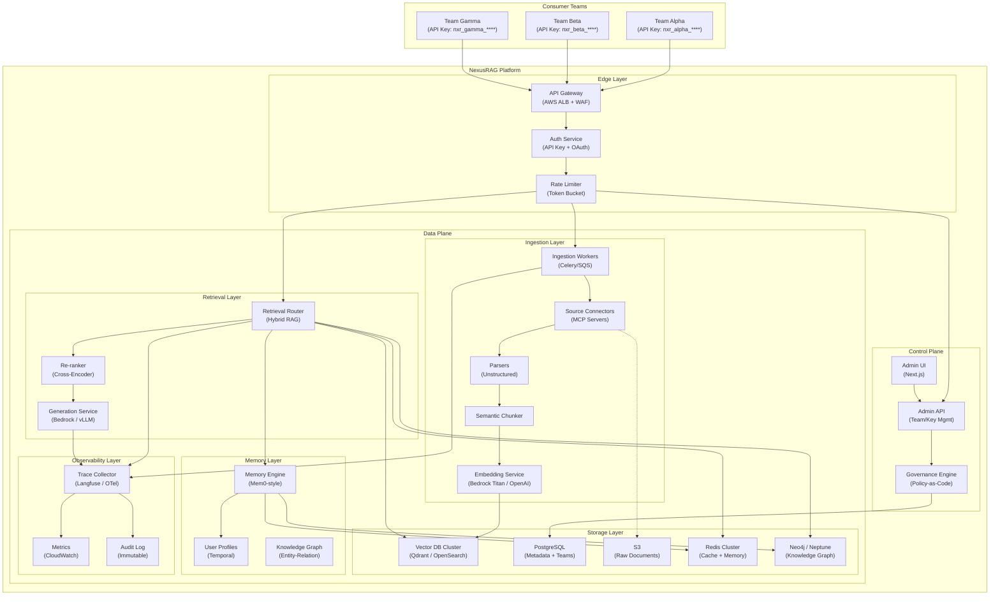
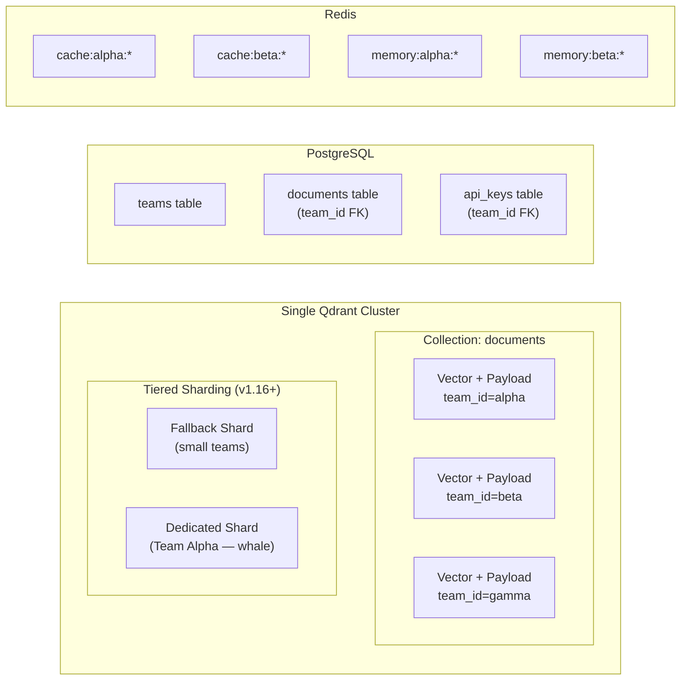
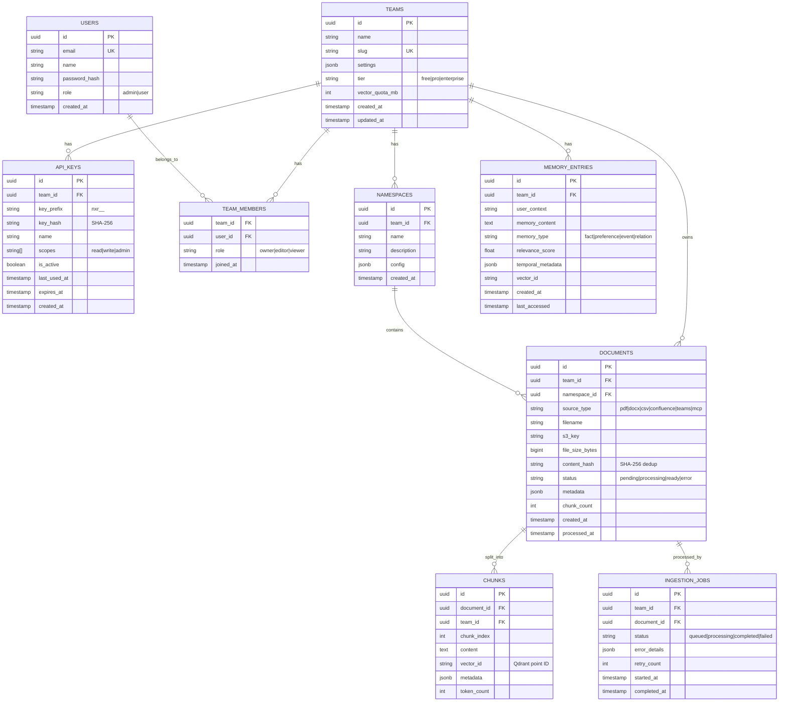
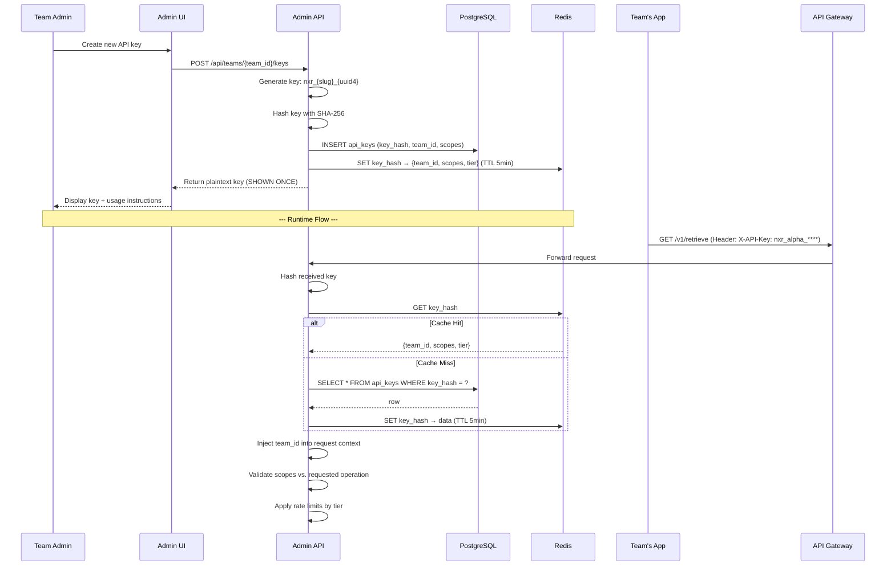
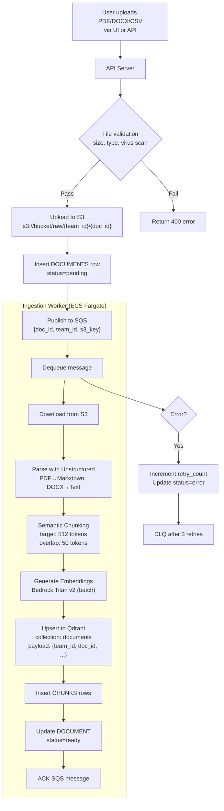
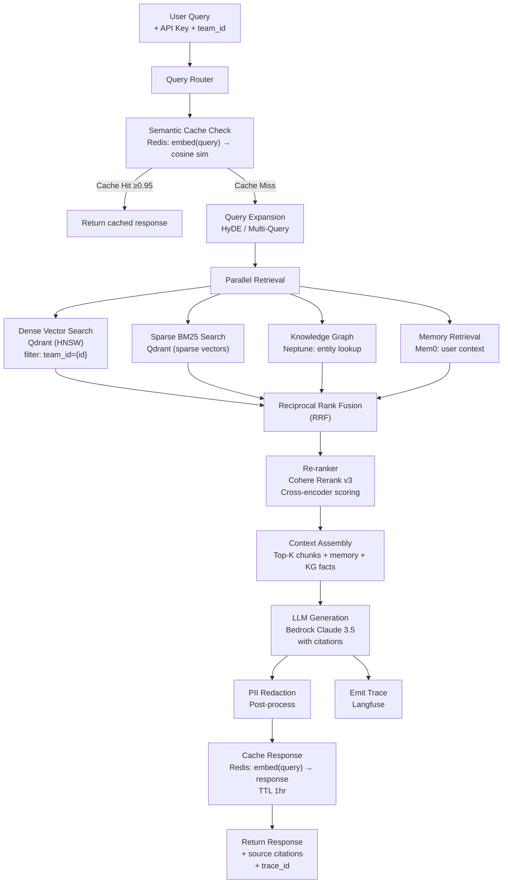
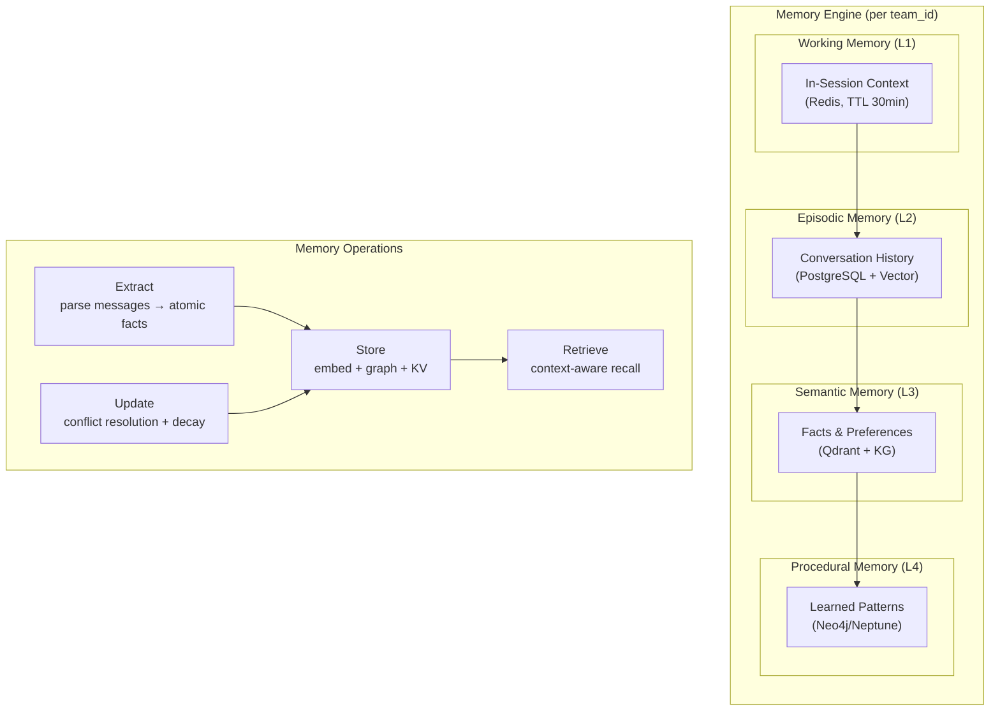
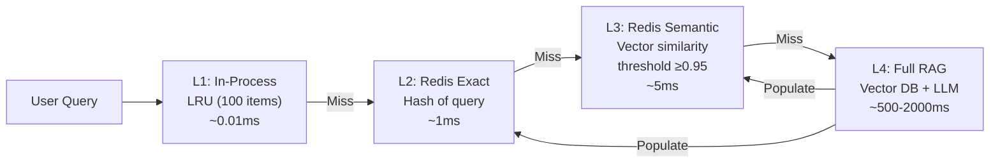
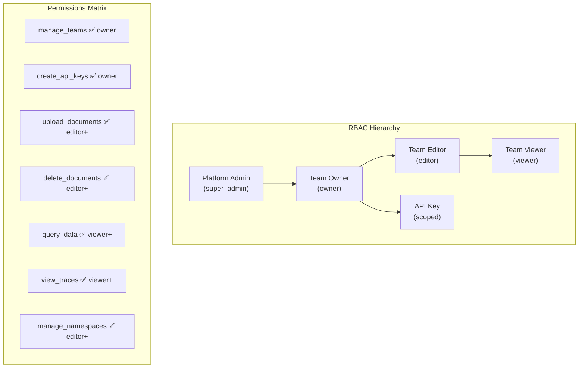
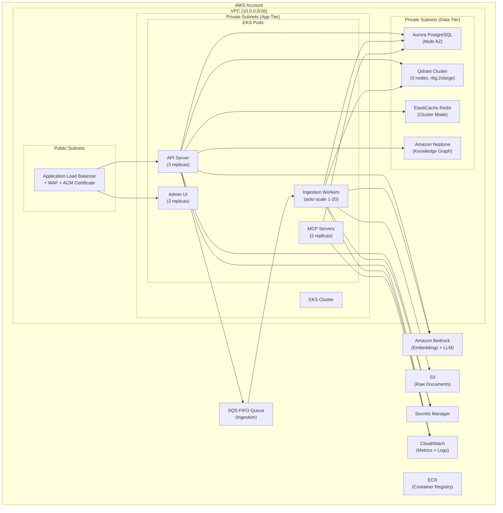

# Centralized RAG Platform — HLD, LLD & Implementation Plan

## 1. Executive Summary

Build an enterprise **Centralized RAG-as-a-Service Platform** (codename: **"NexusRAG"**) that eliminates the need for individual teams to install, maintain, and operate their own RAG applications, memory layers, and observability stacks. Teams onboard via API keys, upload their data sources, and consume retrieval + generation capabilities through a unified API — completely namespace-isolated.

> [!IMPORTANT]
> This is a **distributed system** designed for **1000+ concurrent teams** with strict namespace isolation, multi-tenant vector storage, tiered caching, and governance controls comparable to Google's NotebookLM.

---

## 2. High-Level Design (HLD)

### 2.1 System Context Diagram



### 2.2 Core Architectural Principles

| # | Principle | How It's Applied |
|---|-----------|-----------------|
| 1 | **Namespace Isolation** | Every team's data (vectors, docs, memory, cache) is logically or physically isolated by `team_id` |
| 2 | **Distributed & Stateless** | All services are horizontally scalable containers; state lives in managed datastores |
| 3 | **Defence in Depth** | API key auth → rate limiting → namespace guard → PII redaction → audit log |
| 4 | **Event-Driven Ingestion** | Upload events → SQS → async worker pipeline (no blocking the API) |
| 5 | **Hybrid RAG** | Dense vector + sparse BM25 + knowledge graph retrieval fused by a re-ranker |
| 6 | **Tiered Caching** | L1 (in-process) → L2 (Redis exact) → L3 (Redis semantic) → L4 (Vector DB) |
| 7 | **Policy-as-Code Governance** | Access policies, data retention, PII rules defined as code, versioned in Git |
| 8 | **Observability First** | Every retrieval chain has a trace ID linking query → retrieval → generation → response |

### 2.3 Namespace Isolation Architecture



**Isolation Strategy (3 tiers):**

| Layer | Isolation Mechanism | Details |
|-------|-------------------|---------|
| **API Gateway** | API key → `team_id` resolution | Every request carries team context |
| **Vector DB** | Payload-based filtering (`team_id`) + tiered sharding | Qdrant `is_tenant=true` on `team_id` field; whale teams get dedicated shards |
| **PostgreSQL** | Row-Level Security (RLS) | `WHERE team_id = current_setting('app.team_id')` on all tables |
| **Redis** | Key prefix namespacing | `{service}:{team_id}:{key}` pattern |
| **S3** | Prefix-based isolation | `s3://bucket/raw/{team_id}/...` |
| **Memory** | Scoped memory stores | Per-team memory graph; no cross-contamination |

### 2.4 Component Inventory

| Component | Technology | Why This Choice |
|-----------|-----------|----------------|
| **API Gateway** | AWS ALB + WAF | DDoS protection, TLS termination, path-based routing |
| **Auth** | Custom + AWS Cognito | API key validation (fast path) + OAuth for admin UI |
| **Ingestion Queue** | Amazon SQS (FIFO) | Exactly-once processing, dead-letter queues, no ops |
| **Ingestion Workers** | ECS Fargate (Celery) | Auto-scaling, zero server management |
| **Source Connectors** | MCP Servers (FastMCP) | GOS DB, DynamoDB, Athena, Confluence, Teams/Outlook |
| **Parser** | Unstructured.io | Best-in-class PDF/DOCX/CSV/HTML extraction |
| **Chunker** | Semantic chunking (LangChain) | Boundary-aware splitting preserving context |
| **Embedding** | Amazon Bedrock Titan v2 | Managed, scalable, 1024-dim, AWS-native |
| **Vector DB** | Qdrant (self-hosted on EKS) | Native multi-tenancy, HNSW, tiered sharding |
| **Metadata DB** | Amazon Aurora PostgreSQL | RLS, JSONB, battle-tested relational store |
| **Cache** | Amazon ElastiCache (Redis 7+) | Vector similarity search (HNSW), TTL, pub/sub |
| **Knowledge Graph** | Amazon Neptune | Managed graph DB, Gremlin/SPARQL, entity relations |
| **Memory Engine** | Custom (Mem0-inspired) | Hybrid: vector + KG + key-value per team |
| **Re-ranker** | Cohere Rerank v3 / cross-encoder | Dramatically improves retrieval precision |
| **Generation** | Amazon Bedrock (Claude 3.5) | Managed, secure, no model hosting |
| **Observability** | Langfuse (self-hosted) | OSS, OTel-native, traces + evals + prompts |
| **Admin UI** | Next.js + shadcn/ui | Modern, responsive, team management |
| **IaC** | AWS CDK (Python) | Same language as backend, L2 constructs |
| **CI/CD** | GitHub Actions + ECR | Container builds, automated deploys |

---

## 3. Low-Level Design (LLD)

### 3.1 Data Model (PostgreSQL)



### 3.2 API Key Lifecycle



### 3.3 Ingestion Pipeline (Detailed)



### 3.4 Retrieval Pipeline (Hybrid RAG)



### 3.5 Memory Layer Architecture



**Memory Layer Design (Mem0-inspired):**

| Memory Type | Storage | Retrieval Strategy | TTL |
|------------|---------|-------------------|-----|
| **Working** | Redis hash | Exact key lookup | 30 min (session) |
| **Episodic** | PostgreSQL + Qdrant | Vector similarity + recency | 90 days |
| **Semantic** | Qdrant + Neptune KG | Hybrid: vector + graph traversal | Permanent |
| **Procedural** | Neptune KG | Pattern matching on graph | Permanent |

### 3.6 Cache Layer Architecture



| Cache Tier | Technology | Key Strategy | TTL | Invalidation |
|-----------|-----------|-------------|-----|-------------|
| **L1** | Python `lru_cache` | `hash(query + team_id)` | 60s | Process restart |
| **L2** | Redis String | `SHA-256(query + team_id)` | 1 hour | On doc re-ingestion |
| **L3** | Redis Vector (HNSW) | `embed(query)` + `team_id` filter | 6 hours | On doc re-ingestion |
| **L4** | Qdrant + LLM | Full retrieval pipeline | N/A | Source of truth |

### 3.7 Access Control Model



### 3.8 MCP Integration Points

| MCP Server | Data Source | Direction | Tools |
|-----------|-----------|-----------|-------|
| **GOS DB MCP** | JPMC GOS DB (Oracle) | Ingest + Query | `query_gosdb`, `list_schemas`, `describe_table` |
| **DynamoDB MCP** | AWS DynamoDB | Ingest + Query | `query_table`, `scan_table`, `get_item` |
| **Athena MCP** | AWS Athena / S3 data lake | Query | `execute_query`, `list_databases` |
| **Confluence MCP** | Atlassian Confluence | Ingest | `get_pages`, `search_content`, `get_spaces` |
| **Teams/Outlook MCP** | Microsoft Graph API | Ingest | `get_messages`, `search_mail`, `get_channels` |
| **App Logs MCP** | CloudWatch / ELK | Ingest + Query | `get_log_events`, `search_logs` |
| **Agent Logs MCP** | Langfuse / LangSmith | Ingest + Query | `get_traces`, `get_runs`, `search_spans` |

### 3.9 AWS Deployment Architecture



### 3.10 Microservice Decomposition

| Service | Responsibilities | Language | Scales By |
|---------|-----------------|----------|-----------|
| **api-server** | Auth, routing, query orchestration, team mgmt | Python (FastAPI) | Request volume |
| **ingestion-worker** | Document processing, chunking, embedding | Python (Celery) | Queue depth |
| **retrieval-engine** | Hybrid search, re-ranking, context assembly | Python (FastAPI) | Query volume |
| **memory-service** | Extract/store/retrieve/update memories | Python (FastAPI) | User count |
| **mcp-gateway** | MCP server aggregation for external sources | Python (FastMCP) | Connector count |
| **admin-ui** | Frontend for team/document/key management | TypeScript (Next.js) | Users |
| **observability-collector** | Trace aggregation, metrics emission | Python (OTel SDK) | Event volume |

---

## 4. Proposed Changes — MVP Scope

### Phase 1: Foundation (Weeks 1-3)
- PostgreSQL schema (teams, api_keys, documents, chunks)
- API key generation, hashing, validation
- FastAPI server with auth middleware
- S3 upload + SQS ingestion pipeline
- Basic chunking + embedding (Bedrock Titan)
- Qdrant single-collection multi-tenant setup

### Phase 2: Retrieval + Cache (Weeks 4-5)
- Hybrid retrieval (dense + sparse)
- Re-ranker (Cohere)
- L2 + L3 semantic cache (Redis)
- LLM generation with citations (Bedrock Claude)

### Phase 3: Memory + MCP (Weeks 6-7)
- Memory layer (working + episodic + semantic)
- MCP servers (GOS DB, DynamoDB, Athena — already built)
- Confluence + Teams connectors (MCP)

### Phase 4: Admin UI + Observability (Weeks 8-9)
- Next.js admin dashboard
- Team management, API key CRUD
- Document upload UI, namespace viewer
- Langfuse integration for tracing

### Phase 5: Governance + Hardening (Weeks 10-12)
- RBAC enforcement
- PII redaction pipeline
- Rate limiting per tier
- CDK deployment scripts
- Load testing + security audit

---

## 5. Open Questions

> [!IMPORTANT]
> **Vector DB Choice**: Qdrant (self-hosted on EKS) vs. AWS OpenSearch Serverless. Qdrant has native tiered multi-tenancy; OpenSearch is fully managed. Which do you prefer?

> [!IMPORTANT]
> **Embedding Model**: Bedrock Titan v2 (AWS-native, 1024d) vs. OpenAI `text-embedding-3-large` (3072d, higher quality). Titan avoids external network calls. Preference?

> [!WARNING]
> **Knowledge Graph**: Amazon Neptune ($$$) vs. Neo4j Community (self-hosted, free). Neptune is managed but expensive. For MVP, should we start without graph RAG and add it in Phase 3+?

> [!IMPORTANT]
> **LLM Provider**: Amazon Bedrock (Claude 3.5 Sonnet) vs. self-hosted vLLM (e.g., Llama 3.1 70B on EKS GPU nodes). Bedrock is fastest to production; self-hosted reduces per-token cost at scale.

> [!IMPORTANT]
> **GOS DB Access**: For the MCP server to connect to GOS DB, we need the actual: hostname, service name, Oracle wallet location (or credentials), and schema whitelists. Can you provide or get these from your DBA team?

> [!WARNING]
> **Compliance**: Does JPMC require specific data residency (e.g., us-east-1 only)? Are there internal security review gates before deploying to AWS?

---

## 6. Verification Plan

### Automated Tests
```bash
# Unit tests (guardrails, auth, cache)
pytest tests/ -v --cov=nexusrag --cov-report=html

# Integration tests (ingestion pipeline end-to-end)
pytest tests/integration/ -v --timeout=120

# Load test (retrieval latency under concurrent teams)
locust -f tests/load/locustfile.py --users=100 --spawn-rate=10
```

### Manual Verification
- Upload PDF/DOCX/CSV via UI → verify chunks appear in Qdrant with correct `team_id`
- Query via API key → verify namespace isolation (Team A cannot see Team B's data)
- Rotate API key → verify old key stops working within cache TTL (5 min)
- Check Langfuse traces → verify full retrieval chain is instrumented
- Memory test → have conversation, close session, re-open → verify memory recall

### Performance Targets
| Metric | Target | Measurement |
|--------|--------|-------------|
| **Query P95 latency (cache hit)** | < 50ms | Load test |
| **Query P95 latency (cache miss)** | < 3s | Load test |
| **Ingestion throughput** | 100 docs/min | Celery monitoring |
| **Namespace isolation** | 0 cross-tenant leaks | Security test suite |
| **API key validation** | < 5ms | Benchmark |
