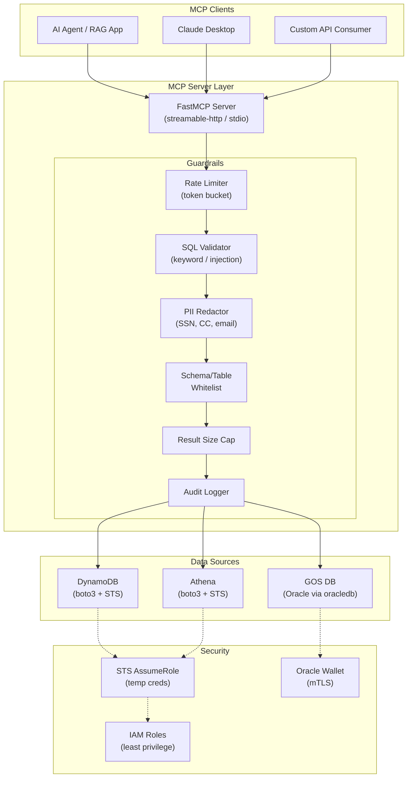
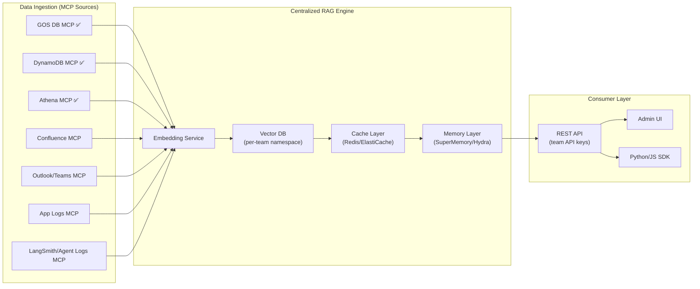

# MCP Enterprise Server — Walkthrough

## What Was Built

A production-grade **Model Context Protocol (MCP) server** in Python that connects AI agents to three enterprise data sources — **GOS DB** (JPMC internal Oracle DB), **AWS DynamoDB**, and **AWS Athena** — with comprehensive guardrails, IAM policies, and audit logging.

## Architecture



## Files Created

| File | Purpose |
|------|---------|
| [config.py](file:///c:/Users/khars/PycharmProjects/scratch/mcp_enterprise_server/config.py) | Type-safe config with Pydantic (env-var driven) |
| [guardrails.py](file:///c:/Users/khars/PycharmProjects/scratch/mcp_enterprise_server/guardrails.py) | SQL validation, rate limiting, PII redaction, audit |
| [aws_credentials.py](file:///c:/Users/khars/PycharmProjects/scratch/mcp_enterprise_server/aws_credentials.py) | Thread-safe STS AssumeRole credential manager |
| [gosdb_mcp.py](file:///c:/Users/khars/PycharmProjects/scratch/mcp_enterprise_server/gosdb_mcp.py) | GOS DB MCP tools (query, list schemas/tables, describe) |
| [dynamodb_mcp.py](file:///c:/Users/khars/PycharmProjects/scratch/mcp_enterprise_server/dynamodb_mcp.py) | DynamoDB MCP tools (list, describe, query, scan, get, put) |
| [athena_mcp.py](file:///c:/Users/khars/PycharmProjects/scratch/mcp_enterprise_server/athena_mcp.py) | Athena MCP tools (execute, async start/check, list DBs/tables) |
| [iam_policies.py](file:///c:/Users/khars/PycharmProjects/scratch/mcp_enterprise_server/iam_policies.py) | Minimum-privilege IAM policy templates |
| [server.py](file:///c:/Users/khars/PycharmProjects/scratch/mcp_enterprise_server/server.py) | Main entrypoint with lifecycle management |
| [client_examples.py](file:///c:/Users/khars/PycharmProjects/scratch/mcp_enterprise_server/client_examples.py) | Consumer examples (stdio + HTTP + Claude config) |
| [test_guardrails.py](file:///c:/Users/khars/PycharmProjects/scratch/mcp_enterprise_server/tests/test_guardrails.py) | Unit tests for guardrails layer |
| [requirements.txt](file:///c:/Users/khars/PycharmProjects/scratch/mcp_enterprise_server/requirements.txt) | All pip dependencies |

---

## Guardrails — Defence in Depth

Each tool invocation passes through **6 security layers** before touching any data source:

| Layer | What It Does | Configurable Via |
|-------|-------------|------------------|
| **Rate Limiting** | Token-bucket per caller + per tool | `GUARDRAILS_GLOBAL_RATE_LIMIT` |
| **SQL Validation** | Blocks DROP/TRUNCATE/injection patterns | `GOS_DB_BLOCKED_KEYWORDS`, `ATHENA_BLOCKED_KEYWORDS` |
| **Schema/Table Whitelist** | Only approved schemas/tables accessible | `GOS_DB_ALLOWED_SCHEMAS`, `DYNAMODB_ALLOWED_TABLES` |
| **Permission Enforcement** | READ_ONLY blocks all mutations | `*_PERMISSION_LEVEL` |
| **PII Redaction** | Strips SSN, credit card, email, phone | `GUARDRAILS_ENABLE_PII_REDACTION` |
| **Result Capping** | Truncates oversized responses | `GUARDRAILS_MAX_RESULT_SIZE_BYTES` |
| **Audit Logging** | Structured log every invocation | `GUARDRAILS_ENABLE_AUDIT_LOGGING` |

> [!IMPORTANT]
> **SQL Injection Prevention** — The guardrails block: SQL comments (`--`, `/*`), chained statements (`;`), UNION injection, tautology attacks (`' OR '`), and MSSQL xp_ procs. Additionally, GOS DB uses **parameterized queries** (`:name` bind syntax) at the driver level.

---

## MCP Tools Registered — Total: 15

### GOS DB Tools (4)
| Tool | Description |
|------|-------------|
| `tool_query_gosdb` | Execute read-only SQL with bind params |
| `tool_list_schemas` | List whitelisted schemas |
| `tool_list_tables` | List tables in a schema |
| `tool_describe_table` | Get column metadata |

### DynamoDB Tools (6)
| Tool | Description |
|------|-------------|
| `tool_list_dynamodb_tables` | List accessible tables |
| `tool_describe_dynamodb_table` | Key schema, indexes, billing |
| `tool_query_dynamodb` | Query by key condition |
| `tool_scan_dynamodb` | Full scan with filter |
| `tool_get_dynamodb_item` | Get single item by key |
| `tool_put_dynamodb_item` | Write item (requires READ_WRITE) |

### Athena Tools (5)
| Tool | Description |
|------|-------------|
| `tool_execute_athena_query` | Sync: start → poll → fetch |
| `tool_start_athena_query` | Async: start only |
| `tool_check_athena_query` | Check status + fetch results |
| `tool_list_athena_databases` | List Glue databases |
| `tool_list_athena_tables` | List tables with columns |

---

## IAM Policies — Minimum Privilege

The [iam_policies.py](file:///c:/Users/khars/PycharmProjects/scratch/mcp_enterprise_server/iam_policies.py) file contains ready-to-deploy IAM policies:

| Policy | Access Level |
|--------|-------------|
| `DYNAMODB_READ_ONLY_POLICY` | GetItem, Query, Scan, Describe, List only |
| `DYNAMODB_READ_WRITE_POLICY` | Adds PutItem, UpdateItem; **explicitly denies** DeleteTable/CreateTable |
| `ATHENA_READ_ONLY_POLICY` | Query execution + S3 results + Glue catalog read |
| `MCP_SERVER_TRUST_POLICY` | STS trust with ExternalId condition |

> [!WARNING]
> Replace `ACCOUNT_ID` and `ALLOWED_TABLE_*` placeholders with your actual AWS account ID and table names before deploying.

---

## GOS DB Connection Details

Since GOS DB is an **internal JPMC Oracle-compatible database**, the connection uses:

1. **Driver**: `python-oracledb` in **thin mode** (no Oracle Client install needed)
2. **Auth Options**:
   - Username/password via `GOS_DB_USERNAME` / `GOS_DB_PASSWORD` env vars
   - **mTLS via Oracle Wallet** (preferred): Set `GOS_DB_WALLET_LOCATION`
3. **Connection Pooling**: Async pool with configurable min/max/increment
4. **Query Timeout**: Session-level timeout kills long queries

> [!NOTE]
> **For JPMC employees**: GOS DB connection details (hostname, service name, wallet location) must come from your internal developer portal or the GOS DB administration team. The values in `config.py` are placeholders.

---

## How to Run

### Install Dependencies
```bash
cd c:\Users\khars\PycharmProjects\scratch
pip install -r mcp_enterprise_server/requirements.txt
```

### Start Server (HTTP — production)
```bash
python -m mcp_enterprise_server.server --transport streamable-http --port 8000
```

### Start Server (stdio — Claude Desktop)
```bash
python -m mcp_enterprise_server.server --transport stdio
```

### Configure Claude Desktop
Add to `%APPDATA%/Claude/claude_desktop_config.json`:
```json
{
  "mcpServers": {
    "enterprise-rag": {
      "command": "python",
      "args": ["-m", "mcp_enterprise_server.server", "--transport", "stdio"],
      "env": {
        "GOS_DB_HOST": "gosdb.internal.jpmc.com",
        "DYNAMODB_ROLE_ARN": "arn:aws:iam::123456789012:role/MCP-DynamoDB-Reader",
        "ATHENA_ROLE_ARN": "arn:aws:iam::123456789012:role/MCP-Athena-Reader",
        "ATHENA_OUTPUT_BUCKET": "s3://my-athena-results/"
      }
    }
  }
}
```

### Run Tests
```bash
pip install pytest
python -m pytest mcp_enterprise_server/tests/ -v
```

---

## Latest MCP Advancements (2025-2026) — Fact-Checked

| Feature | Status | Details |
|---------|--------|---------|
| **MCP Python SDK v1.x** | ✅ Stable | Official SDK from Anthropic with FastMCP high-level API |
| **Streamable HTTP Transport** | ✅ GA | Production-ready HTTP transport replacing SSE for new deployments |
| **Structured Output** | ✅ GA | Tools return Pydantic models / TypedDicts with schema validation |
| **Elicitation** | ✅ GA | Human-in-the-loop: tools can ask users for additional info |
| **FastMCP Lifespan** | ✅ GA | Async context managers for startup/shutdown (DB pools, etc.) |
| **AWS Official MCP Servers** | ✅ Available | `awslabs/mcp` repo: Athena, DynamoDB, S3, Bedrock, etc. |
| **MCP Proxy for AWS** | ✅ Available | SigV4 auth proxy for remote MCP servers on AWS |
| **OAuth 2.1 Auth** | ✅ GA | Native OAuth support in MCP clients |
| **MCP SDK v2** | 🔄 Pre-Alpha | In development on `main` branch |
| **Icons/Branding** | ✅ GA | Servers, tools, resources can have icons |

> [!TIP]
> **AWS Reference**: Check `https://github.com/awslabs/mcp` for official AWS MCP server implementations. They include pre-built servers for Athena, DynamoDB, S3, CloudWatch, and more — useful as reference or to use directly.

---

## Study Resources

### MCP Core
- **Official Spec**: https://modelcontextprotocol.io
- **Python SDK**: https://github.com/modelcontextprotocol/python-sdk
- **FastMCP Guide**: https://gofastmcp.com
- **MCP Inspector** (testing): `npx -y @modelcontextprotocol/inspector`

### AWS + MCP
- **AWS MCP Servers**: https://github.com/awslabs/mcp
- **Deploying MCP on AWS**: https://github.com/aws-solutions-library-samples/guidance-for-deploying-model-context-protocol-servers-on-aws
- **AWS Lambda MCP Wrapper**: https://github.com/awslabs/mcp (lambda subproject)

### Security & Guardrails
- **OWASP LLM Top 10**: https://owasp.org/www-project-top-10-for-large-language-model-applications/
- **MCP Security Best Practices**: https://modelcontextprotocol.io/specification/latest (security section)
- **AWS IAM Best Practices**: https://docs.aws.amazon.com/IAM/latest/UserGuide/best-practices.html

### Oracle / GOS DB
- **python-oracledb**: https://python-oracledb.readthedocs.io
- **Thin Mode Docs**: https://python-oracledb.readthedocs.io/en/latest/user_guide/thin_mode.html
- **Oracle Wallet Setup**: https://python-oracledb.readthedocs.io/en/latest/user_guide/connection_handling.html#wallets

### Open-Source MCP Servers (Reference)
| Project | URL |
|---------|-----|
| Official Python SDK Examples | `python-sdk/examples/` on GitHub |
| AWS Labs MCP Collection | https://github.com/awslabs/mcp |
| Awesome MCP Servers | https://github.com/punkpeye/awesome-mcp-servers |
| MCP Servers Registry | https://mcpservers.org |

---

## Where to Use MCP in Your Centralized RAG Platform



### MCP Use Cases in Your Platform
1. **Data Ingestion** — MCP servers for each source (GOS DB ✅, DynamoDB ✅, Athena ✅, Confluence, Teams, App Logs)
2. **Agent Observability** — MCP tools to query LangSmith/agent execution logs
3. **Admin Operations** — MCP tools for team management, API key rotation, namespace ops
4. **Retrieval** — MCP tools wrapping your vector DB queries (per-namespace)

---

## Vector DB Benchmarking & RAG Type Recommendation

### RAG Architecture Recommendation

> [!IMPORTANT]
> **Recommendation: Hybrid RAG** — Use **Agentic RAG with Graph-enhanced retrieval** for your enterprise use case. Pure vectorless (PageIndex) lacks semantic understanding; pure GraphRAG is compute-heavy. The sweet spot is:

| Approach | When to Use | Your Use Case Fit |
|----------|------------|-------------------|
| **Dense Vector RAG** | Standard semantic search | ✅ Core retrieval layer |
| **GraphRAG** | Complex entity relationships | ✅ GOS DB entity linking |
| **Agentic RAG** | Multi-step reasoning, tool use | ✅ Cross-source queries |
| **Vectorless (PageIndex)** | Simple keyword/BM25 search | ⚠️ Good for app logs only |
| **Hybrid (recommended)** | Best of all worlds | ✅ **Use this** |

### Vector DB Comparison

| Vector DB | Self-Hosted | Managed | Multi-Tenant | Best For |
|-----------|-------------|---------|-------------|----------|
| **Qdrant** | ✅ | ✅ Cloud | ✅ Collections | Your use case — namespace isolation |
| **Weaviate** | ✅ | ✅ Cloud | ✅ Tenants | Multi-modal, GraphQL API |
| **Milvus/Zilliz** | ✅ | ✅ Zilliz | ✅ Partitions | High-scale, GPU-accelerated |
| **Pinecone** | ❌ | ✅ Only | ✅ Namespaces | Zero-ops, smallest team |
| **pgvector** | ✅ | ✅ RDS | ⚠️ Schema-based | Already using PostgreSQL |
| **OpenSearch** | ✅ | ✅ AWS | ✅ Indexes | AWS-native, hybrid search |

> [!TIP]
> For your use case (team-based namespace isolation on AWS), **Qdrant** or **AWS OpenSearch Serverless** are the strongest fits. Qdrant has native collection-based multi-tenancy; OpenSearch integrates seamlessly with other AWS services.
