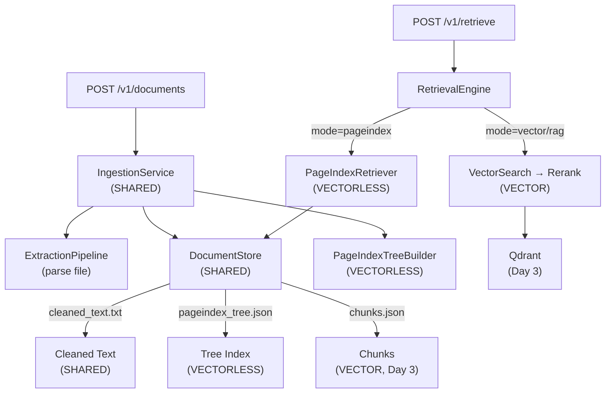
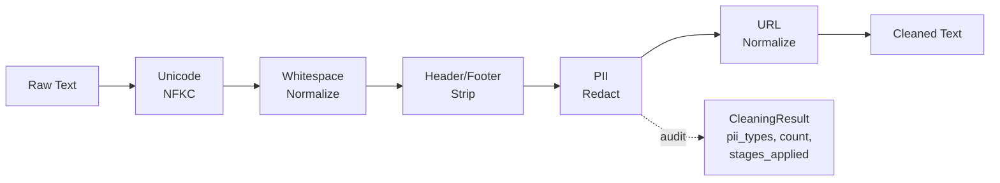
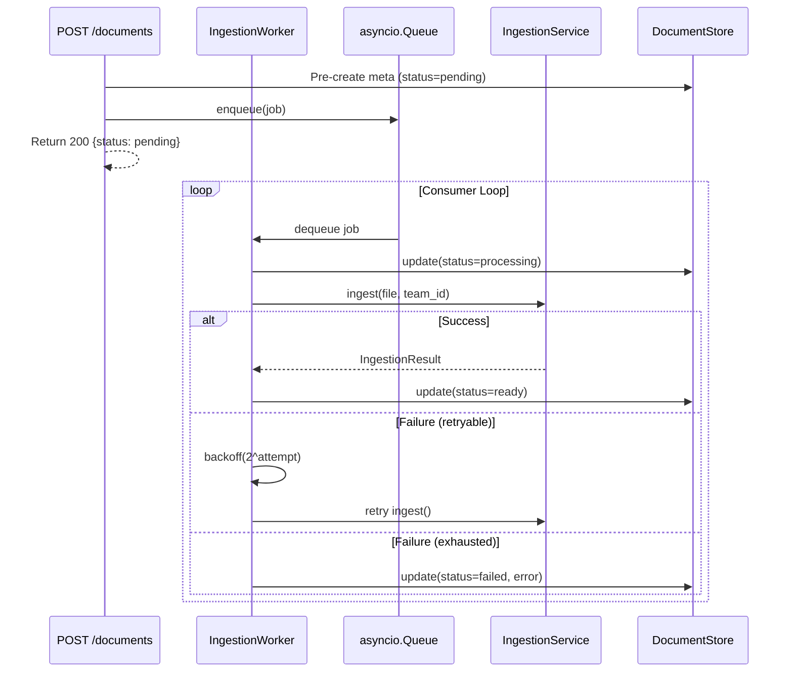
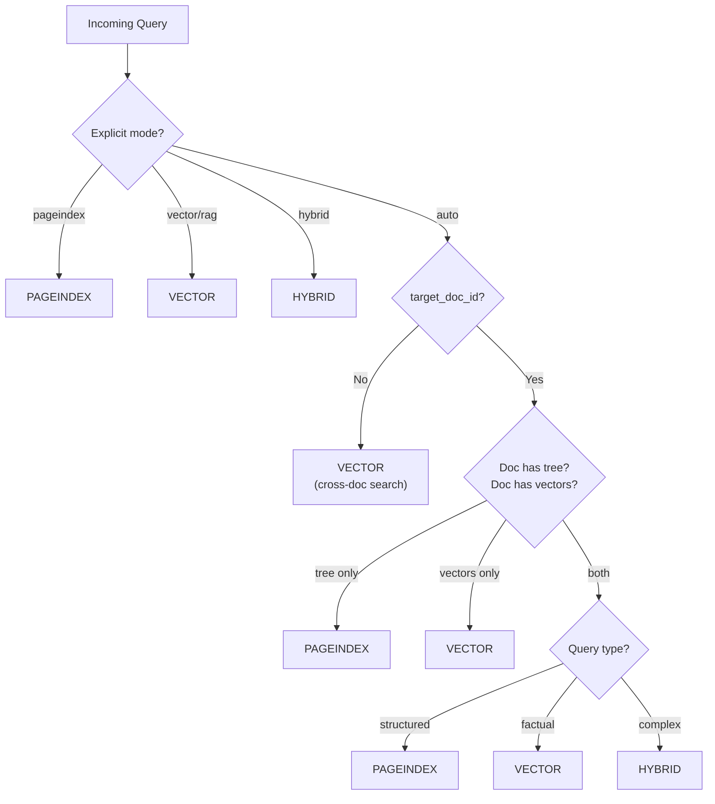
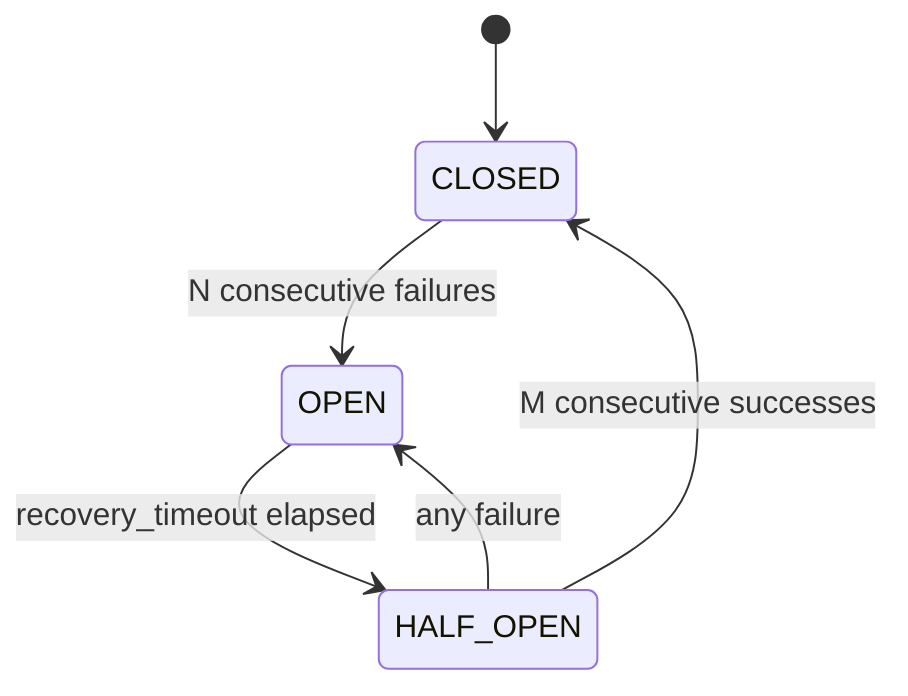

# Days 1–3 Walkthrough — Dual-Path RAG + PII + Vector Path

## Summary

Implemented the foundational architecture for CentRAG's dual-path retrieval system, establishing clean SDLC separation between **VECTORLESS** (PageIndex/reasoning-based) and **VECTOR** (embeddings/similarity-based) retrieval.

> [!IMPORTANT]
> Every new module's docstring explicitly declares which path it belongs to: `VECTORLESS PATH ONLY`, `VECTOR PATH ONLY`, or `SHARED INFRASTRUCTURE`.

## Architecture Overview



---

## New Files Created (7 files)

### VECTORLESS Path
| File | Purpose |
|------|---------|
| [tree_index.py](file:///c:/Users/khars/PycharmProjects/scratch/centrag/abstractions/tree_index.py) | `TreeIndexProtocol` — contract for tree-based indexers |
| [pageindex_tree.py](file:///c:/Users/khars/PycharmProjects/scratch/centrag/implementations/pageindex_tree.py) | `PageIndexTreeBuilder` — wraps VectifyAI/PageIndex library |
| [pageindex_retriever.py](file:///c:/Users/khars/PycharmProjects/scratch/centrag/retrieval/pageindex_retriever.py) | `PageIndexRetriever` — LLM navigates tree to find relevant pages |

### SHARED Infrastructure
| File | Purpose |
|------|---------|
| [storage/__init__.py](file:///c:/Users/khars/PycharmProjects/scratch/centrag/storage/__init__.py) | Storage package with path boundary documentation |
| [document_store.py](file:///c:/Users/khars/PycharmProjects/scratch/centrag/storage/document_store.py) | Filesystem-backed unified document store |
| [ingestion/__init__.py](file:///c:/Users/khars/PycharmProjects/scratch/centrag/ingestion/__init__.py) | Ingestion package |
| [service.py](file:///c:/Users/khars/PycharmProjects/scratch/centrag/ingestion/service.py) | `IngestionService` — orchestrates parse → clean → index |

---

## Modified Files (8 files)

| File | Change |
|------|--------|
| [abstractions/__init__.py](file:///c:/Users/khars/PycharmProjects/scratch/centrag/abstractions/__init__.py) | Export `TreeIndexProtocol`, grouped exports by path (SHARED/VECTOR/VECTORLESS) |
| [config.py](file:///c:/Users/khars/PycharmProjects/scratch/centrag/config.py) | Added `pageindex_model`, `data_dir`, `enable_pageindex` settings |
| [wiring.py](file:///c:/Users/khars/PycharmProjects/scratch/centrag/wiring.py) | Complete rewrite: wires both paths, adds `build_ingestion_service()` |
| [app.py](file:///c:/Users/khars/PycharmProjects/scratch/centrag/app.py) | Lifespan now creates `DocumentStore` + `IngestionService` on `app.state` |
| [engine.py](file:///c:/Users/khars/PycharmProjects/scratch/centrag/retrieval/engine.py) | Dual-path routing: `pageindex_retriever` + `document_store` injected, mode-based dispatch |
| [documents.py](file:///c:/Users/khars/PycharmProjects/scratch/centrag/routes/documents.py) | Real upload → ingestion, GET status/tree, path availability fields |
| [retrieve.py](file:///c:/Users/khars/PycharmProjects/scratch/centrag/routes/retrieve.py) | `target_doc_id`, `mode` (auto/pageindex/vector/hybrid), `retrieval_source` in response |
| [pyproject.toml](file:///c:/Users/khars/PycharmProjects/scratch/pyproject.toml) | Added `litellm`, `pymupdf`, `PyPDF2` dependencies |

---

## SDLC Path Separation

Every component explicitly declares its path affiliation:

```
VECTORLESS PATH ONLY (reasoning-based):
  centrag/abstractions/tree_index.py         → TreeIndexProtocol
  centrag/implementations/pageindex_tree.py  → PageIndexTreeBuilder
  centrag/retrieval/pageindex_retriever.py   → PageIndexRetriever
  DocumentStore: pageindex_tree.json, page_cache.json

VECTOR PATH ONLY (similarity-based):
  centrag/abstractions/embedder.py           → EmbedderProtocol
  centrag/abstractions/vectorstore.py        → VectorStoreProtocol
  centrag/abstractions/reranker.py           → RerankerProtocol
  DocumentStore: chunks.json

SHARED (both paths):
  centrag/storage/document_store.py          → DocumentStore
  centrag/ingestion/service.py               → IngestionService
  centrag/retrieval/engine.py                → RetrievalEngine (routes between paths)
  centrag/config.py                          → Settings
  DocumentStore: meta.json, cleaned_text.txt
```

---

## Test Results

```
py -m pytest tests/ -v → 129/129 passed ✅ (4.86s)
```

| Test File | Count | Status |
|-----------|-------|--------|
| test_cleaner.py | 25 | ✅ All pass |
| test_ingestion_worker.py | 9 | ✅ All pass |
| test_document_store.py | 20 | ✅ All pass |
| test_guardrails.py | 16 | ✅ All pass |
| test_hybrid_retriever.py | 12 | ✅ All pass |
| test_implementations.py | 17 | ✅ All pass |
| test_query_router.py | 12 | ✅ All pass |
| test_cache.py | 9 | ✅ All pass |
| test_memory.py | 6 | ✅ All pass |
| **Total** | **129** | ✅ |

---

## Day 2: PII Scrubbing + Async Ingestion Worker

### New Files (2)

| File | Purpose |
|------|---------|
| [cleaner.py](file:///c:/Users/khars/PycharmProjects/scratch/centrag/ingestion/cleaner.py) | 5-stage text cleaning pipeline (SHARED) |
| [worker.py](file:///c:/Users/khars/PycharmProjects/scratch/centrag/ingestion/worker.py) | Async background ingestion processor (SHARED) |

### DocumentCleaner Pipeline



**Key design decisions:**
- PII redaction uses the existing shared `pii.py` (single source of truth)
- Each stage is toggleable via `DocumentCleanerConfig`
- `CleaningResult` provides a compliance audit trail (which PII found, how many redacted)
- Applied BEFORE both paths — neither PageIndex tree nor vector chunks ever see raw PII

### IngestionWorker Architecture



**Key features:**
- Sequential processing (1 job at a time) — respects LLM rate limits
- Exponential backoff: `2^attempt` seconds, capped at 60s
- Dead-letter: after `max_retries`, job marked FAILED with error in DocumentStore
- Graceful shutdown: finishes current job, reports remaining pending jobs

### Modified Files (4)

| File | Change |
|------|--------|
| [service.py](file:///c:/Users/khars/PycharmProjects/scratch/centrag/ingestion/service.py) | Replaced `_basic_clean()` with `DocumentCleaner`, added cleaning audit to `IngestionResult.metadata` |
| [app.py](file:///c:/Users/khars/PycharmProjects/scratch/centrag/app.py) | Worker starts in lifespan, shuts down gracefully before infra |
| [documents.py](file:///c:/Users/khars/PycharmProjects/scratch/centrag/routes/documents.py) | `async_mode=True` enqueues to worker; `False` blocks synchronously |
| [__init__.py](file:///c:/Users/khars/PycharmProjects/scratch/centrag/ingestion/__init__.py) | Exports DocumentCleaner, IngestionWorker, WorkerConfig, JobStatus |

---

## API Contract Changes

### POST `/v1/retrieve` — New Fields
```diff
 {
   "query": "What were the key risks?",
+  "target_doc_id": "uuid",        // Scope to doc (enables PageIndex)
+  "mode": "auto",                  // auto | pageindex | vector | hybrid | rag
   "namespace": "default",
   "max_results": 5
 }
```

### Response — New Fields
```diff
 {
   "answer": "...",
   "sources": [{
     "content": "...",
     "document_id": "...",
     "relevance_score": 0.85,
+    "source_type": "pageindex",    // Which path produced this source
+    "page_refs": "5-7, 22-28",    // VECTORLESS: page ranges
+    "reasoning": "..."            // VECTORLESS: LLM navigation reasoning
   }],
+  "retrieval_source": "pageindex"  // Which path was used overall
 }
```

---

## Day 3: Vector Path + Dual Retrieval

### New Files (3)

| File | Purpose |
|------|---------|
| [qdrant_vectorstore.py](file:///c:/Users/khars/PycharmProjects/scratch/centrag/implementations/qdrant_vectorstore.py) | Production `VectorStoreProtocol` backed by Qdrant (VECTOR PATH) |
| [query_router.py](file:///c:/Users/khars/PycharmProjects/scratch/centrag/retrieval/query_router.py) | Auto-selects retrieval path based on query + doc state (SHARED) |
| [hybrid.py](file:///c:/Users/khars/PycharmProjects/scratch/centrag/retrieval/hybrid.py) | RRF fusion of dual-path results (SHARED) |

### QueryRouter Decision Flow



### HybridRetriever RRF Fusion

```
RRF Score(d) = Σ 1/(k + rank_i(d))    where k=60

Why RRF over score averaging?
  - Scores from different systems are NOT comparable
    (cosine similarity vs LLM confidence)
  - RRF is rank-based, so scale differences don't matter
  - Proven effective in MS MARCO, BEIR benchmarks
```

**Key features:**
- Deduplication: same content from both paths merges (scores sum)
- Provenance: each FusedResult tracks which paths contributed
- Diagnostics: HybridResult includes per-path counts for evaluation

### Modified Files (3)

| File | Change |
|------|--------|
| [config.py](file:///c:/Users/khars/PycharmProjects/scratch/centrag/config.py) | Added `qdrant_url`, `qdrant_api_key`, `enable_vector` |
| [wiring.py](file:///c:/Users/khars/PycharmProjects/scratch/centrag/wiring.py) | Conditional Qdrant wiring, inject QueryRouter + HybridRetriever |
| [engine.py](file:///c:/Users/khars/PycharmProjects/scratch/centrag/retrieval/engine.py) | Constructor accepts `query_router` + `hybrid_retriever` |

---

## Day 4: LLM Gateway + Conversation History

### New Files (2)

| File | Purpose |
|------|---------|
| [llm_gateway.py](file:///c:/Users/khars/PycharmProjects/scratch/centrag/implementations/llm_gateway.py) | Resilient LLM proxy with circuit breaker, cost tracking, latency (SHARED) |
| [session.py](file:///c:/Users/khars/PycharmProjects/scratch/centrag/retrieval/session.py) | Multi-turn conversation session management (SHARED) |

### Circuit Breaker State Machine



### Key Features

- **LLMGateway** (Decorator): wraps any `LLMProtocol` with budget gate, circuit breaker, retry, and latency monitoring
- **CostTracker**: per-team token budgets with model pricing (gpt-4o, claude-3-5-sonnet, etc.)
- **ConversationSession**: auto-pruning message history (count + token budget), TTL expiry
- **SessionManager**: CRUD + expired session cleanup

### Test Results

```
py -m pytest tests/ -v → 173/173 passed ✅ (5.71s)
```

---

## Next: Day 5

1. **Evaluation Harness** — Golden Dataset + LLM-as-Judge
2. **Metrics Comparator** — side-by-side path comparison
3. **Evaluation API** — `/v1/evaluate` endpoint

