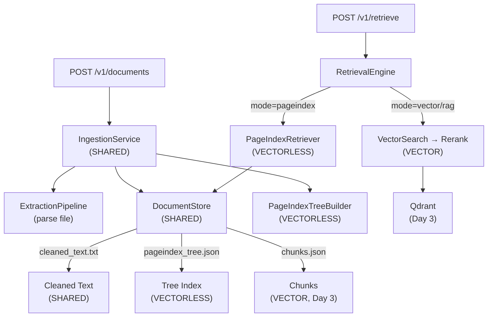

# Day 1 Walkthrough — Dual-Path RAG Foundation

## Summary

Implemented the foundational architecture for CentRAG's dual-path retrieval system, establishing clean SDLC separation between **VECTORLESS** (PageIndex/reasoning-based) and **VECTOR** (embeddings/similarity-based) retrieval.

> [!IMPORTANT]
> Every new module's docstring explicitly declares which path it belongs to: `VECTORLESS PATH ONLY`, `VECTOR PATH ONLY`, or `SHARED INFRASTRUCTURE`.

## Architecture Overview



---

## New Files Created (7 files)

### VECTORLESS Path
| File | Purpose |
|------|---------|
| [tree_index.py](file:///c:/Users/khars/PycharmProjects/scratch/centrag/abstractions/tree_index.py) | `TreeIndexProtocol` — contract for tree-based indexers |
| [pageindex_tree.py](file:///c:/Users/khars/PycharmProjects/scratch/centrag/implementations/pageindex_tree.py) | `PageIndexTreeBuilder` — wraps VectifyAI/PageIndex library |
| [pageindex_retriever.py](file:///c:/Users/khars/PycharmProjects/scratch/centrag/retrieval/pageindex_retriever.py) | `PageIndexRetriever` — LLM navigates tree to find relevant pages |

### SHARED Infrastructure
| File | Purpose |
|------|---------|
| [storage/__init__.py](file:///c:/Users/khars/PycharmProjects/scratch/centrag/storage/__init__.py) | Storage package with path boundary documentation |
| [document_store.py](file:///c:/Users/khars/PycharmProjects/scratch/centrag/storage/document_store.py) | Filesystem-backed unified document store |
| [ingestion/__init__.py](file:///c:/Users/khars/PycharmProjects/scratch/centrag/ingestion/__init__.py) | Ingestion package |
| [service.py](file:///c:/Users/khars/PycharmProjects/scratch/centrag/ingestion/service.py) | `IngestionService` — orchestrates parse → clean → index |

---

## Modified Files (8 files)

| File | Change |
|------|--------|
| [abstractions/__init__.py](file:///c:/Users/khars/PycharmProjects/scratch/centrag/abstractions/__init__.py) | Export `TreeIndexProtocol`, grouped exports by path (SHARED/VECTOR/VECTORLESS) |
| [config.py](file:///c:/Users/khars/PycharmProjects/scratch/centrag/config.py) | Added `pageindex_model`, `data_dir`, `enable_pageindex` settings |
| [wiring.py](file:///c:/Users/khars/PycharmProjects/scratch/centrag/wiring.py) | Complete rewrite: wires both paths, adds `build_ingestion_service()` |
| [app.py](file:///c:/Users/khars/PycharmProjects/scratch/centrag/app.py) | Lifespan now creates `DocumentStore` + `IngestionService` on `app.state` |
| [engine.py](file:///c:/Users/khars/PycharmProjects/scratch/centrag/retrieval/engine.py) | Dual-path routing: `pageindex_retriever` + `document_store` injected, mode-based dispatch |
| [documents.py](file:///c:/Users/khars/PycharmProjects/scratch/centrag/routes/documents.py) | Real upload → ingestion, GET status/tree, path availability fields |
| [retrieve.py](file:///c:/Users/khars/PycharmProjects/scratch/centrag/routes/retrieve.py) | `target_doc_id`, `mode` (auto/pageindex/vector/hybrid), `retrieval_source` in response |
| [pyproject.toml](file:///c:/Users/khars/PycharmProjects/scratch/pyproject.toml) | Added `litellm`, `pymupdf`, `PyPDF2` dependencies |

---

## SDLC Path Separation

Every component explicitly declares its path affiliation:

```
VECTORLESS PATH ONLY (reasoning-based):
  centrag/abstractions/tree_index.py         → TreeIndexProtocol
  centrag/implementations/pageindex_tree.py  → PageIndexTreeBuilder
  centrag/retrieval/pageindex_retriever.py   → PageIndexRetriever
  DocumentStore: pageindex_tree.json, page_cache.json

VECTOR PATH ONLY (similarity-based):
  centrag/abstractions/embedder.py           → EmbedderProtocol
  centrag/abstractions/vectorstore.py        → VectorStoreProtocol
  centrag/abstractions/reranker.py           → RerankerProtocol
  DocumentStore: chunks.json

SHARED (both paths):
  centrag/storage/document_store.py          → DocumentStore
  centrag/ingestion/service.py               → IngestionService
  centrag/retrieval/engine.py                → RetrievalEngine (routes between paths)
  centrag/config.py                          → Settings
  DocumentStore: meta.json, cleaned_text.txt
```

---

## Test Results

```
py -m pytest tests/ -v → 71/71 passed ✅ (0.41s)
```

| Test File | Count | Status |
|-----------|-------|--------|
| test_document_store.py | 20 | ✅ All pass |
| test_guardrails.py | 16 | ✅ All pass (fixed 3 pre-existing bugs) |
| test_implementations.py | 17 | ✅ All pass |
| test_cache.py | 9 | ✅ All pass |
| test_memory.py | 6 | ✅ All pass |

---

## API Contract Changes

### POST `/v1/retrieve` — New Fields
```diff
 {
   "query": "What were the key risks?",
+  "target_doc_id": "uuid",        // Scope to doc (enables PageIndex)
+  "mode": "auto",                  // auto | pageindex | vector | hybrid | rag
   "namespace": "default",
   "max_results": 5
 }
```

### Response — New Fields
```diff
 {
   "answer": "...",
   "sources": [{
     "content": "...",
     "document_id": "...",
     "relevance_score": 0.85,
+    "source_type": "pageindex",    // Which path produced this source
+    "page_refs": "5-7, 22-28",    // VECTORLESS: page ranges
+    "reasoning": "..."            // VECTORLESS: LLM navigation reasoning
   }],
+  "retrieval_source": "pageindex"  // Which path was used overall
 }
```

---

## Next: Day 2

1. **DocumentCleaner** — PII scrubbing via `centrag/guardrails/pii.py`
2. **Async ingestion worker** — background tree building
3. **Normalization pipeline** — whitespace, encoding, Unicode
